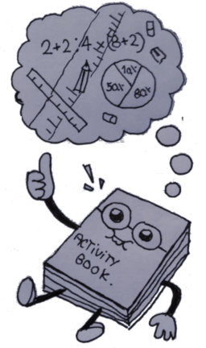

# Libro de actividades

Éste es un proyecto libre para compartir actividades/ejercicios útiles para usar en los **Ciclos Formativos de Informática**.

**Organización**

* Las actividades se guardan dentro del directorio [actividades](./actividades). Es la carpeta principal de este proyecto.
* Los documentos se organizan por materias de la [siguiente forma](./actividades/README.md).
* Cada documento es un fichero de texto simple que puede enlazar a otros documentos, imágenes o páginas web.

---
## Licencia

En general, los documentos del proyecto tiene licencia
[Creative Commons Attribution-ShareAlike 4.0 International License](http://creativecommons.org/licenses/by-sa/4.0/), excepto aquellos que expresamente tengan indicados otro tipo de licencia o tengan en su subdirectorio otro fichero LICENSE diferente.

---

## Otras preguntas

* [¿Cómo accedo a los documentos?](./docs/acceso.md)
* [¿Cómo puedo contribuir al proyecto?](./docs/contribuciones.md)
* [Proyectos similares](./docs/proyectos-similares.md)

¡Muchas gracias!
 
