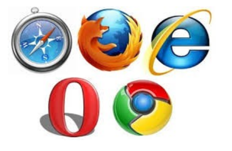
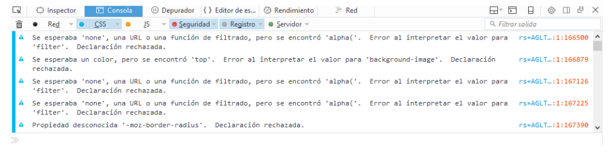

# UD 01. Navegadores y entorno de trabajo

```
Sergio García Barea
sergio.garcia@ceedcv.es
2019/2020
Versión:191028.0934
```

## Licencia


**Reconocimiento – NoComercial – CompartirIgual (by-nc-sa): No se permite un uso comercial de la obra original ni de las posibles obras derivadas, la distribución de las cuales se debe hacer con una licencia igual a la que regula la obra original.**

---

# Índice de contenido

1. Navegadores
    * 1.1  Introducción
    * 1.2  Definición de navegador
    * 1.3  Funcionamiento de los navegadores
2. Principales navegadores
    * 2.1  ¿Que navegador se recomienda para realizar el curso?
3. Herramientas útiles para el desarrollo: Consola Web
    * 3.1  Consola web
4. Entorno de desarrollo
    * 4.1  Visual Studio Code
    * 4.2  Control de versiones en Visual Studio Code
5. Material adicional
6. Bibliografía

---

# 1. Navegadores

## 1.1  Introducción

Para realizar cualquier desarrollo web, es imprescindible comprobar que el resultado que queremos es el adecuado con la mayor cantidad de navegadores posibles, especialmente aquellos más usados.

Además de procesar etiquetas HTML, los navegadores suelen interpretar lenguajes de script, siendo Javascript uno de los más populares.


## 1.2  Definición de navegador

Un navegador o navegador web, o browser (en inglés), es un software que permite el acceso a Internet, interpretando la información de distintos tipos de archivos y sitios web para que estos puedan ser visualizados.

La funcionalidad básica de un navegador web es permitir la visualización de documentos de texto, posiblemente con recursos multimedia incrustados. Además, permite visitar páginas web y hacer actividades en ella, es decir, podemos enlazar un sitio con otro, imprimir, enviar y recibir correo, entre otras funcionalidades más.

Los documentos que se muestran en un navegador  pueden estar ubicados en la computadora en donde está el usuario, pero también pueden estar en cualquier otro dispositivo que esté conectado en la computadora del usuario o a través de Internet, y que tenga los recursos necesarios para la transmisión de los documentos (un software servidor web).

Tales documentos, comúnmente denominados páginas web, poseen hipervínculos que enlazan una porción de texto o una imagen a otro documento, normalmente relacionado con el texto o la imagen.

El seguimiento de enlaces de una página a otra, ubicada en cualquier computadora conectada a Internet, se llama navegación, de donde se origina el nombre navegador.

Para acceder a estos recursos, se utiliza un identificador único llamado URL (Uniform Resource Locator).

El formato general de una URL es `protocolo://máquina/directorio/archivo`.
* Si no se especifica el directorio, toma como directorio el raíz.
* Si no se especifica el fichero, toma alguno de los nombres por defecto (“index.html”, “index.php”, etc...)

> Un ejemplo muy tipico es https://www.google.es donde se accede al recurso www.google.es usando el protocolo https.

## 1.3  Funcionamiento de los navegadores

La comunicación entre el servidor web y el navegador se realiza mediante el protocolo HTTP, aunque la mayoría de los navegadores soportan otros protocolos como FTP y HTTPS (una versión cifrada de HTTP basada en Secure Socket Layer o Capa de Conexión Segura (SSL)).

La función principal del navegador es obtener documentos HTML e interpretarlos para mostrarlos en pantalla. En la actualidad, no solamente descargan este tipo de documentos sino que muestran con el documento sus imágenes, sonidos e incluso vídeos streaming en diferentes formatos y protocolos. Además, permiten almacenar la información en el disco o crear marcadores (bookmarks) de las páginas más visitadas.

Algunos de los navegadores web más populares se incluyen en lo que se denomina una Suite. Estas Suite disponen de varios programas integrados para leer noticias de Usenet y correo electrónico mediante los protocolos NNTP, IMAP y POP.

Los primeros navegadores web sólo soportaban una versión muy simple de HTML. El rápido desarrollo de los navegadores web propietarios condujo al desarrollo de dialectos no estándares de HTML y a problemas de interoperabilidad en la web. Los más modernos (como Google Chrome, Mozilla, Netscape, Opera e Internet Explorer / Microsoft Edge) soportan los estándares HTML y XHTML (comenzando con HTML 4.01, los cuales deberían visualizarse de la misma manera en todos ellos).

Los estándares web son un conjunto de recomendaciones dadas por el World Wide Web consortium W3C) y otras organizaciones internacionales acerca de cómo crear e interpretar documentos basados en la web. Su objetivo es crear una web que trabaje mejor para todos, con sitios accesibles a más personas y que funcionen en cualquier dispositivo de acceso a Internet.

Se puede comprobar de manera online si un documento Web cumple el estándar definido por W3C mediante https://validator.w3.org/

Actualmente la mayoría de navegadores aceptan páginas no estándar, pero cuanto más estándar se la aplicación web desarrollada, mayor probabilidad que funcione correctamente en todos los navegadores.

Es una práctica imprescindible el comprobar que cualquier desarrollo Web funcione correctamente en los principales navegadores.

---
# 2. Principales navegadores



**Microsoft Edge (Antiguo Internet Explorer)**

* URL Oficial: https://www.microsoft.com/es-es/windows/microsoft-edge
* Antiguamente se llamaba Internet Explorer. Microsoft Edge está diseñado para ser un navegador web ligero con un motor de renderizado de código abierto construido en torno a los estándares web.

**Mozilla Firefox**

* URL Oficial: https://www.mozilla.org/es-ES/firefox/new/
* Mozilla Firefox es un navegador web libre y de código abierto desarrollado por la Corporación Mozilla y la Fundación Mozilla. Usa el motor Gecko para renderizar páginas webs, el cual implementa actuales y futuros estándares web.
    * Posee una versión para desarrolladores: “Firefox Developer Edition” https://www.mozilla.org/en-US/firefox/developer/?utm_source=firebug&utm_medium=lp&utm_campaign=switch&utm_content=landingpage

**Google Chrome**

* URL Oficial: https://www.google.com/chrome/
* Google Chrome es un navegador web desarrollado por Google y compilado con base en varios componentes e infraestructuras de desarrollo de aplicaciones (frameworks) de código abierto, como el motor de renderizado Blink (bifurcación o fork de WebKit). Está disponible gratuitamente bajo condiciones específicas del software privativo o cerrado.

**Safari**
* URL oficial: http://www.apple.com/es/safari/
* Safari es un navegador web de código cerrado desarrollado por Apple Inc. Está disponible para OS X, iOS (el sistema usado por el iPhone, el iPod touch y iPad) y Windows (sin soporte desde el 2012).

**Opera**
* URL oficial: http://www.opera.com/es
* Opera es un navegador web creado por la empresa noruega Opera Software. Usa el motor de renderizado Blink. Tiene versiones para escritorio, teléfonos móviles y tabletas.

## 2.1  ¿Que navegador se recomienda para realizar el curso?

Para realizar las actividades del módulo, recomiendo utilizar **Mozilla Firefox** (aunque es posible usar el que se desee).

El motivo de usar este es la gran cantidad de herramientas para depuración que posee incluso en su versión estándar. Para la mayoría de acciones con este será suficiente, pero está disponible una versión que amplia las herramientas de desarrollo llamada “Firefox Developer Edition”.

---

# 3. Herramientas útiles para el desarrollo: Consola Web

Los navegadores incorporan de manera nativa herramientas para facilitar el desarrollo, entra la que destacamos la “Consola Web”. Asimismo, también mediante ampliaciones (extensiones, plugins, etc.) se amplían características para facilitar el desarrollo y la depuración de código.

## 3.1  Consola web



> ATENCIÓN:
> * En Mozilla Firefox, se puede acceder a la consola web con la combinación de teclas “Ctrl+shift+k”
> * En Google Chrome, se puede acceder a las herramientas de desarrollo (que incluyen una consola similar a la de Firefox) con la combinación de teclas “Ctrl+shift+i”

Esta consola incluye varias pestañas:
* Red: registro de Peticiones HTTP.
* CSS: registra analisis y errores CSS.
* JS: registra análisis y errores Javascript
* Seguridad: registra advertencias o fallos de seguridad.
* Registro: registra mensajes enviados al objeto `window.console`
* Servidor: registrar mensajes recibidos del servidor Web.

El resultado de las peticiones HTTP se muestra de color negro, CSS de color azul, JavaScript amarillo y los errores o advertencias de seguridad de color rojo, registro objeto “window.console” en gris y Servidor en verde.

> Mas información del uso de la “Web console” en https://developer.mozilla.org/en-US/docs/Tools/Web_Console

---
# 4. Entorno de desarrollo

Existen diversos entornos de desarrollo, desde los más sencillos (Brackets, Notepad++, Sublime, Brackets, Visual Studio Code, etc...) a interfaces más complejas (Aptana, Eclipse, etc...)

En principio podéis usar aquel que queráis.

## 4.1  Visual Studio Code

Recomendamos Visual Studio Code. Es software libre y muy potente https://code.visualstudio.com/

Aquí algunos manuales libres de uso de Visual Studio Code en castellano:
* http://www.mclibre.org/consultar/informatica/lecciones/vsc-instalacion.html
* http://www.mclibre.org/consultar/informatica/lecciones/vsc-personalizacion.html

## 4.2  Control de versiones en Visual Studio Code

Durante el curso, se utilizarán repositorios Git tanto para la entrega de prácticas como para facilitaros el disponer de un repositorio con control de versiones.

Utilizaremos una cuenta Git en BitBucket https://bitbucket.org/.

Podéis instalarlo en:
* Ubuntu:
    * `sudo apt-get update`
    * `sudo apt-get install git`
* Windows: https://git-for-windows.github.io/

Para facilitar la tarea del uso de Git es recomendable instalar alguna extensión o entorno que os facilite su uso.

* Para usar Git en Visual Studio Code
    * https://code.visualstudio.com/docs/editor/versioncontrol
    * http://www.mclibre.org/consultar/informatica/lecciones/vsc-git-repositorio.html
* Aquí un ejemplo del uso de Git en Visual Studio Code.
    * https://code.visualstudio.com/docs/introvideos/versioncontrol

---
# 5. Material adicional

| ID  | Material | URL |
| --- | -------- | --- |
| [1] | Curso de Git en Udacity | https://www.udacity.com/course/how-to-use-git-and-github--ud775 |
| [2] | Uso de la “Consola Web” | https://developer.mozilla.org/en-US/docs/Tools/Web_Console |

---
# 6. Bibliografía

| ID  | Bibliografía  | URL |
| --- | ------------- | --- |
| [1] | Navegador Web | https://es.wikipedia.org/wiki/Navegador_web |
| [2] | Git | https://es.wikipedia.org/wiki/Git |
| [3] | Servidor Web | 	https://es.wikipedia.org/wiki/Servidor_web |
