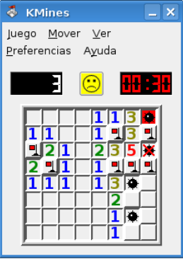

# TEMA 2 – ACTIVIDAD 2 (No evaluable). Sintáxis Javascript

```
Sergio García Barea
sergio.garcia@ceedcv.es
2019/2020
Versión:191121.1530
```

## Licencia


**Reconocimiento – NoComercial – CompartirIgual (by-nc-sa): No se permite un uso comercial de la obra original ni de las posibles obras derivadas, la distribución de las cuales se debe hacer con una licencia igual a la que regula la obra original.**

---

# Boletín de ejercicios

> Intenta hacer los programas por ti mismo, bien comentados y sin mirar código de otros. Te ayudará a aprender muchísimo :)

---
## 1. Sudoku

Realiza una aplicación web que compruebe si una solución de un Sudoku es correcta o no.

Una sugerencia de diseño para la aplicación web es que debe tener 9x9 campos de texto y un botón “Comprobar”. Recomiendo un valor por defecto de un Sudoku válido para hacer pruebas La explicación de las reglas del Sudoku las tenéis aquí https://es.wikipedia.org/wiki/Sudoku.

Internamente el programa realizará la comprobación de si el Sudoku es o no correcto en una función definida como `function esSudokuCorrecto(miArrayBi)`, que devolverá true si es correcto, false en caso contrario.

Esta función se podrá probar en www.aprendeaprogramar.org

---
## 2. Patrones de texto

Realiza una aplicación web que solicite una cadena de texto.

El programa debe decir cuantas veces ocurre cada uno de estos patrones sin distinguir mayúsculas y minúsculas: “00” “101”, “ABC”, “HO”.

Un carácter puede formar parte de mas de un patrón encontrado. Por ejemplo: En la cadena “000” el patrón “00” aparece dos veces (una empieza en la posición 0 y otra empieza en la posición 1).

Internamente el programa realizará la cuenta de patrones con una función definida como `function numeroPatrones(texto)`, que devolverá un número entero con el número de patrones encontrado.

Esta función se podrá probar en www.aprendeaprogramar.org

---
## 3. Buscaminas



Realiza una aplicación web que reciba en código mediante un array bidimensional (de longitud variable) un escenario de Buscaminas, donde haya un 0 donde no hay minas y un -1 donde si hay. Para cada casilla que no tenga una mina, diga cuantas minas adyacentes hay (en diagonal, horizontal y vertical).

Internamente el programa realizará las acciones con una función definida como `function contandoMinas(miCampo)`, que devolverá un array bidimensional con el número de minas adyacentes en cada posición.

Esta función se podrá probar en www.aprendeaprogramar.org

Más información de como funciona el Buscaminas
https://es.wikipedia.org/wiki/Buscaminas

Ejemplo Entrada

```
0  0 -1 0
0 -1 -1 0
```

Ejemplo Salida

```
1  3 -1 2
1 -1 -1 2
```
