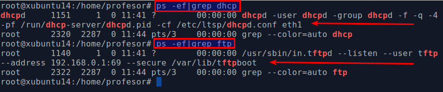

```
* Para el curso próximo, probar a usar OpenSUSE en lugar de Ubuntu.
```

# 1. Clientes ligeros con LTSP/Ubuntu

Entrega de la práctica:
* Crear informe usando ficheros de texto en Markdown e imágenes.
* Incluir breve explicación de clientes ligeros.
* Detallar los pasos realizados.
* Crear pequeño vídeo donde se muestra la práctica en funcionamiento. Esto es,
el momento es que arrancamos un cliente e iniciamos sesión.
* Incluir URL del vídeo subido a youtube.
* Entregar URL(Repositorio Git) del informe.
* Entregar URL(Repositorio Git) commit del informe.

> Al terminar la actividad, y antes de realizar la entrega, etiquetamos el proyecto con "ltsp".
> La etiqueta es un identificador que queda asociado a un instante de tiempo determinado del proyecto git.

# 2. Preparativos

Realizar las siguientes tareas:
* Trabajaremos de forma individual.
* Usaremos 2 MVs para montar clientes ligeros con LTSP.
* Atender a la explicación del profesor.
* Consultar/leer [web official de LTSP] (http://www.ltsp.org/), y los pdf
  que proporciona el profesor.

Veamos el esquema:


# 3. Servidor LTSP
## 3.1 Preparar la MV Server
Crear la MV del servidor con dos interfaces de red.
* La 1º interfaz será la externa:
    * para comunicarse con Internet.
    * Configurarla en VBox como adaptador puente.
    * Consultar [configuraciones](../../global/configuracion/debian.md).
* La 2º interfaz será la interna
    * para conectarse con los clientes ligeros.
    * La IP de esta interfaz de red debe ser estática y debe estar en la misma red que los clientes
        * IP 192.168.67.1
        * Máscara de clase C
    * Configurarla en VBox como "red interna".

## 3.2 Instalación del SSOO
* Instalar un SO GNU/Linux Xubuntu en la MV del servidor (Se prefiere usar una versión ligera
como Xubuntu, Lubuntu, porque las otras opciones consumen demasiada memoria).
* Consultar [configuraciones](../../global/configuracion/debian.md).
* Incluir en el informe la salida de los comandos siguientes:
```
ip a
route -n
hostname -a
hostname -f
uname -a
blkid
```

Veamos ejemplo de nombres de equipo y dominio en Debian/Ubuntu:


> **NOTA**: En OpenSUSE usamos la herramienta Yast2 para modificar cómodamente dichos valores.

* Crear 3 usuarios locales llamados: primer-apellido-alumno1, primer-apellido-alumno2,
primer-apellido-alumno3.

## 3.3 Instalar el servicio LTSP
* Instalar el servidor SSH `apt-get install openssh-server`, para permitir acceso
remoto a la máquina.
* Modificar SSH con `PermitRootLogin Yes`.
* Instalar servidor de clientes ligeros, según la documentación para el SO elegido.
En el caso de Debian/Ubuntu puede ser `apt-get install ltsp-server-standalone`.
* Ahora vamos a crear un imagen del SO a partir del sistema real haciendo `ltsp-build-client`.
La imagen del SO se cargará en la memoria de los clientes ligeros.

> **32 bits o 64 bits**
>
> Si el servidor es de 64-bits pero los clientes tienen arquitectura de 32-bits
entonces usar el comando siguiente `ltsp-build-client --arch i386` para crear una imagen
de 32 bits.
>

* Ejecutar `ltsp-info`, para consultar información.


> **NOTA**
>
> En el caso de tenemos problemas con la imagen, estos son los comandos LTSP
para volver a actualizar la imagen.
>
> * `ltsp-update-kernel`
> * `ltsp-update-sshkeys`
> * `ltsp-update-image`

Revisamos la configuración del servicio DHCP instalado junto con LTSP:
* Revisar la configuración de la tarjeta de red interna del servidor.
IP estática compatible con la configuración dhcp.
* Consultamos el fichero de configuración `/etc/ltsp/dhcpd.conf`.
Comprobar las rutas de `option root-path /opt/ltsp/amd64` y de `filename /ltsp/amd64/pxelinux.0`.
Veamos una imagen de ejemplo.


> **IP de la red interna**
>
> Si se desea usar una IP diferente en la red interna entonces será necesario
modificar también el fichero del servidor DHCP `/etc/ltsp/dhcpd.conf` y luego reiniciar el servicio.
>

* En el fichero `/etc/ltsp/dhcpd.conf` modificar el valor `range 192.168.67.1XX 192.168.67.2XX;`.
Donde XX es el número de puesto de cada alumno.
* Reiniciamos el servidor, y comprobamos que los servicios están corriendo.


> SERVICIOS
>
> * En OpenSUSE
>     * se usa el comando `systemctl` para iniciar y parar servicios.
>     * Si hay algún error deberemos consultar los logs con `journalctl`.
> * En SSOO con el antiguo System
>     * usan `/etc/init.d/isc-dhcp-server status|start|stop`.
>     * usan `/etc/init.d/tftpd-hpa status|start|stop`.
>     * Si hay algún error deberemos consultar syslog `tail /var/log/syslog`.
> * Para cambiar las opciones del arranque por defecto, editamos fichero
>     * `/etc/default/isc-dhcp-server` para DHCP. Modificar INTERFACES
>     * `/etc/default/tftpd-hpa` para TFTP. Modificar TFTP_ADDRESS con IP:PORT. Por ejemplo `192.168.67.1:69`.
>


# 4. Preparar MV Cliente

Crear la MV cliente en VirtualBox:
* Sin disco duro y sin unidad de DVD.
* Sólo tiene RAM, floppy
* Tarjeta de red PXE en modo "red interna".

Con el servidor encendido, iniciar la MV cliente desde red/PXE:
* Comprobar que todo funciona correctamente.

> Si la tarjeta de red no inicia correctamente el protocolo PXE,
conectar disquete Etherboot en la disquetera, tal y como se indica
en la documentación de la web de LTSP.

En la imagen podemos ver un ejemplo de la ventana de login de un cliente ligero.
Vemos como aparece la IP que proporciona el servidor DHCP del servidor LTSP al cliente.


Cuando el cliente se conecte
* entramos con los usuarios apellido-del-alumno[1-3]
* Ir al servidor, como superusuario y capturar la salida de los siguientes comandos:
```
whoami        # Muestra el usuario actual
who           # Muestra los usuarios conectados al sistema
arp           # Muestra la tabla ARP (Asociaciones de IP con MAC)
netstat -ntap # Muestras las conexiones con el exterior
```
* Reiniciar la MV cliente y grabar vídeo mostrando el funcionamiento.

---

# 5. ANEXOS
Los anexos siguientes son resúmenes de la documentación proporcionada por la página web de LTSP.

Enlaces de interés:
* [Hardware de cliente ligero](https://www.youtube.com/watch?v=MgOX63SIl9I)
* [Conectar Knoppix7 con servidor LTSP de sistema operativo ](https://www.youtube.com/watch?v=UpNUHsXSxA4)

## 5.1 Personalización de los clientes
En Debian/Ubuntu podemos personalizar la configuración de los clientes ligeros,
modificando/añadiendo valores en /var/lib/tftpboot/ltsp/i386/ltsp.conf

## 5.2 For openSUSE 12.3

Via commandline(following commands to be run in terminal as root "su -"):
````
    zypper ar -r http://r.opensu.se/server:ltsp.repo
    zypper refresh
    zypper in kiwi-ltsp-prebuilt
````
* It is expected that minimum GNOME environment is installed on the server.
* Check out Network configuration instructions before proceeding.
* Launch `Easy-LTSP` GUI as root (open terminal, run "su -", provide root
password, and then run "easy-ltsp" command).

> **Cambiar para el próximo curso1617**
>
> * Usar SO Debian 8 y/o OpenSUSE13.2
> * La IP interna de Debian8 para LTSP eth1 192.168.67.1
>
