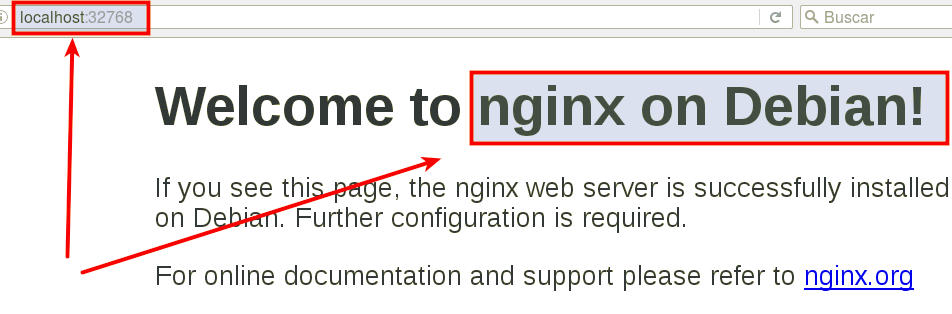

#1.Introducción

Es muy común que nos encontremos desarrollando una aplicación y llegue 
el momento que decidamos tomar todos sus archivos y migrarlos ya sea al 
ambiente de producción, de prueba o simplemente probar su comportamiento 
en diferentes plataformas y servicios. Para situaciones de este estilo 
existen herramientas que, entre otras cosas, nos facilitan el embalaje 
y despliegue de la aplicación, es aquí donde entra en juego Docker.

Esta herramienta nos permite crear lo que ellos denominan contenedores, 
lo cual son aplicaciones empaquetadas auto-suficientes, muy livianas
 que son capaces de funcionar en prácticamente cualquier ambiente, 
 ya que tiene su propio sistema de archivos, librerías, terminal, etc. 

#2. Preparativos

Nesitaremos una MV OpenSUSE 13.2.

> Se requiere versión del Kernel 3.10 o superior (`uname -a`)

#3. Instalación y configuración

* Enlaces de interés [Docker installation on SUSE](https://docs.docker.com/engine/installation/linux/SUSE)

Ejecutar como superusuario:
```
zypper in docker              # Instala docker
systemctl start docker        # Inicia el servicio
docker version                # Debe mostrar información del cliente y del servidor
usermod -a -G docker USERNAME # Añade permisos a nuestro usuario
```

> Salir de la sesión y volver a entrar con nuestro usuario.

Ejecutar con nuestro usuario para comprobar que todo funciona:
``` 
docker images           # Muestra las imágenes descargadas hasta ahora
docker ps -a            # Muestra todos los contenedores creados
docker run hello-world  # Descarga y ejecuta un contenedor con la imagen hello-world
docker images
docker ps -a
``` 

> **Habilitar el acceso a la red externa para los contenedores**
>
> If you want your containers to be able to access the external network, 
you must enable the net.ipv4.ip_forward rule. To do this, use YaST.
>
> * Para openSUSE13.2 (cuando el método de configuracion de red es Wicked).
`Yast -> Dispositivos de red -> Encaminamiento -> Habilitar reenvío IPv4`
> * Cuando la red está gestionada por Network Manager, en lugar de usar YaST 
debemos editar el fichero `/etc/sysconfig/SuSEfirewall2` y poner `FW_ROUTE="yes"`.
> * Para openSUSE Tumbleweed `Yast -> Sistema -> Configuración de red -> Menú de encaminamiento`.
>
> ¿Recuerdas lo que implica `forwarding` en los dispositivos de red?

#4. Crear una imagen personalizada

* Enlace de interés: [Cómo instalar y usar docker](http://codehero.co/como-instalar-y-usar-docker/)

```
docker images          # Vemos las imágenes disponibles localmente
docker search debian   # Buscamos en los repositorios de Docker Hub
                       # contenedores con la etiqueta `debian`
docker pull debian:8   # Descargamos contenedor `debian:8` en local
docker pull opensuse
docker ps -a           # Vemos todos los contenedores
docker ps              # Vemos sólo los contenedores en ejecución
``` 

Vamos a crear un contenedor con nombre `mv_debian` a partir de la imagen `debian:8`, y ejecutaremos `/bin/bash`: 
```
docker run --name=mv_debian -i -t debian:8 /bin/bash

(Estamos dentro del contenedor)
root@IDContenedor:/# cat /etc/motd            # Comprobamos que estamos en Debian
root@IDContenedor:/# apt-get update
root@IDContenedor:/# apt-get install -y nginx # Instalamos nginx en el contenedor
root@IDContenedor:/# nginx -v                 # Ejecutamos nginx en el contenedor
```

Ya tenemos nuestro contenedor auto-suficiente de Nginx, ahora debemos 
crear una nueva imagen con los cambios que hemos hecho, para esto
abrimos otra ventana de terminal y busquemos el IDContenedor:

```
david@camaleon:~/devops> docker ps
CONTAINER ID   IMAGE      COMMAND       CREATED          STATUS         PORTS  NAMES
7d193d728925   debian:8   "/bin/bash"   2 minutes ago    Up 2 minutes          mv_debian
``` 

Ahora con esto podemos crear la nueva imagen a partir de los cambios que realizamos sobre la imagen base:
```
docker commit 7d193d728925 dvarrui/nginx
docker images
``` 

> Los estándares de Docker estipulan que los nombres de las imagenes deben 
seguir el formato `nombreusuario/nombreimagen`.
> Todo cambio que se haga en la imagen y no se le haga commit se perderá en cuanto se cierre el contenedor. 

```
docker ps 
docker stop mv_debian  # Paramos el contenedor
docker ps 
docker ps -a           # Vemos el contenedor parado
docker rm IDcontenedor # Eliminamos el contenedor
docker ps -a 
```

#5. Creando contenedor con nuestra imagen

Bien, tenemos una imagen con Nginx instalado, probemos ahora la magia de Docker. 
Iniciemos el contenedor de la siguiente manera:

`docker run -p 80 -i -t dvarrui/nginx /bin/bash`

> El argumento `-p 80` le indica a Docker que debe mapear el puerto especificado 
del contenedor, en nuestro caso el puerto 80 es el puerto por defecto 
sobre el cual se levanta Nginx. 

* Una vez dentro
    * Iniciamos el servicio de Nginx `service nginx start`.
    * Comprobamos `service nginx status`.
* Ahora en una nueva ventana ejecutaremos `docker ps`. Podemos apreciar 
que la última columna nos indica que el puerto 80 del contenedor 
está redireccionado a un puerto local `0.0.0.0.:NNNNNN->80/tcp`, vayamos al explorador 
y veamos si conectamo con Nginx dentro del contenedor.




#ANEXO

Enlaces de interés:
* [Docker for beginners](http://prakhar.me/docker-curriculum/)
* [getting-started-with-docker](http://www.linux.com/news/enterprise/systems-management/873287-getting-started-with-docker)

Docker es una tecnología contenedor de aplicaciones construida sobre LXC.

