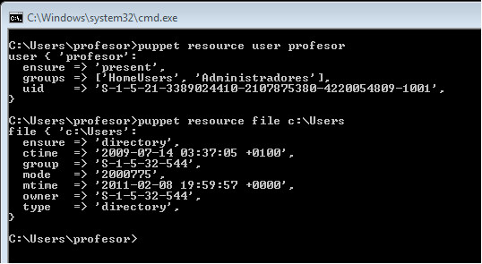

*(Nueva para el curso 201516)*

#1. Introducción

Existen varias herramientas para realizar instalaciones desde un punto central, 
como Chef, Ansible, CFEngine, etc. En este ejemplo, vamos a usar Puppet.

Según Wikipedia, Puppet es una herramienta diseñada para administrar la configuración 
de sistemas Unix-like y de Microsoft Windows de forma declarativa. El usuario describe 
los recursos del sistema y sus estados, ya sea utilizando el lenguaje declarativo de 
Puppet o un DSL (lenguaje específico del dominio) de Ruby.

Enlaces de interés:

* [Puppetcookbook](http://www.puppetcookbook.com/posts/show-resources-with-ralsh.html)
* [Vídeo sin audio - 14 minutos de duración](https://youtu.be/kPyaI--iAcA) 
* [Vídeo en inglés - minuto 15, 36 minutos de duración](https://youtu.be/Hiu_ui2nZa0)
* Vídeo en inglés "LINUX: Installing the Puppet Master on openSUSE" creado por TheUrbanPenguin.
* Vídeo en inglés "LINUX: The Puppet Client and basic site.pp" creado por TheUrbanPenguin
para OpenSUSE.

##1.1 Configuración

> En OpenSUSE podemos hacer todas estas configuraciones a través de `Yast`

Vamos a usar 3 MV's con las siguientes configuraciones:
* MV1 - master: Dará las órdenes de instalación/configuración a los clientes.
    * SO GNU/Linux OpenSUSE 13.2
    * IP estática 172.18.XX.100
    * Enlace: 172.18.0.1
    * DNS: 8.8.4.4
    * Nombre del equipo: masterXX
    * Dominio = primer-apellido-del-alumno
    * Instalar OpenSSH-Server para acceso del profesor.
* MV1 - client1: recibe órdenes del master.
    * SO GNU/Linux OpenSUSE 13.2
    * IP estática 172.18.XX.101
    * Enlace: 172.18.0.1
    * DNS: 8.8.4.4
    * Nombre del equipo: cli1aluXX
    * Dominio = primer-apellido-del-alumno
    * Instalar OpenSSH-Server para acceso del profesor.
* MV3 - client2: recibe órdenes del master.
    * SO Windows 7.
    * IP estática 172.18.XX.102
    * Enlace: 172.18.0.1
    * DNS: 8.8.4.4
    * Nombre Netbios: cli2aluXX
    * Nombre del equipo: cli2aluXX
    * Grupo de trabajo = AULA108
    * Instalar ServidorSSH para acceso del profesor.
* Cada MV debe tener configurada en su `/etc/hosts` al resto. Para poder hacer `ping`
entre ellas usando los nombres. Con esto obtenemos resolución de nombres para nuestras
propias MV's sin tener un servidor DNS. 

> **GNU/Linux**
>
> El fichero `/etc/hosts` debe tener un contenido similar a:
>
>     127.0.0.1       localhost
>     127.0.0.2       master30.vargas    master30
>     172.18.30.100   master30.vargas    master30
>     172.18.30.101   cli1alu30.vargas   cli1alu30
>     172.18.30.102   cli2alu30.vargas   cli2alu30

> **Windows**
>
> Para localizar el fichero hosts de Windows, vamos a la ruta de la imagen:
> 
> 
>
> El contenido del fichero hosts de Windows tiene el siguiente aspecto:
>
> 

##1.2 Comprobacion de las configuraciones

En GNU/Linux, para comprobar que las configuraciones son correctas hacemos:

```
    date
    ip a
    route -n
    host www.google.es
    hostname -a
    hostname -f
    hostname -d
    ping masterXX
    ping masterXX.primer-apellido-del-alumno
    ping cli1aluXX
    ping cli1aluXX.primer-apellido-del-alumno
    ping cli2aluXX
    ping cli2aluXX.primer-apellido-del-alumno   
```

En Windows comprobamos con:

```
    date
    ipconfig
    route /PRINT
    nslookup www.google.es
    ping masterXX
    ping masterXX.primer-apellido-del-alumno
    ping cli1aluXX
    ping cli1aluXX.primer-apellido-del-alumno
    ping cli2aluXX
    ping cli2aluXX.primer-apellido-del-alumno   
```

> **IMPORTANTE**: Comprobar que todas las máquinas tienen la fecha/hora correcta.

##1.3 Veamos un ejemplo

*Esto NO es obligatorio hacerlo. Sólo es un ejemplo.*

Vamos a ver un ejemplo de cómo usar `puppet` manualmente. Esto no s puede ayudar a comprender
cómo es la sintaxis de la herramienta.

Al instalar el servidor puppet en la máquina master, también tenemos instalado el Agente puppet.
Vamos a preguntar a puppet para ver cómo responde con lo siguiente:
* sobre el paquete `tree` instalado en el sistema.
* sobre el usuario `yoda` creado en el sistema, y 
* sobre la carpeta `/home/yoda/endor` que ya existe en el sistema.

Vamos a averiguar la configuración que lee puppet de estos recursos, y guardamos los datos
obtenidos de puppet en el fichero `yoda.pp`. Para ello ejecutamos los comandos siguientes:

    puppet resource package tree > yoda.pp
    puppet resource user yoda >> yoda.pp
    puppet resource file /home/yoda/endor >> yoda.pp

El contenido del fichero `yoda.pp` debe ser parecido a:

```
package { 'tree':
  ensure => 'present',
}

user { 'yoda':
  ensure => 'present',
  home => '/home/yoda',
  password => '$6$G09ynAifi7mX$6pag6BIvQWT6iLa8fjQx20nEev3PabB6HdbqBX37oXrmP6y0',
  shell => '/bin/bash',
}

file { '/home/yoda/endor/':
  ensure => 'directory',
  group => '100',
  mode => '755',
  owner => '1001',
  type => 'directory',
}
```

Si nos lleváramos el fichero `yoda.pp` a otro PC con el Agente puppet instalado, 
podemos forzar a que se creen estos cambios con el comando: `puppet apply yoda.pp`


#2. Primera versión del fichero pp

* Instalamos Puppet Master en la MV masterXX: `zypper install puppet-server puppet puppet-vim`
* Preparamos los ficheros/directorios en el master:
```
    mkdir /etc/puppet/files
    mkdir /etc/puppet/manifests
    mkdir /etc/puppet/manifests/classes
    touch /etc/puppet/files/readme.txt
    touch /etc/puppet/manifests/site.pp
    touch /etc/puppet/manifests/classes/hostlinux1.pp
```

##2.1 /etc/puppet/files/readme.txt

* Contenido para readme.txt: `"¡Que la fuerza te acompañe!"`.
* Los ficheros que se guardan en 
`/etc/puppet/files` pueden se descargados por el resto de máquinas puppet.

##2.2 /etc/puppet/manifests/site.pp

* Este es el fichero principal de configuración puppet.
* Contenido para site.pp:
```
import "classes/*"

node default {
  include hostlinux1
}
```
> Esta configuración significa:
> * Todos los ficheros de configuración del directorio classes se añadirán a este fichero.
> * Todos los nodos/clientes van a usar la configuración `hostlinux1`

##2.3 /etc/puppet/manifests/classes/hostlinux1.pp

* Como podemos tener muchas configuraciones, vamos a separarlas en distintos ficheros para
organizarnos mejor, y las vamos a guardar en la ruta `/etc/puppet/manifests/classes`
* Vamos a crear una primera configuración para máquina estándar GNU/Linux.
* Contenido para `/etc/puppet/manifiests/classes/hostlinux1.pp`:
```
class hostlinux1 {
  package { "tree": ensure => installed }
  package { "traceroute": ensure => installed }
  package { "geany": ensure => installed }
}
```

> **OJO**: La ruta del fichero es `/etc/puppet/manifests/classes/hostlinux1.pp`.

* Comprobar que tenemos los permisos adecuados en la ruta `/var/lib/puppet`.
* Reiniciamos el servicio `puppet-server` (o puppetmasterd).
* Consultamos log por si hay errores: `tail /var/log/syslog`

#3. Instalación y configuración del cliente1

Instalación:
* Instalamos Agente Puppet en el cliente: `zypper install puppet`
* El cliente puppet debe ser informado de quien será su master. Para ello, añadimos a `/etc/puppet/puppet.conf`:

```
    [main]
    server=masterXX.primer-apellido-alumno
    ...
```
* Comprobar que tenemos los permisos adecuados en la ruta `/var/lib/puppet`.
* Reiniciar servicio en el cliente.
* Comprobamos los log del cliente: `tail /var/log/syslog`

#4. Certificados

Antes de que el master acepte a cliente1 como cliente, se deben intercambiar los certificados entre 
ambas máquinas. Esto sólo hay que hacerlo una vez.

##4.1 Aceptar certificado

* Vamos al master y consultamos las peticiones pendiente de unión al master: `puppetca --list`
```
    root@master30# puppetca --list
    "cli1alu30.vargas" (D8:EC:E4:A2:10:55:00:32:30:F2:88:9D:94:E5:41:D6)
    root@master30#
```
* Aceptar al nuevo cliente desde el master `puppetca --sign "nombre-máquina-cliente"`
```
    root@master30# puppetca --sign "cli1alu30.vargas"
    notice: Signed certificate request for cli1alu30.vargas
    notice: Removing file Puppet::SSL::CertificateRequest cli1alu30.vargas at '/var/lib/puppet/ssl/ca/requests/cli1alu30.vargas.pem'

    root@master30# puppetca --list

    root@master30# puppetca --print cli1alu30.vargas
    Certificate:
    Data:
    ....
```

##4.2 Comprobación final

* Vamos a cliente1 y reiniciamos la máquina.
* Comprobar que los cambios configurados en Puppet se han realizado.
* En caso contrario, ejecutar comando para comprobar errores: 
    * `puppetd --test`
    * `puppet agent --server master30.vargas --test`
* Para ver el detalle de los errores, podemos reiniciar el servicio puppet en el cliente, y 
consultar el archivo de log del cliente: `tail /var/log/syslog`.
* Puede ser que tengamos algún mensaje de error de configuración del fichero 
`/etc/puppet/manifests/site.pp del master`. En tal caso, ir a los ficheros del master 
y corregir los errores de sintaxis.

> **¿Cómo eliminar certificados?** (*Esto NO HAY QUE HACERLO*)
> 
> Sólo es información, para el caso que tengamos que eliminar los certificados
> 
> Si tenemos problemas con los certificados, y queremos eliminar los certificados actuales, podemos hacer lo siguiente:
> * `puppetca --revoke cli1alu30.vargas`: Lo ejecutamos en el master para revocar certificado del cliente.
> * `puppetca --clean  cli1alu30.vargas`: Lo ejecutamos en el master para eliminar ficheros del certificado del cliente.
> *  `rm -rf /var/lib/puppet/ssl`: Lo ejecutamos en el cliente para eliminar los certificados del cliente.
>
> Consultar [URL https://wiki.tegnix.com/wiki/Puppet](https://wiki.tegnix.com/wiki/Puppet), para más información.

#5. Segunda versión del fichero pp

Ya hemos probado una configuración sencilla en PuppetMaster. 
Ahora vamos a pasar a configurar algo más complejo.

* Contenido para `/etc/puppet/manifests/classes/hostlinux2.pp`:

```
class hostlinux2 {
  package { "tree": ensure => installed }
  package { "traceroute": ensure => installed }
  package { "geany": ensure => installed }
  package { "gnomine": ensure => purged }

  group { "jedy": ensure => "present", }
  group { "admin": ensure => "present", }

  user { 'obi-wan':
    home => '/home/obi-wan',
    shell => '/bin/bash',
    password => 'kenobi',
    groups => ['jedy','admin','sudo','root'] 
  }

  file { "/home/obi-wan":
    ensure => "directory",
    owner => "obi-wan",
    group => "jedy",
    mode => 750 
  }

  file { "/home/obi-wan/share":
    ensure => "directory",
    owner => "obi-wan",
    group => "jedy",
    mode => 750 
  }

  file { "/home/obi-wan/share/private":
    ensure => "directory",
    owner => "obi-wan",
    group => "jedy",
    mode => 700 
  }

  file { "/home/obi-wan/share/public":
    ensure => "directory",
    owner => "obi-wan",
    group => "jedy",
    mode => 755 
  }

}
```

> Las órdenes anteriores de configuración de recursos puppet, tienen el significado siguiente:
>
> * **package**: indica paquetes que queremos que estén o no en el sistema.
> * **group**: creación o eliminación de grupos.
> * **user**: Creación o eliminación de usuarios.
> * **file**: directorios o ficheros para crear o descargar desde servidor.

* Modificar `/etc/puupet/manifests/site.pp` con:

```
import "classes/*"

node default {
  include hostlinux2
}
```
> Por defecto todos los nodos (máquinas clientes) van a coger la misma configuración.

#6. Cliente puppet windows

Vamos a configurar Puppet para atender también a clientes Windows.

Enlace de interés: 
* [http://docs.puppetlabs.com/windows/writing.html](http://docs.puppetlabs.com/windows/writing.html)

##6.1 Modificaciones en el Master

* En el master vamos a crear una configuración puppet para las máquinas windows, 
dentro del fichero `/etc/puppet/manifests/classes/hostwindows3.pp`, con el siguiente contenido:

```
class hostwindows3 {
  file {'C:\warning.txt':
    ensure => present,
    content => "Hola Mundo Puppet!",
  }
}
```

> De momento, esta configuración es muy básica. Al final la ampliaremos algo más.

* Ahora vamos a modificar el fichero `site.pp` del master, para que tenga en cuenta
la configuración de clientes GNU/Linux y clientes Windows, de la siguiente forma:

```
import "classes/*"

node 'cli1alu30.vargas' {
  include hostlinux2
}

node 'cli2alu30' {
  include hostwindows3
}
```

* Reiniciamos el servicio PuppetMaster.
* Ejecutamos el comando `facter`, para ver la versión de Puppet que está usando el master.

> Debemos instalar la misma versión de puppet en master y clientes

##6.2 Modificaciones en el cliente2

* Consultar URL:
    * [http://docs.puppetlabs.com/windows?/installing.html](http://docs.puppetlabs.com/windows?/installing.html)
    * [https://downloads.puppetlabs.com/windows/](https://downloads.puppetlabs.com/windows/)
* Ahora vamos a instalar AgentePuppet en Windows. Recordar que debemos instalar la misma versión en
ambos equipos (Usar comando `facter` para ver la versión de puppet).
* Reiniciamos.
* Debemos aceptar el certificado en el master para este nuevo cliente. Consultar apartado 4.

> Con los comandos siguentes podremos hacernos una idea de como terminar de configurar 
el fichero puppet del master para la máquina Windows.

* Iniciar consola puppet como administrador y probar los comandos: 
    * `puppet agent --server master30.vargas --test`: Comprobar el estado del agente puppet.
    * `facter`: Para consultar datos de la máquina windows
    * `puppet resource user nombre-alumno1`: Para ver la configuración puppet del usuario.
    * `puppet resource file c:\Users`: Para var la configuración puppet de la carpeta.

Veamos imagen de ejemplo:



* Configuración en el master del fichero `/etc/puppet/manifests/classes/hostwindows3.pp` 
para el cliente Windows:

```
class hostwindows3 {
  user { 'darth-sidius':
    ensure => 'present',
    groups => ['Administradores']
  }

  user { 'darth-maul':
    ensure => 'present',
    groups => ['Usuarios']
  }
}
```
* Crear un nuevo fichero de configuración para la máquina cliente Windows.
Nombrar el fichero con `/etc/puppet/manifests/classes/hostwindows4.pp`.
Incluir configuraciones elegidas por el alumno.

