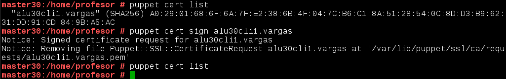
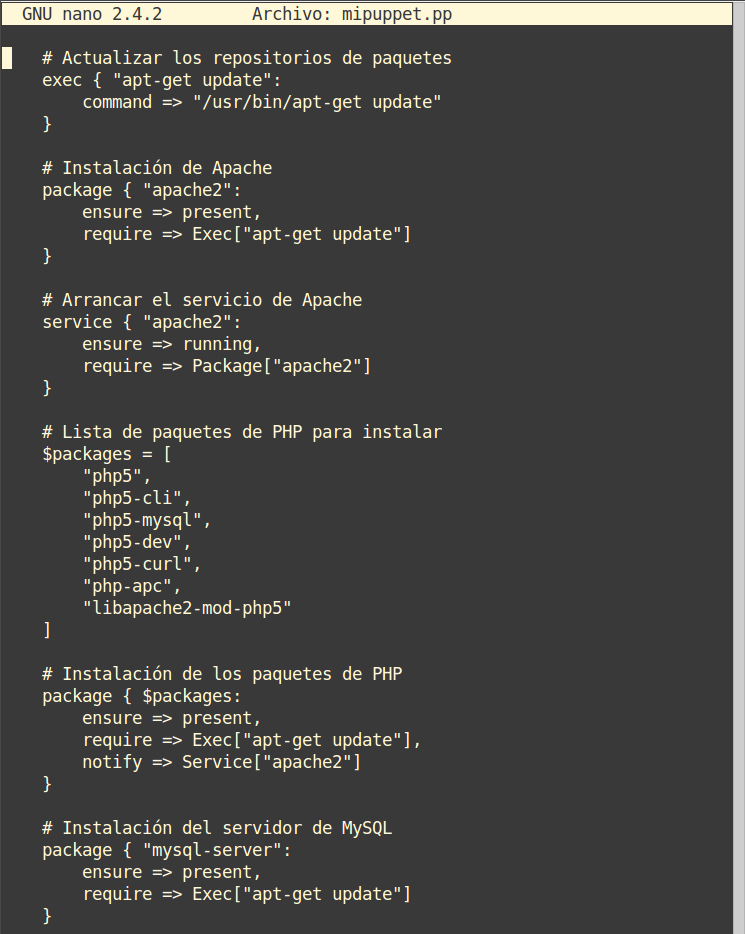

# 1. Introducción

Existen varias herramientas para realizar instalaciones desde un punto central,
como Chef, Ansible, CFEngine, etc. En este ejemplo, vamos a usar Puppet.

Según Wikipedia, Puppet es una herramienta diseñada para administrar la configuración
de sistemas Unix-like y de Microsoft Windows de forma declarativa. El usuario describe
los recursos del sistema y sus estados, ya sea utilizando el lenguaje declarativo de
Puppet o un DSL (lenguaje específico del dominio) de Ruby.

> Enlaces de interés:
>
> * Vídeo en inglés ["LINUX: Installing the Puppet Master on openSUSE" by TheUrbanPenguin](https://www.youtube.com/watch?v=8jBlUKimPVc&feature=youtu.be)
> * Vídeo en inglés ["LINUX: The Puppet Client and basic site.pp" by por TheUrbanPenguin](https://youtu.be/KLF1-i8RzGU)
> * [Puppetcookbook](http://www.puppetcookbook.com/posts/show-resources-with-ralsh.html)
> * Vídeo sin audio (14 minutos) sobre [Puppet en Debian](https://youtu.be/kPyaI--iAcA)
> * [Vídeo en inglés](https://youtu.be/Hiu_ui2nZa0) minuto 15, 36 minutos de duración.

## 1.1 Entrega

* El trabajo se entregará vía repositorio GitHub del alumno.
* Usaremos la etiqueta `puppet` para la entrega.

## 1.2 Configuración

> **ADVERTENCIA**
>
> * Los nombres de máquinas, dominios, usuarios, etc., deben estar siempre en minúsculas.
> * No usar tildes, caracteres especiales (ñ, ü, etc.)
> * En OpenSUSE podemos hacer configurar el equipo a través de `Yast`

Vamos a usar 3 MV's con las siguientes configuraciones:
* MV1 - master: Dará las órdenes de instalación/configuración a los clientes.
    * [Configuración OpenSUSE](../../global/configuracion/opensuse.md).
    * IP estática 172.AA.XX.100
    * Nombre del equipo: `masterXX`
    * Dominio: `curso1718`
* MV2 - cliente 1: recibe órdenes del master.
    * [Configuración OpenSUSE](../../global/configuracion/opensuse.md).
    * IP estática 172.AA.XX.101
    * Nombre del equipo: `cli1aluXX`
    * Dominio: `curso1718`
* MV3 - client2: recibe órdenes del master.
    * [Configuración SO Windows 7](../../global/configuracion/windows.md).
    Este SO debe haber sido instalado por cada alumno.
    NO clonar de un compañero y/o profesor.
    * IP estática 172.18.XX.102
    * Nombre Netbios: `cli2aluXX`
    * Nombre del equipo: `cli2aluXX`

### Configurar `/etc/hosts`

* Cada MV debe tener configurada en su `/etc/hosts` al resto de hosts, para
poder hacer `ping` entre ellas usando los nombres largos y cortos. Con este fichero
obtenemos resolución de nombres para nuestras propias MV's sin tener un servidor DNS.

> **GNU/Linux**
>
> El fichero `/etc/hosts` debe tener un contenido similar a:
>
>     127.0.0.1       localhost
>     # IMPORTANTE: El nombre largo va primero y el corto después!!!
>     172.18.30.100   master42.curso1718    master42
>     172.18.30.101   cli1alu42.curso1718   cli1alu42
>     172.18.30.102   cli2alu42

> **Windows**
>
> * Localizar el fichero hosts de Windows en la siguiente ruta:
>
> 
>
> * El contenido del fichero hosts de Windows tiene el siguiente aspecto:
>
> 

## 1.3 Comprobar las configuraciones

No es necesario hacer capturas de esta parte, pero si es muy importante
asegurarse de:
* Todas las comprobaciones estén correctas antes de seguir.
* Todos los nombres están bien configurados antes de seguir.
* Todas las máquinas tienen la fecha/hora correcta.
* Cuando una MV se pone en pausa la hora se puede quedar mal (retrasada).

En GNU/Linux, para comprobar que las configuraciones son correctas hacemos:

```
date
ip a
route -n
host www.google.es
hostname -a
hostname -f               # Comprobar que devuelve el valor correcto!!!
hostname -d               # Comprobar que devuelve el valor correcto!!!
tail -n 5 /etc/hosts
ping masterXX
ping masterXX.curso1718
ping cli1aluXX
ping cli1aluXX.curso1718
ping cli2aluXX
```

En Windows comprobamos con:

```
date
ipconfig
route PRINT
nslookup www.google.es
ping masterXX
ping masterXX.curso1718
ping cli1aluXX
ping cli1aluXX.curso1718
ping cli2aluXX
```

A partir de este momento ya no deberíamos cambiar los nombres de las máquinas.

## 1.4 Información: Veamos un ejemplo

*Esto NO HAY QUE HACERLO. Sólo es un ejemplo.*

Vamos a ver un ejemplo de cómo usar `puppet` manualmente. Esto nos puede
ayudar a comprender cómo es la sintaxis de la herramienta.

Al instalar el servidor Puppet en la máquina master, también tenemos instalado el Agente puppet.
Vamos a preguntar a puppet para ver cómo responde:
* sobre el paquete `tree` instalado en el sistema.
* sobre el usuario `barbaroja` creado en el sistema, y
* sobre la carpeta `/home/barbaroja/barco` que ya existe en el sistema.

Vamos a averiguar la configuración que lee puppet de estos recursos, y guardamos los datos
obtenidos de puppet en el fichero de prueba `piratas.pp`. Para ello ejecutamos los comandos siguientes:

```
$ puppet resource package tree > piratas.pp
$ puppet resource user barbaroja >> piratas.pp
$ puppet resource file /home/barbaroja/barco >> piratas.pp
```

El contenido del fichero `piratas.pp` debe ser parecido a:

```
package { 'tree':
  ensure => 'present',
}

user { 'barbaroja':
  ensure => 'present',
  home => '/home/barbaroja',
  password => '$6$G09ynAifi7mX$6pag6BIvQWT6iLa8fjQx20nEev3PabB6HdbqBX37oXrmP6y0',
  shell => '/bin/bash',
}

file { '/home/barbaroja/barco/':
  ensure => 'directory',
  group => '100',
  mode => '755',
  owner => '1001',
  type => 'directory',
}
```

Si nos lleváramos el fichero `piratas.pp` a otro PC con el Agente puppet instalado,
podemos forzar a que se creen estos cambios con el comando: `puppet apply piratas.pp`

---

# 2. Instalando y configuración del servidor

* Instalamos Puppet Master en la MV masterXX:
    * `zypper install rubygem-puppet-master` (OpenSUSE Leap).

> En OpenSUSE 13.2 hacemos `zypper install puppet-server puppet puppet-vim`.
> El paquete `puppet-vim`, sólo es para que el editor vim detecte la sintaxis de puppet.

* `systemctl enable puppetmaster`: Permitir que el servicio se inicie automáticamente
en el inicio de la máquina.
* `systemctl start puppetmaster`: Iniciar el servicio.
* `systemctl status puppetmaster`: Consultar el estado del servicio.
* En este momento debería haberse creado el directorio `/etc/puppet/manifests`.
* Preparamos los ficheros/directorios en el master:
```
mkdir /etc/puppet/files
touch /etc/puppet/files/readme.txt
mkdir /etc/puppet/manifests
touch /etc/puppet/manifests/site.pp
mkdir /etc/puppet/manifests/classes
touch /etc/puppet/manifests/classes/hostlinux1.pp
```

## 2.1 site.pp

* `/etc/puppet/manifests/site.pp` es el fichero principal de configuración
de órdenes para los agentes/nodos puppet.
* Contenido de nuestro `site.pp`:

```
import "classes/*"

node default {
  include hostlinux1
}
```

> Esta configuración significa:
>
> * Todos los ficheros de configuración del directorio classes se añadirán a este fichero.
> * Todos los nodos/clientes van a usar la configuración `hostlinux1`

## 2.2 hostlinux1.pp

Como podemos tener muchas configuraciones, vamos a separarlas en distintos ficheros para organizarnos mejor, y las vamos a guardar en la ruta `/etc/puppet/manifests/classes`

Vamos a crear una primera configuración para máquina estándar GNU/Linux.

* Contenido para `/etc/puppet/manifests/classes/hostlinux1.pp`:

```
class hostlinux1 {
  package { "tree": ensure => installed }
  package { "traceroute": ensure => installed }
  package { "geany": ensure => installed }
}
```

* `tree /etc/puppet`, consultar los ficheros/directorios que tenemos creado.
    * **OJO**: La ruta del fichero es `/etc/puppet/manifests/classes/hostlinux1.pp`.
* Comprobar que el directorio `/var/lib/puppet` tiene usuario/grupo propietario `puppet`.
* Reiniciamos el servicio `systemctl restart puppetmaster`.
* Comprobamos que el servicio está en ejecución de forma correcta.
    * `systemctl status puppetmaster`
    * `netstat -ntap |grep ruby`
* Consultamos log por si hay errores: `tail /var/log/puppet/*.log`
* Abrir el cortafuegos para el servicio.

---

# 3. Instalación y configuración del cliente1

Vamos a instalar y configurar el cliente 1.
* Vamos a la MV cliente 1.
* Instalar el Agente Puppet `zypper install rubygem-puppet` (Leap)

> Para OpenSUSE 13.2 `zypper install puppet`.

* El cliente puppet debe ser informado de quien será su master.
Para ello, vamos a configurar `/etc/puppet/puppet.conf`:

```
[main]
# Definir el host master puppet
server=masterXX.curso1718
...
[agent]
...
# Desactivar los plugin para este agente
pluginsync=false
```  

Veamos imagen de ejemplo de Raúl García Heredia:


* Comprobar que el directorio `/var/lib/puppet` tiene como usuario/grupo propietario `puppet`.  
* `systemctl enable puppet`: Activar el servicio en cada reinicio de la máquina.
* `systemctl start puppet`: Iniciar el servicio puppet.
* `systemctl status puppet`: Ver el estado del servicio puppet.
* `netstat -ntap |grep ruby`: Muestra los servicios conectados a cada puerto.
* Abrir el cortafuegos para el servicio.

---

# 4. Certificados

Para que el master acepte a cliente1 como cliente, se deben intercambiar los
certificados entre ambas máquinas. Esto sólo hay que hacerlo una vez.

## 4.1 Aceptar certificado

* Vamos a la MV master.
* Nos aseguramos de que somos el usuario `root`.
* `puppet cert list`, consultamos las peticiones pendientes de unión al master:
```
root@master42# puppet cert list
"cli1alu42.curso1718" (D8:EC:E4:A2:10:55:00:32:30:F2:88:9D:94:E5:41:D6)
root@master42#
```

> **En caso de no aparecer el certificado en espera**
>
> * Si no aparece el certificado del cliente en la lista de espera del servidor,
quizás el cortafuegos del servidor y/o cliente, está impidiendo el acceso.
> * Volver a reiniciar el servicio en el cliente y comprobar su estado.

* `puppet cert sign "nombre-máquina-cliente"`, aceptar al nuevo cliente desde el master:

```
root@master42# puppet cert sign "cli1alu42.curso1718"
notice: Signed certificate request for cli1alu42.curso1718
notice: Removing file Puppet::SSL::CertificateRequest cli1alu42.curso1718 at '/var/lib/puppet/ssl/ca/requests/cli1alu42.curso1718.pem'

root@master42# puppet cert list

root@master42# puppet cert print cli1alu42.curso1718
Certificate:
Data:
....
```

> A continuación podemos ver una imagen de ejemplo, los datos no tienen que coincidir
con lo que se pide en el ejercicio.
>
> 

## 4.2 Comprobación

Vamos a comprobar que las órdenes (manifiesto) del master, llega bien al cliente y éste las ejecuta.
* Vamos a cliente1
* Reiniciamos la máquina y/o el servicio Puppet.
* Comprobar que los cambios configurados en Puppet se han realizado.
* Nos aseguramos de que somos el usuario `root`.
* Ejecutar comando para forzar la ejecución del agente puppet:
    * `puppet agent --test`
    * o también `puppet agent --server master42.curso1718 --test`
* En caso de tener errores:
    * Para ver el detalle de los errores, podemos reiniciar el servicio puppet en
    el cliente, y consultar el archivo de log del cliente: `tail /var/log/puppet/puppet.log`.
    * Puede ser que tengamos algún mensaje de error de configuración del fichero `/etc/puppet/manifests/site.pp` del master. En tal caso, ir a los ficheros del
    master y corregir los errores de sintáxis.

## 4.3 Información: ¿Cómo eliminar certificados?

**Esto NO HAY QUE HACERLO. Sólo es informativo**

 Sólo es información, para el caso que tengamos que eliminar los certificados. Cuando tenemos
problemas con los certificados, o los identificadores de las máquinas han cambiado suele ser
buena idea eliminar los certificados y volverlos a generar con la nueva información.

Si tenemos problemas con los certificados, y queremos eliminar los certificados actuales, podemos hacer lo siguiente:
* En el servidor:
    * `puppet cert revoke cli1alu42.curso1718`, revocar certificado del cliente.
    * `puppet cert clean  cli1alu42.curso1718`, eliminar ficheros del certificado del cliente.
    * `puppet cert print --all`, Muestra todos los certificados del servidor. No debe verse el del cliente que queremos eliminar.
* En el cliente:
    *  `rm -rf /var/lib/puppet/ssl`, eliminar los certificados del cliente. Apagamos el cliente.

> Consultar [URL https://wiki.tegnix.com/wiki/Puppet](https://wiki.tegnix.com/wiki/Puppet), para más información.

---

# 5. Segunda versión del fichero pp

Ya hemos probado una configuración sencilla en PuppetMaster.
Ahora vamos a pasar a configurar algo más complejo.

* Contenido para `/etc/puppet/manifests/classes/hostlinux2.pp`:

```
class hostlinux2 {
  package { "tree": ensure => installed }
  package { "traceroute": ensure => installed }
  package { "geany": ensure => installed }

  group { "piratas": ensure => "present", }
  group { "admin": ensure => "present", }

  user { 'barbaroja':
    home => '/home/barbaroja',
    shell => '/bin/bash',
    password => 'poner-una-clave-encriptada',
    groups => ['piratas','admin','root']
  }

  file { "/home/barbaroja":
    ensure => "directory",
    owner => "barbaroja",
    group => "piratas",
    mode => 750
  }

  file { "/home/barbaroja/share":
    ensure => "directory",
    owner => "barbaroja",
    group => "piratas",
    mode => 750
  }

  file { "/home/barbaroja/share/private":
    ensure => "directory",
    owner => "barbaroja",
    group => "piratas",
    mode => 700
  }

  file { "/home/barbaroja/share/public":
    ensure => "directory",
    owner => "barbaroja",
    group => "piratas",
    mode => 755
  }
}
```

> Las órdenes anteriores de configuración de recursos puppet, tienen el significado siguiente:
>
> * **package**: indica paquetes que queremos que estén o no en el sistema.
> * **group**: creación o eliminación de grupos.
> * **user**: Creación o eliminación de usuarios.
> * **file**: directorios o ficheros para crear o descargar desde servidor.
> * **exec**: Para ejecutar comandos/scripts.
>

* Modificar `/etc/puppet/manifests/site.pp` para que se use
la configuración de hostlinux2 el lugar de la anterior:

```
import "classes/*"

node default {
  include hostlinux2
}
```

> `node default` indica que las órdenes de Puppet se van a aplicar a todos los nodos
clientes.

Vamos al servidor:
* Ejecutar `tree /etc/puppet` para comprobar ficheros y directorios.
* Reiniciar el servicio.
Vamos al cliente1;
* Comprobar que se han aplicado los cambios solicitados.

---

# 6. Cliente puppet Windows

Vamos a configurar Puppet para atender también a clientes Windows.

**IMPORTANTE**: Asegurarse de que todas las máquinas tienen la fecha/hora correcta.

> Enlace de interés:
>
> * [http://docs.puppetlabs.com/windows/writing.html](http://docs.puppetlabs.com/windows/writing.html)

## 6.1 Configuración hostwindows3.pp

* Vamos a la MV master.
* Vamos a crear una configuración puppet para las máquinas windows, dentro del fichero.
* Crear `/etc/puppet/manifests/classes/hostwindows3.pp`, con el siguiente contenido:

```
class hostwindows3 {
  file {'C:\warning.txt':
    ensure => 'present',
    content => "Hola Mundo Puppet!",
  }
}
```

> **Recordatorio: NOMBRES DE MÁQUINA**
> * El master GNU/Linux del ejemplo se llama `master42.curso1718`
> * El cliente1 GNU/Linux del ejemplo se llama `cli1alu42.curso1718`
> * El cliente2 Windows del ejemplo se llama `cli2alu42`

* Ahora vamos a modificar el fichero `site.pp` del master, para que tenga en cuenta
la configuración de clientes GNU/Linux y clientes Windows, de modo diferenciado:

```
import "classes/*"

node 'cli1alu42.curso1617' {
  include hostlinux2
}

node 'cli2alu42' {
  include hostwindows3
}
```

* En el servidor ejecutamos `tree /etc/puppet`, para confirmar que tenemos los nuevos archivos.
* Reiniciamos el servicio PuppetMaster.
* Ejecutamos el comando `facter`, para ver la versión de Puppet que está usando el master.

## 6.2 Instalar el cliente2 Windows

> Enlaces de interés:
>
> * [http://docs.puppetlabs.com/windows?/installing.html](http://docs.puppetlabs.com/windows?/installing.html)
> * [https://downloads.puppetlabs.com/windows/](https://downloads.puppetlabs.com/windows/)

Ahora vamos a instalar AgentePuppet en Windows. Recordar que debemos instalar la misma versión
en ambos equipos. Podemos usar comando `facter` para ver la versión de puppet del servidor.

* Vamos al cliente Windows.
* Hacer una instantánea de la MV antes de seguir.
* Descargamos la versión de Agente Puppet para Windows similar al Puppet Master.
* Instalar el agente Puppet en Windows:
    * IMPORTANTE: Durante el proceso de instalación, poner correctamente en el valor FQDN el nombre del master `masterXX.curso1718`.
    * Desactivar plugins.
* El fichero puppet.conf en Windows está en `C:\ProgramData\PuppetLabs\puppet\etc\puppet.conf`.
(ProgramData es una ruta oculta). Revisar que tenga algo como:
```
[main]
server=masterXX.curso1718 # Definir el host master
pluginsync=false          # Desactivar los plugin
```
* Reiniciamos la MV.
* Debemos aceptar el certificado en el master para este nuevo cliente. Consultar apartado anterior
y repetir los pasos para este nuevo cliente.

> **Si no aparece el cliente Windows en el master**
>
> Si en el master no nos aparece el certificado del cliente windows para ser aceptado, probar
lo siguiente:
>
> * Ir a cli2aluXX
> * Ejecutar el "Agente Puppet"
> * Abrir "Consola Puppet" -> Ejecutar `puppet agent --server masterXX.curso1718 --test`.
> * Ir a masterXX -> `puppet cert list`
> * Capturar pantallas de estos pasos.

> **¿Cómo desintalar Puppet en Windows?**
>
> Si tenemos problemas con el certificado de la máquina windows cliente tenemos que seguir
los siguientes pasos para eliminar cualquier rastro de los mismos y poder reintentar la comunicación:
>
> * Borrar en el maestro el certificado correspondiente a esa máquina `puppet cert clean nombre-netbios-cliente`.
> * Desinstalar el agente puppet en windows.
> * Borrar las carpetas de datos del puppet, ya que no se borran en la desinstalación. Las carpetas son:
>     * `C:\ProgramData\PuppetLabs` y
>     * `C:\Users\usuario\.puppet`.
> * Reiniciar Windows
> * Reinstalar Puppet y volver a probar.
>
> Si seguimos teniendo problemas para unir/conectar el cliente windows con el puppetmaster, porque no se realice el intercambio de certificados podemos:
> * Repetir las recomendaciones anteriores para limpiar los datos, poner un nombre nuevo y diferente a la máquina Windows e intentarlo de nuevo.
> * o usar una máquina Windows nueva (limpia de las acciones anteriores).

## 6.3 Comprobamos los cambios

* Vamos al cliente2.

Con los comandos siguientes podremos hacernos una idea de como terminar de configurar el fichero puppet del master para la máquina Windows.

* Iniciar consola puppet como administrador y probar los comandos:
    * `puppet agent --configprint server`, debe mostrar el nombre del servidor puppet.
    En nuestro ejemplo debe ser `masterXX.curso1718`.
    * `puppet agent --server masterXX.curso1718 --test`: Comprobar el estado del agente puppet.
    * `puppet agent -t --debug --verbose`: Comprobar el estado del agente puppet.
    * `facter`: Para consultar datos de la máquina windows, como por ejemplo la versión de puppet del cliente.
    * `puppet resource user nombre-alumno1`: Para ver la configuración puppet del usuario.
    * `puppet resource file c:\Users`: Para var la configuración puppet de la carpeta.

> Veamos imagen de ejemplo:
>
> 

---

# 7. Configuración hostwindows4.pp

* Configuramos en el master el fichero `/etc/puppet/manifests/classes/hostwindows4.pp`
para el cliente Windows:

```
class hostwindows4 {
  user { 'soldado1':
    ensure => 'present',
    groups => ['Administradores'],
  }

  user { 'aldeano1':
    ensure => 'present',
    groups => ['Usuarios'],
  }
}
```
* Comprobar que funciona.

---

# 8. Configuración personalizada: hostalumno5.pp

* Crear un nuevo fichero de configuración para la máquina cliente Windows con el nombre `/etc/puppet/manifests/classes/hostalumno5.pp`.
* Incluir configuraciones elegidas por el alumno y probarlas.

---

# 9. Para probar: Fichero readme.txt

Los ficheros que se guardan en `/etc/puppet/files` se pueden
descargar desde el resto de máquinas cliente puppet.

* Contenido para readme.txt: `"¡Al abordaje!"`.
* Ejemplo de configuración puppet para descargar fichero:
```
file {  '/opt/readme.txt' :
       source => 'puppet:///files/readme.txt',
}
```

---

# ANEXO

## A.1 Comandos que han cambiado

Relación de comandos de puppet que han cambiado al cambiar la versión:

|Pre-2.6        | Post-2.6          |
|-------------- |-------------------|
| puppetmasterd | puppet master     |
| puppetd       | puppet agent      |
| puppet        | puppet apply      |
| puppetca      | puppet cert       |
| ralsh         | puppet resource   |
| puppetrun     | puppet kick       |
| puppetqd      | puppet queue      |
| filebucket    | puppet filebucket |
| puppetdoc     | puppet doc        |
| pi            | puppet describe   |

## A.2 Ficheros de log

> Pendiente para revisar
> ¿Dónde se guardan ahora los ficheros de log de puppet?
> Con `tail /var/log/puppet/puppet.log` los ficheros no existen.

## A.3 Ejemplo

Veamos imagen de ejemplo:


