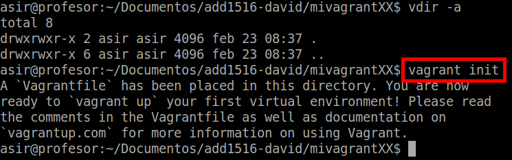
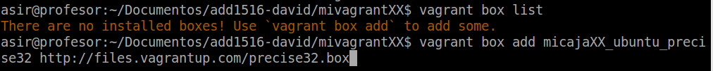
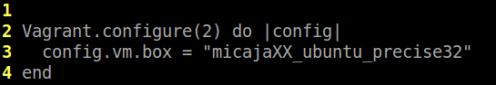
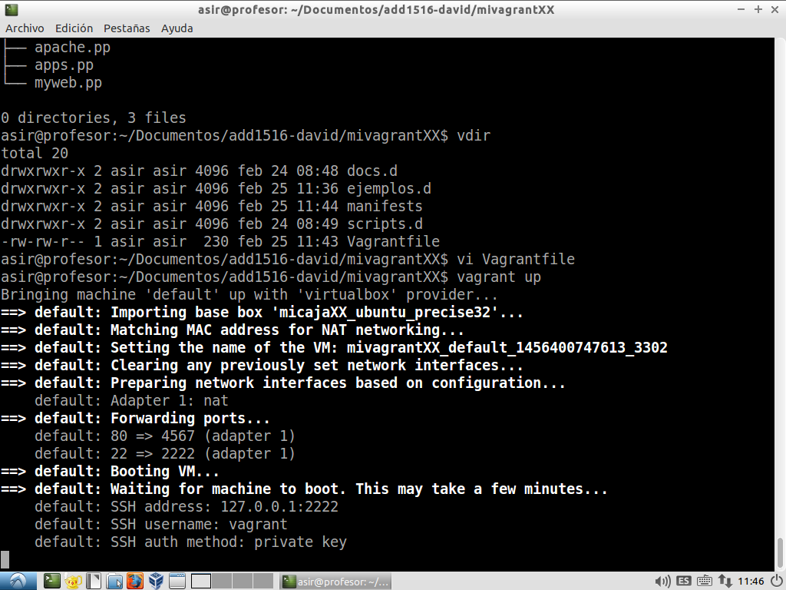
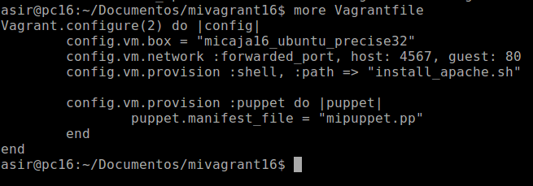
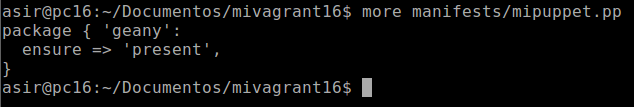
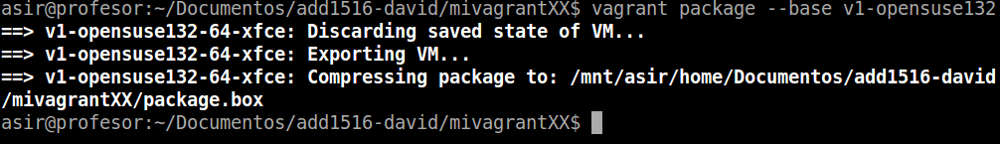
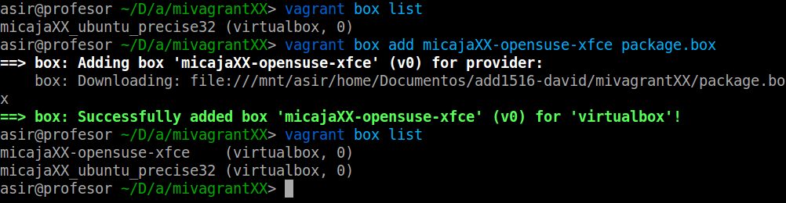

*(Actividad creada en el curso 201516)*

# 1. Introducción

Según *Wikipedia*:
```
    Vagrant es una herramienta para la creación y configuración de entornos
    de desarrollo virtualizados.

    Originalmente se desarrolló para VirtualBox y sistemas de configuración tales
    como Chef, Salt y Puppet. Sin embargo desde la versión 1.1 Vagrant es
    capaz de trabajar con múltiples proveedores, como VMware, Amazon EC2, LXC,
    DigitalOcean, etc.2

    Aunque Vagrant se ha desarrollado en Ruby se puede usar en multitud de
    proyectos escritos en otros lenguajes.
```

Enlaces de interés:
* [Cómo instalar y configurar Vagrant](http://codehero.co/como-instalar-y-configurar-vagrant/)
* [Instalar vagrant en OpenSUSE 13.2](http://gattaca.es/post/running-vagrant-on-opensuse/)  

> Para desarrollar esta actividad se ha utilizado la información del
enlace anterior publicado por: Jonathan Wiesel, El 16/07/2013.

# 2. Primeros pasos

## 2.1 Instalar

La instalación debemos hacerla en una máquina real.
* Hay varias formas de instalar Vagrant:
    * `apt-get install vagrant` o
    * Usando un paquete [Vagrant-deb](http://172.20.1.2/~general/software/varios/vagrant_1.7.2_x86_64.deb)
Disponible para descargar del servidor Leela.

## 2.2. Proyecto

* Crear un directorio para nuestro proyecto vagrant (Donde XX es el número de cada alumno):
```
    mkdir mivagrantXX
    cd mivagrantXX
    vagrant init
```



## 2.3 Imagen, caja o box

* Ahora necesitamos obtener una imagen(caja, box) de un sistema operativo. Vamos,
por ejemplo, a conseguir una imagen de un `Ubuntu Precise de 32 bits`:
```
vagrant box add micajaXX_ubuntu_precise32 http://files.vagrantup.com/precise32.box
```



* `vagrant box list`: Lista las cajas/imágenes disponibles actualmente en nuestra máquina.
* Para usar una caja determinada en nuestro proyecto, modificamos el fichero `Vagrantfile`
(dentro de la carpeta de nuestro proyecto).
* Cambiamos la línea `config.vm.box = "base"` por  `config.vm.box = "micajaXX_ubuntu_precise32"`.



> Existen muchos repositorios para descargar imágenes/cajas/boxes. Por ejemplo:
>
> * [Vagrant Box List](http://www.vagrantbox.es)
> * [HashiCorp's Atlas box catalog](https://atlas.hashicorp.com/boxes/search)
>
> Incluso podemos descargarnos cajas con Windows, GNU/Linux con entorno gráfico, BSD, etc.

## 2.4 Iniciar una nueva máquina

Vamos a iniciar una máquina virtual nueva usando Vagrant:
* `cd mivagrantXX`
* `vagrant up`: comando para iniciar una la instancia de la máquina.



* `vagrant ssh`: Conectar/entrar en nuestra máquina virtual usando SSH.
* Otros comandos últiles de Vagrant son:
    * `vagrant suspend`: Suspender la máquina virtual.
    * `vagrant resume` : Volver a despertar la máquina virtual.
    * `vagrant halt`: Apagarla la máquina virtual.
    * `vagrant status`: Estado actual de la máquina virtual.
    * `vagrant destroy`: Para eliminar completamente la máquina virtual.

> Tener en cuenta que la MV en modo **suspendido** consume más espacio
 en disco debido a que el estado de la maquina virtual que suele almacenarse en RAM
 se pasa a disco.

> Ejemplos:
>
> Crear un proyecto vagrant con Windows7 e iniciar la MV:
> * `vagrant init opentable/win-7-professional-amd64-nocm; vagrant up --provider virtualbox`
>
> Crear un proyecto vagrant con MV OpenSUSE 42.1 e iniciar la MV:
> * `vagrant init opensuse/openSUSE-42.1-x86_64; vagrant up --provider virtualbox`

# 3. Configuración del entorno virtual

## 3.1 Carpetas sincronizadas

> La carpeta del proyecto que contiene el `Vagrantfile` es visible
para el sistema el virtualizado, esto nos permite compartir archivos fácilmente
entre los dos entornos.

* Para identificar las carpetas compartidas dentro del entorno virtual, hacemos:
```
    vagrant up
    vagrant ssh
    ls /vagrant
```

> Esto nos mostrará que efectivamente el directorio `/vagrant` dentro del entorno
virtual posee el mismo `Vagrantfile` que se encuentra en nuestro sistema anfitrión.

## 3.2 Redireccionamiento de los puertos

Cuando trabajamos con máquinas virtuales, es frecuente usarlas para proyectos
enfocados a la web, y para acceder a las páginas es necesario configurar el
enrutamiento de puertos.

* Modificar el fichero `Vagrantfile`, de modo que el puerto 4567 del
sistema anfitrión sea enrutado al puerto 80 del ambiente virtualizado.

`config.vm.network :forwarded_port, host: 4567, guest: 80`


* Luego iniciamos la MV (si ya se encuentra en ejecución lo podemos refrescar
con `vagrant reload`)

> Para confirmar que hay un servicio a la escucha en 4567, desde el
sistema anfitrión ejecutar los siguientes comandos:
> * `nmap -p 4500-4600 localhost`
> * `netstat -ntap`

* Entramos an la MV e instalamos apache
    * `vagrant ssh`
    * `apt-get install apache2`
* En nuestro sistema anfitrión, abrimos el navegador web con el URL
`http://127.0.0.1:4567`. En realidad estamos accediendo al puerto 80 de nuestro
sistema virtualizado.

# 4. Ejemplos

A continuación se muestran ejemplos que NO ES NECESARIO hacer. Sólo es información.
Enlace de interés:
* [Tutorial Vagrant. ¿Qué es y cómo usarlo?](https://geekytheory.com/tutorial-vagrant-1-que-es-y-como-usarlo)

Ejemplo para configurar la red:
```
  config.vm.network "private_network", ip: "192.168.33.10"
```

Ejemplo para configurar las carpetas compartidas:
```
  config.vm.synced_folder "htdocs", "/var/www/html"
```

Ejemplo, configurar en Vagrantfile la conexión SSH de vagrant a nuestra máquina:
```
  config.ssh.username = 'root'
  config.ssh.password = 'vagrant'
  config.ssh.insert_key = 'true'
```

Ejemplo para configurar en Vagrantfile la ejecución remota de aplicaciones
gráficas instaladas en la máquina virtual, mediante SSH:
```
  config.ssh.forward_agent = true
  config.ssh.forward_x11 = true
```

# 5.Suministro

## 5.1 Suministro mediante shell script

Una de los mejores aspectos de Vagrant es el uso de herramientas de suministro.
Esot es, ejecutar *"una receta"* o una serie de scripts durante el proceso de
arranque del entorno virtual para instalar, configurar y personalizar un sin fin
de aspectos del SO del sistema anfitrión.

* Por ahora suministremos al ambiente virtual con un pequeño script para instalr Apache.
* Crear el script `install_apache.sh`, dentro del proyecto con el siguiente
contenido:

```
    #!/usr/bin/env bash

    apt-get update
    apt-get install -y apache2
    rm -rf /var/www
    ln -fs /vagrant /var/www
    echo "<h1>Actividad de Vagrant</h1>" > /var/www/index.html
    echo "<p>Curso201516</p>" >> /var/www/index.html
    echo "<p>Nombre-del-alumno</p>" >> /var/www/index.html
```

* Modificar Vagrantfile y agregar la siguiente línea a la configuración:
`config.vm.provision :shell, :path => "install_apache.sh"`

> * Esta instrucción le indica a Vagrant que debe usar un shell script
para ejecutar dentro del entorno virtual con el nombre de archivo `install_apache.sh`.
> * Si usamos los siguiente `config.vm.provision "shell", inline: '"echo "Hola"'`, ejecuta
directamente el comando especificado.

* Iniciamos la MV o `vagrant reload` si está en ejecución para que coja el cambio de la configuración.

> Podremos notar, al iniciar la máquina, que en los mensajes de salida se muestran
mensajes que indican cómo se va instalando el paquete de Apache que indicamos:

* Para verificar que efectivamente el servidor Apache ha sido instalado e iniciado,
abrimos navegador en la máquina real con URL `http://127.0.0.1:4567`.

## 5.2 Suministro mediante Puppet

> Enlace de interés:
> * [Crear un entorno de desarrollo con vagrant y puppet](http://developerlover.com/crear-un-entorno-de-desarrollo-con-vagrant-y-puppet/)
> * `friendsofvagrant.github.io -> Puppet Provisioning`

> Veamos imágenes de ejemplo suministradas por Aarón Gonźalez Díaz:
>
> * Vagrantfile configurado con puppet:
>
> 
>
> * Fichero de configuración de puppet:
>
> 
>
> Veamos otros ejemplo:
> ```
> Vagrant::Config.run do |config|
>   config.vm.provision :puppet do |puppet|
>     puppet.manifest_path = "manifests"
>     puppet.manifest_file = "software.pp"
>   end
> end
>```

* Crear un fichero `software.pp`, con las órdenes puppet para
instalar el programa `ruby`.
* Configurar `Vagrantfile` para permitir la ejecución de programas
gráficos de la máquina virtual (`config.ssh.forward_x11 = true`)
* Preparar un fichero `apache2.pp`, para instalar y configurar
Apache2.

# 6. Nuestra caja personalizada

Si estamos pensando en crear nuestra propia caja, entonces haremos lo siguiente:
* Leer las indicaciones de [¿Cómo crear una Base Box en Vagrant a partir de una máquina virtual](http://www.dbigcloud.com/virtualizacion/146-como-crear-un-vase-box-en-vagrant-a-partir-de-una-maquina-virtual.html)    
* Vamos a crear una nueva carpeta `mivagrantXXconmicaja`, para este nuevo proyecto vagrant.
* Ejecutamos `vagrant init` para crear el fichero de configuración nuevo.
* A partir de una máquina virtual VirtualBox (Por ejemplo, `v1-opensuse132-xfce`)
vamos a crear la caja `package.box`.



* Comprobamos que se ha creado la caja `package.box` en el directorio donde
hemos ejecutado el comando.


* Muestro la lista de cajas disponibles, pero sólo tengo 1 porque todavía
no he incluido la que acabo de crear. Finalmente, añado la nueva caja creada
por mí al repositorio de vagrant.



* Al levantar la máquina con esta nueva caja obtengo este error.
Probablemente por tener mal las GuestAdittions.


* Pero haciendo `vagrant ssh` nos conectamos sin problemas con la máquina.

# ANEXO

## A.1 Directorios
¿Dónde se guardan las imágenes base? ¿Las cajas de vagrant que nos vamos descargando?


## A.2 Windows
Ampliar esta práctica para comprobar el funcionamiento de Vagrant bajo Windows.
