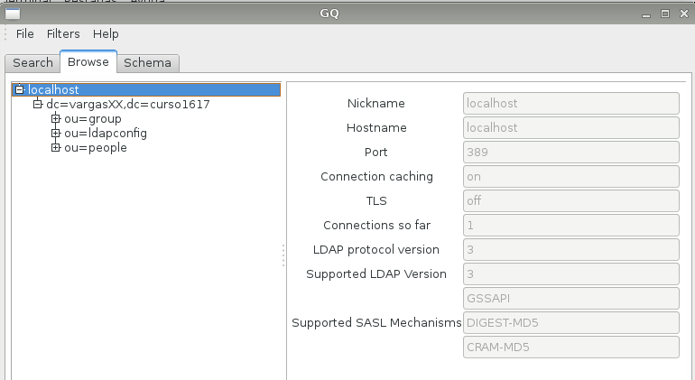
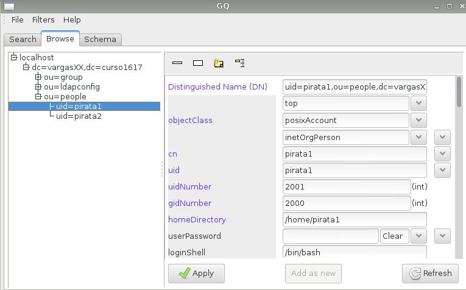
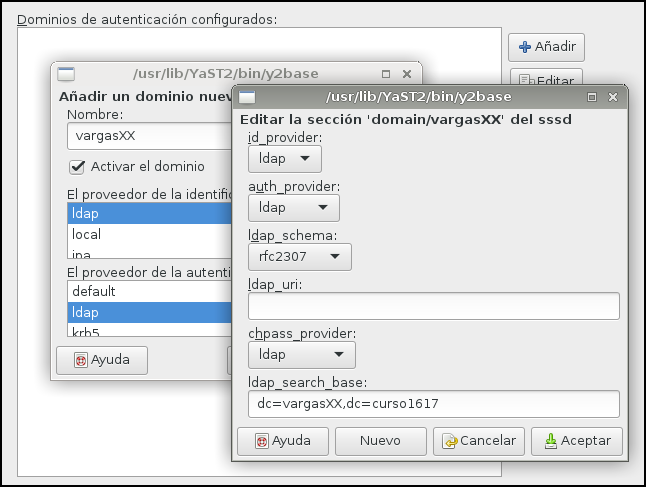

```
En CONSTRUCCIÓN!!!
```

---

# Servidor 389-DS - OpenSUSE

> **Últimas noticias** [Red Hat y Suse retiran su apoyo a OpenLDAP2](https://www.ostechnix.com/redhat-and-suse-announced-to-withdraw-support-for-openldap/).
>
> Por este motivo hemos decido a partir de noviembre de 2018 cambiar el OpenLDAP2 por 389-DS.


> Enlaces de interés sobre teoría LDAP:
> * VÍDEO [¿Qué es LDAP?](http://www.youtube.com/watch?v=CXe0Wxqep_g)
> * VÍDEO [Los ficheros LDIF](http://www.youtube.com/watch?v=ccFT94M-c4Y)

Hay varias herramientas que implementan el protocolo LDAP, por ejemplo:
389-DC, OpenLDAP, Active Directory, etc. En esta guía vamos a instalar y
configurar del servidor LDAP con OpenLDAP.

---

# 1. Prerequisitos

> Enlaces de interés:
>
> * [389 Directory Server Documentation](http://directory.fedoraproject.org/docs/389ds/documentation.html)

## 1.1 Nombre de equipo FQDN

* Vamos a usar una MV OpenSUSE para montar nuestro servidor LDAP con:
    * [Configuración MV](../../global/configuracion/opensuse.md)
* Nuestra máquina debe tener un FQDN.
    * Nombre equipo: `ldap-serverXX.curso1819`
    * Además en `/etc/hosts` añadiremos:
```
ip-del-servidor   ldap-serverXX.curso1819   ldap-serverXX
127.0.0.3         nombrealumnoXX.curso1819  nombrealumnoXX
```

> Veamos imagen de ejemplo:
>
> 

## 1.2 Opening the Required Ports in the Firewall

* `systemctl status firewalld` Make sure the firewalld service is running.
* `systemctl enable firewalld`, configure it to start automatically when the system boots.
* `systemctl start firewalld`, to start firewalld.  
* `firewall-cmd --permanent --add-port={389/tcp,636/tcp,9830/tcp}
`, Open the required ports using the firewall-cmd utility. For example, to open the Directory Server default ports in the default firewall zone.

> For details on using firewall-cmd to open ports on a system, see the Red Hat Security Guide or the firewall-cmd(1) man page.

* `firewall-cmd --reload`, Reload the firewall configuration to ensure that the change takes place immediately.

## 1.3 Directory Server User and Group

Parece que lo va a crear automáticamente...(dirsrv)

## 1.4 Directory Suffix

The directory suffix is the first entry within the directory tree. At least one directory suffix must be provided when the Directory Server is set up. The recommended directory suffix name matches your organization's DNS domain name. For example, if the Directory Server host name is `ldap.example.com`, the directory suffix is `dc=example,dc=com`.

## 1.5 About the `setup-ds-admin.pl` Script

The Directory Server and Administration Server instances are created and configured through a script called setup-ds-admin.pl. The Directory Server alone can be created using the setup-ds.pl script.

If simply the setup script is run, then the script launches an interactive installer which prompts for configuration settings for the Directory Server and Administration Server instances. For example:

> Duda https://serverfault.com/questions/658042/how-to-install-and-setup-389-ds-on-centos-7

* Abrir una consola como root.
* La documentación de 389-DS dice que ahora debemos ejecutar el script `setup-ds-admin.pl`...
    * `find / -name setup-ds-admin.pl`, pero no encuentramos este script.
    * Se nos ocurre buscar en los paquetes del SO `zypper se 389-ds`.
    * Encontramos éste y lo instalamos `zypper in 389-ds`
    * `find / -name setup-ds.pl`, el script tiene OTRO NOMBRE!!!
    * Ahora nos vamos a centrar en buscar información del paquete 389-ds de OpenSUSE.

---

# 2. Instalar el Servidor

> Enlaces de interés:
>
> * [389-DS installation](https://access.redhat.com/documentation/en-us/red_hat_directory_server/10/html/installation_guide/)

---
**PARA REVISAR**
---

# ANEXO

Necesitaremos ajustar parámetros del kernel para segurarnos de que
la instalación no se quejará por la falta de recursos.
Necesitamos elevar el rango de puertos locales disponibles al número
máximo de descriptores de ficheros.
* Crear el fichero `/etc/sysctl.d/00-389-ds.conf` con:
```
# Local ports available
net.ipv4.ip_local_port_range = 1024 65000
# Maximum number of file handles
fs.file-max = 64000
```
* `sysctl -p`, como root para aplicar los cambios.

# 2. Instalar el servidor de directorios 389

> * [HOWTO: Configure 389-ds LDAP server on openSUSE Tumbleweed](https://www.dennogumi.org/2016/01/howto-configure-389-ds-ldap-server-on-opensuse-tumbleweed/
)

Necesitamos añadir los respositorios con los ficheros del proyecto LDAP.

* `zypper ar -f obs://network:ldap Network_Ldap`, confía en la Key!.
* `zypper ref`

> The obs:// scheme automatically adds the “guessed” distribution to your repository (with Leap it might fail though, so beware).

* `zypper in 389-admin 389-admin-console 389-adminutil 389-console 389-ds 389-ds-console 389-adminutil 389-adminutil-lang`, Instalar los siguientes paquetes.

---

# 3. Ajustamos la configuración

> Adjusting the configuration to ensure that it works
>
> So far so good. But if you follow the guides now and use setup-ds-admin.pl, you’ll get strange errors and the administration server will fail to get configured properly.
>
> This is because of a missing dependency on the apache2-worker package and because the configuration for the HTTP service used by 389 Directory Server is not properly adjusted for openSUSE: it references Apache 2 modules that the openSUSE package ships builtin or with different names and thus cannot be loaded.

* `zypper in apache2-worker`, solucionar problemas con las dependencias de los paquetes.
* Entrar en la consola como `root`.
* Editar `/etc/dirsrv/admin-serv/httpd.conf`, localiza y comenta las siguientes líneas:
```
LoadModule unixd_module         /usr/lib64/apache2/mod_unixd.so
```
* Cambiar mod_nss por lo siguiente:
```
LoadModule nss_module         /usr/lib64/apache2/mod_nss.so
```
* Grabar el fichero.
* Ejecutar `setup-ds-admin.pl` sin problemas.

> I won’t cover the process here, there are plenty of instructions in the 389 DS documentation.

---

# 4. After installation: fixing 389-console

> If you want to use 389-console on a 64 bit system with openJDK you’ll notice that upon running it’ll throw a Java exception saying that some classes (Mozilla NSS Java classes) can’t be found. This is because the script looks in the wrong library directory (/usr/lib as opposed to /usr/lib64).

* Editar `/usr/bin/389-console` y buscar `java -cp /usr/lib/java/jss4.jar` y lo cambiamos por `java -cp /usr/lib64/java/jss4.jar`.
* Voilà!. 389-console working


Comprobaciones:
* `slaptest -f /etc/openldap/slapd.conf` para comprobar la sintaxis del fichero
de configuración.
* `systemctl status slapd`, para comprobar el estado del servicio.
* `systemctl enable slapd`, para activar el servicio automáticamente al reiniciar la máquina.
* `nmap -Pn localhost | grep -P '389|636'`, para comprobar que el servidor LDAP es accesible desde la red.
* `slapcat` para comprobar que la base de datos está bien configurada.
* Podemos comprobar el contenido de la base de datos LDAP usando la herramienta `gq`.
Esta herramienta es un browser LDAP.
* Comprobar que tenemos creadas las unidades organizativas: `groups` y `people`.



## 1.3 Problemas

Si tenemos que desinstalar el software anterior, hacemos lo siguiente:
* zypper remove yast2-auth-server
* zypper remove openldap2 krb5-server krb5-client
* mv /etc/openldap /etc/openldap.000
* mv /var/lib/ldap /var/lib/ldap.000

---

## 1.4 Crear usuarios y grupos LDAP

* `Yast -> Usuarios Grupos -> Filtro -> LDAP`.
* Crear el grupo `piratas2` (Estos se crearán dentro de la `ou=groups`).
* Crear los usuarios `pirata21`, `pirata22` (Estos se crearán dentro de la `ou=people`).
* Usar `gq` para consultar/comprobar el contenido de la base de datos LDAP.

> Vemos un ejemplo de un árbol de datos en LDAP:
> 
>
> Imagen de ejemplo:
> 

* `ldapsearch -x -L -u -t "(uid=nombre-del-usuario)"`, comando para consultar en la base de datos LDAP la información del usuario con uid concreto.

> Veamos imagen de ejemplo:
>
> 

---

# 2. Cliente LDAP

En este punto vamos a escribir información en el servidor LDAP.

> Enlaces de interés:
>
> * [ Crear usuarios y grupos LDAP ](https://es.opensuse.org/Ingreso_de_usuarios_y_grupos_en_LDAP_usando_YaST)
> * [ Autenticación con OpenLDAP ](http://www.ite.educacion.es/formacion/materiales/85/cd/linux/m6/autentificacin_del_sistema_con_openldap.html).
> * VIDEO [LPIC-2 202 LDAP Client Usage](http://www.youtube.com/embed/ZAHj93YWY84).

## 2.1 Preparativos

* Vamos a otra MV OpenSUSE.
* Cliente LDAP con OpenSUSE:
    * [Configuración MV](../../global/configuracion/opensuse.md)
    * Nombre equipo: `ldap-clientXX`
    * Dominio: `curso1718`
    * Asegurarse que tenemos definido en el fichero /etc/hosts del cliente,
el nombre DNS con su IP correspondiente:
```
127.0.0.2         ldap-clientXX.curso1718   ldap-clientXX
ip-del-servidor   ldap-serverXX.curso1718   ldap-serverXX   nombredealumnoXX.curso1718   nombrealumnoXX
```

## Comprobación

* `nmap -Pn ldap-serverXX | grep -P '389|636'`, para comprobar que el servidor LDAP es accesible desde el cliente.
* Usar `gq` en el cliente para comprobar que se han creado bien los usuarios.
    * `File -> Preferencias -> Servidor -> Nuevo`
    * URI = `ldap://ldap-serverXX`
    * Base DN = `dc=davidXX,dc=curso1718`

## 2.2 Instalar cliente LDAP

Vamos a configurar de la conexión del cliente con el servidor LDAP.

* Debemos instalar el paquete `yast2-auth-client`, que nos ayudará a configurar la máquina para autenticación.
* Ir a `Yast -> LDAP y cliente Kerberos`.
* Configurar como la imagen de ejmplo. Al final usar la opción de `Probar conexión`


## 2.3 Comprobamos desde el cliente

* Vamos a la consola con nuestro usuario normal, y probamos lo siguiente:
```
getent passwd pirata21
getent group piratas2
id pirata21
finger pirata21
cat /etc/passwd | grep pirata21
cat /etc/group | grep piratas2
su pirata21
```

---

## 2.4. Autenticación

Con autenticacion LDAP prentendemos usar la máquina servidor LDAP, como repositorio
centralizado de la información de grupos, usuarios, claves, etc.
Desde otras máquinas conseguiremos autenticarnos (entrar al sistema) con los
usuarios definidos no en la máquina local, sino en la máquina remota con
LDAP. Una especie de *Domain Controller*.

* Entrar en la MV cliente con algún usuario LDAP.

> Si tenemos problemas al reiniciar la MV cliente, debemos:
> * Iniciar MV con Knoppix
> * Deshacer los cambios ldap en el fichero `/etc/nsswitch.conf`
>     * `passwd: files nis ldap`
>     * `shadow: files nis`
>     * `group: files nis ldap`
> * Reiniciar MV cliente
> * Repetir configuración Yast.

---

# A. ANEXO

## A.1 Configurar cliente 13.2
> Información extraída de https://forums.opensuse.org/showthread.php/502305-Setting-up-LDAP-on-13-2

* `Yast -> Authentication client`
* Hacemos click sobre el botón sssd.
    * Aparece una ventana de configuración.
        * config_file_version = 2
        * services = nss, pam
        * domains = LDAP, nombre-de-alumnoXX
    * Escribir LDAP en la sección dominio.
    * Pulsamos OK y cerramos la ventana.
* Creamos un nuevo dominios.
    * domains = `nombre-de-alumnoXX`
    * id_provider = `ldap`
    * auth_provider = `ldap`
    * chpass_provider = `ldap`
    * ldap_schema = `rfc2307bis`
    * ldap_uri = `ldap://ldap-serverXX`
    * ldap_search base = `dc=davidXX, dc=curso1718`

Ver imagen de ejemplo:



Consultar el fichero `/etc/sssd/sssd.conf` para confirmar el valor de ldap_schema.
```
# A native LDAP domain
[domain/LDAP]
enumerate = true
cache_credentials = TRUE

id_provider = ldap
auth_provider = ldap
chpass_provider = ldap

ldap_uri = ldap://ldap-serverXX
ldap_search_base = dc=davidXX,dc=curso1617
```

> **Default Re: Setting up LDAP on 13.2**
>
> Did you ever resolve your secondary group issues? I'm seeing the same problem and have already changed ldap_schema to rfc2307bis.
>
> I have resolved this issue. My solution was in `/etc/sssd/sssd.conf` comment out the lines
> # ldap_user_uuid = entryuuid
> # ldap_group_uuid = entryuuid


## A.2 Cambiar el método de encriptación en el SO

Podemos tener un problema con las claves si el método de encriptación de las claves del sistema operativo es diferente al utilizado en el servidor LDAP.

Veamos ejemplo donde se establece el método de encriptación durante la instalación del SO.


Veamos otro ejemplo donde podemos cambiar el método de encriptación de claves con el SO
ya instalado, usando Yast.


