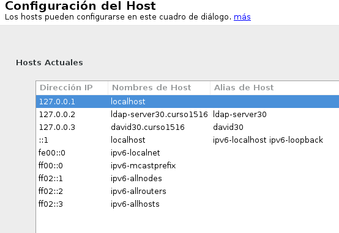
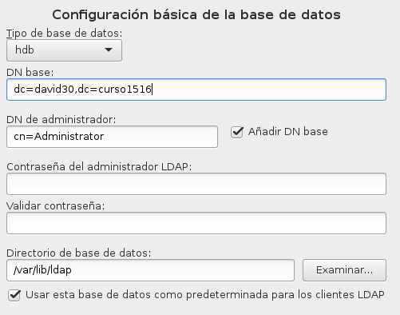
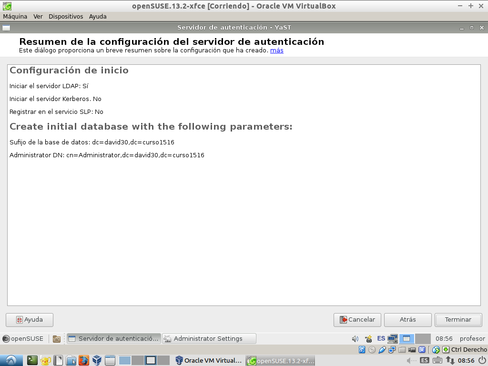

*(Actividad nueva para e curso 2015-2016)*

#Servidor LDAP - OpenSUSE

> Enlaces de interés:
> * Teoría
>     * [Presentación: ¿Qué es LDAP?](http://www.youtube.com/watch?v=CXe0Wxqep_g)
>     * [Presentación: Los ficheros LDIF](http://www.youtube.com/watch?v=ccFT94M-c4Y)
> * OpenSUSE
>     * [Configurar_LDAP_usando_YaST](https://es.opensuse.org/Configurar_LDAP_usando_YaST)
>     * [Ingreso_de_usuarios_y_grupos_en_LDAP_usando_YaST](https://es.opensuse.org/Ingreso_de_usuarios_y_grupos_en_LDAP_usando_YaST)
>     * [Configurar servidor LDAP en OpenSUSE con Yast](http://www.youtube.com/watch?v=NsQ1zPpoVBc)
> * Otros
>     * [LD01: Instalar Servidor OpenLDAP](http://www.youtube.com/watch?v=E0mIYO_vbx8)
>     * Min 38: Crear config dir a partir de config text.
>     * [Tool Openfile](http://www.openfiler.com/)
>     * Tool Zentyal

##1.1 Preparar la máquina
Comenzamos la instalación del servidor LDAP:
* Vamos a usar una MV para montar nuestro servidor LDAP con:
    * SO OpenSUSE 13.2
    * IP estática del servidor 172.18.XX.51 (Donde XX es su número de puesto).
    * Nombre equipo: `ldap-serverXX`
    * Dominio: `curso1516`
    * Además en `/etc/hosts` añadiremos:
```
127.0.0.2   ldap-serverXX.curso1516   ldap-serverXX
127.0.0.3   nombrealumnoXX.curso1516  nombrealumnoXX
```
    

##1.2 Instalación del Servidor LDAP

* Procedemos a la instalación del módulo Yast para gestionar el servidor LDAP (`yast-auth-server`)
* Apartir de aquí seguimos los pasos indicados en [servidor LDAP](https://es.opensuse.org/Configurar_LDAP_usando_YaST)
de la siguiente forma:
   * Ir a Yast -> Servidor de autenticación.
   * Tipo de servidor: autónomo
   * Configuración TLS: NO habilitar
   * Usar como DN el siguiente: `dc=nombredealumnoXX, dc=curso1516`. Donde XX es el número del puesto de cada uno.
   

   * NO habilitar kerberos.
* Veamos ejemplo de la configuración final:

* Una vez instalado, comprobar el servicio `systemctl  status slapd`. 
Comprobar también que el servicio se inicia automáticamente al reiniciar la máquina. 
 
##1.3. Poblado del Árbol
Ahora vamos a introducir datos de usuarios y grupos en el servidor LDAP
* Comprobar que ya tenemos las unidades organizativas: `groups` y `people`. 
Han sido creadas automáticamente por Yast.
* Crear dentro de `ou=grupos`, los grupos de `jedis2` y `siths2`.
* Crear dentro de `ou=people`, varios usuarios `jedi21`, `jedi22`, `sith21`, `sith22`.

Vemos un ejemplo de un árbol de datos en LDAP:


* Mediante el un browser LDAP (`gq`) podemos escribir y/o consultar información en la base de datos LDAP.


#2. Otro equipo

##2.1 Preparativos

* Cliente LDAP:    
    * IP estática del cliente 172.18.XX.52
    * Nombre equipo: `ldap-client-XX`
    * Dominio: `curso1516`
* Asegurarse que tenemos definido en el fichero /etc/hosts del cliente, 
el nombre DNS con su IP correspondiente: 
    * `127.0.0.2         ldap-clientXX.curso1516   ldap-clientXX`.
    * `ip-del-servidor   ldap-serverXX.curso1516   ldap-serverXX   nombredealumnoXX.curso1516   nombrealumnoXX`.


**Seguir las instrucciones del siguiente [enlace](https://es.opensuse.org/Ingreso_de_usuarios_y_grupos_en_LDAP_usando_YaST)**
a partir de la sección *Poblado del Árbol LDAP*.
* Usar cliente LDAP desde la máquina cliente, y comprobar que podemos acceder al contenido del servidor LDAP.

* Instalar alguna de las herramientas browser LDAP de OpenSUSE con Yast, com o por ejemplo `gq`.


#ANEXO

* Consultar Vídeo [LPIC-2 202 LDAP Client Usage](http://www.youtube.com/embed/ZAHj93YWY84).

*(Práctica nueva del curso 2015-2016)*

#Autenticación LDAP
Con autenticacion LDAP prentendemos usar una máquina como servidor LDAP,
donde se guardará la información de grupos, usuarios, claves, etc. Y desde
otras máquinas conseguiremos autenticarnos (entrar al sistema) con los 
usuarios definidos no en la máquina local, sino en la máquina remota con
LDAP. Una especie de *Domain Controller*.

> *Enlaces de interés*
> * [Ingreso_de_usuarios_y_grupos_en_LDAP_usando_YaST](https://es.opensuse.org/Ingreso_de_usuarios_y_grupos_en_LDAP_usando_YaST)
> * [Configurar_LDAP_usando_YaST](https://es.opensuse.org/Configurar_LDAP_usando_YaST)
>
> Otros
> * Consultar documento `ldap-auth-pminik-taller.pdf`, página 20.
> * Enlaces de interés [Autenticación con OpenLDAP](http://www.ite.educacion.es/formacion/materiales/85/cd/linux/m6/autentificacin_del_sistema_con_openldap.html).

##1. Preparativos
Vamos a usar dos MV con GNU/Linux OpenSUSE 13.2

Servidor LDAP:
* IP estática del servidor 172.18.XX.51 (Donde XX es su número de puesto).
* Nombre equipo: `ldap-server-XX`
* Dominio: `curso1516`
* Asegurarse que tenemos definido en el fichero `/etc/hosts` del servidor, el nombre DNS con su IP correspondiente: 
    * `127.0.0.2   ldap-serverXX.curso1516   ldap-serverXX`.
    * `127.0.0.3   nombredealumnoXX.curso1516   nombrealumnoXX`. 
* Instalar servidor SSH.
* Capturar imagen de la salida de los siguientes comandos: `ip a`, `hostname -f`, `lsblk`, `blkid`

Cliente LDAP:    
* IP estática del cliente 172.18.XX.52
* Nombre equipo: `ldap-client-XX`
* Dominio: `curso1516`
* Asegurarse que tenemos definido en el fichero `/etc/hosts` del cliente, 
el nombre DNS con su IP correspondiente: 
    * `127.0.0.2         ldap-clientXX.curso1516   ldap-clientXX`.
    * `ip-del-servidor   ldap-serverXX.curso1516   ldap-serverXX   nombredealumnoXX.curso1516   nombrealumnoXX`.
* Instalar servidor SSH.
* Capturar imagen de la salida de los siguientes comandos: `ip a`, `hostname -f`, `lsblk`, `blkid`

##2. Configurar cliente
* Consultar enlace sobre [Ingreso_de_usuarios_y_grupos_en_LDAP_usando_YaST](https://es.opensuse.org/Ingreso_de_usuarios_y_grupos_en_LDAP_usando_YaST)
* Configurar la MV cliente para usar usuarios locales y usuarios del servidor LDAP.
* Añadir más usuarios LDAP. Como por ejemplo: `jedi31`, `jedi32`, `sith31` y `sith32`.
* Añadir los grupos LDAP. Como por ejemplo:  `jedis3` y `siths3`.

##3. Comprobaciones
Vamos a comprobar que con los usuarios definidos en el LDAP se puede entrar a la MV cliente.

* Entrar en `.ldap-clientXX`, con `jedi21` y `sith31` y ejecutar los comandos siguientes
capturando su salida:
```
id (Muestra información del usuario actual)
cat /etc/passwd |grep nombre-usuario (No debe existir este usuario en la MV local)
pamtest passwd nombre-usuario
finger nombre-usuario
hostname -f (Muestra nombre de la MV actual)
ip a (Muestra datos de red de la MV actual)
date (Muestra la fecha actual)
```

