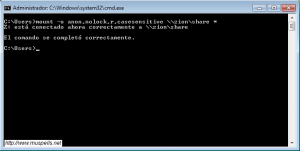

```
* Usada en los cursos 201516 y 201617.
```

# NFS (Network File System)

NFS es un protocolo àra compartir recursos en red entre sistemas heterogéneos.

# 1. SO Windows

Para esta parte vamos a necesitar las siguientes máquinas:
* MV Servidor NFS
    * Windows 2008 Server (Enterprise)
    * [ Configurar MV ](./../../global/configuracion/windows-server.md)
* MV Cliente NFS
    * Windows 7 (Enterprise).
    * [ Configurar MV ](./../../global/configuracion/windows.md)

>  El cliente NFS sólo lo tienen las versiones Enterprise

## 1.1 Servidor NFS Windows

> Vídeos:
>
> * [Vídeo que explica cómo instalar NFS en Windows Server](https://www.youtube.com/embed/1yigsSPwxds)
> * [Vídeo: NFS - Parte 1. SO Windows 7 FUNCIONANDO](http://www.youtube.com/watch?v=QWx-WlKf1DY&feature=youtu.be)
>
> Enlaces de interés:
>
> * Cliente NFS: [Montar directorios NFS bajo Windows 7](http://www.muspells.net/blog/2011/08/montar-directorios-nfs-bajo-windows-7/)
> * Servidor NFS: [Servidor NFS para Windows con WinNFSd](https://robleshermoso.wordpress.com/2010/07/15/tip-servidor-nfs-para-windows/)
> * Cliente NFS: [Compartir carpetas Windows mediante Servidor NFS](https://support.microsoft.com/es-es/kb/324089)
> * Comandos NFS: [Guía paso a paso de Servicios para NFS para Windows Server 2008 R2](https://support.microsoft.com/es-es/kb/324089)
>

### Instalación del servicio NFS

Vamos a la MV con Windows 2008 Server
* Agregar rol `Servidor de Archivos`.
* Marcar `Servicio para NFS`.

### Configurar el servidor NFS

* Crear la carpeta `c:\exportXX\public`. Picar en la carpeta `botón derecho
propiedades -> Compartir NFS`, y configurarla para que sea accesible desde la red en modo lectura/escritura con NFS.
* Crear la carpeta `c:\exportXX\private`. Picar en la carpeta `botón derecho
propiedades -> Compartir NFS`, y configurarla para que sea accesible desde la red sólo en modo sólo lectura.


> En caso de problemas al acceder desde el cliente, configurar en el servidor el recurso con "Permitir Acceso Anónimo".

* Ejecutamos el comando `showmount -e IP-DEL-SERVIDOR`, para comprobar que los recursos exportados.

## 1.2 Cliente NFS

Algunas versiones de Windows permiten trabajar con directorios de red NFS nativos de sistemas UNIX.
En esta sección veremos como montar y desmontar estos directorios bajo un entorno de Windows 7
Enterprise (Las versiones home y starter no tienen soporte para NFS).

### Instalar el soporte cliente NFS bajo Windows

* En primer lugar vamos a instalar el componente cliente NFS para Windows.
Para ello vamos a `Panel de Control -> Programas -> Activar o desactivar características de Windows`.


Captura imagen del resultado final.
* Nos desplazamos por el menú hasta localizar Servicios para NFS y dentro de este, Cliente NFS.
* Marcamos ambos y le damos a Aceptar.
* En unos instantes tendremos el soporte habilitado.

Iniciar el servicio cliente NFS. Captura imagen del proceso.
* Para iniciar el servicio NFS en el cliente, abrimos una consola con permisos de Administrador.
* Ejecutamos el siguiente comando: `nfsadmin client start`

### Montando el recurso

Ahora necesitamos montar el recurso remoto para poder trabajar con él.
* Esto no lo hacemos con Administrador, sino con nuestro usuario normal.
* Consultar desde el cliente los recursos que ofrece el servidor: `showmount -e ip-del-servidor`
* Montar recurso remoto: `mount –o anon,nolock,r,casesensitive \\ip-del-servidor\Nombre-recurso-NFS *`

> **Descripción de los parámetros**
>
> * anon: Acceso anónimo al directorio de red.
> * nolock: Deshabilita el bloqueo. Esta opción puede mejorar el rendimiento si sólo necesita leer archivos.
> * r: Sólo lectura. Para montar en modo lectura/escritura no usaremos este parámetro.
> * casesensitive: Fuerza la búsqueda de archivos con distinción de mayúsculas y minúsculas (similar a los clientes de NFS basados en UNIX).



* Hemos decidido asignar la letra de unidad de forma automática, así que si no hay otras unidades de red
en el sistema nos asignará la Z.


> Si hay problemas, entonces:
>
> * Comprobar que la configuración del cortafuegos del servidor permite accesos NFS.
> * Desde un cliente GNU/Linux hacer `nmap IP-del-servidor -Pn`. Debe aparecer abierto el puerto del servicio NFS

* Comprobar en el cliente los recursos montados con `net use` y `showmount -a ip-del-servidor`
* `netstat -n`, para comprobar el acceso a los recursos NFS desde el cliente.
* Para desmontar la unidad simplemente escribimos en una consola: `umount z:`
* En el servidor ejecutamos el comando `showmount -e ip-del-servidor`, para comprobar los recursos compartidos.

---

# 2. SO OpenSUSE

Vamos a necesitar las siguientes máquinas:

* MV Servidor NFS
    * SO OpenSUSE 13.2
    * [Configurar MV](./../../global/configuracion/opensuse.md)
    * Como nombre de esta máquina usar `nfs-server-XX`.
* MV CLiente NFS
    * SO OpenSUSE 13.2.
    * [Configurar MV](./../../global/configuracion/opensuse.md)
    * Como nombre de esta máquina usar `nfs-client-XX`

> Para cambiar el nombre de máquina podemos usar Yast o modificar directamente los ficheros `/etc/hostname` y `/etc/hosts`.
>
> Podemos configurar el fichero /etc/hosts del cliente y servidor, añadiendo estas líneas:
> ```
> 172.18.XX.52 nfs-server-XX.curso1617   nfs-server-XX
> 172.18.XX.62 nfs-client-XX.curso1617   nfs-client-XX
> ```

## 2.1 Servidor NFS

> Enlaces de interés:
>
> * Vídeo [LPIC-2 202 NFS Server Configuration](https//www.youtube.com/embed/Kc3LZum5DIQ?list=UUFFLP0dKesrKWccYscdAr9A)
> * Vídeo [NFS. Learning Linux: Lesson 17 NFS Server and Installation Repository](https//www.youtube.com/embed/9N8QTh-oYis?list=PL3E447E094F7E3EBB)
> * Enlace de interés a [NFS Sistema de Archivos de red](http://recursostic.educacion.es/observatorio/web/es/software/software-general/733-nfs-sistema-de-archivos-de-red)

* Instalar servidor NFS por Yast.
* Crear las siguientes carpetas/permisos:
    * `/srv/exportXX/public`, usuario y grupo propietario `nobody:nogroup`
    * `/srv/exportXX/private`, usuario y grupo propietario `nobody:nogroup`, permisos 770
* Vamos configurar el servidor NFS de la siguiente forma:
    * La carpeta `/srv/exportXX/public`, será accesible desde toda la red en modo lectura/escritura.
    * La carpeta `/srv/exportXX/private`, sea accesible sólo desde la IP del cliente, sólo en modo lectura.
* Para ello usaremos o Yast o modificamos el fichero `/etc/exports` añadiendo las siguientes líneas:
```
...
/srv/exportXX/public *(rw,sync,subtree_check)
/srv/exportXX/private IP-DEL-CLIENTE/32(ro,sync,subtree_check)
...
```

> OJO: NO debe haber espacios entre la IP y abrir paréntesis.

* Para iniciar y parar el servicio NFS, usaremos Yast o `systemctl`. Si al iniciar
el servicio aparecen mensaje de error o advertencias, debemos resolverlas.
Consultar los mensajes de error del servicio.

> [Enlace de interés](http://www.unixmen.com/setup-nfs-server-on-opensuse-42-1/)

* Para comprobarlo, `showmount -e localhost`. Muestra la lista de recursos exportados por el servidor NFS.

## 2.2 Cliente NFS

Ahora vamos a comprobar que las carpetas del servidor son accesibles desde el cliente.
Normalmente el software cliente NFS ya viene preinstalado pero si tuviéramos que instalarlo en
OpenSUSE:
* `zypper search nfs`, para buscar los paquetes nfs.
* `zypper install nfs-...`, para instalar el paquete cliente.

### Comprobar conectividad desde cliente al servidor

* `ping ip-del-servidor`: Comprobar la conectividad del cliente con el servidor. Si falla hay que revisar las configuraciones de red.
* `nmap ip-del-servidor -Pn`: nmap sirve para escanear equipos remotos, y averiguar que servicios están ofreciendo al exterior. Hay que instalar el paquete nmap, porque normalemente no viene preinstalado.
* `showmount -e ip-del-servidor`: Muestra la lista de recursos exportados por el servidor NFS.

### Montar y usar cada recurso compartido desde el cliente

* Estamos en el equipo cliente.
* Crear las carpetas:
    * `/mnt/remotoXX/public`
    * `/mnt/remotoXX/private`
* `showmount -e IP-DEL-SERVIDOR`, para consultar los recursos que exporta el servidor.
* Montar cada recurso compartido en su directorio local correspondiente.

> Ejemplo de montaje:
>
> * `mount.nfs IP-DEL-SERVIDOR:/srv/exportXX/public /mnt/remotoXX/public` montar el recurso public del servidor GNU/Linux.
> * `mount.nfs IP-DEL-SERVIDOR:/public /mnt/remotoXX/public`, para montar el recurso public del servidor Windows
> * `mount.nfs ip-servidor-nfs-windows:/C/exportXX/public /mnt/remotoXX/windows`

* `mount` o `df -hT`, para comprobar los recursos montados en nuestras carpetas locales.
* `netstat -ntap`, para comprobar el acceso a los recursos NFS desde el cliente.
* Ahora vamos a crear ficheros/carpetas dentro del recurso public.
* Comprobar que el recurso private es de sólo lectura.

## 2.3. Montaje automático

> Acabamos de acceder a recursos remotos, realizando un montaje de forma manual (comandos mount/umount).
Si reiniciamos el equipo cliente, podremos ver que los montajes realizados de forma manual
ya no están. Si queremos volver a acceder a los recursos remotos debemos repetir el proceso,
a no ser que hagamos una configuración permanente o automática.

* Configurar montaje autoḿatico del recurso compartido public.
    * Usar `Yast -> particionador -> NFS -> Add`.
    * Modificar directamente en el fichero `/etc/fstab` ([Consultar](http://web.mit.edu/rhel-doc/4/RH-DOCS/rhel-rg-es-4/s1-nfs-client-config.html))
* Incluir contenido del fichero `/etc/fstab` en la entrega.
* Reiniciar el equipo y comprobar que se monta el recurso remoto automáticamente.
* Comprobarlo.

# 3. Preguntas

* ¿Nuestro cliente GNU/Linux NFS puede acceder al servidor Windows NFS? Comprobarlo.
* ¿Nuestro cliente Windows NFS podría acceder al servidor GNU/Linux NFS? Comprobarlo.
* Fijarse en los valores de usuarios propietario y grupo propietario de los ficheros
que se guardan en el servidor NFS, cuando los creamos desde una conexión cliente NFS.
