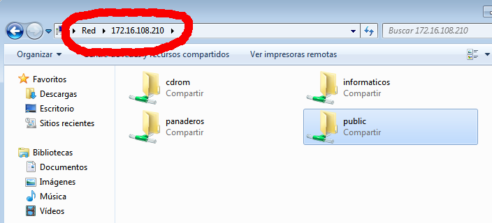
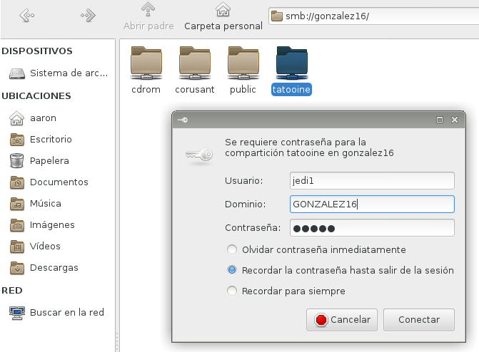
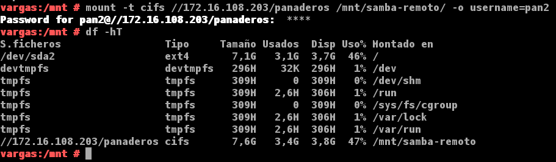

```
Cambios para el curso1718
* Revisar comando net view
```

# Samba

Samba con OpenSUSE y Windows 7/10.

Entrega:
* La entrega la realizaremos a través del repositorio Git.
* Al terminar etiquetaremos la entrega con *samba*.

Introducción:
* Leer documentación proporcionada por el profesor.
* Atender a la explicación del profesor.
* Vídeo [LPIC-2 202 Samba Server Configuration](http://www.youtube.com/embed/Gkhl0mHpm1E")
* Vamos a necesitar las siguientes 3 MVs:
    * MV1: Un servidor GNU/Linux OpenSUSE con IP estática (172.18.XX.31).
    * MV2: Un cliente GNU/Linux OpenSUSE con IP estática (172.18.XX.32).
    * MV3: Un cliente Windows con IP estática (172.18.XX.11).

# 1. Servidor Samba (MV1)

## 1.1 Preparativos

* [Configurar](../../global/configuracion/opensuse.md) el servidor GNU/Linux.
Usar los siguientes valores:
    * Nombre de equipo: smb-serverXX (Donde XX es el número del puesto de cada uno).
* Añadir en `/etc/hosts` los equipos `smb-cliXXa` y `smb-cliXXb` (Donde XX es el número del puesto de cada uno).

Capturar salida de los comandos siguientes en el servidor:
```
hostname -f
ip a
lsblk
sudo blkid
```

## 1.2 Usuarios locales

* Capturar imágenes del resultado final.
* Podemos usar comandos o entorno gráfico Yast.

Vamos a GNU/Linux, y creamos los siguientes grupos y usuarios:
* Crear los grupos `piratas`, `soldados` y `todos`.
* Crear el usuario `smbguest`. Para asegurarnos que nadie puede usar `smbguest` para
entrar en nuestra máquina mediante login, vamos a modificar este usuario y le ponemos
como shell `/bin/false`.
    * Por entorno gráfico lo cambiamos usando Yast.
    * Por comandos el cambio se hace editando el fichero `/etc/passwd`.
* Dentro del grupo `piratas` incluir a los usuarios `pirata1`, `pirata2` y `supersamba`.
* Dentro del grupo `soldados` incluir a los usuarios `soldado1` y `soldado2` y `supersamba`.
* Dentro del grupo `todos`, poner a todos los usuarios `soldados`, `pitatas`, `supersamba` y a `smbguest`.

## 1.3 Crear las carpetas para los futuros recursos compartidos

* Capturar imagen del resultado final.
* Vamos a crear las carpetas de los recursos compartidos con los permisos siguientes:
    * `/srv/sambaXX/public.d`
        * Usuario propietario `supersamba`.
        * Grupo propietario `todos`.
        * Poner permisos 775.
    * `/srv/sambaXX/castillo.d`
        * Usuario propietario `supersamba`.
        * Grupo propietario `soldados`.
        * Poner permisos 770.
    * `/srv/sambaXX/barco.d`
        * Usuario propietario `supersamba`.
        * Grupo propietario `piratas`.
        * Poner permisos 770.

## 1.4 Configurar el servidor Samba

* Capturar imágenes del proceso.
* Vamos a hacer una copia de seguridad del fichero de configuración existente
`cp /etc/samba/smb.conf /etc/samba/smb.conf.000`.

> Podemos usar comandos o el entorno gráfico para instalar y configurar el servicio Samba.
> Como estamos en OpenSUSE vamos a usar Yast.

* `Yast -> Samba Server`
    * Workgroup: `mar1718`
    * Sin controlador de dominio.
* En la pestaña de `Inicio` definimos
    * Iniciar el servicio durante el arranque de la máquina.
    * Ajustes del cortafuegos -> Abrir puertos

## 1.5 Crear los recursos compartidos de Samba

Vamos a configurar los recursos compartido del servidor Samba.
Podemos hacerlo modificando el fichero de configuración o por entorno gráfico con Yast.

* Capturar imágenes del proceso.
* `Yast -> Samba Server -> Recursos compartidos`

* Tenemos que conseguir una configuración como la siguiente:

> * Donde pone XX, sustituir por el núméro del puesto de cada uno
> * `public`, será un recurso compartido accesible para todos los usuarios en modo lectura.
> * `cdrom`, es el recurso dispositivo cdrom de la máquina donde está instalado el servidor samba.

```
[global]
  netbios name = smb-serverXX
  workgroup = mar1617
  server string = Servidor de nombre-alumno-XX
  security = user
  map to guest = bad user
  guest account = smbguest

[cdrom]
  path = /dev/cdrom
  guest ok = yes
  read only = yes

[public]
  path = /srv/sambaXX/public.d
  guest ok = yes
  read only = yes

[castillo]
  path = /srv/sambaXX/castillo.d
  read only = no
  valid users = @soldados

[barco]
  path = /srv/sambaXX/barco.d
  read only = no
  valid users = pirata1, pirata2
```

* Abrimos una consola para comprobar los resultados.
    * `cat /etc/samba/smb.conf`
    * `testparm`

## 1.6 Usuarios Samba

Después de crear los usuarios en el sistema, hay que añadirlos a Samba.
* `smbpasswd -a nombreusuario`, para crear clave de Samba para un usuario del sistema.
* `pdbedit -L`, para comprobar la lista de usuarios Samba.
* Capturar imagen del comando anterior.

## 1.7 Reiniciar

* Ahora que hemos terminado con el servidor, hay que reiniciar el servicio
para que se lean los cambios de configuración.
* Podemos hacerlo por `Yast -> Servicios`, o usar los comandos.:
    * Servicio smb
        * `systemctl stop smb`
        * `systemctl start smb`
        * `systemctl status smb`
    * Servicio nmb
        * `systemctl stop nmb`
        * `systemctl start nmb`
        * `systemctl status nmb`

> Enlaces de interés:
>
> * [Demonios Samba y servicios relacionados](http://web.mit.edu/rhel-doc/4/RH-DOCS/rhel-rg-es-4/s1-samba-daemons.html)

* Capturar imagen de los siguientes comando de comprobación:
```
    sudo testparm     # Verifica la sintaxis del fichero de configuración del servidor Samba
    sudo netstat -tap # Vemos que el servicio SMB/CIF está a la escucha
```

> **Comprobar CORTAFUEGOS**
>
> Para descartar un problema con el cortafuegos del servidor Samba.
> Probamos el comando `nmap -Pn smb-serverXX` desde la máquina real, u otra
máquina GNU/Linux. Deberían verse los puertos SMB/CIFS(139 y 445) abiertos.

---

# 2. Windows (MV3 `smb-cliXXb`)

* [Configurar](../../global/configuracion-aula108.md) el cliente Windows.
* Usar nombre `smb-cliXXb` y la IP que hemos establecido.
* Configurar el fichero `...\etc\hosts` de Windows.
* En los clientes Windows el software necesario viene preinstalado.

## 2.1 Cliente Windows GUI

Desde un cliente Windows vamos a acceder a los recursos compartidos del servidor Samba.

* Escribimos `\\ip-del-servidor-samba` y vemos lo siguiente:



* Comprobar los accesos de todas las formas posibles. Como si fuéramos:
    * un `soldado`
    * un `pirata`
    * y/o un invitado.

> * Después de cada conexión se quedan guardada la información en el cliente
Windows (Ver comando `net use`).
> * `net use * /d /y`, para cerrar las conexión SMB/CIFS que se ha realizado
desde el cliente al servidor.

* Capturar imagen de los siguientes comandos para comprobar los resultados:
    * `smbstatus`, desde el servidor Samba.
    * `netstat -ntap`, desde el servidor Samba.
    * `netstat -n`, desde el cliente Windows.

## 2.2 Cliente Windows comandos

* En el cliente Windows, para consultar todas las conexiones/recursos conectados hacemos `C:>net use`.
* Si hubiera alguna conexión abierta la cerramos.
    * `net use * /d /y`, para cerrar las conexiones SMB.
    * `net use` ahora vemos que NO hay conexiones establecidas.

Capturar imagen de los comandos siguientes:
* Abrir una shell de windows. Usar el comando `net use /?`, para consultar la ayuda del comando.
* Vamos a conectarnos desde la máquina Windows al servidor Samba usando el comando net.
* Con el comando `net view`, vemos las máquinas (con recursos CIFS) accesibles por la red.

## 2.3 Montaje automático

* El comando `net use S: \\ip-servidor-samba\recurso clave /USER:usuario /p:yes` establece
una conexión del rescurso panaderos y lo monta en la unidad S.
* `net use`, comprobamos.
* Ahora podemos entrar en la unidad S ("s:") y crear carpetas, etc.

* Capturar imagen de los siguientes comandos para comprobar los resultados:
    * `smbstatus`, desde el servidor Samba.
    * `netstat -ntap`, desde el servidor Samba.
    * `netstat -n`, desde el cliente Windows.

---

# 3 Cliente GNU/Linux (MV2 `smb-cliXXa`)

* [Configurar](../../global/configuracion-aula108.md) el cliente GNU/Linux.
* Usar nombre `smb-cliXXa` y la IP que hemos establecido.
* Configurar el fichero `/etc/hosts` de la máquina.

## 3.1 Cliente GNU/Linux GUI

Desde en entorno gráfico, podemos comprobar el acceso a recursos compartidos SMB/CIFS.

> Estas son algunas herramientas:
> * Yast en OpenSUSE
> * Nautilus en GNOME
> * Konqueror en KDE
> * En Ubuntu podemos ir a "Lugares -> Conectar con el servidor..."
> * También podemos instalar "smb4k".
> * existen otras para otros entornos gráficos. Busca en tu GNU/Linux la forma de acceder vía GUI.

Ejemplo accediendo al recurso prueba del servidor Samba,
pulsamos CTRL+L y escribimos `smb://ip-del-servidor-samba`:



> En el momento de autenticarse para acceder al recurso remoto, poner
en **Dominio** el *nombre-netbios-del-servidor-samba*.

Capturar imagen de lo siguiente:
* Probar a crear carpetas/archivos en `castillo` y en  `barco`.
* Comprobar que el recurso `public` es de sólo lectura.
* Capturar imagen de los siguientes comandos para comprobar los resultados:
    * `smbstatus`, desde el servidor Samba.
    * `netstat -ntap`, desde el servidor Samba.
    * `netstat -n`, desde el cliente.

## 3.2 Cliente GNU/Linux comandos

Capturar imagenes de todo el proceso.

> Existen comandos (`smbclient`, `mount` , `smbmount`, etc.) para ayudarnos
a acceder vía comandos al servidor Samba desde el cliente.
> Puede ser que con las nuevas actualizaciones y cambios de las distribuciones
alguno haya cambiado de nombre. ¡Ya lo veremos!

* Vamos a un equipo GNU/Linux que será nuestro cliente Samba. Desde este
equipo usaremos comandos para acceder a la carpeta compartida.
* Primero comprobar el uso de las siguientes herramientas:
```
sudo smbtree                       # Muestra todos los equipos/recursos de la red SMB/CIFS
                                   # Hay que abroir el cortafuegos para que funcione.
smbclient --list ip-servidor-samba # Muestra los recursos SMB/CIFS de un equipo concreto
```
* Ahora crearemos en local la carpeta `/mnt/sambaXX-remoto/corusant`.
* MONTAJE: Con el usuario root, usamos el siguiente comando para montar un recurso
compartido de Samba Server, como si fuera una carpeta más de nuestro sistema:
`mount -t cifs //172.18.XX.55/castillo /mnt/sambaXX-remoto/castillo -o username=soldado1`

> En versiones anteriores de GNU/Linux se usaba el comando
`smbmount //smb-serverXX/public /mnt/remotoXX/public/ -o -username=smbguest`.

* COMPROBAR: Ejecutar el comando `df -hT`. Veremos que el recurso ha sido montado.



> * Si montamos la carpeta de `castillo`, lo que escribamos en `/mnt/remotoXX/castillo`
debe aparecer en la máquina del servidor Samba. ¡Comprobarlo!
> * Para desmontar el recurso remoto usamos el comando `umount`.

* Capturar imagen de los siguientes comandos para comprobar los resultados:
    * `smbstatus`, desde el servidor Samba.
    * `netstat -ntap`, desde el servidor Samba.
    * `netstat -n`, desde el cliente Windows.

## 3.3 Montaje automático

Capturar imágenes del proceso.

Acabamos de acceder a los recursos remotos, realizando un montaje de forma manual (comandos mount/umount).
Si reiniciamos el equipo cliente, podremos ver que los montajes realizados de forma manual ya no están (`df -hT`).
Si queremos volver a acceder a los recursos remotos debemos repetir el proceso de  montaje manual,
a no ser que hagamos una configuración de  montaje permanente o automática.

* Para configurar acciones de montaje automáticos cada vez que se inicie el equipo,
debemos configurar el fichero `/etc/fstab`. Veamos un ejemplo:

`//smb-serverXX/public /mnt/remotoXX/public cifs username=soldado1,password=clave 0 0`

* Reiniciar el equipo y comprobar que se realiza el montaje automático al inicio.
* Incluir contenido del fichero `/etc/fstab` en la entrega.

---

# 4. Preguntas para resolver

* ¿Las claves de los usuarios en GNU/Linux deben ser las mismas que las que usa Samba?
* ¿Puedo definir un usuario en Samba llamado soldado3, y que no exista como usuario del sistema?
* ¿Cómo podemos hacer que los usuarios soldado1 y soldado2 no puedan acceder al sistema pero sí al samba?
(Consultar `/etc/passwd`)
* Añadir el recurso `[homes]` al fichero `smb.conf` según los apuntes. ¿Qué efecto tiene?
