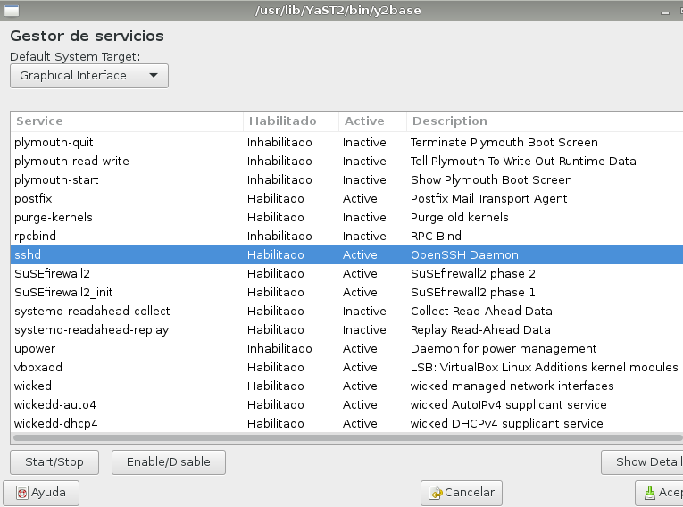
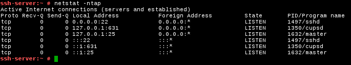
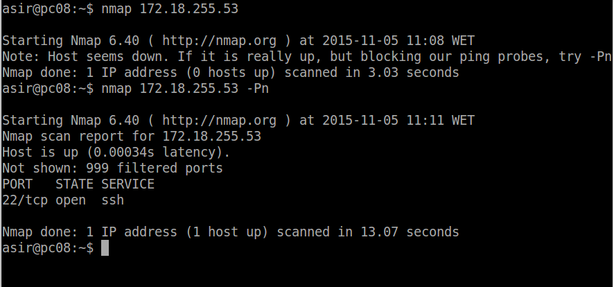
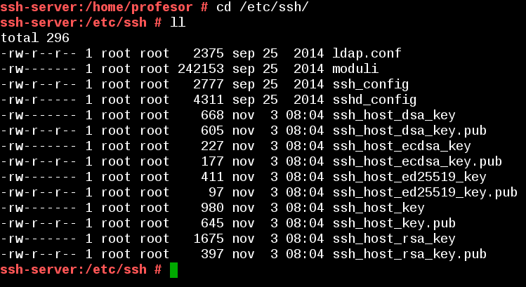

# Acceso remoto SSH

## Introducción

* Atender a la explicación del profesor.
* Leer documentación proporcionada por el profesor.

Enlaces de interés:
* [Aumentar la seguridad servidor SSH](http://rm-rf.es/como-securizar-un-servidor-ssh/)
* [Hardening SSH](https://linux-audit.com/audit-and-harden-your-ssh-configuration)
* http://en.wikipedia.org/wiki/: Secure_Shell,VNC, NX_technology, Remote_Desktop_Protocol, Remote_Desktop_Services, X_Window_System_protocols_and_architecture, Comparison_of_remote_desktop_software

Vamos a necesitar las siguientes MVs:

| Función | Sistema Operativo     | IP        | Nombre |
| ------- |--------------------- | --------- | --------- |
| Un servidor SSH| GNU/Linux OpenSUSE | 172.AA.XX.31 | ssh-serverXXg |
| Un cliente SSH | GNU/Linux OpenSUSE | 172.AA.XX.32 | ssh-clientXXg |
| Un servidor SSH | Windows | 172.AA.XX.11 | ssh-serverXXw |
| Un cliente SSH | Windows7 | 172.AA.XX.12 | ssh-clienteXXw |

Entrega:
* Añadir informe al repositorio git. Etiqueta `ssh`.
* Incluir capturas de pantalla de cada apartado para confirmar que está funcionando.
* Además se mostrará al profesor la práctica funcionando en clase y se responderá
a las preguntas que pudieran hacerse en dicho instante.

---

# 1. Preparativos

## 1.1 Servidor SSH

* Configurar el servidor GNU/Linux con siguientes valores:
    * SO GNU/Linux: OpenSUSE
    * IP estática: 172.AA.XX.31
    * Nombre de equipo: ssh-serverXXg
    * [Configuración de las MV's](../../global/configuracion/opensuse.md)
* Añadir en `/etc/hosts` los equipos `ssh-clientXXg` y `ssh-clientXXw` (Donde XX es el puesto del alumno).
* Para comprobar los cambios ejecutamos varios comandos. Capturar imagen:
```
ip a                # Comprobar IP y máscara
route -n            # Comprobar puerta de enlace
ping 8.8.4.4 -i 2   # Comprobar conectividad externa
host www.google.es  # Comprobar el servidor DNS
ping ssh-clientXXa  # Comprobar conectividad con cliente A
ping ssh-clientXXb  # Comprobar conectividad con cliente B
lsblk               # Consultar particiones
blkid               # Consultar UUID de la instalación
```

* Crear los siguientes usuarios en ssh-serverXXg:
    * primer-apellido-del-alumno1
    * primer-apellido-del-alumno2
    * primer-apellido-del-alumno3
    * primer-apellido-del-alumno4

## 1.2 Cliente GNU/Linux

* Configurar el cliente1 GNU/Linux con los siguientes valores:
    * SO OpenSUSE
    * IP estática 172.18.XX.32
    * [Configuración de las MV's](../global/configuracion/opensuse.md)
    * Nombre de equipo: ssh-clientXXg
* Añadir en `/etc/hosts` el equipo `ssh-serverXXg`, y `ssh-clientXXw`.
* Comprobar haciendo ping a ambos equipos.

## 1.3 Cliente Windows

* Instalar software cliente SSH en Windows. Para este ejemplo usaremos [PuTTY](http://www.putty.org/).
* Configurar el cliente2 Windows con los siguientes valores:
    * SO Windows 7
    * IP estática 172.18.XX.11
    * Nombre de equipo: ssh-clientXXw
    * [Configuración de las MV's](../../global/configuracion/windows.md)
* Añadir en `C:\Windows\System32\drivers\etc\hosts` el equipo ssh-serverXXg y ssh-clientXXw.
* Comprobar haciendo ping a ambos equipos.

---

# 2 Instalación del servicio SSH

* Instalar el servicio SSH en la máquina ssh-server
    * Desde la herramienta `yast -> Instalar Software`
    * Desde terminal `zypper search openssh` muestra los paquetes instalados o no con nombre openssh*.
    * Desde terminal `zypper install openssh`, instala el paquete OpenSSH.

> * Los ficheros de configuración del servicio se guardan en /etc/ssh.
> * [Vídeo: Instalación y configuración de un servidor SSH en Windows Server](http://www.youtube.com/embed/QlqokjKt69I)

## 2.1 Comprobación

* Desde el propio **ssh-server**, verificar que el servicio está en ejecución.
    * `systemctl status sshd`, esta es la forma de comprobarlo en *systemd*
    * `ps -ef|grep sshd`, esta es la forma de comprobarlo mirando los procesos del sistema.




> Para poner el servicio enable, si no lo estuviera.:
>  * `systemctl enable sshd` por comandos
>  * `Yast -> servicios` por entorno gráfico

* `netstat -ntap`: Comprobar que el servicio está escuchando por el puerto 22



## 2.2 Primera conexión SSH desde cliente GNU/Linux

* Comprobamos la conectividad con el servidor desde el cliente con `ping ssh-serverXXg`.
* Desde el cliente comprobamos que el servicio SSH es visible con `nmap -Pn ssh-serverXXg`.
Debe mostrarnos que el puerto 22 está abierto. Esto es, debe aparecer una línea como  "22/tcp open  ssh".



* Si esto falla debemos comprobar en el servidor la configuración del cortafuegos:


Vamos a comprobar el funcionamiento de la conexión SSH desde cada cliente usando el usuario *1er-apellido-alumno1*.
* Desde el cliente GNU/Linux nos conectamos mediante `ssh 1er-apellido-alumno1@ssh-serverXXg`. Capturar imagen del intercambio de claves que se produce en el primer proceso de conexión SSH.


* Si nos volvemos a conectar tendremos:


* Comprobar contenido del fichero `$HOME/.ssh/known_hosts` en el equipo ssh-client1. OJO si el prompt
pone *ssh-server* están el el servidor, y si pone *ssh-client1* están el el cliente1.


* ¿Te suena la clave que aparece? Es la clave de identificación de la máquina ssh-server.
* Una vez llegados a este punto deben de funcionar correctamente las conexiones SSH desde el cliente. Comprobarlo.

## 2.3 Primera conexión SSH desde cliente Windows

* Desde el cliente Windows nos conectamos usando `PuTTY`.
    * Capturar imagen del intercambio de claves que se produce en el primer proceso de conexión SSH.
    * No guardar la conexión SSH en los perfiles de PuTTY.
* ¿Te suena la clave que aparece? Es la clave de identificación de la máquina ssh-server.
* Una vez llegados a este punto deben de funcionar correctamente las conexiones SSH desde el cliente. Comprobarlo.

---

# 3. ¿Y si cambiamos las claves del servidor?

* Confirmar que existen los siguientes ficheros en `/etc/ssh`,
Los ficheros `ssh_host*key` y `ssh_host*key.pub`, son ficheros de clave pública/privada
que identifican a nuestro servidor frente a nuestros clientes:

```
-rw-r--r-- 1 root root 136156 ago 24  2012 moduli
-rw-r--r-- 1 root root   1667 sep 12  2012 ssh_config
-rw-r--r-- 1 root root   2487 dic 27  2013 sshd_config
-rw------- 1 root root    672 dic 27  2013 ssh_host_dsa_key
-rw-r--r-- 1 root root    601 dic 27  2013 ssh_host_dsa_key.pub
-rw------- 1 root root    227 dic 27  2013 ssh_host_ecdsa_key
-rw-r--r-- 1 root root    173 dic 27  2013 ssh_host_ecdsa_key.pub
-rw------- 1 root root    528 dic 27  2013 ssh_host_key
-rw-r--r-- 1 root root    333 dic 27  2013 ssh_host_key.pub
-rw------- 1 root root   1675 dic 27  2013 ssh_host_rsa_key
-rw-r--r-- 1 root root    393 dic 27  2013 ssh_host_rsa_key.pub
```



* Modificar el fichero de configuración SSH (`/etc/ssh/sshd_config`) para dejar una única línea:
`HostKey /etc/ssh/ssh_host_rsa_key`. Comentar el resto de líneas con configuración HostKey.
Este parámetro define los ficheros de clave publica/privada que van a identificar a nuestro
servidor. Con este cambio decimos que sólo vamos a usar las claves del tipo RSA.

### Regenerar certificados

Vamos a cambiar o volver a generar nuevas claves públicas/privadas para la
identificación de nuestro servidor.
* En **ssh-serverXXg**, como usuario root ejecutamos: `ssh-keygen -t rsa -f /etc/ssh/ssh_host_rsa_key`.
* No poner password al certificado de la máquina.
* Reiniciar el servicio SSH: `systemctl restart sshd`.
* Comprobar que el servicio está en ejecución correctamente: `systemctl status sshd`

### Comprobamos

* Comprobar qué sucede al volver a conectarnos desde los dos clientes, usando los
usuarios 1er-apellido-alumno2 y 1er-apellido-alumno1. ¿Qué sucede?

> **Enlaces de interés**
>
> Cliente SSH para Windows:
>
> * [Learning Linux : Lesson 14 Using Public key Authentication with PuTTY ](https://youtu.be/xe599gD4b5E?list=PL3E447E094F7E3EBB)
>
> Servicio SSH en Windows:
>
> * [Tutorial FreeSShd](http://www.redeszone.net/windows/freesshd-para-windows-instalacion-y-manual-de-configuracion-de-freesshd-para-windows-servidor-ssh-y-sftp/)
> * [Configuración de OpenSSH para Windows7 con SSH Cygwin +Putty](http://www.taringa.net/post/linux/15562479/Configuracion-de-OpenSSH-en-Windows-7-SSH-Cygwin-Putty.html)
> * [Installing Cygwin and Starting the SSH Daemon](http://docs.oracle.com/cd/E24628_01/install.121/e22624/preinstall_req_cygwin_ssh.htm#EMBSC150)
> * En Windows, la información relativa a los know_hosts, se almacena en el registro. En la ruta `CURRENT_USER/Software/SimonTaham/Putty/SSHHostKeys`. Para acceder al registro ejecutamos el comando `regedit`.

---

# 4. Personalización del prompt Bash

> [INFO] Esto sólo para servidores GNU/Linux o BSD.
>
> Personalizar Bash según la documentación, para cambiar el color cuando tenemos activa una sesión SSH.

* Por ejemplo, podemos añadir las siguientes líneas al fichero de configuración
del usuario1 en la máquina servidor (Fichero /home/1er-apellido-alumno1/.bashrc)

```
# Se cambia el prompt al conectarse vía SSH

if [ -n "$SSH_CLIENT" ]; then
   PS1="AccesoRemoto_\e[32m\u@\h:\e[0m \w\a\$ "
else
   PS1="\[$(pwd)\]\u@\h:\w>"
fi
```
* Además, crear el fichero el fichero `/home/1er-apellido-alumno1/.alias`,
donde pondremos el siguiente contenido:
```
alias c='clear'
alias g='geany'
alias p='ping'
alias v='vdir -cFl'
alias s='ssh'
```
* Comprobar funcionamiento de la conexión SSH desde cada cliente.

---

# 5. Autenticación mediante claves públicas


El objetivo de este apartado es el de configurar SSH para poder acceder desde el cliente1,
usando el `1er-apellido-alumno4` sin poner password, pero usando claves pública/privada.

Para ello, vamos a configurar la autenticación mediante clave pública para
acceder con nuestro usuario personal desde el equipo cliente al servidor con el
usuario `1er-apellido-alumno4`.

Capturar imágenes de los siguientes pasos:
* Vamos a la máquina `ssh-clientXXg`.
* ¡OJO! No usar el usuario root.
* Iniciamos sesión con nuestro usuario *nombre-alumno* de la máquina `ssh-clientXXg`.
* `ssh-keygen -t rsa` para generar un nuevo par de claves para el
usuario en `/home/1er-apellido-alumno4/.ssh/id_rsa` y `/home/1er-apellido-alumno4/.ssh/id_rsa.pub`.

Ahora vamos a copiar la clave pública (id_rsa.pub) del usuario (nombre-de-alumno)
de la máquina cliente, al fichero "authorized_keys" del usuario remoto *1er-apellido-alumno4*
(que está definido en el servidor. Hay varias formas de hacerlo:
* El modo recomendado es usando el comando `ssh-copy-id`. Ejemplo para copiar
la clave pública del usuario actual al usuario remoto en la máquina remota:
`ssh-copy-id usuario-remoto@hostname-remoto`.

> Otra forma de hacerlo sería usando el programa de copia segura `scp`.
>
> * Comprobar que existe el directorio `/home/1er-apellido-alumno4/.ssh` en el servidor.
> * Copiamos el fichero `.ssh/id_rsa.pub` local al fichero `.ssh/authorized_keys` del usuario
remoto en la máquina remota.

* Comprobar que ahora al acceder remotamente vía SSH
    * Desde `ssh-clientXXg`, NO se pide password.
    * Desde `ssh-clientXXw`, SI se pide el password.

---

# 6. Uso de SSH como túnel para X


> Enlaces de interés:
>
> * http://dustwell.com/how-x-over-ssh-really-works.html
> * http://www.vanemery.com/Linux/XoverSSH/X-over-SSH2.html

* Instalar en el servidor una aplicación de entorno gráfico (APP1) que no esté en los clientes.
Por ejemplo Geany. Si estuviera en el cliente entonces buscar otra aplicación o desinstalarla en el cliente.
* Modificar servidor SSH para permitir la ejecución de aplicaciones gráficas, desde los clientes.
Consultar fichero de configuración `/etc/ssh/sshd_config` (Opción `X11Forwarding yes`)

Vamos al clienteXXa.
* Comprobar que no está instalada APP1: `zypper se APP1`.
* Comprobar desde el clienteXXa, que funciona APP1(del servidor).
    * Con el comando `ssh -X remoteuser1@ssh-serverXXg`, podemos conectarnos de forma
remota al servidor, y ahora ejecutamos APP1 de forma remota.
    * El parámetro es `-X` en mayúsculas, no minúsculas.

> Para ver los logs del sistema usar `journalctl`

---

# 7. Aplicaciones Windows nativas

Podemos tener aplicaciones Windows nativas instaladas en ssh-server mediante el emulador WINE.
* Instalar emulador Wine en el ssh-serverXXg.
* Ahora podríamos instalar alguna aplicación (APP2) de Windows en el servidor SSH
usando el emulador Wine. O podemos usar el Block de Notas que viene con Wine: wine notepad.
* Comprobar el funcionamiento de APP2 en ssh-serverXXg.
* Comprobar funcionamiento de APP2, accediendo desde ssh-client1.

> En este caso hemos conseguido implementar una solución similar a RemoteApps usando SSH.

---

# 8. Restricciones de uso

Vamos a modificar los usuarios del servidor SSH para añadir algunas restricciones de uso del servicio.

## Restricción sobre un usuario

Vamos a crear una restricción de uso del SSH para un usuario:

* En el servidor tenemos el usuario remoteuser2. Desde local en el servidor podemos usar
sin problemas el usuario.
* Vamos a modificar SSH de modo que al usar el usuario por ssh desde los clientes tendremos permiso denegado.

Capturar imagen de los siguientes pasos:
* Consultar/modificar fichero de configuración del servidor SSH (`/etc/ssh/sshd_config`) para
restringir el acceso a determinados usuarios. Consultar las opciones `AllowUsers`, `DenyUsers`.
Más información en: `man sshd_config` y en el Anexo de este enunciado.
* Comprobarlo la restricción al acceder desde los clientes.

## Restricción sobre una aplicación

Vamos a crear una restricción de permisos sobre determinadas aplicaciones.

* Crear grupo remoteapps
* Incluir al usuario 1er-apellido-alumno4 en el grupo remoteapps.
* Localizar el programa APP1. Posiblemente tenga permisos 755.
* Poner al programa APP1 el grupo propietario a remoteapps.
* Poner los permisos del ejecutable de APP1 a 750. Para impedir que los usurios
que no pertenezcan al grupo puedan ejecutar el programa.
* Comprobamos el funcionamiento en el servidor.
* Comprobamos el funcionamiento desde el cliente.

---

# 9. Servidor SSH en Windows

* Configurar el servidor Windows con los siguientes valores:
    * SO Windows Server
    * IP estática 172.AA.XX.11
    * Nombre de equipo: ssh-serverXXw
    * [Configuración de las MV's](../../global/configuracion/windows-server.md)
* Añadir en `C:\Windows\System32\drivers\etc\hosts` el equipo ssh-clientXXg y ssh-clientXXw.
* Comprobar haciendo ping a ambos equipos.
* Instalar y configurar el servidor SSH en Windows. Para este ejemplo usaremos [servidor SSH en Windows](../../global/acceso-remoto/windows10.md).
* Comprobar acceso SSH desde los clientes Windows y GNU/Linux al servidor SSH Windows.
    * `netstat -n` en Windows.
    * `lsof -i -n` en GNU/Linux.

---

# ANEXO A

## SSH cipher

https://answers.launchpad.net/ubuntu/+source/openssh/+question/669164

## A.1 Restricción sobre una IP con `iptables`

* Hacer copia de seguridad (snapshot de la MV) antes de hacer esta parte.
* Enlace de interés:
    * [ Howto Ejemplos de iptables ](http://www.seavtec.com/en/content/soporte/documentacion/iptables-howto-ejemplos-de-iptables-para-sysadmins)
    * [ 20 ejemplos de iptables para sysadmins ](https://elbauldelprogramador.com/20-ejemplos-de-iptables-para-sysadmins/#parar--iniciar--reiniciar-el-firewall)
* Usar `iptables` para restringir el acceso al puerto 22 desde `ssh-clientXXb`.
* Comprobar.


## A.2 Configuración de seguridad en OpenSSH

Fichero de configuración del servidor SSH `/etc/ssh/sshd_config`

## OpenSSH locking parameters

For locking down which users may or may not access the server you will want to look into one, or more, of the following directives: User/Group Based Access

* **AllowGroups**. This keyword can be followed by a list of group name patterns, separated by spaces.If specified, login is allowed only for users whose primary group or supplementary group list matches one of the patterns.`*' and `?' can be used as wildcards in the patterns.Only group names are valid; a numerical group ID is not recognized.By default, login is allowed for all groups.

* **AllowUsers**. This keyword can be followed by a list of user name patterns, separated by spaces.If specified, login is allowed only for user names that match one of the patterns.`*' and `?' can be used as wildcards in the patterns.Only user names are valid; a numerical user ID is not recognized.By default, login is allowed for all users.If the pattern takes the form USER@HOST then USER and HOST are separately checked, restricting logins to particular users from particular hosts.

* **DenyGroups**. This keyword can be followed by a list of group name patterns, separated by spaces.Login is disallowed for users whose primary group or supplementary group list matches one of the patterns.
* and ? can be used as wildcards in the patterns.Only group names are valid; a numerical group ID is not recognized. By default, login is allowed for all groups.

* **DenyUsers**. This keyword can be followed by a list of user name patterns, separated by spaces.Login is disallowed for user names that match one of the patterns. * and ? can be used as wildcards in the patterns.Only user names are valid; a numerical user ID is not recognized.By default, login is allowed for all users. If the pattern takes the form USER@HOST then USER and HOST are separately checked, restricting logins to particular users from particular hosts.

## Example configuring locking

* The first thing to do is backup the original configuration file:
`cp /etc/ssh/sshd_config /etc/ssh/sshd_config{,.`date +%s`}`
* We will now need to edit the configuration file with your favorite editor (vi/vim/ed/joe/nano/pico/emacs.)
* An example of only allowing two specific users, admin and bob, to login to the server will be,
/etc/ssh/sshd_config: `AllowUsers admin bob`


Ifyou would like to more easily control this for the future then you can create a Group on the server that will be allowed to login to the server, adding individual users as needed (replace username with the actual user):
* Open a shell
* `groupadd –r sshusers`
*  `usermod –a –G sshusers username`
* With this we will no longer be using AllowUsers but AllowGroups
* Edit /etc/ssh/sshd_config: `AllowGroups sshusers`

The alternatives to these directives are DenyGroups and DenyUsers which perform the exact opposite of the aforementioned AllowGroups and AllowUsers. When complete you will want to make sure that sshd will read in the new configuration without breaking.
```
    /usr/sbin/sshd –t
    echo $?
```

We will want to see a 0 following the `echo $?` command.Otherwise we should also
see an error stating what the erroneous data is:
```
    sshd_config: line 112: Bad configuration option: allowuser
    sshd_config: terminating, 1 bad configuration options
```
After verification we will simply need to restart sshd.This can be performed via many different methods.

> Make sure to not disconnect your ssh session but create a new one as a ‘just incase’.
> Verify that you can perform any required actions with this user(eg: su into root if you are not allowing root logins.)

---

## Conectar 2 máquinas

Podemos seguir esta recomendación para que varias personas trabajen en la misma máquina.

    Supongamos que tenemos 2 máquinas llamadas m1 y m2.
    En m1 instalamos openssh-server: apt-get install openssh-server
    En m1 tenemos los usuarios usu1 y usu2.
    En la máquina m2 para conectarse a m1 debemos hacer: ssh usu2@ip-m1
    Con esto abrimos sesión en m1 desde m2 y podemos trabajar desde m2.
    Si queremos abrir una sesión remota pero gráfica podemos hacer en m2:
        ssh -X usu2@ip-m1 (Es es para abrir la sesión. Establecer contacto)
        nautilus (Con esto abrimos un explorador en m1 pero desde m2) sonrisa
        Si tenemos el programa LibreOffice instalado en m1, pero no en m2... podemos conectarnos con ssh -X, y luego ejecutar... /usr/lib/libreoffice/program/soffice.bin, y ya está. Esto es trabajo remoto.

Si queremos copiar archivo de m2 hacia m1 hacemos:

    scp file usu2@ip-m1:/home/usu2
    Ya está! Si además queremos iniciar una sesión sftp hacemos:
    sftp usu2@ip-m1
