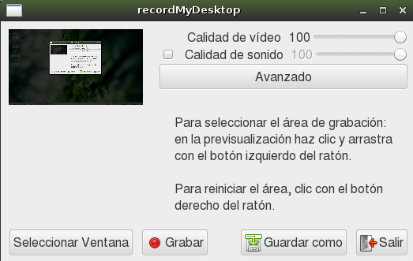

# Entregas en formato VIDEO

Enlaces de interés:
* [Convertir una vídeo en GIF animando](https://www.linuxadictos.com/como-convertir-un-video-en-un-gif-animado-en-linux.html)

En este tipo de entregas el alumno/grupo deberá realizar un vídeo donde se muestre el funcionamiento de la actividad a evaluar.

Cuando la entrega sea un vídeo:
* Hay que entregar URL con la ruta al vídeo subido a Youtube.
* En el caso de presentar varios vídeos, numerarlos secuencialmente para mantener el orden.
* Debe aparecer en el vídeo: los nombres de los componentes, fecha y título de la actividad y el nombre del centro "IES Puerto de la Cruz".

---

# ANEXO

## Programa: Capturador de vídeo

Disponemos de varios programas para grabar el escritorio. Estos se llaman
programas capturadores de vídeo.



*RecordMyDesktop* es un programa capturador de vídeo. Esto es, cuando se activa
graba un vídeo con todo lo que hagamos en el escritorio de nuestro PC.
Además, si conectamos un micrófono, puede grabar nuestra voz como parte
del sonido del vídeo.

Al terminar la grabación, obtenemos como resultado un vídeo (Formato ogv),
que podemos ver en cualquier PC (VLC player) o incluso subir a YouTube.

Es una herramienta muy útil para enseñar mediante vídeos.

[Ver vídeo en YouTube](https://youtu.be/NyF9-5sGtak)

> Otro capturador de vídeo muy fácil de usar es SimpleScreenRecorder

---

## Programa: Editor de vídeo

Para editar el vídeo pueden usar la herramienta que quieran. Por ejemplo kdenlive.

---

## Conversor de formato multimedia

Crea un fichero de texto con el nombre "conversor-de-video". Escribe el siguiente contenido dentro del fichero:

```
#!/bin/bash
echo "[INFO] Realizando conversión de formato..."
mencoder -idx out.ogv -ovc lavc -oac mp3lame -o out.avi
echo "[INFO] Done"
```

Pon permisos de ejecución al fichero: `chmod +x conversor-de-video`
Para ejecutarlo, simplemente escribe en la consola: `./conversor-de-video`
¡Ya está!

# OpenSUSE

* [SDB:Firefox MP4/H.264 Video Support](https://en.opensuse.org/SDB:Firefox_MP4/H.264_Video_Support)
* [Additional package repositories](https://en.opensuse.org/Additional_package_repositories#Packman)
