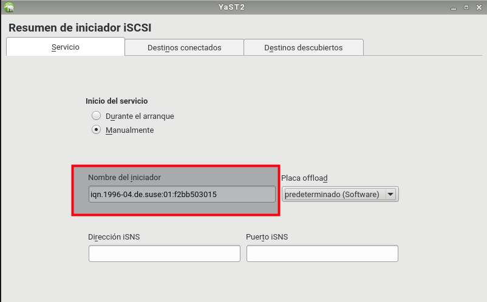
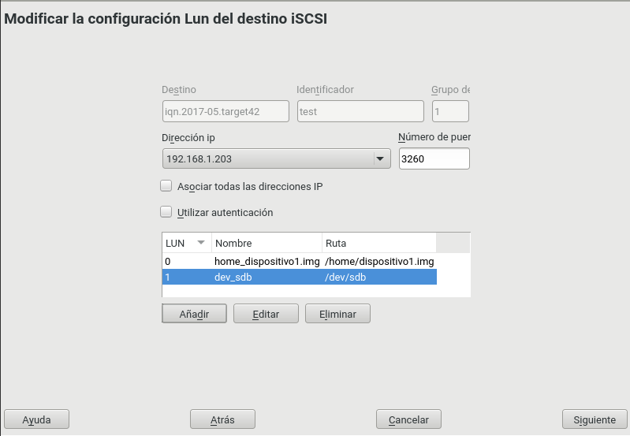
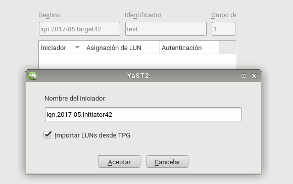
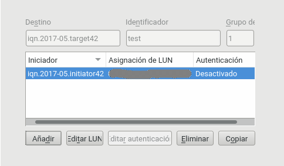
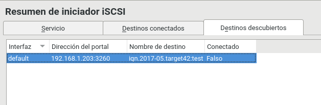
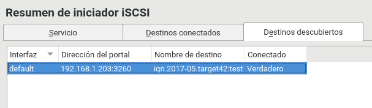
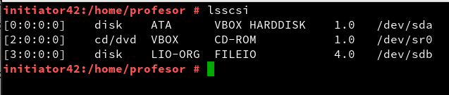

```
* Fecha de creación : curso 201415
* Fecha de UM       : curso 201617
* Sistema Operativo : OpenSUSE Leap, OpenSUSE 13.2
```

# iSCSI en OpenSUSE

Vamos a montar un iSCSI con GNU/Linux OpenSUSE.

---

# 1 Preparativos

Vamos a montar la práctica de iSCSI con OpenSUSE 13.2.

Necesitamos 2 MV's (Consultar [configuraciones](../../global/configuracion/opensuse.md)).
* MV1: Esta MV actuará de `Initiator`.
    * Hostname `initiatorXX`.
    * Con dos interfaces de red.
    * Una en modo puente (172.19.XX.31)
    * y la otra en red interna (192.168.XX.31) con nombre `san`.
        * Este interfaz NO tiene gateway.
* MV2: Esta MV actuará de `Target`.
    * Hostname `targetXX`.
    * Con un interfaz de red (192.168.XX.32) en modo red interna `san`.
    * Este interfaz tiene como gateway 192.168.XX.31.
* Las IP's las pondremos todas estáticas.
* Las IP's de la red interna estarán en el rango 192.168.XX.NN/24.
Donde XX será el número correspondiente al puesto de cada alumno.

> Como vamos a necesitar acceso a los repositorios de Internet en el Target
para instalar el software, podemos hacerlo de varias formas:
> * (a) Poner el interfaz de red temporalmente en puente, instalar y cambiar.
> * (b) Poner temporalmente un 2º interfaz puente para instalar y luego lo desactivamos.
> * (c) Activar/configurar enrutamiento en el Initiator.
>    
> **Enrutamiento en GNU/Linux**
>
> * [Enrutamiento en GNU/Linux](http://www.ite.educacion.es/formacion/materiales/85/cd/linux/m6/enrutamiento_en_linux.html)
> *  Ejemplo de script que activa el enrutamiento y el NAT:
> ```
>     // activar-enrutamiento.sh
>     echo "1" > /proc/sys/net/ipv4/ip_forward
>     iptables -A FORWARD -j ACCEPT
>     iptables -t nat -A POSTROUTING -s IP_RED_INTERNA/MASCARA_RED_INTERNA -o eth0 -j MASQUERADE
> ```
> *  Ejemplo de script que desactivara el enrutamiento:
> ```
>     // desactivar-enrutamiento.sh
>     echo "0" > /proc/sys/net/ipv4/ip_forward
> ```

---

# 2 Target - Teoría

La configuración del Target contiene:
* El nombre de nuestro target
* El nombre de usuario y la contraseña para la conexión del iniciador
* El dispositivo que ofreceremos como target

### 2.1 Nombre

El estándar iSCSI define que tanto los target como los iniciadores deben
tener un nombre que sigue un patrón,
el cual es el siguiente: `iqn.YYYY-MM.NOMBRE-DEL_DOMINIO_INVERTIDO:IDENTIFICADOR`.
Donde:
* `iqn` es un término fijo y debe figurar al principio.
* `YYYY-MM` es la fecha de alta del dominio de la organización para la que estamos configurando el target.
* A continuación debe figurar el nombre del dominio invertido
* Luego de los “:”, un identificador que podemos ponerlo a nuestro gusto, y que
puede en muchos casos brindar información del target.

Un ejemplo válido sería: `iqn.2005-02.au.com.empresa:san.200G.samba`.

Como vemos el identificador aunque es variable y personalizable, puede
reflejar el nombre dado al target, la capacidad y el servicio donde lo usaremos.

### 2.2 Autenticación

Si queremos que nuestro target requiera autenticación, podemos definir
un usuario y una contraseña para que solo se conecten los iniciadores que nosotros queremos.

`IncomingUser usuario-iniciador clave-iniciador`

### 2.3 Dispositivos/Destinos

Luego debemos definir qué dispositivo ofreceremos como target.
Debemos poner una línea como la siguiente: `Lun 0 Path=/dev/sda3,Type=fileio`

En este ejemplo el primer dispositivo que estamos ofreciendo es la
partición /dev/sda3 del servidor. La documentación nos dice que además
de particiones podemos usar discos enteros, volúmenes LVM y RAID,
e incluso archivos. En cualquier caso solo hay que definir el path.

El archivo contiene muchos parámetros más de configuración,
que en la mayoría de los casos tienen que ver con la performance del servidor.
En nuestro ejemplo, configurando estos tres parámetros nos basta.

---

## 3 Práctica: Initiator

* Por entorno gráfico, `Yast -> Iniciador SCSI`
* Modificamos el identificador iqn del Initiator con
`iqn.2017-05.initiatorXX`.
* Comprobamos por comandos, `more /etc/iscsi/initiatorname.iscsi`



---

## 4 Práctica: configuración del Target

Enlaces recomendados:
* [OpenSUSE - tutorial iSCSI Target usando comandos](http://es.opensuse.org/iSCSI)
* [OpenSUSE - iSCSI Target documentation ](https://www.suse.com/documentation/sles11/stor_admin/data/sec_inst_system_iscsi_target.html)

Otros enlaces de interés:
* INITIATOR - [Setting up iSCSI initiator on OpenSUSE](https://www.suse.com/documentation/sles11/stor_admin/data/sec_inst_system_iscsi_initiator.html)
* Vídeo: [EN - LINUX: ISCSI Target and Initiator Command Line configuration](https://youtu.be/5yMSxqUs4ys)
* Vídeo: [Linux Configure an iSCSI Target](https://www.youtube.com/watch?v=cWPY3lH3qTQ)
* Vídeo: [Linux Configure iSCSI Initiator ( client ) ](https://www.youtube.com/watch?v=8UojNONhQDo)
* Vídeo: [EN - Configure iSCSI initiator (client)](https://youtu.be/8UojNONhQDo)

## 4.1 Crear los dispositivos

Crear los dispositivos
* Creamos el dispositivo1 a partir de un fichero.
    * `dd if=/dev/zero of=/home/dispositivo1.img bs=1M count=500`
    * Hemos creado un fichero con tamaño 500M.
    * `du -sh /home/dispositivo1.img`, lo comprobamos.
* Creamos el dispositivo2 a partir de un disco extra.
    * Añadiremos un 2º disco de 700M a la MV Target.
    * `/dev/sdb` será nuestro dispositivo2.

## 4.2 Instalar y configurar el Target

* Vamos a la máquina target.
* `zypper in yast2-iscsi-lio-server`, instala el software para crear un Target iSCSI y sus dependencias.
* Ir a `Yast -> Objetivo LIO iSCSI`, para configurar el Target.
* Inicio del Servicio
    * Durante el arranque = Sí
    * Abrir el cortafuegos = Sí
* Global
    * Sin autenticación
* Destinos(Dispositivos)
    * Nombre `iqn.2017-05.targetXX`.
    * Identificador `test`
    * Seleccionar los LUN (dispositivos creados anteriormente)
        * `Lun 0 Path=/home/dispositivo1.img,Type=fileio`
        * `Lun 1 Path=/dev/sdb,Type=fileio` (Escribir la ruta del dispositivo)
    * Utilizar autenticación => NO



> El target tiene un identificador iqn y el iniciador tendrá otro iqn diferente.
> En el target hay que habilitar permiso de acceso al iqn del Iniciador.

* Pulsamos siguiente y vamos a configurar iniciador -> Añadir -> Ponemos el identificador de nuestro iniciador.



* Siguiente -> Terminar.



## 4.3 Comprobamos

Para activar todos los cambios hay que reiniciar el servidor Target iSCSI.

* `systemctl start target.service`, inicia el servicio Target manualmente.
* `systemctl status target.service`, comprueba el estado del servicio Target.
* `systemctl enable target.service`, habilita el servicio Target para que se inicie automáticamente con cada reinicio.

Ya tenemos nuestro servidor Target iSCSI instalado. Ahora necesitamos un iniciador iSCSI para que se conecte a nuestro target y empezar a usar el almacenamiento.

---

# 5 Initiator

Enlaces recomendados:
* [OpenSUSE - tutorail iSCSI Initiator con comandos](http://es.opensuse.org/iSCSI)
* [OpenSUSE - iSCSI Initiador documentation](https://www.suse.com/documentation/sles11/stor_admin/data/sec_inst_system_iscsi_initiator.html)

## 5.1 Instalar y configurar acceso

Vamos a la máquina Iniciador.
* El software necesario viene preinstalado en OpenSUSE Leap:
    *  Si tenemos que hacer la instalación ejecutar `zypper in open-iscsi yast2-iscsi-client`.

**Descubrir**

* `Yast -> configurar Initiator -> Descubrir`, para descubrir los destinos de targets disponibles.
    * Debemos especificar la IP del equipo target donde queremos descubrir los destinos disponibles.
    * Puerto 3260
    * Sin autenticación.



> Otra forma de descubrir target es usando el siguiente comando por la consola:
>
> * `iscsiadm -m discovery -t sendtargets -p IP-DEL-TARGET`
> * `iscsiadm -m discovery -t st -p IP-DEL-TARGET`
>
> El target ofrece su servicio por defecto en el puerto 3260.
> * `iscsiadm -m discovery`, para descubrir los puertos de trabajo del Target.

**Conectar**

* `Yast -> configurar Initiator -> Conectar` para conectar con el destino que hemos descubierto.
* Elegimos:
   * Inicio en el arranque
   * Sin autenticación.



> Otra forma de conectar con el destino del Target vía comandos:
>
> * `iscsiadm -m node --targetname iqn.2017-05.targetXX:test -p IP-TARGET --login`,
conectar un target concreto.
> * `iscsiadm -m node -l`, conectar con todos los targets, usando una configuración básica sin autenticación.

* Si hacemos `fdisk -l`, veremos que nos aparece un nuevo disco en
el equipo iniciador.

## 5.2 Usar almacenamiento

* `dmesg`, comprobar que tenemos un nuevo disco SCSI de 1200M conectado a la MV del Initiator.
    * Debería ser un disco `/dev/sdb`.
* `lsscsi`, encontrar la ruta del dispositivo local para el dispositivo Target iSCSI.



* Crear directorio `/mnt/remote_targetXX`.
* `Yast -> Particionador`, elegir el disco.
    * Crear partición y formatear el disco.
    * Editar -> Montar -> Punto de montaje -> `/mnt/remote_targetXX`.
* Guardar datos en el disco SAN.

---

# ANEXO

## A.1 Otros enlaces de interés Debian

Enlaces de interés:
* [federicosayd - ISCSI Target en GNU/Linux Debian](https://federicosayd.wordpress.com/2007/09/11/instalando-un-target-iscsi/)
* iSCSI - [Using iSCSI (target and initiator) on Debian](https://www.howtoforge.com/using-iscsi-on-debian-lenny-initiator-and-target).
* TARGET - [Create targer iSCSI on Debian](https://wiki.debian.org/SAN/iSCSI/iscsitarget).
