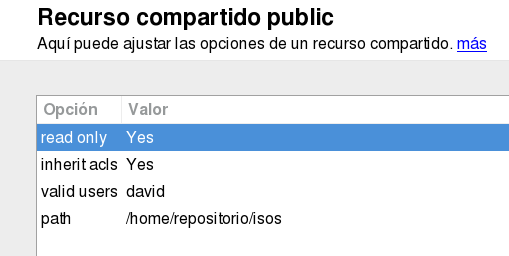

```
* Práctica utilizada en los cursos 201213, 201314, 201415
* Actualizada para el curso 201516
```

#Almacenamiento NAS

* Trabajar de forma individual.
* Entregar informe con capturas de pantalla.
* Esquema de la práctica:
    * Instalar y configurar NAS.
    * Montar 2 discos para guardar los datos en RAID1.
    * Crear 2 recursos compartidos CIFS/SMB en el servidor NAS.
        * Recurso1 compartido de lectura/escritura para el usuario1.
        * Recurso2 de sólo lectura para el usuario2.
    * Crear usuarios/clave para acceder al repositorio NAS.
    * Comprobar el acceso al servdidor NAS desde otra máquina.

#1. NAS OpenSUSE 13.2

* Montar en una MV con OpenSUSE el servicio Samba
(Consultar [configuración](../../global/configuracion-aula109.md)).
* Consultar vídeo [SAMBA Management with YaST on SUSE](https://youtu.be/Zh3J-HUYDY4?list=PL3E447E094F7E3EBB)

La práctica de NAS consisten en:
* Montar 2 discos para guardar los datos en RAID1.
* Montar el RAID1 en la ruta `/mnt/nas`.
    * Pista. Ejecutando el comando `df -hT` debemos ver los discos montados en la ruta.
    * Pista. En el directorio `/mnt/nas` debe aparecer un `lost+found`.
* Instalar y configurar un servidor Samba (desde Yast por ejemplo o con zypper).


> Samba es un software que permite que el equipo se comunique
usando el protocolo SMB/CIFS típico de las redes Windows.

* Configurar Servidor Samba con:
    * Grupo de trabajo: `CURSO1516`
    * Sin controlador de Dominio
    * Inicio del servicio: `durante el arranque`
    * Puerto abierto en el cortafuegos
* Crear el grupo `hobbitsXX`
    * Añadir los usuarios `frodoXX` y `bilboXX`
* Crear el grupo `humanosXX`
    * Añadir los usuarios `gandalfXX` y `aragornXX`
* Crear el recurso compartido (I):
    * Crear la carpeta `/mnt/nas/hobbitonXX.d`
    * Con permisos de lectura/navegación para todos.
    * Con permisos de escritura/lectura/navegación para el grupo `hobbitsXX`.
    * Usar `Yast -> Samba Server` para crear recursos compartido (SMB/CIFS) 
    en la ruta anterior, con el nombre `hobbitonXX`.
    * Poner permisos al recurso de red de lectura para todos.
    * Heredar ACLS
    * `path = /mnt/nas/hobbitonXX.d`
    * `valid users = @hobbitsXX` (Los usuarios de este grupo pueden acceder al recurso)
    * `read only = No`



* Crear el recurso compartido (II):
    * Crear la carpeta `/mnt/nas/mordorXX.d`
    * Con permisos de lectura/navegación para todos.
    * Crear recursos compartido (SMB/CIFS) en dicha ruta, con el nombre `mordorXX`.
    * Poner permisos al recurso de red de lectura para todos.
    * Heredar ACLS
    * `path = /mnt/nas/mordorXX.d`
    * `valid users = gandalfXX, frodoXX` (Estos usuarios pueden acceder al recurso)
    * `read only = Yes`

* Poner también clave en Samba para los usuarios.
    * `smbpasswd -a USUARIO` para poner clave del usuario en samba.
    * `smbpasswd -e USUARIO` para activar el usuario en samba.
* Reiniciar el servicio:
    * `systemctl stop smb`
    * `systemctl start smb`
    * `systemctl status smb`
* Comprobar el acceso al servidor NAS desde otra máquina con todos los 
usuarios, y todos los recursos. 
* Comprobaciones:
    * Ejecutando `smbtree` en OpenSUSE veremos todos los recursos compartidos de red.
    * Ejecutando `smbclient -L ip-servidor-samba`, ven los recursos de una máquina concreta.

