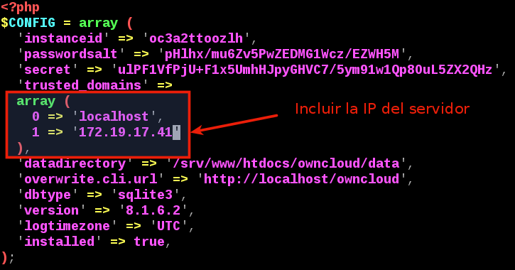

```
Utilizada en los cursos 201415 y 201314
En el curso 201516 se amplía para usar OpenSUSE13.2
``` 

# 1. Entrega

* Apartado 2:
    * Trabajo individual.
    * Vídeo que muestre la práctica en funcionamiento.
* Apartados 4 y 5:
    * Colaborar con otro compañero.
        * Montar nuestro servidor para que lo use el compañero.
        * Usar el servidor de otro compañero.
    * Entregar un informe de los pasos realizados

---

# 2. Nube ajena

Almacenamiento en la nube de un proveedor externo.

* Realizar la instalación y configuración de alguna de las siguientes herramientas a elegir por el alumno:
    * DropBox
    * Windows Live Mesh, OneDrive,
    * Ubuntu One, ZumoDrive.
* Realizar una instalación sobre SO Windows y otra sobre GNU/Linux. Mostrar su uso mediante ejemplos.

---

# 3. Nube propia con OwnCloud Server en OpenSUSE 13.2

Últimamente se están poniendo de moda servicios de almacenamiento y sincronización
de ficheros en la nube, entre los que destacan Dropbox y Google Drive. Ambas soluciones son cerradas.

Dentro de las soluciones libres disponemos de ownCloud, por el que parece
que apuesta Suse, y que utilizan varios proveedores para ofrecer servicios
de almacenamiento en la nube con un modelo de negocio freemium, como son OwnCubey GetFreeCloud.

Las fuentes están disponibles para poder instalarlo en máquinas propias o
 alquiladas, así como clientes de sincronización para Windows, Linux, Android y próximamente para iOs y Mac.

##3.1 Instalar OwnCloud

* Elegir una MV con OpenSUSE13.2 para instalar OwnCloud Server.
    * [OwnCloud en OpenSuse13.2](https://www.howtoforge.com/owncloud-install-on-opensuse-13.2)
* Agregar repositorios para OwnCloud en OpenSUSE
   * Pistas: `zypper addrepo http://...`, `zypper r...`.
   * Comprobación:  `zypper search owncloud`
* Instalar el paquete de OwnCloud Server.
   * Comprobación: `zypper se owncloud`
* Instalar el paquete de apache2. Comprobación `zypper se apache2`.
* Activar e iniciar el servicio apache2. Comprobación `systemctl status apache2.service`
* Abrir en el cortafuegos (yast2) los puertos/serviciods http , https y SSH.

##3.2 Configurar OwnCloud

* Instalar el paquete mariadb. Comprobación `zypper se maridb`.
* Activar e iniciar el servicio `mysql.service`.
* Configurar la seguridad con el comando `mysql_secure_installation`

```
* Enter current password for root (enter for none): <--ENTER
...
* Set root password? [Y/n] <--ENTER
* New password: <--mariadbpassword
* Re-enter new password: <--mariadbpassword
Password updated successfully!
...
* Remove anonymous users? [Y/n]  <--ENTER
...
* Disallow root login remotely? [Y/n] <--ENTER
...
* Remove test database and access to it? [Y/n] <--ENTER
...
* Reload privilege tables now? [Y/n] <--ENTER
...
Thanks for using MariaDB!
```
* Vamos a entrar en mariadb y crear la base de datos:
    * `mysql -u root -p`
    * `CREATE DATABASE owncloud;`
    * `GRANT ALL ON owncloud.* to 'root'@'localhost' IDENTIFIED BY 'database_password';`
    * `exit`
* Ahora configuramos php5 con apache2
    * `a2enmod php5`
    * `vi /srv/www/htdocs/owncloud/.htaccess` y añadimos `Options +FollowSymLinks` al principio.
* Reiniciar el servicio apache2. Comprobación: `systemctl status apache2`
* Abrimos un navegador URL: `ip-del-servidor/owncloud`
    * Click en Almacenamiento.
    * Elegir MySQL/MariaDB y crear usuario administrador.
    * Debajo MySQL/MariaDB escribir `username=root password=database_password databasename=owncloud`.

##3.3 Comprobar vía web

* Para permitir desde otros equipos tenemos que añadir la IP del servidor a las opciones
`trusted_domains` dentro del fichero de configuración `/srv/www/htdocs/owncloud/config/config.php`.



* Abrimos un navegador web, y ponemos en el URL `http://localhost/owncloud`
* Usamos nuestro usuario/clave administrador.
* Creamos un usuario normal.
* Subiremos algunos archivos al servidor.

---

# 4. OwnCloud Desktop Client

* Ir a una MV con Windows 7.
* Instalar el sofware cliente de OwnCloud.
* Comprobar cómo se mantienen sincronizados los archivos entre las máquinas.

---

# ANEXO

## A.1 Instalación del servidor OwnCloud para Ubuntu

* [OwnCloud en Debian/Ubuntu](http://hipertextual.com/archivo/2014/10/owncloud/)

## A.2 Instalación del servidor OwnCloud para Debian7

* Añadimos un nuevo repositorio con el paquete que queremos instalar:
    * echo 'deb http://download.opensuse.org/repositories/isv:/ownCloud:/community:/nightly/Debian_7.0/ /' >> /etc/apt/sources.list.d/owncloud.list
* Actualizamos la lista de repositorios: `apt-get up...`
* Instalamos el paquete: `apt-get .... owncloud`

## A.3 Instalación del servidor OwnCloud para Raspberry PI

* [BTSync: Clone Dropbox with a Raspberry Pi and BTSync](http://reustle.io/blog/btsync-pi)
