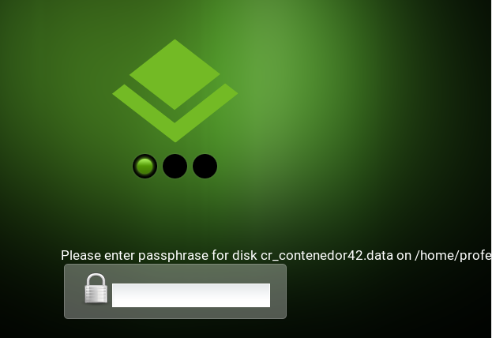

Trabajaremos en parejas.

---

# 1. Encriptación

* [Información sobre GPG](https://www.genbetadev.com/seguridad-informatica/manual-de-gpg-cifra-y-envia-datos-de-forma-segura)

## 1.1 Encriptado simétrica

Nosotros hacemos lo siguiente:

* Asegurarnos de tener instalado GPG (`zypper info gpg2`).
* Crear un fichero de texto `/home/nombre-alumno/mensaje-secreto1.txt`.
* Hacer una encriptación simétrica con GPG.
    * `gpg -c mensaje-secreto1.txt`
* Enviar fichero encriptado al compañero para que lo desencripte.
    * `gpg -d mensaje-secreto1.txt.gpg`

## 1.2 Encriptado asimétrico

Nosotros hacemos lo siguiente:

* Generar un par de claves pública/privada.
    * `gpg --gen-key`
    * Comprobamos `gpg -k`
    * `tree .gnupg`

> Comprobaremos que se crea un directorio oculto, dentro del home de nuestro usuario con el nombre `.gnugp`. Ahí es donde se guarda la información
de claves de GPG para nuestro usuario.

* Exportar la clave pública para pasarla al compañero.
    * `gpg --output nombre-alumno1.pub.gpg --export PUBLIC_KEY_IDNUMBER`

El compañero:

* Crear un fichero de texto `/home/nombre-alumno/mensaje-secreto2.txt`.
* Importamos la clave pública del compañero.
    * `gpg --import nombre-alumno1.pub.gpg`
* Hacer una encriptación asimétrica con GPG con la clave pública recibida.
    * `gpg -k`, para ver las claves que tenemos.
    * `gpg --encrypt --recipient PUBLIC_KEY_IDNUMBER mensaje-secreto2.txt`
* El compañero nos envía el fichero a nosotros para que lo desencriptemos.

Nosotros:
* Desencriptamos el fichero `gpg -d mensaje-secreto2.txt.gpg`.

> Se entiende que podemos desencriptar el fichero porque ha sido encriptado
con nuestra clave pública por parte del compañero que nos envía el archivo.
eliminar una clave pública (de tu anillo de claves públicas):
>
> Otros comandos de interés:
>
> * `gpg --gen-key`, Crear una clave.
> * `gpg --export -a “Nombre de Usuario"`, muestra la clave pública para el ‘Nombre de Usuario’ en la línea de comandos.
> * `gpg --export-secret-key -a "Nombre de Usuario" > private.key`, Esto creará un archivo llamado private.key con la representación ascii de la clave privada para ‘Nombre de Usuario’.
> * `gpg --import public.key`, Importar una clave pública.
> * `gpg --allow-secret-key-import --import private.key`, Importar una clave privada.
> * `gpg --delete-key "Nombre de Usuario"`, Esto elimina la clave pública de tu anillo de claves.

---

# 2. Firma

* [Información sobre firma GPG](https://www.genbetadev.com/seguridad-informatica/que-son-y-para-que-sirven-los-hash-funciones-de-resumen-y-firmas-digitales)
* Crear documento firma.txt, pondremos dentro un texto cualquiera.
* Vamos a firmar digitalmente el documento en modo ASCII.
    * `gpg --clearsign firma.txt`
* Consultar el fichero que se ha generado con la firma `firmar.txt.asc`
* Comprobar que la firma es correcta.
    * `gpg --verify firma.txt.asc`
* Modificar el documento `firma.txt.asc`.
* Comprobar que ahora el fichero tiene la firma incorrecta.

---

# 3. Estenografía

Enlaces de interés:

* [De andar por casa (zip y cat)](http://www.linuxhispano.net/2014/07/03/ocultar-datos-en-imagenes-esteganografia-de-andar-por-casa/)
* [Windows](http://www.taringa.net/posts/linux/19356036/Esconder-archivos-en-imagenes-Esteganografia.html)
* [Programa específico `steghide`](http://www.reydes.com/d/?q=Ocultar_un_Archivo_de_Texto_dentro_de_un_Archivo_JPG_utilizando_Steghide)
* [steghide](http://www.linuxadictos.com/steghide-esteganografia-para-ocultar-texto-en-imagenes.html)
* [Esconder ficheros dentro de imágenes en Linux](www.ostechnix.com/hide-files-inside-images-linux/).

* Consultar enlace sobre estenografía de "Andar por casa (zip y cat)".
* Crear un fichero de texto con un mensaje oculto (`mensaje-oculto.txt`).
* Crear un fichero zip con el mensaje oculto.
* Descargar una `imagen1.png` que nos guste.
* Incrustar el fichero zip dentro de la `imagen1.png`, obteniendo un fichero `imagen2.png`.
* Pasar el fichero `imagen2.png` al compañero.
* El compañero debe aplicar el proceso necesario para extraer el mensaje oculto dentro de la `imagen2.png`.

---

# 4. Contenedor encriptado

Enlace de interés:
* [Security](https://doc.opensuse.org/documentation/leap/security/html/book.security/cha.security.cryptofs.html#sec.security.cryptofs.y2)

En lugar de usar una partición, es posible crear un fichero encriptado, que a su vez puede contener directorios y ficheros manteniendo los datos de forma confidencial. La ventaja de usar un contenedor encriptado sobre encriptar particiones es que se pueden añadir sin tener que reparticionar el disco.
Se montan en un dispositivo Loop y se comportan como si fueran particiones normales.

* Crear un contenedor encriptado en `/home/nombre-alumno/contenedorXX`.

Estos ficheros contenedores se pueden crear usando la ventana de particionamiento de Yast.
* Elegir `Crypt Files › Add Crypt File`


* Especificamos la ruta al fichero contenedor y su tamaño.
* Activar el check box para crear el fichero.
* Especificar el tipo de sistema de fichero.
* Especificar el punto de montaje y asegurarse de que el dispositivo encriptado está marcado.


* Siguiente.
* Escribir el password para el contenedor.


* Reiniciar la MV para que active los cambios que hemos realizado.




* Escribir el password del contenedor para poder activarlo.
* `df -hT |contenedor`, comprobamos que hay un dispositivo montado en la ruta contenedorXX.d.
* Poner archivos dentro del contenedor.
* Comprobar a acceder a los ficheros del contenedor cuando se pone la contraseña correcta y cuando no.

---

# ANEXO

* `gpg --export -a "user name" > public.key`, exportar la clave ṕublica.
* `gpg --export-secret-key -a "nombre del usuario" > private.key`, exportar la clave privada.

## Intercambiar claves

Enlaces de interés:
* https://www.gnupg.org/gph/es/manual/x75.html
* https://elbauldelprogramador.com/chuleta-de-comandos-para-gpg/#exportar-una-clave-p%C3%BAblica-dentro-del-archivo-public-key
* https://access.redhat.com/documentation/en-US/Red_Hat_Enterprise_Linux/4/html/Step_by_Step_Guide/s1-gnupg-export.html

Para poder comunicarse con otros, el usuario debe intercambiar las claves públicas.
Para obtener una lista de las claves en el fichero («anillo») de claves públicas, se puede usar la opción de la línea de órdenes --list-keys.

```
javier:~$ gpg --list-keys

/home/javier/.gnupg/pubring.gpg
--------------------------------
pub  1024D/D58711B7 1999-09-24 Javier (Paramo S.L.) <javier@casa.es>
sub  1024g/92F6C9E3 1999-09-24
```

## Exportar una clave pública

Para poder enviar una clave pública a un interlocutor, antes hay que exportarla. Para ello se usará la opción de la línea de órdenes --export. Es necesario un argumento adicional para poder identificar la clave pública que se va a exportar. Hay que usar el identificador de clave o cualquier parte del identificador de usuario para identificar la clave que se desea exportar.

```
javier:~$ gpg --output javi.gpg --export javier@casa.es
```

La clave se exporta en formato binario, y esto puede no ser conveniente cuando se envía la clave por correo electrónico o se publica en una página web. Por tanto, GnuPG ofrece una opción de la línea de órdenes --armor[1] que fuerza que la salida de la orden sea generada en formato armadura-ASCII, parecido a los documentos codificados con uuencode. Por regla general, cualquier salida de una orden de GnuPG, v.g.. claves, documentos cifrados y firmas, pueden ir en formato armadura-ASCII añadiendo a la orden la opción --armor.

```
javier:~$ gpg --armor --output javi.asc --export javier@casa.es
-----BEGIN PGP PUBLIC KEY BLOCK-----
Version: GnuPG v0.9.8 (GNU/Linux)
Comment: For info see http://www.gnupg.org

[...]
-----END PGP PUBLIC KEY BLOCK-----
```

## Importar una clave pública

Se puede añadir una clave pública al anillo de claves públicas mediante la opción --import.

```
javier:~$ gpg --import arancha.gpg
gpg: key B63E132C: public key imported
gpg: Total number processed: 1
gpg:               imported: 1

javier:~$ gpg --list-keys
/home/javier/.gnupg/pubring.gpg
--------------------------------
pub  1024D/D58711B7 1999-09-24 Javier (Paramo S.L.) <javier@casa.es>
sub  1024g/92F6C9E3 1999-09-24

pub  1024D/B63E132C 1999-09-24 Aranzazu (A.G.deZ.) <arancha@nav.es>
sub  1024g/581A915F 1999-09-24
```

Una vez que la clave haya sido importada, es necesario validarla. GnuPG usa un potente y flexible modelo de confianza que no requiere que el usuario dé validez personalmente a cada clave que importe. Sin embargo, algunas claves pueden necesitar que el usuario les dé validez de forma personal. Una clave se valida verificando la huella digital de la clave, y firmando dicha clave para certificar su validez. La huella digital se puede ver con la opción de la línea de órdenes --fingerprint, pero para certificar la clave hay que editarla.

```
javier:~$ gpg --edit-key arancha@nav.es

pub  1024D/B63E132C  created: 1999-09-24 expires: never      trust: -/q
sub  1024g/581A915F  created: 1999-09-24 expires: never
(1)  Aranzazu (A.G.deZ.) <arancha@nav.es>

Command> fpr
pub  1024D/B63E132C 1999-09-24 Aranzazu (A.G.deZ.) <arancha@nav.es>
             Fingerprint: 4203 82E2 448C BD30 A36A  9644 0612 8A0F B63E 132C
```

La huella digital de una clave se verifica con el propietario de la clave. Esto puede hacerse en persona o por teléfono, o por medio de otras maneras, siempre y cuando el usuario pueda garantizar que la persona con la que se está comunicando sea el auténtico propietario de la clave. Si la huella digital que se obtiene por medio del propietario es la misma que la que se obtiene de la clave, entonces se puede estar seguro de que se está en posesión de una copia correcta de la clave.

Después de comprobar la huella digital ya se puede firmar la clave con el fin de validarla. Debido a que la verificación es un punto débil en criptografía de clave pública, es aconsejable ser cuidadoso en extremo y siempre comprobar la huella digital de una clave con la que nos dé el propietario antes de firmar dicha clave.

```
Command> sign

pub  1024D/B63E132C  created: 1999-09-24 expires: never      trust: -/q
             Fingerprint: 4203 82E2 448C BD30 A36A  9644 0612 8A0F B63E 132C

     Aranzazu (A.G.deZ.) <arancha@nav.es>

Are you really sure that you want to sign this key
with your key: "Javier (Paramo S.L.) <javier@casa.es>"

Really sign? y

You need a passphrase to unlock the secret key for
user: "Javier (Paramo S.L.) <javier@casa.es>"
1024-bit DSA key, ID D58711B7, created 1999-09-24

Enter passphrase:

Una vez firmada, el usuario puede comprobar la clave para obtener un listado de las firmas que lleva y para ver la firma que le acaba de añadir. Cada identificador de usuario tendrá una o más autofirmas, así como una firma por cada usuario que haya validado la clave en cuestión.

Command> check

uid  Aranzazu (A.G.deZ.) <arancha@nav.es>
sig!       B63E132C 1999-09-24   [self-signature]
sig!       D58711B7 1999-09-24   Javier (Paramo S.L.) <javier@casa.es>

Command> quit
```
