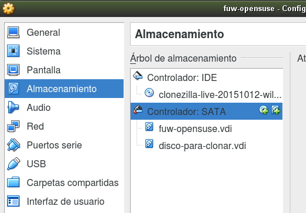

# Clonezilla device-device

Vamos a hacer una práctica de clonación usando el software Clonezilla.

# 1. Entrega

* Trabajar de forma individual.
* Entregar un informe del trabajo realizado acompañado de capturas
de pantalla/fotos de los pasos realizados.

# 2. Clonación

## 2.1 Preparamos el segundo disco

* Clonar una MV con OpenSUSE para usar en esta práctica.
* Añadir un 2º disco duro del mismo tamaño que el disco original (Puede ser un poco mayor, pero nunca menor).
    * VirtualBox -> Seleccionar MV.
    * Configuración -> Almacenamiento -> SATA.
    * Añadir disco duro.
* Descargar la ISO con Clonezilla del servidor Leela
(Descargar la más reciente).

## 2.2 Iniciamos Clonezilla

Iniciar la MV con la distro Clonezilla para realizar una clonación del tipo *device-device*.
* Elegimos la resolución.
* Elegimos idioma.
* Elegir mapa teclado -> querty -> Estándar -> Estándar.
* Start Clonezilla
* `device-device`

# 3. Configurar el gestor de arranque

Vamos a modificar el gestor de arranque para que detecte los dos SO instalados.

* Iniciar SO1.
* `cp /boot/grub2/grub.cgf /boot/grub2/grub.cgf.000`
* `grub2-mkconfig -o /boot/grub2/grub.cgf`
* Crear algunos archivos en /home/profesor/Documentos.
* Ejecutar el comando siguiente en el SO1: `df -hT`. Para comprobar que estamos en el SO1.

# 4. Comprobamos

* Reiniciar la MV.
* Iniciar el SO2,
* Ejecutar el comando siguiente en el SO2: `df -hT`. Para comprobar que estamos en el SO2.
* Comprobar que no hay ficheros en `/home/profesor/Documentos`.
