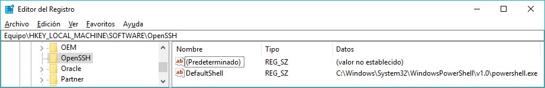

```
Autor   : Francisco Vargas Ruiz
Versión : v201711211859
```

---
# Acceso remoto con SSH en Windows 10 y Server

Vamos a ver dos formar de acceder vía SSH al SO Windows 10.

# 1. Introducción

El servidor SSH (Secure SHell) es un servicio similar a Telnet, de forma que permite que un usuario acceda de forma remota a un sistema GNU/Linux, con la particularidad de que, al contrario que Telnet, las comunicaciones entre el cliente y el servidor son encriptadas. Así, si un usuario malintencionado intercepta paquetes de datos entre el cliente y el servidor, será muy difícil que pueda extraer algo de información de dichos paquetes.

El servicio SSH ha tenido tanto éxito que Telnet prácticamente no se usa. De hecho, se recomienda usar siempre SSH en lugar de Telnet.

Para que un usuario se conecte a un sistema mediante SSH éste deberá disponer de un cliente SSH. Al establecer la conexión, mediante un proceso de encriptación asimétrica, las comunicaciones se encriptan, incluido el proceso de autentificación del usuario, cuando se proporciona el usuario y la contraseña. También se proporciona una clave de encriptación simétrica por su
menor necesidad de procesamiento.

---

# 2. Servidor SSH integrado en Windows 10

En Windows 10 dispone de un servidor SSH integrado: `Microsoft SSH Server for Windows`.
Debemos tener en cuenta que no se trata de un servidor SSH completo, con todas las características que cabría esperar de un
servicio de este tipo (no soporta todos los métodos de autenticación de un servidor SSH, compresión,...), pues está pensado para la comunicación entre dispositivos para cuestiones de depuración.

Otro de los inconvenientes es que es necesario cambiar nuestro sistema a `Modo Desarrollador` (Developer Mode), afectando
esto al nivel de aplicación de las políticas de seguridad del sistema, por lo que es conveniente leer bien cómo va a afectar esto a nuestro sistema antes de proceder a realizar este cambio.

## 2.1 Instalar el servicio SSH integrado

1. Abrir la aplicación `Configuración` de Windows.
2. Seleccionar `Actualización y Seguridad`.
3. Seleccionar en el panel de la izquierda `Para programadores`.
4. Cambiar a `Modo programador` (confirmar el cambio) y esperar que se descarguen e instalen los paquetes necesarios.
5. Una vez termina el proceso, reiniciar en caso necesario (si nos lo pide).
6. Activar la opción `Detección de dispositivos`.
7. Volver a desactivar la opción `Detección de dispositivos` (a no ser que queremos tenerla activada).

Este proceso habilita los servicios “SSH Server Broker” y “SSH Server Proxy”, que aceptarán conexiones TCP al puerto 22.

* `PS> Get-Service SshBroker,SshProxy`, para comprobar la existencia de estos dos nuevos servicios desde PowerShell.
* `CMD> netstat –anop tcp`, para comprobar que el puerto 22 está ahora levantado podemos ejecutar el siguiente comando.
* Mediante los siguientes comandos PowerShell podemos configurar los servicios anteriores para que se inicien automáticamente
(hacer como “Administrador):
```
PS> Set-Service –Name SshBroker –StartupType Automatic
PS> Set-Service –Name SshProxy –StartupType Automatic
```

## 2.2 Configurar usuarios para usar SSH

Los usuarios que quieran conectar de forma remota al servidor SSH integrado en Windows 10 deben pertenecer al grupo `Ssh
Users`. Desde la consola de administración de usuarios y grupos locales podremos añadir los usuarios a este grupo:
lusrmgr.msc

## 2.3 Inicio y parada manual de los servicios

* Para iniciar los servicios de forma manual es posible usar los siguientes comandos PowerShell: `PS> Start-Service SshBroker,SshProxy`
* Para detenerlos de forma manual, los siguientes comandos PS: `PS> Stop-Service SshBroker,SshProxy`
* Para consultar el estado de los servicios (Running/Stopped): `PS> Get-Service SshBroker,SshProxy`

## 2.4 Desactivar el servicio SSH

Para desactivar el servicio (no desinstalarlo) podemos “revertir” el proceso que seguimos al instalarlo:
1. Abrir la aplicación “Configuración” de Windows.
2. Seleccionar “Actualización y Seguridad”.
3. Seleccionar en el panel de la izquierda “Para programadores”.
4. Desactivar la opción “Detección de dispositivos” (si estuviera activada).
5. Cambiar de nuevo a “Aplicaciones de la Tienda de Windows”.

* `PS> Get-Service SshBroker,SshProxy`, comprobar el estado de los servicios.
* También podemos deshabilitar desde PowerShell los servicios anteriores para que no se inicien de ninguna forma (hacer como
“Administrador):
```
PS> Set-Service –Name SshBroker –StartupType Disable
PS> Set-Service –Name SshProxy –StartupType Disable
```

---

# 3. Servidor OpenSSH en Windows

Microsoft está trabajando en portar a Windows el servicio OpenSSH disponible en los sistemas UNIX/Linux. En el momento de
redactar este tutorial está disponible la versión v0.0.23.0 de este servicio.
AVISO: Se trata aún de una versión de prueba (test release) y no es recomendable su uso en sistemas en producción.

## 3.1 Instalar el servicio

Para instalarlo seguimos los siguientes pasos:

1. Descargar la última versión de [OpenSSH-Win64.zip](https://github.com/PowerShell/Win32-OpenSSH/releases/latest/).
2. Descomprimir en `C:\Program files\OpenSSH`. En caso de haber descargado la versión de 32 bits (OpenSSH-Win32), extraer el contenido del ZIP en `C:\Program files\OpenSSH (x86)`.
3. `PS> cd ‘C:\Program files\OpenSSH’`, Iniciar PowerShell como Administrador y movernos hasta `C:\Program files\OpenSSH`:
4. Ejecutar el script para instalar los servicios “sshd” y “ssh-agent”:
```
PS> Set-ExecutionPolicy –ExecutionPolicy Bypass
PS> .\install-sshd.ps1
```
5. Al terminar debe indicar que los servicios se han instalado de forma satisfactoria. Podemos comprobar que se han
instalado los servicios con el siguiente comando: `PS> Get-Service sshd,ssh-agent`
6. Generar las claves (certificados) del servidor:
```
PS> .\ssh-keygen.exe –A
PS> .\FixHostFilePermissions.ps1 -Confirm:$false
```
7. Habilitar la regla de nombre “SSH” en el Firewall de Windows para permitir (Allow) conexiones TCP entrantes
(Inbound) en el puerto 22 (SSH): `PS> New-NetFirewallRule -Protocol TCP -LocalPort 22 -Direction Inbound -Action Allow -DisplayName SSH`
8. Configuramos los servicios para que inicien automáticamente:
```
PS> Set-Service sshd -StartupType Automatic
PS> Set-Service ssh-agent -StartupType Automatic
```
9. Iniciamos el servicio: `PS> Start-Service sshd`

## 3.2 Configurar la Shell por defecto

Es posible configurar el intérprete de comandos (Shell) que se ejecutará cuando nos conectemos de forma remota al servidor SSH en Windows. Las Shell más comunes en Windows son el “Símbolo del sistema” (cmd.exe) y PowerShell (powershell.exe).

Para hacerlo debemos realizar la siguiente modificación en el “Registro de Windows”:
1. Abrimos el “Editor del Registro” de Windows (regedit.exe).
2. Nos desplazamos hasta la clave `Equipo\HKEY_LOCAL_MACHINE\SOFTWARE`.
3. Creamos la clave “OpenSSH”.
4. Dentro de la clave “OpenSSH”, creamos un “Valor de cadena” (REG_SZ) con el nombre “DefaultShell” y cuyo valor es
la ruta al ejecutable de PowerShell:
`C:\Windows\System32\WindowsPowerShell\v1.0\powershell.exe”`

Al terminar el proceso, el “Registro de Windows” debe quedar de la siguiente forma:


Ahora, en la próxima conexión por SSH al servidor se iniciará por defecto PowerShell en vez del “Símbolo del sistema”.

* Asegurarse de que el servicio OpenSSH está iniciado.
* Asegurarse de que l cortafuegos permite el acceso al Servicio OpenSSH.

## 3.3 Desinstalar el servicio

Para desinstalar el servidor OpenSSH de Windows seguimos los siguientes pasos:
* Iniciar PowerShell como Administrador y movernos hasta “C:\Program files\OpenSSH”:
`PS> cd ‘C:\Program files\OpenSSH’``
* Ejecutar el script para desinstalar los servicios “sshd” y “ssh-agent”:
```
PS> Set-ExecutionPolicy –ExecutionPolicy Bypass
PS> .\uninstall-sshd.ps1
```
* Al terminar debe indicar que los servicios se han desinstalado de forma satisfactoria.

---

# 4. Servidor FTP seguro con OpenSSH

OpenSSH también incorpora un servidor FTP seguro (stfp-server.exe). Para activar el servidor FTP
seguro tan solo hay que tener arrancado el servidor SSH y tener activada la siguiente línea en el
fichero de configuración `C:\Program files\OpenSSH\sshd_config`

`Subsystem   sftp   sftp-server.exe`

Para deshabilitarlo comentamos la línea anterior poniendo una “#” (almohadilla) al principio de la línea:

`# Subsystem   sftp   sftp-server.exe`

Destacar que cada vez que cambiemos algo en el fichero de configuración “sshd_config” es
necesario reiniciar el servidor, lo que podemos hacer desde PowerShell como “Administrador”:
`PS> Restart-Service sshd`

> AVISO: Es necesario abrir el fichero “sshd_config” como “Administrador” para poder modificarlo.

---

# 5. Conexión al servidor mediante SSH y SFTP

## 5.1 Cliente GNU/Linux

* Si no estuviera disponible, podríamos instalarlo con el siguiente comando:
`$ sudo apt-get install openssh-client`

## 5.2 Cliente Windows

### 5.2.1 Desde la Interfaz gráfica
* En el caso de Windows, podemos utilizar el cliente SSH PuTTY desde la interfaz gráfica, disponible para su descarga de forma gratuita en el siguiente enlace: http://www.putty.org/.
* Para conectar al servidor SFTP podemos utilizar el cliente FileZilla: https://filezilla-project.org/.

### 5.2.2 Desde el Símbolo del sistema

Igualmente, es posible disponer en Windows de los mismos clientes OpenSSH que tenemos en GNU/Linux (“ssh” y “sftp”), para
lo que seguimos los siguientes pasos:
* Descargar la última versión (OpenSSH-Win64.zip) del siguiente enlace: https://github.com/PowerShell/Win32-
OpenSSH/releases/latest/
* Descomprimir en “C:\Program files\OpenSSH”. En caso de haber descargado la versión de 32 bits (OpenSSH-Win32), extraer el contenido del ZIP en “C:\Program files (x86)\OpenSSH”.
* Para que los comandos cliente de OpenSSH (ssh y sftp) estén disponibles desde el “Símbolo del sistema” debemos añadir
su ruta a la variable PATH del sistema:
    * Abrimos la ventana “Sistema” (WIN + PAUSA).
    * Pulsamos “Configuración avanzada del sistema” en el panel de la izquierda.
    * Pestaña “Opciones avanzadas” y pulsamos botón “Variables de entorno...”.
    * En la ventana “Variables de entorno” editamos la variable del sistema “Path”.
    * Añadimos la ruta donde extrajimos OpenSSH, en nuestro caso “C:\Program files\OpenSSH”.
* Cliente SSH con el comando “ssh” de OpenSSH
    * Para conectar al servidor mediante el cliente SSH de OpenSSH ejecutamos el siguiente comando desde el “Símbolo del sistema”: `CMD> ssh usuario@equipo`
    * Donde “usuario” es el nombre del usuario en el equipo remoto y “equipo” es la dirección IP o nombre del servidor.
* Cliente FTP seguro con el comando “sftp” de OpenSSH
    * Para conectar al servidor mediante el cliente SFTP de OpenSSH ejecutamos el siguiente comando desde el “Símbolo del sistema”: `CMD> sftp usuario@equipo`.
    * Los comandos son similares a los de un cliente FTP normal: get, put, mkdir, rm, cd, lcd, etc.

> NOTA: Los comandos “ssh” y “sftp” no funcionan bien en PowerShell.

* Copia remota de archivos con el comando “scp” de OpenSSH
    * También disponemos del comando “scp” que permite copiar archivos desde y hacia el servidor remoto en el cliente.
    * Para copiar un archivo del servidor al cliente: `CMD> scp usuario@equipo:rutaRemota rutaLocal`
    * Para copiar un archivo del cliente al servidor: `CMD> scp rutaLocal usuario@equipo:rutaRemota`
    * Por ejemplo, si queremos copiar el archivo “documento.pdf” (que está en nuestro directorio actual en el cliente) al directorio personal del usuario “fran” (C:\Users\fran) del servidor cuya IP es 192.168.1.36, ejecutaremos el siguiente comando: `CMD> scp documento.pdf fran@192.168.1.36:.``
    * En este caso “.” hace referencia al directorio del usuario “fran” en el servidor, pero podría ser otra ruta.
En caso de copiar un fichero del servidor al cliente, sólo es necesario invertir los parámetros:
`$ scp fran@192.168.1.36:documento.pdf`.

---

# ANEXO

# 6. Autenticación mediante certificado

Para evitar tener que introducir la contraseña continuamente cuando queremos conectar al servidor remoto por SSH,
existe la posibilidad de autenticarse por certificado. Para ello es necesario:
* Crear un certificado de usuario en el cliente, que estará formado por 2 claves (pública y privada)
* Copiar la clave pública del certificado del usuario del cliente al servidor.

Para que el servidor SSH acepte la autenticación por medio de certificado es necesario tener activada
la opción `PubkeyAuthentication yes` en el fichero de configuración del servidor `C:\Program files\OpenSSH\sshd_config`.

NOTA: No olvides reiniciar el servidor SSH después de cambiar el fichero de configuración.

## 6.1 Crear un certificado de usuario en el cliente

Para crear un certificado que permita autenticar al usuario, debemos ejecutar el comando “ssh-keygen”.
Dicho comando creará dentro de nuestro directorio personal (C:\Users\<usuario>) la carpeta “.ssh” con dos archivos:

* id_rsa : clave privada del certificado
* id_rsa.pub: clave pública del certificado

Esta última será la que hay que copiar en el servidor:
```
CMD> ssh-keygen –t rsa
Generating public/private rsa key pair.

Enter file in which to save the key (C:\Users\<usuario>/.ssh/id_rsa):
Enter passphrase (empty for no passphrase):
Enter same passphrase again:

Your identification has been saved in C:\Users\<usuario>/.ssh/id_rsa.
Your public key has been saved in C:\Users\<usuario>/.ssh/id_rsa.pub.

The key fingerprint is:
SHA256:cO5LR4q9IdfKOQz9tbtKaFlN04cAL8N8JCEgmk++Mcw <usuario>@<equipo>@<equipo>
The key's randomart image is:
+----[SHA256]-----+
```

> NOTA: en nuestro caso estamos generando un certificado de tipo RSA.

## 6.2 Copiar el certificado en el servidor

Para poder identificarse en el servidor desde el cliente mediante certificado,
debemos copiar el archivo “id_rsa.pub” (la clave pública del certificado) desde el cliente
al directorio personal del usuario en el servidor, dentro del directorio “.ssh” y con el
nombre “authorized_keys” (porque así está configurado en el servidor por defecto):

`CMD> scp C:\Users\<usuario>\.ssh\id_rsa.pub <usuario>@<equipo>:.\.ssh\authorized_keys`

Tener en cuenta que es necesario crear previamente el directorio “.ssh” en el directorio personal del usuario en el servidor:
`CMD> md C:\Users\<usuario>\.ssh`


> ATENCION: Cualquiera que tenga acceso a la clave privada (fichero “id_rsa”) podrá autenticarse en el servidor, por lo
que es conveniente poner una contraseña a la hora de crear el certificado en el paso anterior.

> NOTA: Esto también se puede hacer copiando el fichero “id_rsa.pub” del cliente en un pendrive y luego copiarlo en el
servidor desde el pendrive, pero con “scp” queda más PRO ;-D
Otros parámetros de interés

Algunos de los parámetros que podemos configurar en el servidor mediante su fichero “C:\Program files\OpenSSH\sshd_config”,
son los siguientes:
```
# El puerto que abre el servidor (por defecto para SSH es el 22)
Port 22
# Dirección de la interfaz o interfaces de red a través de las que escucha el servidor SSH
# (0.0.0.0 significa todas las interfaces); ej.: 127.0.0.1 = sólo acceso a través de interfaz localhost
Listen 0.0.0.0
# Usuarios que pueden conectar por SSH
# (si indicamos sólo el nombre del usuario indica cualquier máquina,
# si se especifica usuario@ip, se refiere a ese usuario desde esa IP)
AllowUsers fran remoto chuck@10.0.0.2
# Grupos permitidos (igual que antes pero con grupos de usuarios)
AllowGroups usuarios empleados@10.0.0.2
# Deniega el acceso a usuarios (más restrictivo que Allow)
DenyUsers juan pepe
# Deniega el acceso a los usuarios de un grupo (más restrictivo que Allow)
DenyGroups gandules
# Muestra el mensaje del dia (MOTD) tras iniciar sesión
PrintMotd yes
# Muestra el contenido del fichero C:\Program files\OpenSSH\bienvenida.txt al conectar al servidor
Banner C:\Program files\OpenSSH\bienvenida.txt
```

---

# 7. Alternativas a OpenSSH en Windows

Servidores
* FreeSSHd: http://www.freesshd.com/
* KpyM: http://www.kpym.com/2/kpym/index.htm
Clientes
* WinSCP: https://winscp.net/eng/docs/lang:es
Referencias
* How-to enable, login to, or disable Microsoft SSH Server in Windows 10: https://www.ctrl.blog/entry/how-to-win10-ssh-service#section-mssshserv-security
* Install Win32 OpenSSH: https://github.com/PowerShell/Win32-OpenSSH/wiki/Install-Win32-OpenSSH
* Setup a free SSH server on Windows 7 https://www.techrepublic.com/blog/tr-dojo/set-up-a-free-ssh-server-on-windows-7-with-freesshd/

----

# ANEXO

## 3. Windows con Servidor SSH con CopSSH

* Descargar la versión Free del programa [CopSSH](https://www.itefix.net/copssh).
* Instalar con las opciones por defecto.
* Configurar el usuario siguiente:
    * Crear usuario `sysadmingame` dentro del grupo `Administradores`.
    * Clave de `sysadmingame` conocida por el alumno y el profesor.
    * Shell: `Linux Shell + SFTP`
* Para comprobar el acceso remoto SSH, vamos a la máquina real
y ejecutamos:
    * `ssh sysadmingame@ip-de-la-mv` para entrar en la MV
