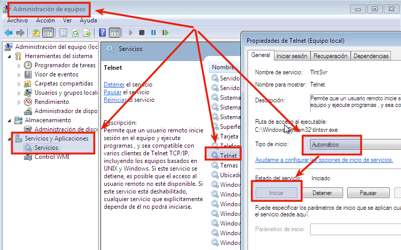
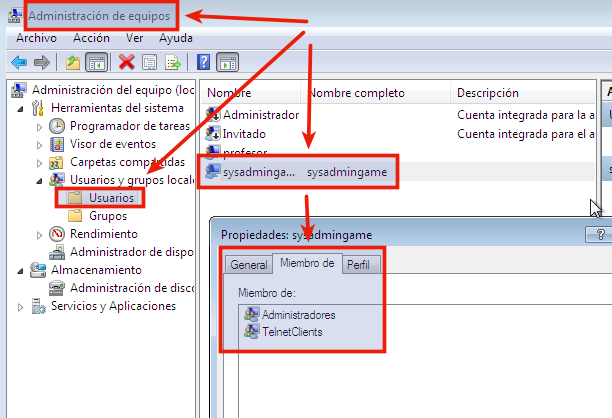
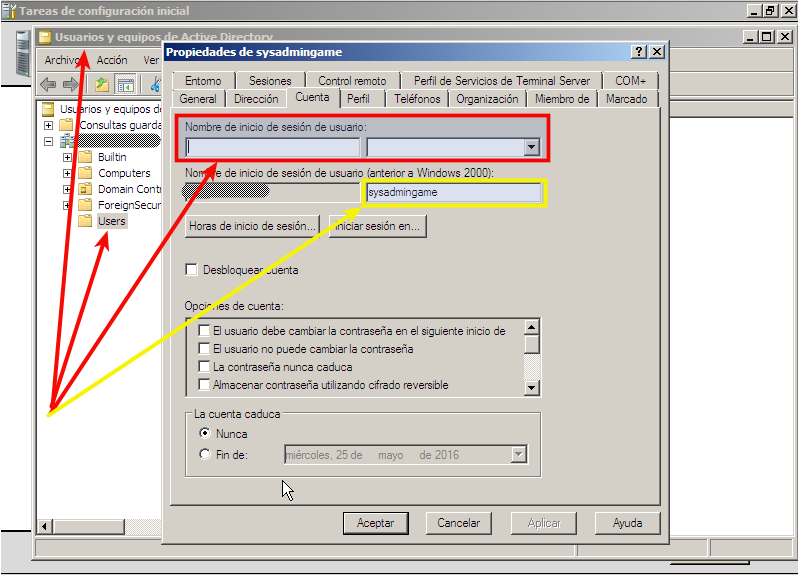
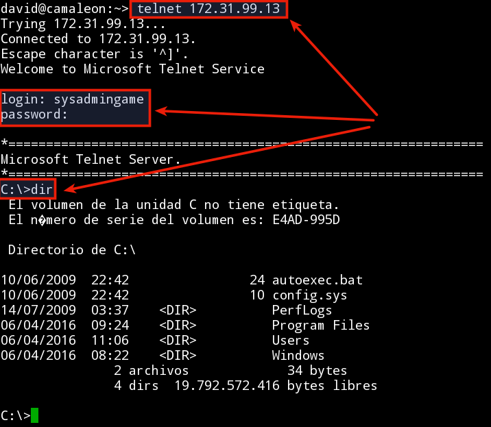

```
* Creado en Marzo 2016 para el curso1516
```

#1. Configurar acceso remoto en Windows7/Windows2008Server

##1.1. Servidor SSH con CopSSH

* Descargar la versión Free del programa [CopSSH](https://www.itefix.net/copssh).
* Instalar con las opciones por defecto.
* Configurar el usuario siguiente:
    * Crear usuario `sysadmingame` dentro del grupo `Administradores`.
    * Clave de `sysadmingame` conocida por el alumno y el profesor.
    * Shell: `Linux Shell + SFTP`

##1.2. Servidor Telnet

* Instalar: Ir a `Panel de Control`->`Instalar Características de Windows`->`Servidor Telnet`.


* Configurar: Ir a `Equipo`->(btn derecho)->`Administrar`->`Servicios`->`Telnet`->`Propiedades`:
    * `Automático`->`Aplicar`
    * `Iniciar`->`Aceptar`
        


* Usuario/clave
   * Crear usuario `sysadmingame` dentro de los grupos `Administradores` y `TelnetClients`.
   * Clave de `sysadmingame` conocida por el alumno y el profesor.



* Cuando tenemos un Windows Server con Directorio Activo podemos crear usuarios del dominio,
pero también usuarios locales. Para crear un usuario local cuando tenemos AD hacemos lo siguiente:
    * Vamos a `USUARIOS Y EQUIPOS DE ACTIVE DIRECTORY -> USERS`
    * Hacemos "click" en `CUENTA`y vemos nuestro nombre de usuario y dominio.
    * Borramos el `Nombre de inicio de sesión`, y se borrará automaticamente el dominio. 
    * Reiniciamos y ya tenemos el usuario en local y NO en dominio.
    * Consultar imagen de ejemplo:
    


* Comprobamos el acceso al servicio Telnet desde otra máquina 
(Por ejemplo la máquina real) con `telnet IP-HOST-WINDOWS`.



* Enlaces de interés:
    * [Vídeo : Configurar un servicio de servidor telnet en Windows 7 con permisos a usuarios](https://www.youtube.com/watch?v=oLnf8MICrL4) 

#2. Configurar las máquinas virtuales


##2.1 Configuración Windows 7 Professional

Configuración de la máquina Windows 7 Professional:
* IP: `172.19.XX.11` (Donde XX corresponde al nº de cada puesto).
    * Si tenemos varias máquinas usaremos las IP 172.19.XX.12, 172.19.XX.13, etc.
    * Máscara de red: `255.255.0.0`
    * Gateway: `172.19.0.1`
    * Servidor DNS: `8.8.4.4`
* Nombre de equipo: `primer-apellido-del-alumno+XXw`.
    * Por ejemplo: vargas30w
    * El nombre NetBIOS sólo puede tener 16 caractéres.
    * Si tenemos varias máquinas las llamaremos vargas30w, vargas30x, vargas30y, etc.
* Los nombres de usuario, máquina y dominio deben estar en minúsculas.
Sin usar caracteres especiales como ñ, tildes, espacios, etc.
* Grupo de trabajo: `curso1516`
* Tarjeta de red VBox en modo puente.
* Instalar el servidor Telnet (consultar más arriba)

Capturar imágenes de las configuraciones.
```
date
ipconfig
route PRINT
nslookup www.iespuertodelacruz.es
ping 8.8.4.4
``` 

> **Periodo de pruebas**
>
> Una vez instalado el SO Windows 7 disponemos de unos 30 días trabajar con el sistema,
antes de que pase al estado *"Copia ilegal"*.
>
> Al finalizar este plazo de tiempo podemos:
>
> 1. Activar el SO introduciendo un código de activación válido.
> 2. Renovar el perido de pruebas por 30 días más, mediante el comando: `slmgr -rearm`. 
Podemos renovar varias veces, pero el tiempo máximo que podemos usar el SO antes de activarlo
es de 90 días.
>

##2.2 Configuración Windows 2008 Server

Configuración de la máquina Windows 2008 Server Enterprise:
* IP: `172.19.XX.21` (Donde XX corresponde al nº de cada puesto).
    * Si tenemos varias máquinas usaremos las IP 172.19.XX.22, 172.19.XX.23, etc.
    * Máscara de red: `255.255.0.0`
    * Gateway: `172.19.0.1`
    * Servidor DNS1: `127.0.0.1`
    * Servidor DNS2: `8.8.4.4`
* Nombre de equipo: `primer-apellido-del-alumno+XXs`.
    * Por ejemplo: vargas30s.
    * El nombre NetBIOS sólo puede tener 16 caractéres.
    * Si tenemos varias máquinas las llamaremos vargas30s, vargas30t, vargas30u, etc.
* Los nombres de usuario, máquina y dominio deben estar en minúsculas.
Sin usar caracteres especiales como ñ, tildes, espacios, etc.
* Grupo de trabajo: `curso1516`
* Nombre de dominio: `segundo-apellido-del-alumno+XXdom.c1516`.
* Tarjeta de red VBox en `modo puente`.
* Instalar el servidor Telnet (consultar más arriba)

Capturar imágenes de las configuraciones.

``` 
date
ipconfig
route PRINT
nslookup www.iespuertodelacruz.es
ping 8.8.4.4
```  

> **Periodo de pruebas**
>
> Una vez instalado el SO Windows 2008 Server disponemos de unos 60 días trabajar con el sistema,
antes de que pase al estado *"Copia ilegal"*.
> Al finalizar este plazo de tiempo podemos:
> 1. Activar el SO introduciendo un código de activación válido.
> 2. Renovar el perido de pruebas por 60 días más, mediante el comando: `slmgr -rearm`. 
Podemos renovar varias veces, pero el tiempo máximo que podemos usar el SO antes de activarlo
es de 180 días.
>

##2.3 Configuración GNU/Linux OpenSUSE 13.2

* IP: `172.19.XX.31` (Donde XX corresponde al nº de cada puesto).
    * Si tenemos varias máquinas usaremos las IP 172.19.XX.32, 172.19.XX.33, etc.
    * Máscara de red: `255.255.0.0`
    * Gateway: `172.19.0.1`
    * Servidor DNS: `8.8.4.4`
* Nombre de equipo: `primer-apellido-del-alumnoXXg`.
    * Por ejemplo vargas30g
    * Si tenemos varias máquinas las llamaremos vargas30g, vargas30h, vargas30i, etc.
* Nombre de dominio: `curso1516`.
* Tarjeta de red VBox en `modo puente`.
* Los nombres de usuario, máquina y dominio deben estar en minúsculas.
Sin usar caracteres especiales como ñ, tildes, espacios, etc.

Además también:
* Asegurarse de que el nombre de host está correctamente en el fichero /etc/hosts. 
Para que el comando hostname funcione bien.
* Programa SSH server:
    * Para veriguar si lo tenemos instalado: `zypper search openssh`
    * Instalar openssh-server para que el profesor pueda acceder 
    de forma remota:`zypper install openssh`.
    * Modificar el fichero `/etc/ssh/sshd_config` y cambiar 
    `PermitRootLogin yes`. La línea debe estar descomentada.
    * Reiniciar el servicio: `service ssh restart`

Capturar imágen de la configuración del equipo:
```
date
uname -a
hostname -f
hostname -a
hostname -d
tail -n 5 /etc/passwd
ip a
route -n
host www.iespuertodelacruz.es
ping 8.8.4.4
blkid
```

> **Guest Additions**
>
> * En la consola como root, `zypper in kernel-devel kernel-desktop-devel gcc make`
> * Reiniciar equipo
> * VirtualBox -> Instalar Guest Additions
> * En la consola como root
>     * `cd /run/media/....`
>     * `./VBoxLinux...`
> * Reiniciar el equipo si todo va bien.

##2.4 Configuración GNU/Linux Debian 8

* IP: `172.19.XX.41` (Donde XX corresponde al nº de cada puesto).
    * Si tenemos varias máquinas usaremos las IP 172.19.XX.42, 172.19.XX.43, etc.
    * Máscara de red: `255.255.0.0`
    * Gateway: `172.19.0.1`
    * Servidor DNS: `8.8.4.4`
* Nombre de equipo: `primer-apellido-del-alumnoXXg`.
    * Por ejemplo vargas30g
    * Si tenemos varias máquinas las llamaremos vargas30g, vargas30h, vargas30i, etc.
* Nombre de dominio: `curso1516`.
* Tarjeta de red VBox en `modo puente`.
* Los nombres de usuario, máquina y dominio deben estar en minúsculas.
Sin usar caracteres especiales como ñ, tildes, espacios, etc.

Además también:
* Asegurarse de que el nombre de host está correctamente en el fichero /etc/hosts. 
Para que el comando hostname funcione bien.
* Programa SSH server:
    * Para averiguar si lo tenemos instalado: `dpkg -l openssh*`.
    * Instalar openssh-server para que el profesor pueda acceder 
    de forma remota:`apt-get install openssh-server`.
    * Modificar el fichero `/etc/ssh/sshd_config` y cambiar 
    `PermitRootLogin yes`.
    * Reiniciar el servicio: `service ssh restart`

Capturar imágen de la configuración del equipo:
```
date
uname -a
hostname -f
hostname -a
hostname -d
tail -n 5 /etc/passwd
ip a
route -n
host www.iespuertodelacruz.es
ping 8.8.4.4
blkid
```

##2.4.1 Ficheros de configuración Debian/Ubuntu

En máquinas Debian/Ubuntu podemos cambiar la configuración de red, 
modificando el fichero `/etc/network/interfaces`.

Veamos un ejemplo, donde se configura el interfaz eth0 estático y el eth1 dinámico:
```
auto lo
iface lo inet loopback

auto eth0
iface eth0 inet static
  address 172.16.108.240
  netmask 255.255.0.0
  gateway 172.16.1.1
  dns-nameservers 172.16.108.40 172.16.1.1
  dns-search vargas1w.idp vargas1w
  dns-domain vargas1w.idp

auto eth1
iface eth1 inet dhcp
```

Si tuviéramos problemas con resolvconf podemos reconfigurarlo con:
```
sudo rm /etc/resolv.conf
sudo dpkg-reconfigure resolvconf
```

##2.4.2 Instalar las Guest Addittions

Antes de intalar las Guest Additions, es  mejor verificar que no hace falta.
Si la ventana de la MV se redimensiona bien, funciona el pendrive, y las carpetas compartidas
con el host anfitrión, entonces no hace falta instalar nada.

En caso contrario haremos:
* Ubuntu: Ir a VBox -> Dispositivos -> Instalar.
* Debian/LUbuntu:
    * Ir a VBox -> Dispositivos -> Instalar.
    * Abrir consola como super usuario: `apt-get -y install make gcc linux-headers-$(uname -r)`.
    * Una vez terminada la instalación comprobar que no aparecen mensajes de error.
    * Buscar donde está montado VBOXADDITIONS (`df -hT`), y moverse a dicho directorio.
    * Ejecutar el programa de instalación para linux: `./VBoxLinuxAddittions.run`

#ANEXO

#A.1 Instalación del servidor SSH en windows7

* (Recomendado) CopSSH
* [FreeSSHD en Windows7](http://www.redeszone.net/windows/freesshd-para-windows-instalacion-y-manual-de-configuracion-de-freesshd-para-windows-servidor-ssh-y-sftp/)
* [OpenSSH en Windows7](http://wiki.elhacker.net/redes/windows/instalacion-y-configuracion-de-un-servidor-ssh-en-windows)
    * Instalar Firefox
    * [Descargar el instalador](https://sourceforge.net/projects/sshwindows/files/OpenSSH%20for%20Windows%20-%20Release/3.8p1-1%2020040709%20Build/setupssh381-20040709.zip/download)
    * Descomprimir y ejecutar.
* [OpenSSH en Windows7](http://linuxbsdos.com/2015/01/17/how-to-install-the-latest-openssh-on-windows-7-and-windows-8/)
* [Cygwin+SSH server en Windows7](http://www.taringa.net/post/linux/15562479/Configuracion-de-OpenSSH-en-Windows-7-SSH-Cygwin-Putty.html)


