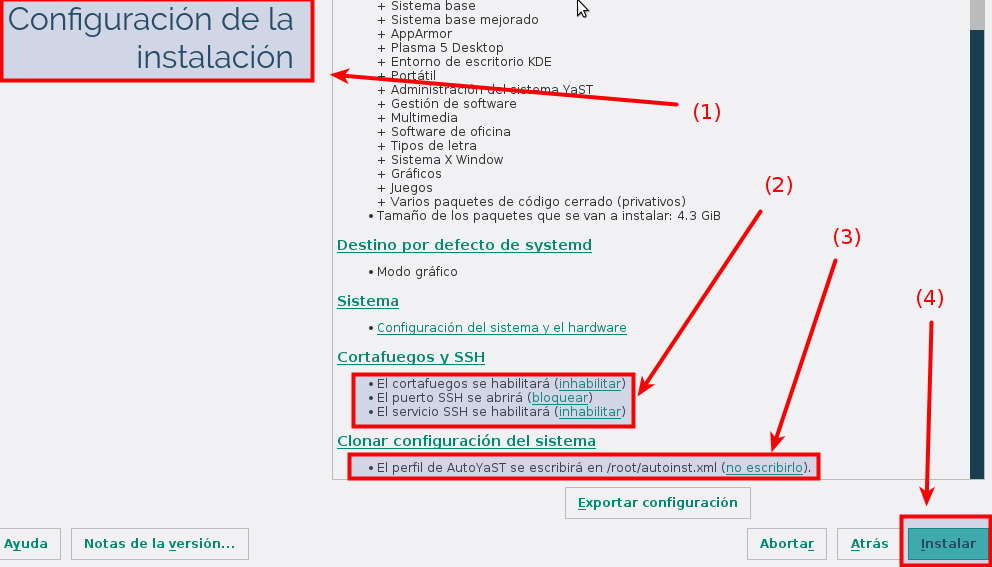

```
* Creado en Marzo 2016 para el curso1516
* Configuración de las MV del aula 109
```

Otros documentos
* [Configurar acceso remoto](acceso-remoto.md)
* [Configurar VirtualBox](virtualbox.md)

#Configurar las máquinas virtuales

##1. Configuración Windows 7 Professional

Configuración de la máquina Windows 7 Professional:
* IP: `172.19.XX.11` (Donde XX corresponde al nº de cada puesto).
    * Si tenemos varias máquinas usaremos las IP 172.19.XX.12, 172.19.XX.13, etc.
    * Máscara de red: `255.255.0.0`
    * Gateway: `172.19.0.1`
    * Servidor DNS: `8.8.4.4`
* Nombre de equipo: `primer-apellido-del-alumno+XXw`.
    * El nombre de equipo se cambia en `Inicio -> Equipo -> (Botón derecho) -> Propiedades`
    * Por ejemplo: vargas30w
    * El nombre NetBIOS sólo puede tener 16 caractéres.
    * Si tenemos varias máquinas las llamaremos vargas30w, vargas30x, vargas30y, etc.
* Los nombres de usuario, máquina y dominio deben estar en minúsculas.
Sin usar caracteres especiales como ñ, tildes, espacios, etc.
* Grupo de trabajo: `curso1516`
* Tarjeta de red VBox en modo puente.
* Instalar el servidor Telnet (consultar más arriba)

Capturar imágenes de las configuraciones desde *PowerShell*.
```
date
hostname
ipconfig
route PRINT
nslookup www.iespuertodelacruz.es
ping 8.8.4.4
```

> **Periodo de pruebas**
>
> Una vez instalado el SO Windows 7 disponemos de unos 30 días trabajar con el sistema,
antes de que pase al estado *"Copia ilegal"*.
>
> Al finalizar este plazo de tiempo podemos:
>
> 1. Activar el SO introduciendo un código de activación válido.
> 2. Renovar el perido de pruebas por 30 días más, mediante el comando: `slmgr -rearm`.
Podemos renovar varias veces, pero el tiempo máximo que podemos usar el SO antes de activarlo
es de 90 días.
>

##2. Configuración Windows 2008 Server

Configuración de la máquina Windows 2008 Server Enterprise:
* IP: `172.19.XX.21` (Donde XX corresponde al nº de cada puesto).
    * Si tenemos varias máquinas usaremos las IP 172.19.XX.22, 172.19.XX.23, etc.
    * Máscara de red: `255.255.0.0`
    * Gateway: `172.19.0.1`
    * Servidor DNS1: `127.0.0.1`
    * Servidor DNS2: `8.8.4.4`
* Nombre de equipo: `primer-apellido-del-alumno+XXs`.
    * Por ejemplo: vargas30s.
    * El nombre NetBIOS sólo puede tener 16 caractéres.
    * Si tenemos varias máquinas las llamaremos vargas30s, vargas30t, vargas30u, etc.
* Grupo de trabajo: `curso1516`

> En el caso de tener un PDC, pondremos como nombre de dominio `segundo-apellido-del-alumno+XXdom.c1516`.

* Usuarios:
    * Un usuario identificado con `nombre-del-alumno`.
    * Poner al usuario `root` la clave del alumno con la letra en minúscula.

> **ATENCIÓN**
>
> * Los nombres de usuario, máquina y dominio deben estar en minúsculas.
Sin usar caracteres especiales como ñ, tildes, espacios, etc.

* Tarjeta de red VBox en `modo puente`.
* Instalar el servidor Telnet (consultar más arriba)

Capturar imágenes de las configuraciones.

```
date
ipconfig
ping 8.8.4.4
nslookup www.iespuertodelacruz.es
```  

> **Periodo de pruebas**
>
> Una vez instalado el SO Windows 2008 Server disponemos de unos 60 días trabajar con el sistema,
antes de que pase al estado *"Copia ilegal"*.
> Al finalizar este plazo de tiempo podemos:
> 1. Activar el SO introduciendo un código de activación válido.
> 2. Renovar el perido de pruebas por 60 días más, mediante el comando: `slmgr -rearm`.
Podemos renovar varias veces, pero el tiempo máximo que podemos usar el SO antes de activarlo
es de 180 días.
>

##3. Configuración GNU/Linux OpenSUSE 13.2

###3.1 Durante la instalación
Podemos configurar algunos aspectos de openSUSE durante la instalación:



###3.2 Con el sistema operativo instalado
Una vez instalado el sistema operativo, podemos hacer cambios en la configuración,
usando la herramienta `Inicio -> Configuración -> Yast`. Luego iremos a la
opcion de `Ajustes de red`.

###3.3 Configuración del equipo

La configuración de red se cambia en `Inicio -> Yast -> Ajustes de red`.

Vamos a `Vista resumen -> Interfaz -> Editar`
* Marcamos IP fija.
* IP: `172.19.XX.31` (Donde XX corresponde al nº de cada puesto).
    * Si tenemos varias máquinas usaremos las IP 172.19.XX.32, 172.19.XX.33, etc.
    * Máscara de red: `255.255.0.0`
* Siguiente

Vamos a `Nombre de Host/DNS` y ponemos:
* Desmarcamos `Modificar nombre mediante DHCP`
* Marcamos `Asignar nombre de host a la IP bucle local`
* Nombre de equipo: `primer-apellido-del-alumnoXXg`.
    * Por ejemplo vargas30g
    * Si tenemos varias máquinas las llamaremos vargas30g, vargas30h, vargas30i, etc.
* Nombre de dominio: `curso1617`.
* Servidor DNS: `8.8.4.4`
Vamos a `Encaminamiento`y ponemos:
* Gateway o pasarela IPv4: `172.19.0.1`. Esto es la puerta de enlace o encaminamiento.
* Ir dispositivo y elegir interfaz de red.
* Usuarios:
    * Un usuario identificado con `nombre-del-alumno`.
    * Poner al usuario `root` la clave del alumno con la letra en minúscula.

> **ATENCIÓN**
>
> * Los nombres de usuario, máquina y dominio deben estar en minúsculas.
Sin usar caracteres especiales como ñ, tildes, espacios, etc.
> * Asegurarse de que el nombre de host está correctamente en el fichero `/etc/hosts`.
Para que el comando hostname funcione bien.

Virtual Box:
* Tarjeta de red VBox en `modo puente`.


Capturar imágen de la configuración del equipo:
```
date
uname -a
hostname -f #Muestra nombre-maquina.nombre-dominio
hostname -a #Muestra nombre-maquina
hostname -d #Muestra nombre-dominio

tail -n 5 /etc/passwd
ip a
route -n
ping 8.8.4.4
host www.iespuertodelacruz.es
blkid
```

##4. Configuración GNU/Linux Debian 8

* IP: `172.19.XX.41` (Donde XX corresponde al nº de cada puesto).
    * Si tenemos varias máquinas usaremos las IP 172.19.XX.42, 172.19.XX.43, etc.
    * Máscara de red: `255.255.0.0`
    * Gateway: `172.19.0.1`
    * Servidor DNS: `8.8.4.4`
* Nombre de equipo: `primer-apellido-del-alumnoXXg`.
    * Por ejemplo vargas30g
    * Si tenemos varias máquinas las llamaremos vargas30g, vargas30h, vargas30i, etc.
* Nombre de dominio: `curso1516`.
* Tarjeta de red VBox en `modo puente`.
* Usuarios:
    * Un usuario identificado con `nombre-del-alumno`.
    * Poner al usuario `root` la clave del alumno con la letra en minúscula.

> **ATENCIÓN**
>
> * Los nombres de usuario, máquina y dominio deben estar en minúsculas.
Sin usar caracteres especiales como ñ, tildes, espacios, etc.
> * Fichero `/etc/hostname`
>     * Ponemos el `nombre-maquina.nombre-dominio`
>     * Por ejemplo: `vargas116g.curso1617`
> * Fichero `/etc/hosts`.
>     * Asegurarse de que hay una línea con `ip nombre-de-host`
>     * Por ejemplo: `127.0.0.2   vargas116g.curso1617   vargas116g`

Capturar imágen de la configuración del equipo:
```
date
uname -a
hostname -f           #Muestra nombre-maquina.nombre-dominio
hostname -a           #Muestra nombre-maquina
hostname -d           #Muestra nombre-dominio

tail -n 5 /etc/passwd #Comprobar que existe el usuario
id nombre-de-usuario  #Comprobar que existe el usuario
ip a
route -n
ping 8.8.4.4
host www.iespuertodelacruz.es
blkid
```

##4.1 Ficheros de configuración Debian/Ubuntu

* En máquinas Debian/Ubuntu podemos cambiar la configuración de red,
modificando el fichero `/etc/network/interfaces`.
* Para averiguar los nombres de nuestras interfaces usamos `ip a` o `ifconfig`.
* Veamos un ejemplo, donde se configura el interfaz eth0 estático y el eth1 dinámico:
```
auto lo
iface lo inet loopback

auto eth0
iface eth0 inet static
  address 172.19.XX.41
  netmask 255.255.0.0
  gateway 172.19.0.1
  dns-nameservers 8.8.4.4
  dns-search vargas116g.curso1617 vargas116g
  dns-domain vargas116g.curso1617

auto eth1
iface eth1 inet dhcp
```
* Para que se tengan en cuenta los cambios podemos:
   * `service networking restart` o
   * Reiniciar el equipo.

> Si tuviéramos problemas con resolvconf podemos reconfigurarlo con:
> * `sudo rm /etc/resolv.conf`
> * `sudo dpkg-reconfigure resolvconf`
