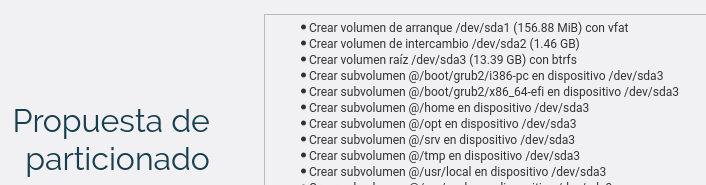
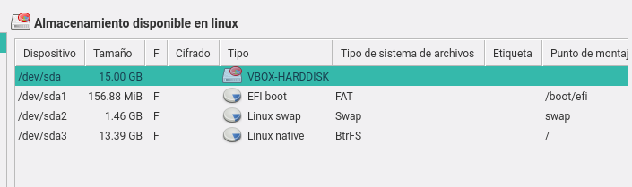

> Otros documentos relacionados:
>
> * Configurar [VirtualBox](../virtualbox/opensuse.md)
> * Configurar [Acceso remoto](../acceso-remoto/opensuse.md)
> * Configurar [Firewall](../firewall.md).
> * Cómo trabajar en [casa](../casa.md).

---

# Configurar MV GNU/Linux OpenSUSE

> * Donde aparezca AA debemos poner el código asignado al aula:
>     * 18 para el aula103
>     * 19 para el aula109
> * Donde aparezca XX debemos poner el código asignado al alumno.

---

# Máquina VirtualBox

* Crear un **disco VirtualBox de 20 GB**.
* Tarjeta de red VBox en `modo puente`.

---

# Durante la instalación del SO

Recomendaciones:
* Crear usuario identificado con `nombre-del-alumno`.
* Seleccionar entorno gráfico ligero (XFCE o MATE preferiblemente).
* Recordatorio.
    * Abrir puerto SSH.
    * Habilitar servicio SSH.
* Configurar lo siguiente durante la instalación:

> 

---

# Usuario

Comprobar que se ha creado el usuario correctamente con los siguientes comandos:

```
id nombre-alumno    # Muestra información del usuario
su -l nombre-alumno # Abrimos una sesión con el usuario
```

---

# Nombre de EQUIPO

Comprobar nombre del equipo por los ficheros de texto.

Comprobar hostname. Ejemplo:
```
david@vargas42g:~> cat /etc/hostname
vargas42g.curso1819
```

Comprobar host. Ejemplo:
```
david@vargas42g:~> cat /etc/hosts
#
# hosts         This file describes a number of hostname-to-address
#               mappings for the TCP/IP subsystem.  It is mostly
#               used at boot time, when no name servers are running.
#               On small systems, this file can be used instead of a
#               "named" name server.

127.0.0.1	localhost
127.0.0.2 vargas42g.curso1819   vargas42g

# special IPv6 addresses
::1             localhost ipv6-localhost ipv6-loopback
fe00::0         ipv6-localnet
ff00::0         ipv6-mcastprefix
ff02::1         ipv6-allnodes
ff02::2         ipv6-allrouters
ff02::3         ipv6-allhosts
```

Comprobar con los siguientes comandos:

```
uname -a         # Muestra información del SO y del kernel
hostname -f      # Muestra nombre-maquina.nombre-dominio
hostname -a      # Muestra nombre-maquina
hostname -d      # Muestra nombre-dominio
```

---

# Configurar la RED con YAST

Configuración de red y nombre del equipo por YAST.

Una vez instalado el sistema operativo, podemos hacer cambios en la configuración de red.

Vamos a `Inicio -> Configuración -> Yast -> Ajustes de red`.
* Seleccionamos el interfaz de red y editamos.
* Marcamos IP fija.
* IP: `172.AA.XX.31` (Donde XX corresponde al nº de cada puesto).
    * Máscara de red: `255.255.0.0`
* Siguiente

Vamos a `Nombre de Host/DNS` y ponemos:
* Desmarcamos `Modificar nombre mediante DHCP`
* Marcamos `Asignar nombre de host a la IP bucle local`
* Nombre de equipo: `primer-apellido-del-alumnoXXg`.
    * Por ejemplo vargas30g1
* Nombre de dominio: `curso1819` (Modificar los números al curso actual).
* Servidor DNS: `8.8.4.4`.
* Vamos a `Encaminamiento`y ponemos Gateway o pasarela IPv4: `172.AA.0.1`. Esto es la puerta de enlace o encaminamiento.
* Ir dispositivo y elegir interfaz de red.

> **Fichero de configuración de red**
>
> El fichero de configuración de red de OpenSUSE es `/etc/sysconfig/network/ifcfg-eth0` para la tarjeta `eth0`.
> El modo automático tiene un contenido similar al siguiente:
> ```
> BOOTPROTO='dhcp'
> STARTMODE='auto'
> DHCLIENT_SET_DEFAULT_ROUTE='yes'
> ```
>
> El modo manual puede ser como:
> ```
> BOOTPROTO='static'
> IPADDR='192.168.16.11/24'
> STARTMODE='ifplugd'
> ```

---

# IMPORTANTE: Comprobar la configuración de RED

Cuando la red no vaya bien, debes primero hacer estas comprobaciones para averiguar dónde tienes el problema.

Comprobar con los siguientes comandos:

```
ip a                     # Información de red
ifstatus NOMBREINTERFAZ  # Configuración del interfaz de red
ping 8.8.4.4             # Verifica la conectividad con Internet
traceroute 8.8.4.4       # Comprobar enrutamiento   
host www.nba.com         # Comprueba DNS
```

> * Si tenemos varias máquinas usaremos las IP 172.AA.XX.32, 172.AA.XX.33, etc.
> * Si tenemos varias máquinas las llamaremos vargas30g2, vargas30g3, vargas30g4, etc.

---

# ANEXO

## Cambiar el idioma/country desde comandos

https://www.suse.com/documentation/opensuse110/opensuse110_reference/data/sec_suse_l10n.html

## Combrobar ISO

Con el comando `sha256sum -c opensuse-version.sha256` comprobamos si el fichero lo hemos descargado bien.

## EFI + GPT

* Creamos una MV VirtualBox y Activamos EFI. Ir
`VBox -> Configuración -> Sistema -> EFI -> Habilitar`.
* Consultar la siguiente propuesta de particionamiento y comprobar que se
proponen 3 particiones (swap, para el sistema y una nueva para el boot/efi).




