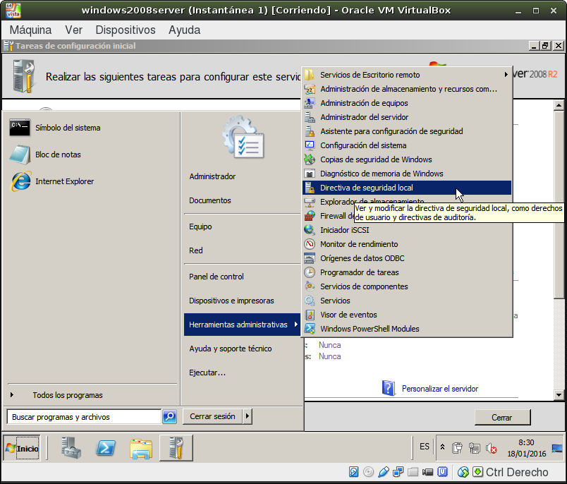

> Documentos relacionados
> * Configurar [Acceso remoto](../acceso-remoto/windows-server.md)
> * Configurar [Firewall](../firewall.md).
> * Cómo trabajar en [casa](../casa.md).

---
# MV Windows 2008 Server

1. [Configuración](#configuracion)
2. [Contraseñas](#contrasenas)
3. [Comprobaciones](#comprobaciones)
4. [Perido de pruebas](#periodo-de-pruebas)

## 1. Configuracion

> * Donde aparezca AA debemos poner el código asignado al aula:
>     * 18 para el aula103
>     * 19 para el aual109
> * Donde aparezca XX debemos poner el código asignado al alumno.

Configuración de la máquina Windows 2008 Server Enterprise (Instalación completa):
* Tarjeta de red VBox en `modo puente`.
* Dentro del SO, configuramos el interfaz de red en modo estático.
* IP: `172.AA.XX.21`.
    * Si tenemos varias máquinas usaremos las IP 172.AA.XX.22, 172.AA.XX.23, etc.
    * Máscara de red: `255.255.0.0`
    * Gateway: `172.AA.0.1`
    * Servidor DNS1: `127.0.0.1`
    * Servidor DNS2: `8.8.4.4`
* Nombre de equipo: `primer-apellido-del-alumno+XXs`.
    * Por ejemplo: vargas30s.
    * El nombre NetBIOS sólo puede tener 16 caractéres.

> Si tenemos varias máquinas las llamaremos vargas30s, vargas30s2, vargas30s3, etc.

* Los nombres de usuario, máquina y dominio deben estar en minúsculas.
Sin usar caracteres especiales como ñ, tildes, espacios, etc.
* Grupo de trabajo: `curso1920` (Modificar los números al curso actual)

> En el caso de tener un PDC, pondremos como nombre de dominio `segundo-apellido-del-alumnoXXdom.curso1920`.

## 2. Contraseñas

Se recomienda mantener habilitada la política de contraseñas seguras (complejas). Pero para las prácticas, la podemos deshabilitarla por comodidad.

* Para desactivar las contraseñas complejas: `Inicio -> Herramientas
Administrativas -> Directivas de seguridad local -> Directivas de cuenta ->
Directivas de contraseña -> Deshabilitar complejidad de contraseñas`.




## 3. Comprobaciones

Comprobaciones finales:

```  
date
ipconfig
ping 8.8.4.4
nslookup www.iespuertodelacruz.es
```   

## 4. Periodo de pruebas

Una vez instalado el SO Windows 2008 Server disponemos de unos 60 días trabajar con el sistema, antes de que pase al estado **Copia ilegal**.

Al finalizar este plazo de tiempo podemos:
1. Activar el SO introduciendo un código de activación válido.
2. Renovar el periodo de pruebas por 60 días más, mediante el comando: `slmgr -rearm`.

Podemos renovar varias veces, pero el tiempo total que podemos usar el SO antes de activarlo es de 180 días.

> Enlace de interés:
>
> * [Cómo aceder a una partición GNU/Linux desde Windows](https://es.opensuse.org/SDB:Acceder_a_la_particion_de_GNU/Linux_desde_Windows)
