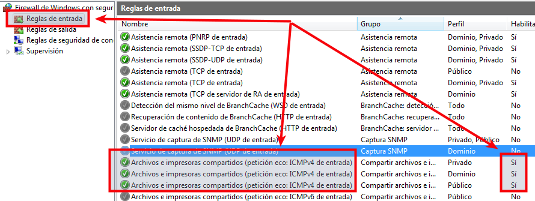
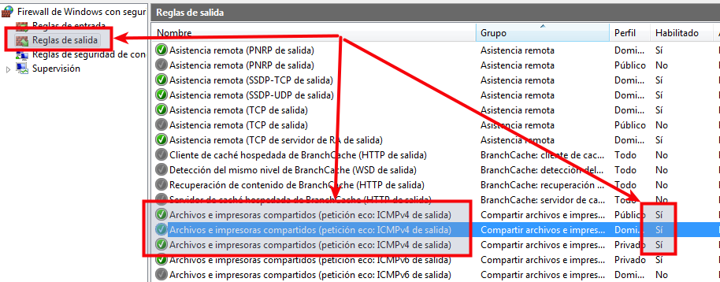

# Cortafuegos (Firewall)

El cortafuegos a firewall es un software que controla las comunicaciones,
permitiendo/denegando las entradas/salida de red según especifiquemos en las
reglas de seguridad.

1. [Windows 7](#windows-7)
2. [Windows Server](#windows-server)
3. [OpenSUSE](#opensuse)

## 1. Windows 7

Abrir el cortafuegos de Windows para permitir que funcionen los `ping`
(`echo request` y `echo replay`).

* Ir a `Panel de control -> Firewall`
* Comprobar que el cortafuegos está activo.
* Ir a `Configuración avanzada` y modificar las `Reglas de entrada`  y `Reglas de salida`
como se muestra en las siguientes imágenes.

> Esto es, habilitar `petición echo ICMP v4`, en las reglas de entrada y de salida.

## 2. Windows Server

* Hay que usar la Herramienta `Firewall de Windows con seguridad avanzada`.
* Se configura igual que Windows7.

## 3. OpenSUSE

* Ir a `Yast -> Firewall`
* Mantendremos el cortafuegos activo.
* Permitiremos el acceso externo únicamente a los servicios que necesitemos.
* Ir a `Servicios autorizados -> Zona externa`
