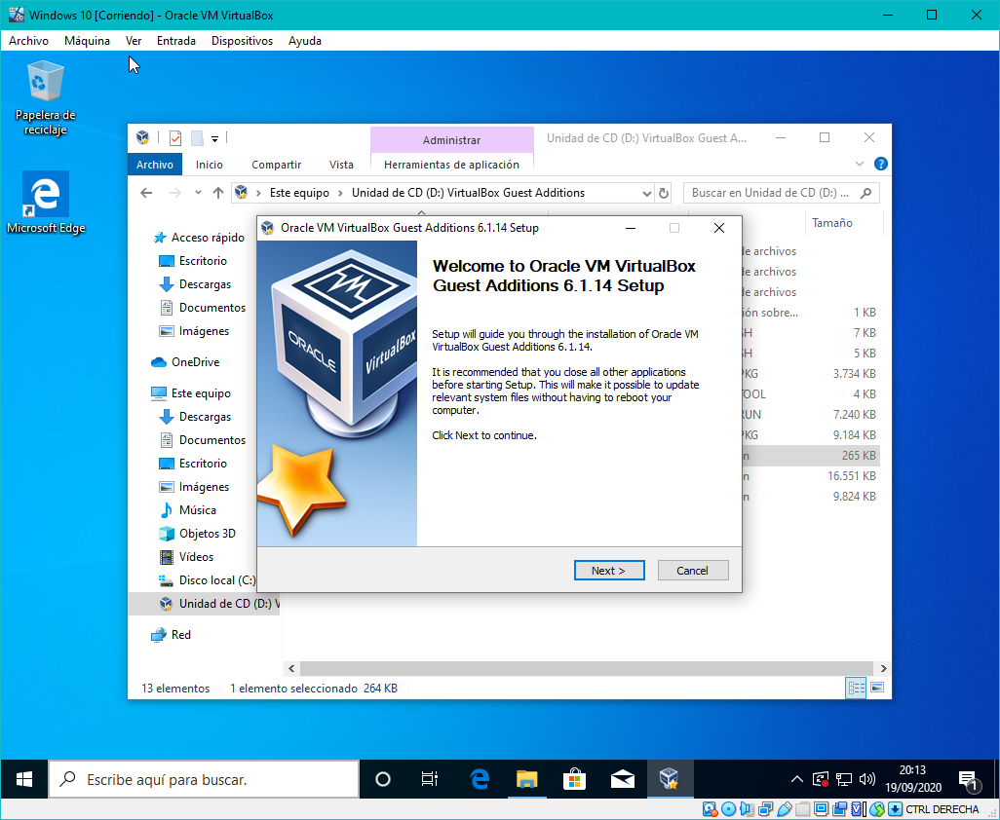
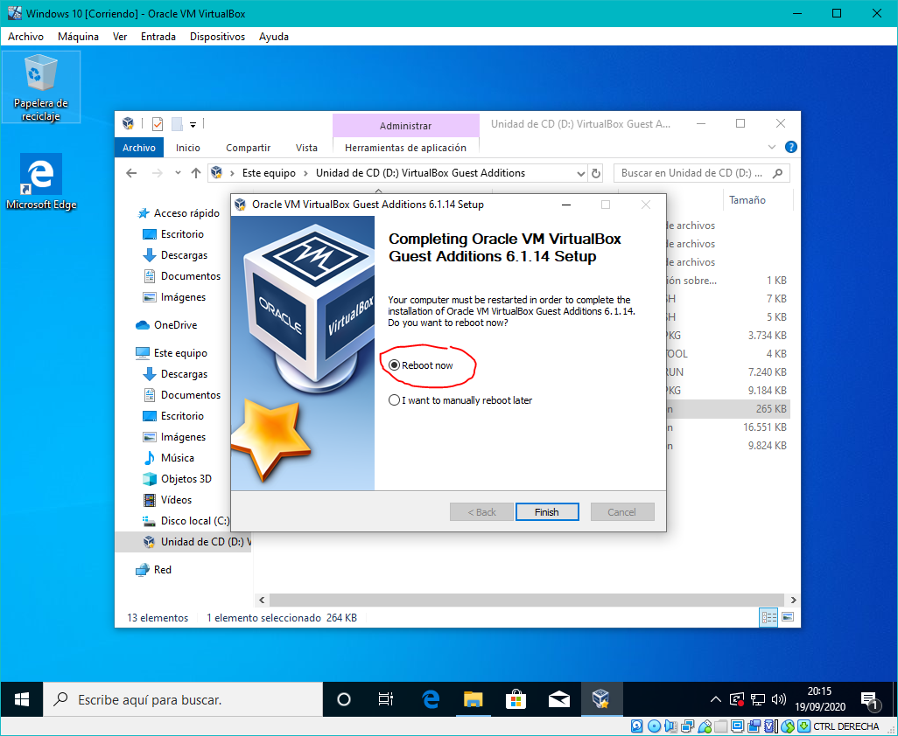

# Instalación de VBox GuestAdditions en Windows

1. Insertar la imagen de CD de las GuestAdditions (GA) en la máquina virtual (MV):

	

2. Abrir la unidad de CD en el **Explorador de Archivos** y ejecutar **VBoxWindowsAdditions** (instalador de la GA para Windows):

	

3. Completar el proceso de instalación mediante el asistente, dejando todas las opciones por defecto:

	

4. Reiniciar la MV y listo:

	