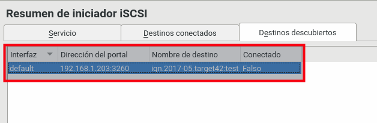

```
Curso          : 201819
Software       : SO OpenSUSE Leap 15
Tiempo estimado: 7 horas
Comentarios    : Revisar problemas con el software del target
```
---

# iSCSI en OpenSUSE

Vamos a montar un iSCSI sin autenticación, usando dos máquinas GNU/Linux OpenSUSE.

Propuesta de rúbrica:

| ID | Criterios                     | Nivel 2 | Nivel 1 | Nivel 0 |
| -- | ----------------------------- | ------- | ------- | ------- |
| C1 | (4.3) Crear destino 1         | | | |
| C2 | (5.3) Conectar a destino      | | | |
| C3 | (5.4) Consumir almacenamiento | | | |

---

# 1 Preparativos

Vamos a montar la práctica de iSCSI con GNU/Linux OpenSUSE.

## 1.1 Configuraciones 

Necesitamos 2 MV's (Consultar [configuraciones](../../global/configuracion/opensuse.md)).

| Parámetro | MV1                      | MV2      |
| --------- | ------------------------ | -------- |
| Rol       | Initiator              | Target |
| SSOO      | OpenSUSE Leap          | OpeSUSE Leap |
| Hostname  | initiatorXXg.curso1819 | targetXXg.curso1819 |
| Red1      | Red interna `san` (192.168.XX.31). NO gateway | Red interna `san` (192.168.XX.32) |
| Red2      | Puente (172.AA.XX.31)  | |
| IQN       | iqn.2019-06.curso1819.initiatorXXg | iqn.2019-06.curso1819.targetXXg |

Recordar:
* Las IP's las pondremos todas estáticas.
* Las IP's de la red interna estarán en el rango 192.168.XX.NN/24. Donde XX será el número correspondiente al puesto de cada alumno.


## 1.2 INFO: Acceso a Internet desde el Target

_Esta parte es INFORMATIVA_
 
Como vamos a necesitar acceso a los repositorios de Internet en el Target
para instalar el software, podemos hacerlo de varias formas:
* (a) Poner temporalmente un 2º interfaz puente y DHCP para instalar y luego lo desactivamos. Es sencillo y rápido > para nuestro entorno de aprendizaje.
* (b) Poner el interfaz de red temporalmente en puente y DHCP, instalar y cambiar.
* (c) Activar/configurar enrutamiento y NAT en ma MV Initiator. Esto es más complejo, pero más profesional.

**Activar enrutamiento en GNU/Linux**

* Enlace de interés: [Enrutamiento en GNU/Linux](http://www.ite.educacion.es/formacion/materiales/85/cd/linux/m6/enrutamiento_en_linux.html)
* Veamos un script de ejemplo de script que sirve para activar el enrutamiento y el NAT.

```
// activar-enrutamiento.sh
echo "1" > /proc/sys/net/ipv4/ip_forward
iptables -A FORWARD -j ACCEPT
iptables -t nat -A POSTROUTING -s IP_RED_INTERNA/MASCARA_RED_INTERNA -o eth0 -j MASQUERADE
```

*  Ejemplo de script que desactivara el enrutamiento:

```
// desactivar-enrutamiento.sh
echo "0" > /proc/sys/net/ipv4/ip_forward
```

---

# 2 Teoría: Un poco de teoría sobre iSCSI

La configuración del Target contiene:
* El nombre de nuestro target
* El nombre de usuario y la contraseña para la conexión del iniciador
* El dispositivo que ofreceremos como target

## 2.1 Teoría: Nombre IQN

El estándar iSCSI define que tanto los target como los iniciadores deben
tener un nombre (identificador iqn) que sigue el siguiente patrón: `iqn.YYYY-MM.NOMBRE-DEL_DOMINIO_INVERTIDO:IDENTIFICADOR`.
Donde:
* `iqn` es un término fijo y debe figurar al principio.
* `YYYY-MM` es la fecha de alta del dominio de la organización para la que estamos
configurando el equipo.
* A continuación debe figurar el nombre del dominio invertido.
* Después de ":", un identificador del almacenamiento, que podemos ponerlo a nuestro gusto, y que puede en muchos casos brindar información del target.

Ejemlos válidos serían: `iqn.2005-02.au.com.empresa:san.200G.samba`, `iqn.2017-05.curso1617.target42:test`.

Como vemos el identificador aunque es variable y personalizable, puede
reflejar el nombre dado al target, la capacidad y el servicio donde lo usaremos.

## 2.2 Teoría: Autenticación

Si queremos que nuestro target requiera autenticación, podemos definir
un usuario y una contraseña para que solo se conecten los iniciadores que nosotros queremos.
Ejemplo: `IncomingUser usuario-iniciador clave-iniciador`

Hay 3 tipos de autenticación:
* Sin autenticación
* Autenticación de entrada y
* Autenticación de salida

## 2.3 Teoría: Dispositivos/Destinos

Luego debemos definir qué dispositivo ofreceremos como target.
Debemos poner una línea como la siguiente: `Lun 0 Path=/dev/sda3,Type=fileio`

En este ejemplo el primer dispositivo que estamos ofreciendo es la
partición /dev/sda3 del servidor. La documentación nos dice que además
de particiones podemos usar discos enteros, volúmenes LVM y RAID,
e incluso archivos. En cualquier caso hay que definirlo en el path.

El archivo contiene muchos parámetros más de configuración,
que en la mayoría de los casos tienen que ver con la performance del servidor.

En nuestro ejemplo, configurando estos tres parámetros nos bastaría.

---

# 3 Práctica: Initiator

Vamos al equipo que será nuestro iniciador:
* Por entorno gráfico, `Yast -> Iniciador SCSI`
* Modificamos el identificador IQN del Initiator (Consultar tabla).
* Comprobamos por comandos, `more /etc/iscsi/initiatorname.iscsi`

---

# 4 Práctica: configuración del Target

## 4.1 Enlaces de interés

> Enlaces de interés:
> * [OpenSUSE - Target usando comandos](http://es.opensuse.org/iSCSI)
> * [OpenSUSE - Target documentation ](https://www.suse.com/documentation/sles11/stor_admin/data/sec_inst_system_iscsi_target.html)
> * Vídeo: [EN - LINUX: ISCSI Target and Initiator Command Line configuration](https://youtu.be/5yMSxqUs4ys)
> * Vídeo: [Linux Configure an iSCSI Target](https://www.youtube.com/watch?v=cWPY3lH3qTQ)

## 4.2 Crear los dispositivos

Crear los dispositivos de almacenamiento en el equipo target.
* Creamos el `dispositivo1` a partir de un fichero.
    * `dd if=/dev/zero of=/home/nombre-alumnoXXdisco01.img bs=1M count=500`
    * Hemos creado un fichero con tamaño 500M.
    * `du -sh /home/nombre-alumnoXXdisco01.img`, lo comprobamos.
* Creamos el `dispositivo2` a partir de un disco extra.
    * Añadiremos un 2º disco de 700M a la MV Target.
    * `/dev/sdb` será nuestro dispositivo2.

## 4.3 Crear destino

* Vamos a la máquina target.
* `zypper in yast2-iscsi-lio-server`, instala el software para crear un Target iSCSI y sus dependencias.
* Ir a `Yast -> Objetivo LIO iSCSI`, para configurar el Target.
* Inicio del Servicio
    * Durante el arranque = Sí
    * Abrir el cortafuegos = Sí
* Global
    * Sin autenticación
* Destinos(Dispositivos)
    * Nombre IQN del target (Consultar tabla).
    * Identificador `destino1`
    * Seleccionar los LUN (dispositivos creados anteriormente)
        * `Lun 0 Path=/home/nombre-alumnoXXdisco01.img,Type=fileio`
        * `Lun 1 Path=/dev/sdb,Type=fileio` (Escribir la ruta del dispositivo)
    * Utilizar autenticación => NO

> Podemos comprobar que los ficheros de configuración están en /etc/target.

## 4.4 Comprobar servicio 

* `systemctl status targetcli`, debe mostrar el servicio loaded y enable. En caso contrario, ya sabemos que hay que hacer.

---

# 5 Initiator

> Enlaces de interés:
> * [OpenSUSE - Initiator con comandos](http://es.opensuse.org/iSCSI)
> * [OpenSUSE - Initiador documentation](https://www.suse.com/documentation/sles11/stor_admin/data/sec_inst_system_iscsi_initiator.html)
> Enlaces de interés:
> * [Setting up iSCSI initiator on OpenSUSE](https://www.suse.com/documentation/sles11/stor_admin/data/sec_inst_system_iscsi_initiator.html)
> * Vídeo: [EN - LINUX: ISCSI Target and Initiator Command Line configuration](https://youtu.be/5yMSxqUs4ys)
> * Vídeo: [Linux Configure iSCSI Initiator ( client ) ](https://www.youtube.com/watch?v=8UojNONhQDo)
> * Vídeo: [EN - Configure iSCSI initiator (client)](https://youtu.be/8UojNONhQDo)

* Ir a la mv Iniciador.
* Ejecutar `nmap -Pn IP-TARGET`. Debe aparecer el puerto iscsi (3260) abierto, indicando que el servicio iSCSI estaría disponible en el equipo Target.

## 5.1 Instalar y configurar acceso

* Vamos a la máquina Iniciador.
* El software necesario viene preinstalado en OpenSUSE Leap:

> Si tenemos que hacer la instalación ejecutar `zypper in open-iscsi yast2-iscsi-client`.

## 5.2 Descubrir

**Descubrir por Yast**

* `Yast -> Iniciador iSCSI -> Descubrir`, para descubrir los destinos disponibles en las máquinas targets.
* Debemos especificar la IP del equipo target donde queremos descubrir los destinos disponibles.
* Puerto 3260
* Sin autenticación.



**Descubrir por comandos**

* `iscsiadm -m discovery -t sendtargets -p IP-DEL-TARGET`, comando para descubrir máquinas target.

> * El target ofrece su servicio por defecto en el puerto 3260.
> * `iscsiadm -m discovery`, para descubrir los puertos de trabajo del Target.

## 5.4 Conectar

**Conectar por Yast**

* `Yast -> Iniciador iSCSI -> Conectar` para conectar con el destino que hemos descubierto.
* Elegimos:
   * Inicio en el arranque
   * Sin autenticación.


**Conectar por comandos**

* `iscsiadm -m node -l`, conectar con todos los targets configurados, usando modo básico sin autenticación.

> NOTA: Otra forma de conectar con un target concreto sería `iscsiadm -m node --targetname IQN-TARGET:destino1 -p IP-TARGET --login`.

* Si hacemos `fdisk -l`, veremos que nos aparece nuevos discos en el equipo iniciador.

## 5.4 Usar almacenamiento

Vamos a equipo Iniciador:
* `lsscsi`, encontrar la ruta del dispositivo local para el dispositivo Target iSCSI.


* Crear directorio `/mnt/destino1sdbXX`.
* Crear directorio `/mnt/destino1sdcXX`.
* `Yast -> Particionador`, elegir el disco.
    * Crear partición y formatear el disco sdb.
    * Editar -> Montar -> Punto de montaje -> `/mnt/destino1sdbXX`.
    * Crear partición y formatear el disco sdc.
    * Editar -> Montar -> Punto de montaje -> `/mnt/destino1sdcXX`.
* Guardar datos en las carpetas anteriores. Notar que estos datos se están guardando realmente en el dispositivo remoto SAN iSCSI.

---

# ANEXO

## IDEAS para el futuro

* Crear en el target un destino (test2) con un lun0 que sea un volumen lógico (lvm)
* Conectar destinos de un target Windows con un iniciador GNU/Linux y viceversa.
* Hacer configuraciones usando las autenticaciones de entrada y salida.
