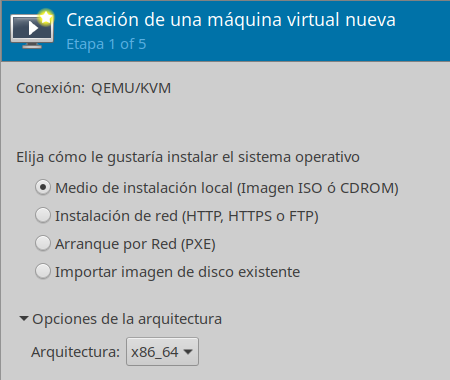
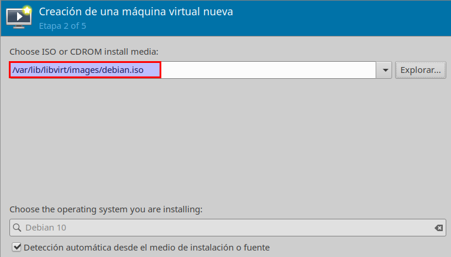
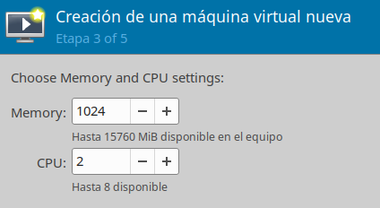
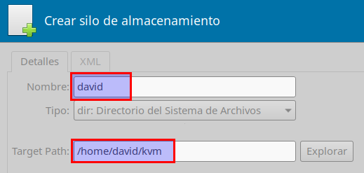
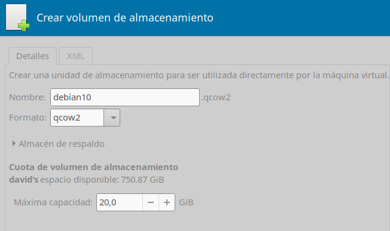
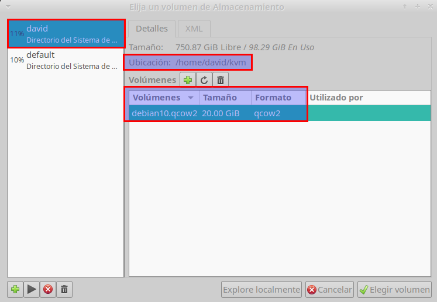
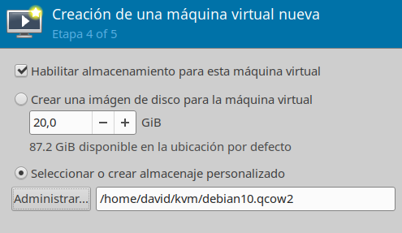
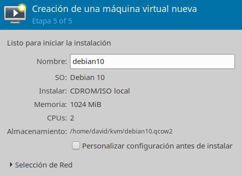
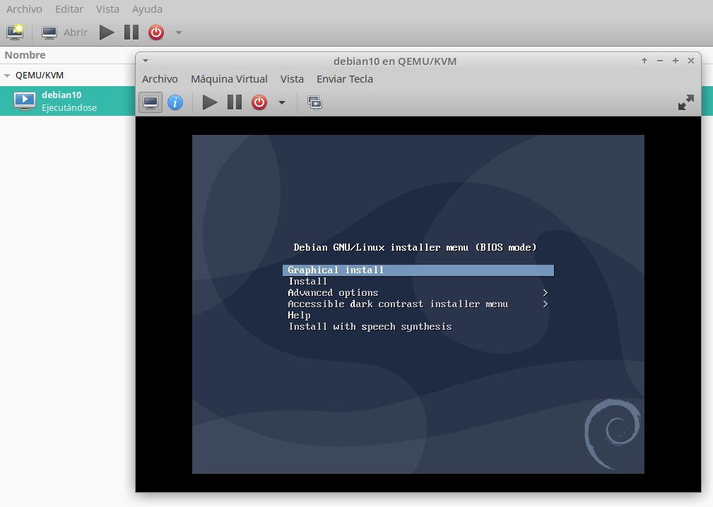

```
Estado      : EN CONSTRUCCION!!!
Cursos      : 202021
Area        : CPD, Virtualización
Descripción : Practicar virtualización KVM
Requisitos  : SO GNU/Linux, isos de otros SSOO
Tiempo      : 3 sesiones
```

# KVM y libvirt (con OpenSUSE)

Ejemplo de rúbrica:

| Sección               | Muy bien (2) | Regular (1) | Poco adecuado (0) |
| --------------------- | ------------ | ----------- | ----------------- |
| (1.4 y 1.5)           | | | |

> Enlaces de interés:
> * https://www.linuxtechi.com/install-configure-kvm-opensuse-leap-15/

# 1. KVM

## 1.1 Instalar KVM

* Ir a `Yast -> Virtualización -> Instalar Hipervisor y herramientas`.
* Elegir `Servidor de KVM` y `Herramientas de KVM`
* `Aceptar`

## 1.2 Crear una MV

* Crear el directorio `/home/david/kvm` para guardar el disco duro de la máquina virtual.
* En el directorio `/var/lib/libvirt/images`, necesitamos tener la ISO del sistema
operativo que queramos instalar en MVs.
* Ir a `Menú -> Create Virtual Machines for Xen and KVM`. Necesitaremos permisos de superusuario.

















* Iniciar red virtual: **SI**
* ¡Ya tenemos la MV creada!

## 1.3 Instalar el SO en la MV

* Ir `Menú -> Gestor de Máquinas Virtuales`



* Procedemos a instalar el SO dentro de la MV.

---
# 2. libvirt


> Enlaces de interés:
>
> * [How to get started with libvirt on Linux](http://rabexc.org/posts/how-to-get-started-with-libvirt-on/)
> * [Linux KVM Libvirt Tutorial – POFTUT](https://www.poftut.com/linux-kvm-libvirt-tutorial/)
> * [Virtualization - libvirt | Server documentation | Ubuntu](https://ubuntu.com/server/docs/virtualization-libvirt)


---

# ANEXO

* **isardvdi**: https://www.isardvdi.com/
