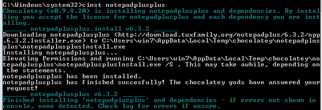

```
* Modificado para el curso 201516
* Se trabaja en el curso 201617
```

# Instalar aplicaciones y actualizar el sistema

En esta actividad vamos a practicar diversas formas de realizar la instalación de aplicaciones en varios sistemas operativos, así como la forma de mantener nuestros sistemas actualizados.

# 1. Windows 7

> Enlaces de interés:
> * [Chocolatey NuGet](https://chocolatey.org/) is a Machine Package Manager, somewhat like apt-get, but built with Windows in mind.
> * [Ninite](https://ninite.com/): Instala y actualiza varios programas en un paso.

## 1.1 Usando el GUI

Capturar imagen del proceso final.

### Actualización del sistema

* Usar el usuario `jedi1` (Debe tener privilegios de administrador del equipo)
* Ir a `Panel de control -> Windows Update`. Actualización del sistema.
* Consultar las actualizaciones pendientes.
* Elijar 3 y aplicar actualización.

### Instalar características del sistema operativo

El SO viene con software que se puede instalar si se necesita. Esto es características del sistema.

* Vamos a las `Herramientas de Windows -> Panel de control -> Programas y características -> Activar o desactivar características de Windows`.
* Instalar 3 características:
    * Cliente Telnet.
    * Juegos/Buscaminas.
    * Otra a elección del alumno.
* Comprobar que funcionan correctamente.

> **Cliente Telnet**
>
> La herramienta telnet sirve para conectarse a equipos remotos.
>
> En este caso le estamos dando un uso poco común, porque la estamos usando para consultar
la página web del servidor 172.20.1.2. Lo suyo es usar un navegador web.
>
> Una forma de comprobar el cliente telnet:
> * Abrir terminal de comandos y escribir: `telnet 172.20.1.2 80`
> * Escribir `olleh` y pulsar enter
> * Debes ver algo como... etiquetas HTML ¿te suenan de algo?

### Vamos a instalar aplicaciones

Capturar imagenes de los pasos realizados.
* Descargar Wget para Windows de la [página oficial](http://gnuwin32.sourceforge.net/packages/wget.htm)

> Otras opciones serían Gimp o LibreOffice, pero son más "pesadas", y se tarda más tiempo.

* Comprobar el código MD5 del fichero descargado, para verificar que la descarga es correcta. En Windows podemos usar por ejemplo el programa HashCalc para realizar dicha verificación.
* Realizar la instalación de la aplicación.
* El programa Wget se usa para hacer descargas desde la consola.
* Comprobar su funcionamiento (`wget http://...`)
* Desinstalar el programa.

## 1.2 Usando los comandos

Capturar imágenes de los pasos realizados.

### Instalar programas

* Usar wget para descargar el programa GIT desde la web oficial (http://git-scm.com/).
* Abrir una consola cmd.
* Ir a la carpeta donde hemos descargado el fichero.

> NOTA: Sustituir VERSION por el número de versión que se haya descargado cada uno.

* `Git-VERSION.exe /?` (Con el argumento /? vemos todas las opciones del programa)
* `Git-VERSION.exe /SILENT` (Hacemos una instalación sin preguntas al usuario)

Comprobar (por la consola cmd) que lo tenemos instalado haciendo:
* `cd c:\Program Files\Git\bin` (Esta es la ruta donde se instaló el programa)
Si no encuentran el programa `git.exe` en esta ruta hagan una búsqueda y sitúense en el directorio encontrado.


* `git --version` (Esto ejecuta un comando para averiguar la versión del git instalado)
* Descargar e instalar el programa Evince en formato MSI desde el URL https://wiki.gnome.org/Apps/Evince/Downloads.

### Desinstalar programas

A continuacion vamos a desinstalar un programa MSI por comandos, usando la consola wmic.

> Estos comandos sólo sirven para desinstalar programas instalados MSI. NO sirve para ficheros  EXE.

* Abrir consola PowerShell como Administrador
* `wmic`, abrir consola wmic.
* `product get name`, para localizar los programas MSI instalados.
* `product where name="Evince 2.30.3" call uninstall`, para desintalar el programa.
* Comprobarlo.

> **INFORMACIÓN - PowerShell**
>
> * Ejemplo de [Script para desinstalar un programa con PowerShell](https://social.technet.microsoft.com/Forums/es-ES/b56a8e37-0840-45fb-b9ea-4ece77af1ebe/script-para-desinstalar-un-programa-con-powershell?forum=powershelles)
> * Desinstalar programas MSI usando comandos de PowerShell. Abrir consola PowerShell como Administrador y ejecutar lo siguiente:
> ```
> $programa = Get-WmiObject -Class Win32_Product -Filter "Name = 'Nombre-mostrado-en Agregar/Quitar programas' "
> $programa.Uninstall()
> ```

---

# 2. GNU/Linux - OpenSUSE

Vamos a usar SO OpenSUSE 13.2.

## 2.1 Usando el GUI

El gestor de paquetes es un programa para instalar/desinstalar software como un AppStore.

* Capturar imagen del resultado final.
* Iniciar el gestor de paquetes ( `Inicio -> Yast -> Inst. Software`).

> Enlaces de interés:
> * [Gestión de software con Yast](https://es.opensuse.org/SDB:Gesti%C3%B3n_de_software_con_YaST)

### Instalar paquetes

* Iniciar Yast -> refrescar los repositorios.
* Instalar por ejemplo el editor `geany`, `git`, `gkrellm` o `gtk-recordmydesktop`.
* Comprobar que funciona el programa instalado.

### Desinstalar paquetes

* Desinstalar la aplicación con el gestor de paquetes.
* Comprobarlo.

## 2.2 Usando los comandos

Capturar imágenes de los pasos realizados.

> Enlace de interés:
>
> * [Zypper](https://es.opensuse.org/Zypper)

### Actualización del sistema

* Entramos en la consola como `root`.
* `zypper refresh`, para actualizar el catálogo de productos software disponible.
* `zypper update`, para actualizar todas las aplicaciones del sistema.

### Instalar software

* Entramos en la consola como `root`.
* Instalar algún programa con el comando `zypper ...` (`man zypper` para consultar ayuda).

Ahora vamos a comprobar que el programa está instalado:
* `zypper search nombre-programa`
* Ejecutar el programa y ver funciona.
* Buscar el programa en el sistema de ficheros: `whereis nombre-programa`

### Desinstalar software

* Desinstalar el programa con `zypper ...`.
Comprobar que el programa no está instalado:
* `zypper se nombre-programa`
* Ejecutar el programa y ver que funciona.
* Buscar el programa en el sistema de ficheros: `whereis nombre-programa`, y no encontrarlo.

### Instalar programa Windows

* Instalar el emulador Windows (`wine`).
* Descargar un programa Windows en GNU/Linux e instalarlo usando `wine`. Por ejemplo, usar Jhony Simulator.

### Instalar programa desde rpm

> * `.rpm`, extensión de los ficheros de instalación para los sistemas operativos OpenSUSE y Red Hat.
> * `.deb`, extensión de los ficheros de instalación para los sistemas operativos Debian y Ubuntu.

* Comprobar que el programa `atom` no está disponible en los respositorios.
* Buscamos en la web de [atom.io](https://atom.io) el instalador para nuestro sistema.
* Descargamos el fichero `.rpm`.
* `rpm -i atom-VERSION.rm`, para instalar el programa mediante el fichero rpm.
* `rpm -q atom`, para comprobar qye está el paquete instalado.
* Comprobamos ejecutando el editor atom.

### Instalación desde el código fuentes

GitHub es una plataforma donde los desarrolladores ponen sus proyectos de forma
pública.

* Elegir un programa de la lista [Games on GitHub](https://github.com/leereilly/games)
* Consultar las instrucciones de instalación.
* Descargar el proyecto.
* Instalar el juego.

---

# ANEXO

El ANEXO sólo contiene información extra. No hay que realizar ninguna tarea con el contenido de esta sección.

## A.1 Compilación de las fuentes

* Instalar programa desde el código fuente.
* Ver ejemplo con ruby3.X.

## A.2 Instalar desde la terminal Windows al estilo de Linux

* URL: http://chocolatey.org/
* Probado en Windows 7 64bits.

Para instalar esta herramienta ejecutamos en una terminal (cmd.exe) lo siguiente:
* `@powershell -NoProfile -ExecutionPolicy unrestricted -Command "iex ((new-object net.webclient).DownloadString('http://chocolatey.org/install.ps1'))" && SET PATH=%PATH%;%systemdrive%\chocolatey\bin`

Una vez realizado este paso ya está instalado el "gestor" de instalaciones para la terminal.

Por ejemplo si queremos instalar el Notepad++ podemos hacerlo desde la terminal tecleando lo siguiente: `cinst notepadplusplus`



En http://chocolatey.org/packages podemos ver todas las aplicaciones disponibles.
