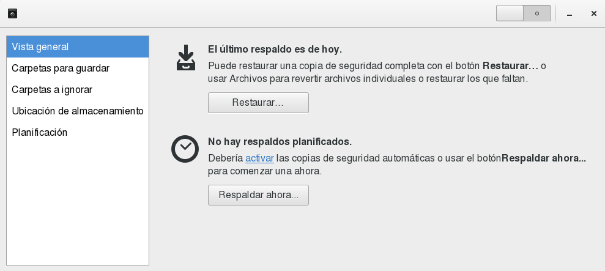
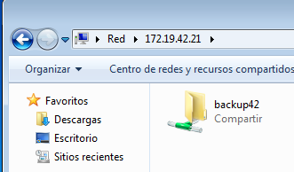
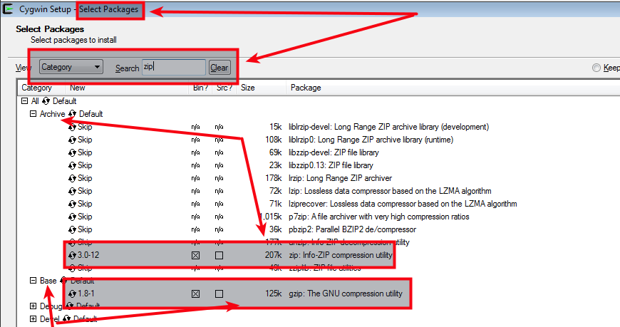
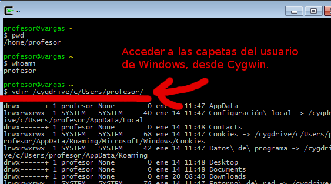

# Copias de Seguridad

En esta práctica vamos a realizar copias de seguridad de los datos de los usuarios en máquinas con SO Windows y GNU/Linux, usando tanto el entorno gráfico como los comando.

# 1. Configuración de las máquinas

* [Configuración de la máquina OpenSUSE](../../global/configuracion/opensuse.md)
* [Configuración de la máquina Windows 7](../../global/configuracion/windows.md)
* [Configuración de la máquina Windows 2008 Server](../../global/configuracion/windows-server.md)

Capturar imágenes de las configuraciones.

---

# 2. Backup en Entorno gráfico

## 2.1 Entorno gráfico GNU/Linux

### El usuario tiene datos para guardar

* Con el usuario `rebelde1`, crear en dos archivos de texto:
    * `/home/rebelde1/mydocsXX/manual-xwing.txt`
    * `/home/rebelde1/mydocsXX/mapa-luke-skywalker.txt`
* Escribir dentro de los ficheros lo siguiente:

```
GNU/Linux
GUI
nombre-del-alumnoXX
```

### Preparamos la copia de seguridad

Vamos crear un directorio para almacenar las copias de seguridad que vayamos realizando.
* Crear el directorio `/srv/backupXX`.
    * El usuario propietario será `root`, y el grupo propietario `root`.
    * Todos los permisos para usuario. Y lectura y navegación para el grupo y para el resto.
* Crear el directorio `/srv/backupXX/rebelde1`.
    * El usuario propietario será `rebelde1`, y el grupo propietario `root`.
    * Todos los permisos para usuario y grupo. Ninguno para el resto.

### Realizar la copia de seguridad

Vamos a usar una herramienta de entorno gráfico para realizar la copia de seguridad.
* Iniciar la herramienta de copia de seguridad que venga por defecto en nuestro sistema.
* Copiar los datos del directorio `mydocsXX` del usuario `rebelde1`.

> Ejemplos de herramientas de backup:
> * deja-dup
> 
>
> * Back in Time
> * BackupPC, Amanda, Bacula, Areca Backup, Flyback, luckyBackup

* Crear copia de seguridad en el directorio `/srv/backupXX/rebelde1` (N1).
* Comprobar el contenido de la copia de seguridad. Esto podemos hacerlo
restaurando en el directorio `/tmp` y consultado la salida, o a través de
la propia herramienta, si ésta lo permite.
* Eliminar el archivo `mapa-luke-skywalker.txt` original.
* Crear copia de seguridad (N2).
* Restaurar únicamente el archivo eliminado a partir de alguna de las copias de seguridad.
En el caso de que la herramienta no lo permitiera tendríamos que restaurarlo todo.
* Si la herramienta de backup nos lo permite, programar una copia de seguridad, por ejemplo, a las 11:00 horas diariamente.

## 2.2 Copia en entorno gráfico Windows

> Enlace de interés:
> * [Copia de seguridad y recuperación](https://technet.microsoft.com/es-es/library/cc754097%28v=ws.10%29.aspx).

### En el Windows Server

Vamos a crear un recurso de red, que utilizaremos para almacenar las copias de seguridad que vayamos realizando.

* Crear la carpeta `c:\backupXX\`.
* `Botón derecho -> Propiedades -> Seguridad`. Añadir permisos `Control total` a `Todos`.
* `Botón derecho -> Propiedades -> Compartir -> Uso compartido avanzado`.
* Activar `compartir`.
* Nombre del recurso `backupXX`
* Ir a `permisos -> Todos -> Control Total`.
* Crear la carpeta `c:\backupXX\soldado1`.

### En el Windows 7

Vamos a comprobar que podemos acceder al recurso compartido anterior del Windows Server.
* Desde Windows7.
* Abrir explorador de archivos -> Red.
* Si no vemos el nombre de nuestra máquina Windows Server, usaremos la IP directamente.
Esto es, escribir `\\172.19.XX.31` y ahora veremos los recursos compartidos.
* Clickeamos en el recurso para conectarnos. Se nos pide un usuario/clave del Windows Server para establecer la conexión.

Ahora vamos a crear algunos archivos:
* Iniciamos sesión con `soldado1`.
* Crear la carpeta `C:\Users\soldado1\mydocsXX`, dos archivos de texto: `claves-del-imperio.txt` y `plano-estrella-muerte.txt`.
* Escribir dentro lo siguiente:

```
Windows
GUI
nombre-del-alumnoXX
```

* Vamos a Inicio, escribimos `Copia de seguridad` para buscar el programa de backup.
* Desde Windows7, buscar el recurso compartido de red del Windows Server.
    * Si no vemos el nombre de nuestra máquina Windows Server, usaremos la IP directamente.
    * Escribir `\\172.19.XX.31` y ahora veremos los recursos compartidos
    de red que nos ofrece nuestro servidor.
    * 
* Realizar una copia de seguridad (N1) del direcotorio `mydocsXX` del usuario `soldado1`
y lo grabamos en el recurso compartido de red (Windows 2008 Server).
* Para comprobar el paso anterior, restaurar la copia de seguridad en el directorio local `c:\temp` del equipo Windows7 (Crear el directorio si no existe).
* Eliminar el archivo `plano-estrella-muerte.txt` original.
* Crear copia de seguridad (N2).
* Restaurar el fichero borrado desde la copia de seguridad a su lugar original.
* Programar la copia de seguridad, a las 11:00 horas diariamente.

---

# 3. Copia de seguridad con comandos

## 3.1 Comandos en GNU/Linux

### El usuario tiene datos

* Iniciar sesión con el usuario `rebelde2`.
* Crear en dos archivos de texto:
    * `/home/rebelde2/mydocs/manual-xwing.txt`
    * `/home/rebelde2/mydocs/mapa-luke-skywalker.txt`
* Escribir dentro de los ficheros lo siguiente:

```
GNU/Linux
comandos
nombre-del-alumnoXX
```

### Preparamos la copia de seguridad

* Crear el directorio `/srv/backupXX/rebelde2`. Lo utilizaremos para almacenar
las copias de seguridad que vayamos realizando de momento.
* Comprobar permisos.
    * El usuario propietario será `rebelde2`, y el grupo root.
    * Todos los permisos para usuario y grupo. Ninguno para el resto.

### Aprendiendo a usar el comando tar

Vamos a usar el  comando `tar` para resolver este apartado. Consultar pdf y/o internet.

* `tar -cvf ...`: Crear fichero empaquetado.
* `tar -tvf ...`: Muestra el contenido del fichero empaquetado.
* `tar -xvf ...`: Extrae el contenido del fichero empaquetado.
* `tar -xvf ... --directory /dir2`: Extrae el contenido del fichero empaquetado en dir2.
* `tar -xvf ... -C /dir2`: Extrae el contenido del fichero empaquetado en dir2.
* `tar -acvf ...`: Crear fichero empaquetado y comprimido.
* `tar -atvf ...`: Muestra el contenido del fichero empaquetado y comprimido.
* `tar -axvf ...`: Extrae el contenido del fichero empaquetado y comprimido.
* `date +%Y%m%y`: Muestra la fecha en formato AAAAMMDD
* `gzip ...`: Comando para hcer la compresión en formato gz.
* `zip ...`: Comando para hacer la compresión en formato zip.

> Enlaces de interés:
>
> * [ES - Copia incremental con tar](http://systemadmin.es/2015/04/backup-y-restauracion-de-backups-incrementales-con-tar)
> * [EN - Incremental backup using tar command](https://www.unixmen.com/performing-incremental-backups-using-tar/)

### Realizamos la copia de seguridad

Vamos a usar el  comando `tar` para lo siguiente:
* Iniciar sesión con el usuario `rebelde2`.
* Asegurarse de que estamos en el directorio `/home/rebelde2`
* Crear copia de seguridad total del directorio `mydocsXX` (`/srv/backupXX/rebelde2/AAAAMMDD-N1-total.tar.gz`) .
* Usar comando tar para consultar el contenido del fichero anterior.
* Restaurar la copia de seguridad en `/tmp` para comprobar su contenido.
* Eliminar el fichero `mapa-luke-skywalker.txt`.
* Crear copia `/srv/backupXX/rebelde2/AAAAMMDD-N2-total.tar.gz` del directorio `mydocsXX`.
* Usar comando tar para consultar el contenido del fichero anterior. Fijarse bien en
la ruta del archivo.

> * Si el fichero a restaurar contiene la ruta `home/rebelde2/mydocsXX` entonces
    descomprimimos desde la raiz del sistema. Por ejemplo: `cd /` y luego `tar xvf ruta-al-fichero-backup home/rebelde2/mydocsXX/nombre-fichero`.
> * Si el fichero empaquetado contiene la ruta `mydocsXX` entonces descomprimimos desde `/home/rebelde2`.

* Restaurar únicamente el archivo eliminado a partir de la copia de seguridad (N1)
en su ubicación original (No usar --directory).

## 3.2 Comandos Windows

### El usuario tiene datos que guardar

* Iniciamos sesión con el usuario `soldado2`.
* En `C:\Users\soldado2\mydocsXX`, crear
los archivos `claves-del-imperio.txt` y `plano-estrella-muerte.txt`.
* Escribir el siguiente contenido dentro de los archivos:
```
Windows
comandos
nombre-del-alumnoXX
```

### Información sobre Cygwin

Cygwin es una aplicación que crea un entorno de comandos similar al de GNU/Linux.

Podemos usar Cygwin para realizar la copia de la misma forma que lo haríamos en GNU/Linux.
Esto es, usando los comandos tar y gzip.

### Instalación de Cygwin

* Descargar software [Cygwin](https://www.cygwin.com) para Windows 7.
* Instalar software con las siguientes opciones.
* `Install from Internet`
* Root directory: `C:\cygwin`
* Local Packages: `valor por defecto`
* `Direct Connection`
* `Choose a download site`
* Select packages: `base/tar, base/gzip, archive/zip,  utils/tree, net/rsync, net/openssh`.



> Para que el paquete aparezca seleccionado, hacer click en `skip`, y así
aparecerá marcado el paquete para su instalación.

### Realizar la copia de seguridad

> Hay que tener en cuenta que cuando estamos dentro de Cygwin la ruta
`c:\Users\profesor` será `/cygdrive/c/Users/profesor`.

Vamos a usar los comandos como tar y gzip de Cygwin pararealizar copia de seguridad
de la carpeta `mydocsXX` del usuario `soldado2`.



* Crear el directorio local `c:\backupXX\soldado2` que va a almacenar las
copias de seguridad.
* Iniciar Cygwin.
* Cambiar al directorio `/cygdrive/c/Users/soldado2`.
* Crear una copia de seguridad total del directorio `mydocsXX` del usuario
`soldado2` con el nombre `/cygdrive/c/backupXX/soldado2/AAAAMMDD-N1-total.tar.gz`.
* Usar comando tar para consultar el contenido del fichero anterior.
* Restaurar la copia de seguridad en `/cygdrive/c/temp` para comprobar su contenido.
* Eliminar el archivo `plano-estrella-muerte.txt` original.
* Crear copia `/cygdrive/c/backupXX/soldado2/AAAAMMDD-N2-total.tar.gz` del directorio `mydocsXX`.
* Usar comando tar para consultar el contenido del fichero anterior.
* Restaurar únicamente el archivo eliminado a partir de la copia de seguridad (N1) (No usar --directory).

---

# ANEXO

## A.1 Windows XP

* En el caso de trabajar con WXP podremos hacer la copia de seguridad directamente en
una carpeta local de la propia máquina.
* Windows XP proporciona el comando "ntbackup" para hacer copias de seguridad.
* Veamos un ejemplo: `ntbackup backup "C:\Documents and Settings\alumno2" /F C:\backupXX\alumno2\backup.bkf /V:yes`

## A.2 Windows 7

* En este SO nos obliga a que la copia de seguridad se realice en un almacenamiento externo.
Para ello podemos crear la carpeta `c:\backupXX`, y la compartimos por la red.
* Permisos de la carpeta compartida lectura/escritura para
el usuario que vamos a usar en el acceso por red. ¡OJO la carpeta compartida por red puede
estar en la misma máquina!
* Otra posibilidad sería la de añadir un 2º disco duro a la máquina virtual, y
realizar el backup en este 2º disco.
* En Windows, cada vez que nos conectamos a un recurso compartido de red y nos pide
información de usuario/clave. Ésta queda guardada hasta un nuevo inicio de sesión.
Podemos limpiar estos datos ejecutando el comando `net use /d *`.

## A.3 Windows 2008 Server

Si necesitamos hacer copias de seguridad en Windows Server necesitamos instalar dicha herramienta.
Para ello hay que instalar la característica `Copias de seguridad` (Ver imagen):


Windows7/2008server proporciona el comando "wbadmin" para manejar copias de seguridad.
* Abrimos consola (cmd) con el usuario administrador.
* Ejecutamos "wbadmin get versions", para comprobar que funciona.
* Ejemplo de copia parcial: "wbadmin start backup -backupTarget:\vargas1\backup\alumno1 -include:c:\Users\Alumno1\*"
* Ejemplo de copia total: "wbadmin start backup -backupTarget:\vargas1\backup\alumno1 -include:c:"
