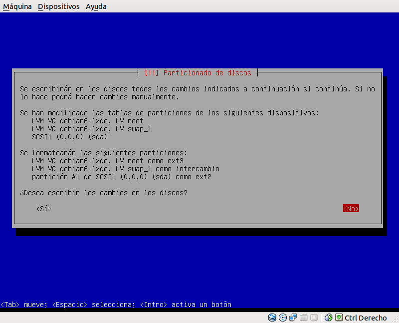
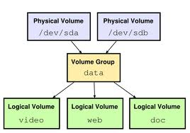
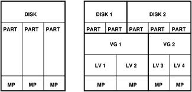
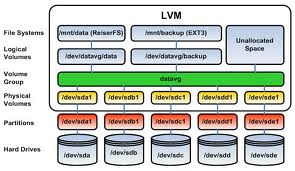
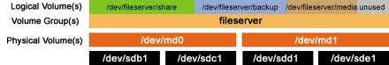

# 1. Introducción

Vídeos
* [LVM. Learning Linux : "Lesson 20 Managing LVM"](https://youtu.be/m9SNN6IWyZo?list=PL3E447E094F7E3EBB)
* [LVM. Learning Linux: "Lesson 21 LVM snapshots"](https://youtu.be/N8rUlYL2O_g?list=PL3E447E094F7E3EBB)

---

# 2. Instalar SO sobre LVM

Vamos a instalar un sistema operativo GNU/Linux Debian, sobre unos discos con LVM.

> Otra forma de producir un efecto similar al de LVM, es mediante el uso de
sistemas de ficheros como BtrFS o ZFS (Consultar).
> Nosotros NO vamos a usar ZFS sino LVM en nuestra práctica, pero si algún
grupo desea usar ZFS debe hablar con el profesor.

## 2.1 Preparar MV

Realizar las siguientes tareas:
* Crear MV para Debian, con un disco de 8GB.
* [Configuración](../../global/configuracion/debian.md) de la máquina.
* Comenzar a instalar GNU/Linux Debian, parar al llegar al particionado.

## 2.2 Particionar

* Crearemos una partición de 100MB para boot formato ext2.

> Tener en cuenta que la partición "/boot" va a parte (Fuera de LVM).

* Crear en el resto una partición LVM. En la partición LVM, podemos hacer
un grupo de volumen llamado `vg-debian`.
* Dentro del `vg-debian`, podemos los VL (volúmenes lógicos) siguientes:
    * `lv-swap` (500 MB) usar para área de intercambio
    * `lv-raiz` (5 GB ext4) usar como raíz de la instalación del SO.
    * `lv-datos` (100MB ext3) usar como /home del sistema.

> Vemos que nos ha sobrado espacio. Lo dejamos así porque lo usaremos más adelante.

A continuación se muestran imágenes de referencia que NO tienen porqué coincidir con lo que se solicita.


A continuación se muestra imagen de muestra que NO tiene que coincidir con lo que se solicita.



* Terminamos la instalación del sistema operativo.
* Reiniciamos el sistema y comprobamos lo que tenemos:

```
date
hostname
hostname -a
hostname -f
hostname -d
ip a
route -n
host www.google.es
fdisk -l
vgdisplay
lvdisplay vg-debian
```

## 2.3 Ampliar VL

Ahora podremos ampliar *"en caliente"*, el espacio de lv-datos de 100MB a 400MB.

* Consultar el tamaño actual del volumen lógico: `lvdisplay -v /dev/vg-debian/lv-datos`
* Para ampliar el tamaño del volumen lógico: `lvextend -L 400 /dev/vg-debian/lv-datos`
* Comprobar con: `lvdisplay -v /dev/vg-debian/lv-datos`
* Comprobamos lo que tenemos ahora:
```
vgdisplay
lvdisplay vg-debian
```

---

# 3. Modificar el espacio físico LVM

> Consejo: Haz copia de seguridad de la MV (Exportar/importar de VBox, instantánea/snapshot, etc.).

Vamos a añadir al sistema anterior, más almacenamiento físico LVM, puesto que ya hemos agotado
todo el espacio libre de los discos físicos.

Esquema de PV, VG y LV:



## 3.1 Preparar la MV

* Añadimos 2 discos virtuales nuevos:
    * (Disco de 200MB: con una partición completa del disco
    * (Disco de 750MB: con 3 particiones de 250MB sin formato, ni tipo.

> NOTA: Las particiones las pueden crear con fdisk, gparted, etc.
>
> * Para crear particiones del disco sdb con fdisk:
>     * `fdisk /dev/sdb`
>     * `m` ver el menú con las opciones
>     * `n` para crear partición
>     * `w` grabar y salir
>     * `q` salir sin grabar

## 3.2 Crear VG y VL

* Crear un Grupo de Volumen llamado `vg-extra`, con el disco (a) y las 2
primeras particiones del (b). (Comando vgcreate)
* Crear un nuevo Volumen Lógico llamado `lv-extra` con tamaño 690MB.
Comando: `lvcreate -L690M -n lv-extra vg-extra`.

> NOTA: La partición 3 del disco (b) NO la estamos usando por ahora.

* Comprobamos lo que tenemos:
```
ip a               # Muestra información de la configuración de red del equipo
vgdisplay vg-extra # Muestra información del grupo de volumen
lvdisplay vg-extra # Muestra información de los volúmenes lógicos de un grupo de volumen concreto
```

## 3.3 Escribir información

* Primero vamos a crear directorio (`/mnt/vol-extra`),donde vamos a montar el nuevo dispositivo (Volumen lógico).

> El nuevo dispositivo `/dev/vg-extra/lv-extra` no tiene formato. Debe ser formateado antes de montarse. Elegir el formato que quieran.

* Montar el nuevo dispotivo (Volumen Lógico) en la carpeta /mnt/vol-extra.
A partir de ahora todo lo que escribamos en dicha carpeta se estará guardando en el dispositivo montado.
* Escribir información en `/mnt/vol-extra`. Crear algunas carpetas y ficheros con tamaño mayor a cero.
Por ejemplo para crear un archivo de tamaño 1M podemos hacer `dd if=/dev/zero of=/mnt/vol-extra/file-size-1M bs=512 count=2048`.
El comando dd hay que usarlo con precaución.
* Comprobar el espacio usado en `/mnt/vol-extra` (df -hT).

## 3.4 Añadir más tamaño

* Añadir la tercera partición del disco (b) (no utilizada) al VG vg-extra.

```
pvcreate /dev/sdc3
vgextend vg-extra /dev/sdc3
vgdisplay vg-extra (Para comprobar el cambio)
```

* Ampliar el tamaño de lv-extra a 930MB (Comando lvextend). Comprobar el aumento del espacio (lvdisplay)
* Comprobar que los datos/información no se han borrado al ampliar el volumen lógico.

## 3.5 Quitar un disco físico del VG

> En LVM los discos físicos se llaman volúmenes físicos (Physical Volumes).

El grupo de volumen vg-extra, tiene dos volúmenes físicos que son los discos (a) y (b).
Vamos a quitar el disco (b) del VG, sin perder la información almacenada en él.

* Primero comprobamos el tamaño utilizado de nuestros datos: `du -sh /mnt/vol-extra`.
Este valor debe ser menor a 50 MB.
* Reducir el tamaño del volumen lógico lv-extra a 50 MB: `lvreduce --size 50MB /dev/vg-extra/lv-extra`
* Comprobamos: `lvdisplay /dev/vg-extra/lv-extra`

> INFO: Vamos a quitar un disco del VG vg-extra (Consultar enlace).

* Movemos la información del disco sdc al disco sdb:

```
pvmove /dev/sdc1 /dev/sdb1
pvmove /dev/sdc2 /dev/sdb1
pvmove /dev/sdc3 /dev/sdb1
```

* Reducimos el tamaño del grupo de volumen:

```
vgreduce vg-extra /dev/sdc1
vgreduce vg-extra /dev/sdc2
vgreduce vg-extra /dev/sdc3
```

* Comprobar que se mantiene la información almacenada.
* Comprobamos lo que tenemos:

```
ip a
vgdisplay
lvdisplay vg-extra
```

---

# 4. Discos dinámicos en Windows

En windows las particiones se llaman volúmenes básicos. Para poder hacer el mismo
efecto de LVM debemos convertir las particiones a volúmenes básicos.

## 4.1 Volumen Distribuido

* Vídeo sobre la [Creación de un volumen distribuido en Windows7](https://www.youtube.com/watch?v=prXBbHvqgx8)
* Vamos a crear un volumen distribuido *Distribuido* como aparece en el vídeo anterior.

> * Nota: los volúmenes simples del primer disco deben permanecer intactos.
> * Un volumen Distribuido NO es RAID0. Se parece a RAID0 y usa discos de distinto tamaño
para crear otro mayor. Es el mismo efecto que el conseguido con LVM y los volúmenes lógicos.

* ¿Te das cuenta como con la misma letra de unidad se acceden a una zona
de almacenamiento (volumen dinámico) formada por partes (particiones o
volúmenes básicos) de varios discos?

---

# ANEXO A: Esquemas LVM






