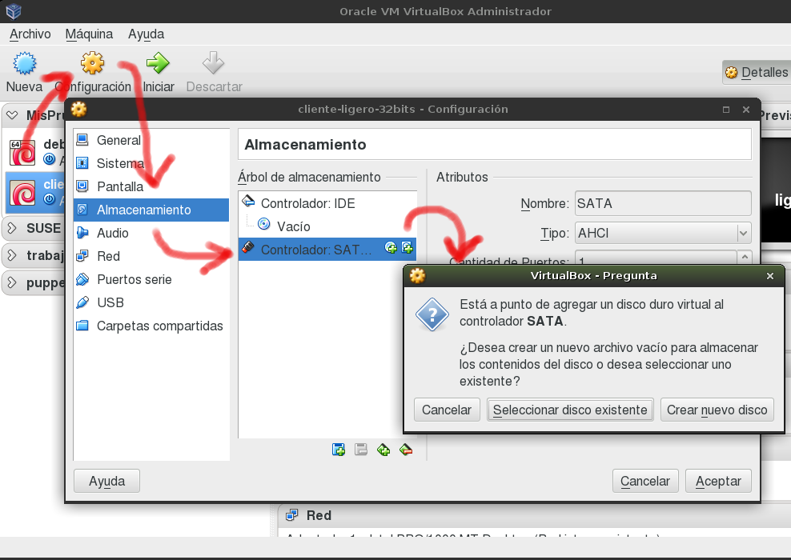
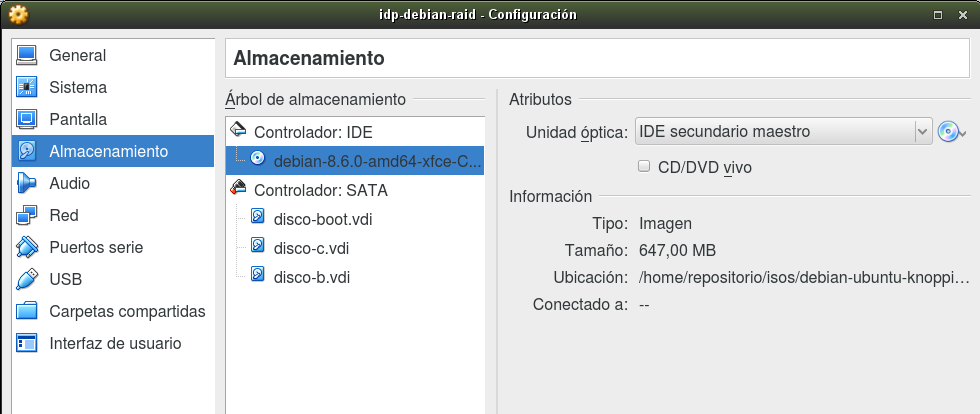
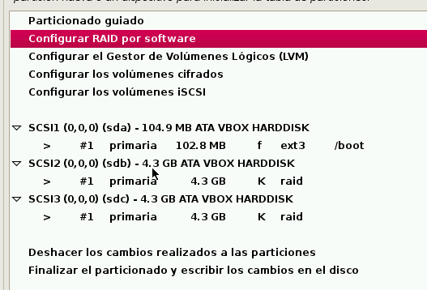
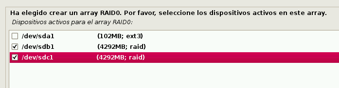
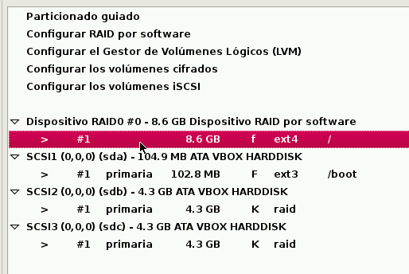

# 1. Instalar SO en RAID-0 software

Vamos a instalar un sistema operativo Debian sobre unos discos con RAID-0 software.

> Vídeo de interés:
> * [RAID en Ubuntu](https://youtu.be/z84oBqOxsD0?list=PLtGnc4I6s8duPu8fzK6zoNzczrXogvYnx). Este
> vídeo no es exactamente la actividad que vamos a realizar, pero muestra cómo se configuran
> discos RAID-1 software durante la instalación del SO Ubuntu 12.

> Con el comando `sha256sum -c debian.sha256` comprobamos si el fichero lo hemos descargado bien.

## 1.1 Creación de la MV

> Las máquinas (Y por tanto las MV de VirtualBox también), sólo aceptan 4 discos IDE,
o 3 discos IDE y 1 unidad de cdrom.
> Cuando necesitamos una mayor cantidad de discos, es mejor usar controladoras SATA y/o SCSI
en nuestra máquina.

Crear una máquina virtual nueva:
* Con 1 interfaz de red en modo puente.
* Comprobar que la unidad óptica debe estar en el controlador IDE.
* Con 3 discos virtuales en el controlador SATA:
    * (a) 100MB
    * (b) 4GB
    * (c) 4GB
Veamos una imagen de ejemplo para crear discos duros en una MV VirtualBox.





## 1.2 Particionado e instalación

En los siguientes pasos vamos a instalar GNU/Linux Debian, donde los discos
(b) y (c), van a formar un RAID-0.
* Empezamos el proceso de instalación.
* Elegimos particionado manual.

> Por esta vez sin swap (Área de intercambio).
> Tampoco vamos a crear una partición independiente para `/home`

* La partición `/boot`, va en el disco (a). Los ficheros que inician el SO
van en una partición aparte sin RAID, para evitar problemas en el boot del sistema.

Para hacer el RAID-0:
* Crear partición completa para el disco (b) y le damos formato tipo RAID.
* Crear partición completa para el disco (c) y le damos formato tipo RAID.
* Vamos a `Configuración RAID software`, y elegimos que queremos
hacer un RAID-0, con los discos (b) y (c).

> Cuando veamos las siglas 'MD', se refieren a "MultiDisks". Esto es un conjunto de discos RAID.

* Dentro del dispositivo `/dev/md0`(RAID-0) vamos a crear una partición que coja el RAID0 completo. Dentro de esta partición vamos a instalar el sistema operativo.

Veamos una secuencia de imágenes de ejemplo:









Veamos imagen de ejemplo, al realizar el particionado RAID0.


* Seguimos la instalación como siempre. Consultar la [configuración](../../global/configuracion/debian.md) de MV Debian.
    * Replica de red -> Sí. Elegir una cualquiera.
    * Proxy -> Vacío.
    * El sistema de arranque va en el disco (a).

> Recordar que hemos creado una partición separada para el arranque del sistema.

## 1.3 Comprobación

* Una vez instalado ejecutar los siguientes comandos, e incluir su salida en el informe:

```
date
hostname
ip a
route -n             # Ejecutar como superusuario
host www.google.es
fdisk -l             # Ejecutar como superusuario
df -hT
cat /proc/mdstat
lsblk -fm
```

---

# 2. RAID-1 software

> **IMPORTANTE**
> * Haz copia de seguridad de la MV VBox (snapshot/instantánea o clonarla).
> * Una vez que empiecen con los apartados 2.x,  NO apagar la MV porque al reiniciar
se pueden perder los cambios realizados.
> * Sólo se puede apagar la MV cuando terminen el punto 2.4.

Ahora vamos a añadir al sistema anterior, dos discos más para montar un RAID-1 software.

## 2.1 Preparar la MV

Realizar las siguientes tareas:
* Crear 2 discos virtuales: (d) 500MB, (e) 500MB. Importante: (d) y (e) deben ser del mismo tamaño.
* Reiniciar la MV
* Usar `fdisk -l` para asegurarnos que los discos nuevos son `/dev/sdd` y `/dev/sde`.

## 2.2 Usar mdadm para crear RAID-1

> Enlaces de interés:
>
> * [Crear y configurar un raid 1 por software](http://www.linux-party.com/index.php/60-software/9247-como-crear-y-configurar-un-raid-1-por-software-con-mdadm-en-linux)
> * [Por qué aparece /dev/md127 en lugar de /dev/md1](https://www.enmimaquinafunciona.com/pregunta/32104/por-que-mi-raid-devmd1-mostrando-como-devmd126-es-mdadmconf-ser-ignorado)

* Instalar el paquete `mdadm` (Administración de dispositivos RAID). En Debian se usan
los siguientes comandos:
    * `apt-get update`, para refrescar la información de paquetes de los repositorios.
    * `apt-get install mdadm`, para instalar el paquete.
* Ahora debe existir el fichero `/etc/mdadm/mdadm.conf`. Comprobarlo.

Vamos a crear un RAID-1 (`/dev/md1`) con los discos (d) y (e)
(Consultar [URL wikipedia sobre mdadm](https://en.wikipedia.org/wiki/Mdadm):
* `mdadm --create /dev/md1 --level=1 --raid-devices=2 /dev/sdd /dev/sde`

> * `mdadm` es la herramienta que vamos a usar para gestionar los dispositivos RAID.
> * `--create /dev/md1`, indica que vamos a crear un nuevo dispositivo con el nombre que pongamos.
> * `--level=1` el dispositivo a crear será un RAID-1.
> * `--raid-devices=2`, vamos a usar dos dispositivos (particiones o discos) reales para crear el RAID.

* Para comprobar si se ha creado el raid1 correctamente:

```
cat /proc/mdstat        # Muestra info de discos RAID
lsblk -fm               # Muestra info de los discos/particiones
mdadm --detail /dev/md1 # Muestra info del disposivo RAID md1
```
* Formatear el RAID-1 con ext4: `mkfs -t ext4 /dev/md1`

## 2.3 Escribir datos en el RAID-1

* Vamos a montar el dispositivo RAID-1 (/dev/md1) en el directorio /mnt/raid1: `mount /dev/md1 /mnt/raid1`.
* Con los comandos `df -hT` y `mount` podemos comprobar el paso anterior.

> Ahora podemos escribir información en /mnt/raid1.

* Crea lo siguiente en /mnt/raid1
    * Directorio `/mnt/raid1/nabooXX`
    * Fichero `/mnt/raid1/nabooXX/yoda.txt`
    * Directorio `/mnt/raid1/endorXX`
    * Fichero `/mnt/raid1/endorXX/sandtrooper.txt`

## 2.4 Configuración de RAID-1

Si reiniciamos la MV vamos a perder la configuración RAID1.
Vamos a configurar `mdadm.conf` para que RAID1 mantenga su configuración con cada reinicio del sistema.

* Hacer un snapshot de la MV por seguridad.
* Hacer una copia de seguridad del archivo `/etc/mdadm/mdadm.conf`.
* Consultar el contenido del fichero `/etc/mdadm/mdadm.conf`. Este archivo de configuración sólo tiene (de momento) una línea ARRAY correspondiente al RAID0.

Vamos a añadir una segunda línea ARRAY para el RAID1.
* Ejecutamos el comando `mdadm --examine --scan`. La información que nos muestra
sobre RAID1 la debemos usar para incluirla nosotros en el fichero de configuración.
* Otra forma de hacerlo es `mdadm --examine --scan >> /etc/mdadm/mdadm.conf`, de esta forma estamos añadiendo la salida del comando al fichero de configuración.
* Ahora hay que editar el fichero de configuración para dejar sólo 2 líneas ARRAY: una para RAID0 y otra para RAID1.

> **Redirección**
>
> * Si usamos la redirección de comandos, es más fácil escribir la configuración anterior.
Por ejemplo si hacemos `echo "hola" >> /etc/mdadm/mdadm.conf`, estamos añadiendo la salida de un comando al fichero de texto.

* `sudo update-initramfs -u`, tenemos que actualizir el fichero initramfs, de modo que contenga las configuraciones actualizadas de nuestro fichero `mdadm.conf` durante el arranque.
* Reiniciar la MV. Ahora ya se puede reiniciar la MV sin que se pierda la configuración RAID1 que hemos hecho.
* `cat /proc/mdstat`, comprobamos que el sistema ha detectado bien los dispositivos RAID.

## 2.5 Montaje automático

> El fichero `/etc/fstab` guarda información de los dispositivos que deben montarse al iniciarse la máquina.

Vamos a configurar `/etc/fstab` para que el disco raid1 se monte automáticamente en cada reinicio.

* Hacer una copia de seguridad del archivo `/etc/fstab`.
* Configurar `/etc/fstab` para que el disco raid1 se monte automáticamente en cada reinicio.
* Añadir la siguiente línea al fichero `/etc/fstab`:
```
/dev/md1 /mnt/raid1 ext4 defaults 0 2
```
* Para comprobar, reiniciamos la MV y ejecutamos `df -hT`. Debe aparecer montado el
dispositivo RAID1.

---

# 3. Quitar un disco y probar

* Apagamos la MV.
* Quitar en VirtualBox uno de los discos del raid1 (`/dev/sde`).
* Reiniciamos la MV y comprobamos que la información no se ha perdido.
* Volver a poner el disco en la MV, reiniciar.

Vamos a sincronizar los discos y comprobar que todo está correcto.

> Para sincronizar los discos RAID1:
> * [Enlace de interés para arreglar dispositivos RAID1](http://www.seavtec.com/en/content/soporte/documentacion/mdadm-raid-por-software-ensamblar-un-raid-no-activo).

* `mdadm --detail /dev/md1`, comprobamos que de los dos discos configurados, sólo hay uno.
* Aun habiendo quitado uno de los discos del RAID1 la información sigue estando
disponible. Comprobamos `tree /mnt/raid1`
* `mdadm /dev/md1 --manage --add /dev/sde`, añadimos el disco que habíamos quitado.
* `mdadm --detail /dev/md1`, comprobamos que están los dos discos del RAID-1.

Una vez realizado lo anterior, ejecutar los siguientes comandos, y comprobar su salida:
```
date
fdisk -l
df -hT
cat /proc/mdstat
lsblk -fm
cat /etc/mdadm/mdadm.conf
```

> NOTA: Para consultar el UUID de una partición podemos usar el comando "blkid" o hacer "vdir /dev/disk/by-uuid".

---

# 4. Discos dinámicos en Windows

* Haremos esta parte con MV Windows Server, para asegurarnos de que tenga soporte
para implementar RAID5.
* En windows las particiones se llaman volúmenes básicos.
* Para poder hacer RAID debemos convertir los volúmenes básicos en dinámicos.
* Equivalencias:
    * Reflejo: RAID1
    * Seccionado: RAID0 con todos los discos de igual tamaño.
    * Distribuido: similar a RAID0 pero puede usar discos de distinto tamaño.

## 4.1 Volumen Seccionado (RAID0)

Un volumen *seccionado* es similar a un RAID0.

> Enlaces de interés:
>
> * Vídeo sobre la [Creacion de un volumen seccionado de Windows](https://www.youtube.com/watch?v=g0TF38JV1Xk)
> * Vídeo sobre [RAID 0, 1 y 5 en Windows Server 2008](https://www.youtube.com/watch?v=qUNvCqWkeBA)

Vamos a crear un volumen *seccionado*.
* Añadir 4 discos duros virtuales de 200 MB cada uno a la MV.
* Crea un volumen seccionado con un tamaño total de 800MB, utilizando para ello los 4 discos.

> Un volumen Seccionado es similar a un RAID0, donde todos los discos de igual tamaño.

## 4.2 Volumen Reflejado (RAID1)

Un volumen *Reflejado* es similar a un RAID1.

> Enlaces de interés:
>
> * Vídeo sobre [Creación de un volumen reflejado en Windows7](https://www.youtube.com/watch?v=UzIR9FHZyEQ).
> * Vídeo sobre [RAID 0, 1 y 5 en Windows Server 2008](https://www.youtube.com/watch?v=qUNvCqWkeBA).
> * Web sobre [Configurar unas particiones reflejadas en Windows Server 2008](https://support.microsoft.com/es-es/kb/951985).

Vamos a crear un volumen *reflejado*:
* Crea un par de volúmenes reflejados de 200MB cada uno, con los discos anteriormente utilizados.
* Crear un fichero `prueba-mirror.txt` en el volumen reflejado. Escribe tu nombre dentro.
* Si quitamos uno de los discos del RAID1 de la MV ¿qué ocurre?
* Vuelve a poner los dos discos. Deshacer/romper el RAID1 entre los dos discos.
¿Qué ocurre?

## 4.3 Pregunta RAID5

* Vídeo sobre [RAID 0, 1 y 5 en Windows Server 2008](https://www.youtube.com/watch?v=qUNvCqWkeBA)
* Investiga acerca de cómo crear en Windows un Raid-5 por software y detalla la respuesta.

---

# ANEXO

## A.1 Raid error /dev/md127

* [EN - enlace](http://unix.stackexchange.com/questions/148062/mdadm-raid-doesnt-mount)

Your arrays are not properly started. Remove them from your running config with this:
```
mdadm --stop /dev/md12[567]
```

Now try using the autoscan and assemble feature.
```
mdadm --assemble --scan
```

Assuming that works, save your config (assuming Debian derivative) with
(and this will overwrite your config so we make a backup first):

```
mv /etc/mdadm/mdadm.conf /etc/mdadm/mdadm.conf.old
/usr/share/mdadm/mkconf > /etc/mdadm/mdadm.conf
```

You should be fixed for a reboot now, and it will auto assemble and start every time.
If not, give the output of:

```
mdadm --examine /dev/sd[bc]6 /dev/sd[bc]7
```

It'll be a bit long but shows everything you need to know about the arrays
and the member disks of the arrays, their state, etc.

Just as an aside, it normally works better if you don't create multiple raid arrays on a disk (ie, /dev/sd[bc]6 and /dev/sd[bc]7) separately. Rather create only one array, and you can then create partitions on your array if you must. But LVM is a much better way to partition your array most of the time.
