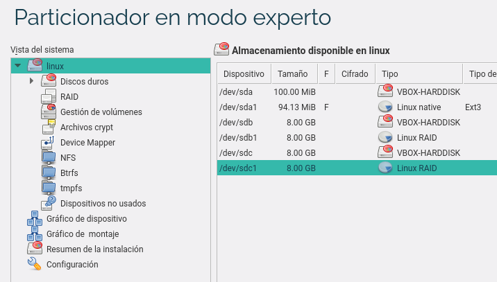
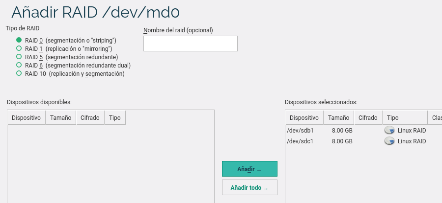
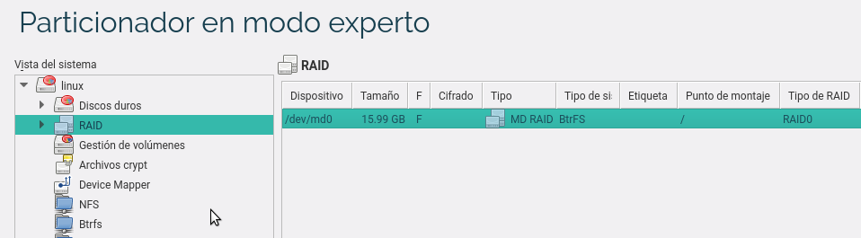

# 1. Instalar OpenSUSE en disco RAID0 software

Vamos a instalar un sistema operativo OpenSUSE sobre unos discos en RAID0 software.

> Con el comando `sha256sum -c opensuse-version.sha256` comprobamos si el fichero lo hemos descargado bien.

## 1.1 Creación de la MV

* Crear una máquina virtual nueva con 3 discos virtuales SATA:
    * (a) 100MB,
    * (b) 4GB
    * (c) 4GB.

Veamos una imagen de ejemplo para crear discos duros en una MV VirtualBox.


* Vamos a instalar GNU/Linux OpenSUSE en los discos (b) y (c), van a formar un RAID-0.

## 1.2 Particionado e instalación

* Empezamos el proceso de instalación.
* Elegimos particionado experto o manual.

> Para hacer el RAID-0:
>
> * Hacemos una partición que coja todo el disco (sdb) y otra para el (sdc)
> * Elegimos tipo RAID para cada partición (sdb1) y (sdc1).
> * Luego debemos ir a `RAID`, y elegimos que queremos hacer un raid0, con las paritciones (sdb1) y (sdc1).
> * Cuando veamos las siglas 'MD', se refieren a "MultiDisks". Esto es un conjunto de discos RAID.
> * Por esta vez sin swap (Área de intercambio).
> * Tampoco vamos a crear una partición independiente para `/home`

* En el disco (a), creamos una partición `ext3` y montamos `/boot`. Los ficheros que inician el SO
van en una partición aparte sin RAID, para evitar problemas en el boot del sistema.
* El sistema de arranque irá en el disco (a).
* En los discos (b) y (c), creamos una partición completa de tipo `Volumen físico RAID`.
* Crearemos un dispostivo RAID0 llamado `/dev/raid0` vamos a crear una partición que coja el RAID0 completo.
Dentro de esta partición vamos a instalar el sistema operativo.

Veamos una secuencia de imágenes de ejemplo:







* Seguimos la instalación como siempre. Consultar la [configuración](../../global/configuracion/opensuse.md).

## 1.3 Comprobación

* Una vez instalado ejecutar los siguientes comandos, e incluir su salida en el informe:

```
date                 # Muestra la fecha/hora actual
hostname             # Nombre de la máquina
ip a                 # Muestra configuración interfaces de red
route -n             # Muestra información de enrutamiento
host www.google.es   # Comprueba la resolución de nombres
fdisk -l             # Muestra particiones y discos
df -hT               # Muestra los puntos de montaje
cat /proc/mdstat     # Muestra la configuración RAID
lsblk -fm            # Muestra esquema de discos/particiones/montaje
```

---

# 2. RAID-1 software

> **IMPORTANTE**
> * Haz copia de seguridad de la MV VBox (snapshot/instantánea o clonarla).
> * Una vez que empiecen con los apartados 2.x,  NO apagar la MV. Sólo se puede apagar la MV
cuando terminen el punto 2.4, se puede reiniciar la máquina sin perder los resultados.

Ahora vamos a añadir al sistema anterior, dos discos más para montar un RAID-1 software.

## 2.1 Preparar la MV

Realizar las siguientes tareas:
* Crear 2 discos virtuales: (d) 500MB, (e) 500MB. Importante: (d) y (e) deben ser del mismo tamaño.
* Reiniciar la MV
* Usar `fdisk -l` para asegurarnos que los discos nuevos son `/dev/sdd` y `/dev/sde`.

## 2.2 Usar mdadm para crear RAID-1

Vamos a crear un RAID-1 (`/dev/md1`) con los discos (d) y (e)
(Consultar [URL wikipedia sobre mdadm](https://en.wikipedia.org/wiki/Mdadm):
* `mdadm --create /dev/md1 --level=1 --raid-devices=2 /dev/sdd /dev/sde`

> * `mdadm` es la herramienta que vamos a usar para gestionar los dispositivos RAID.
> * `--create /dev/md1`, indica que vamos a crear un nuevo dispositivo con el nombre que pongamos.
> * `--level=1` el dispositivo a crear será un RAID-1.
> * `--raid-devices=2`, vamos a usar dos dispositivos (particiones o discos) reales para crear el RAID.

* Para comprobar si se ha creado el raid1 correctamente:

```
cat /proc/mdstat        # Muestra info de discos RAID
lsblk -fm               # Muestra info de los discos/particiones
mdadm --detail /dev/md1 # Muestra info del disposivo RAID md1
```
* Formatear el RAID-1 con ext4: `mkfs -t ext4 /dev/md1`

## 2.3 Escribir datos en el RAID-1

* Montar el dispositivo RAID-1 (/dev/md1) en /mnt/raid1: `mount /dev/md1 /mnt/raid1`.
* Con los comandos `df -hT` y `mount` podemos comprobar el paso anterior.

> Ahora podemos escribir información en /mnt/raid1.

* Crea lo siguiente en /mnt/raid1
    * Directorio `/mnt/raid1/naboo`
    * Fichero `/mnt/raid1/naboo/yoda.txt`
    * Directorio `/mnt/raid1/endor`
    * Fichero `/mnt/raid1/endor/sandtrooper.txt`

## 2.4 Configuración de RAID-1

Si reiniciamos la MV vamos a perder la configuración RAID1.
Vamos a configurar mdadm.conf para que RAID1 pierda su configuración con cada reinicio del sistema.

* Hacer un snapshot de la MV por seguridad.
* Hacer una copia de seguridad del archivo `/etc/mdadm/mdadm.conf`.
* Consultar el fichero `/etc/mdadm/mdadm.conf`. Este archivo de configuración sólo tiene una línea ARRAY correspondiente al RAID0.
* Para añadir una segunda línea ARRAY para el RAID1, nos ayudamos de la salida del comando siguiente: `mdadm --examine --scan`.
La información correspondiente al RAID1 la tenemos que incluir nosotros en el fichero de configuración.
* `mdadm --examine --scan >> /etc/mdadm/mdadm.conf`, de esta forma estamos añadiendo la salida del comando al fichero de configuración.
* Ahora hay que editar el fichero de configuración para dejer sólo 2 líneas ARRAY: una para RAID0 y otra para RAID1.

> **Redirección**
>
> * Si usamos la redirección de comandos, es más fácil escribir la configuración anterior.
Por ejemplo si hacemos `echo "hola" >> /etc/mdadm/mdadm.conf`, estamos añadiendo la salida de un comando al fichero de texto.

* `sudo mkinitrd`, tenemos que actualizar el fichero initramfs, de modo que contenga las configuraciones de nuestro mdadm.conf durante el arranque.
* Ahora ya se puede reiniciar la MV sin que se pierda la configuración RAID1 que hemos hecho.

## 2.5 Montaje automático

> El fichero `/etc/fstab` guarda información de los dispositivos que deben montarse al iniciarse la máquina.

Vamos a configurar `/etc/fstab` para que el disco raid1 se monte automáticamente en cada reinicio.

* Hacer una copia de seguridad del archivo `/etc/fstab`.
* Configurar `/etc/fstab` para que el disco raid1 se monte automáticamente en cada reinicio.
* Añadir la siguiente línea al fichero `/etc/fstab`:
```
/dev/md1 /mnt/raid1 ext4 defaults 0 2
```

---

# 3. Quitar disco y probar

* Apagamos la MV.
* Quitar en VirtualBox uno de los discos del raid1 (`/dev/sde`).
* Reiniciamos la MV y comprobamos que la información no se ha perdido.
* Volver a poner el disco en la MV, reiniciar.

Vamos a sincronizar los discos y comprobar que todo está correcto.

> Para sincronizar los discos RAID1:
> * [Enlace de interés para arreglar dispositivos RAID1](http://www.seavtec.com/en/content/soporte/documentacion/mdadm-raid-por-software-ensamblar-un-raid-no-activo).

* `mdadm --detail /dev/md1`, comprobamos que de los dos discos configurados, sólo hay uno.
* `mdadm /dev/md1 --manage --add /dev/sdX`, añadimos el disco que falta (sdd o sde, depende de cada caso).
* `mdadm --detail /dev/md1`, comprobamos que están los dos.

Una vez realizado lo anterior, ejecutar los siguientes comandos, y comprobar su salida:
```
date
fdisk -l
df -hT
cat /proc/mdstat
lsblk -fm
cat /etc/mdadm/mdadm.conf
```

> NOTA: Para consultar el UUID de una partición podemos usar el comando "blkid" o hacer "vdir /dev/disk/by-uuid".

---

# 4. Discos dinámicos en Windows

* Haremos la práctica con MV Windows Server, para asegurarnos de que tenga soporte
para implementar RAID5.

En windows las particiones se llaman volúmenes básicos.

Para poder hacer RAID se convierten los volúmenes básicos en dinámicos.
* Reflejo: RAID1
* Seccionado: RAID0 con todos los discos de igual tamaño.
* Distribuido: parecido a RAID0 usando discos de distinto tamaño.

## 4.1 Volumen Seccionado (RAID0)

Vamos a crear un volumen *seccionado*:
* Vídeo sobre la [Creacion de un volumen seccionado de Windows](https://www.youtube.com/watch?v=g0TF38JV1Xk)
* Vídeo sobre [RAID 0, 1 y 5 en Windows Server 2008](https://www.youtube.com/watch?v=qUNvCqWkeBA)

* Crea un volumen seccionado con un tamaño total de 800MB,utilizando para ello 4 discos duros virtuales de 200 MB cada uno.

> Un volumen Seccionado es similar a un RAID0, donde todos los discos de igual tamaño.

## 4.2 Volumen Reflejado (RAID1)

Un volumen *Reflejado* es similar a un RAID1.
* Vídeo sobre la [Creación de un volumen reflejado en Windows7](https://www.youtube.com/watch?v=UzIR9FHZyEQ).
* Vídeo sobre [RAID 0, 1 y 5 en Windows Server 2008](https://www.youtube.com/watch?v=qUNvCqWkeBA)
* Enlace sobre cómo [Configurar unas particiones reflejadas en Windows Server 2008](https://support.microsoft.com/es-es/kb/951985)

* Crea un par de volúmenes reflejados de 200 MB cada uno, con los discos anteriormente utilizados.
* Crear un fichero `prueba-mirror.txt` en el volumen reflejado. Escribe tu nombre dentro.
* Rompe los discos utilizando la opción adecuada. ¿Qué ocurre?

## 4.3 Pregunta RAID5

* Vídeo sobre [RAID 0, 1 y 5 en Windows Server 2008](https://www.youtube.com/watch?v=qUNvCqWkeBA)
* Investiga acerca de cómo crear en Windows un Raid-5 por software y detalla la respuesta.

---

# ANEXO

## A1: proceso para OpenSUSE

RAID0
* Crear MV con los discos
* Elegit idioma e instalar
* Particionador modo experto
* sda1 ext3 /boot
* sdb1 (volumen bruto) -> raid
* sdc1 (volumen bruto) -> raid
* Raid0 -> Añadir 2 particiones
* Siguiente -> Volumen para SO
* Elegir ext4 /
* Sin swap
* Escritorio XFce
RAID1
* Crear discos VBox
* Iniciar MV
* Yast -> Particionador
* crear particiones raid
* Crear md1 , montar y formatear
* usar dispositivio raid1
