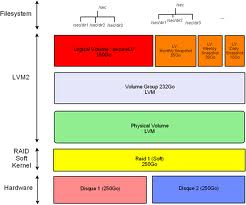

#Combinar RAID y LVM

Vamos a combinar RAID con LVM.




Realizar los siguientes pasos:
* Crear 3 discos:
    * (a) 3GB.
    * (b) 1GB
    * (c) 1 GB
> NOTA: Los discos B y C deben tener el mismo tamaño, porque formarán un RAID-1 en espejo.

Configurar un RAID-1 (espejo) con los discos B y C.
* Sobre el dispositivo raid1 (/dev/md1) vamos a configurar un LVM.
* Crear un Grupo de Volumen (vg-trek), y crear 2 Volúmenes Lógicos:
    * (e) 500 MB (vl-datos)
    * (f) 100 MB (vl-prueba)

Finalmente el particionado debe quedar de la siguiente forma:
```
    /dev/sda1 -> / (3GB)
    /dev/sdb -> RAID1
    /dev/sdc -> RAID1
    /dev/md1 -> 1GB en raid1
    /dev/vg-trek/vl-datos -> /home (500 MB)
    /dev/vg-trek/vl-prueba -> (100MB) No montarlo en la instalación
```

> **OPCIONAL**: Realizar la instalación del sistema operativo, con el entorno gráfico.

* Crear el directorio /mnt/vol-prueba, y montar el volumen lógico vl-prueba en él.
* Escribir información en /home y en /mnt/vol-prueba.
* Aumentar el tamaño de vl-datos 50MB.
* Reducir el tamaño de vl-prueba 30 MB.
* Comprobar el resultado.
