```
* Práctica utilizada en los cursos 201415, 201314, 201211
```

#0. Introducción

* En esta práctica vamos a montar un PDC (Controlador Primario de Dominio) con Windows 2008 Server.
* Leer/consultar la documentación de la unidad.
* Realizaremos las prácticas en MV's que pueden estar todas en el mismo PC o en varios diferentes.
     
#1. Preparativos

Necesitaremos:
* 1 MV con Windows 2008 Server Enterprise (Consultar [configuración](../../global/configuracion-aula109.md)).
* 2 MV con Windows 7 Profesional

> **NOTA**
>
> * Las diferencias entre las distintas versiones de SO Windows: Standard, Professional, Enterprise, etc. 
son las funcionalidades/características que vienen activas o deshabilitadas.
> * Si trabajamos con Windows 2003 Server el disco duro en VirtualBox debe estar configurado 
con el controlador IDE, para evitar problemas con los drivers SATA.
> * Recién instalado, WinServer es estricto con la política de seguridad, en cuanto a cómo 
deben definirse las claves (Mayúsculas, minúsculas, números y caracteres especiales y 
longitud superior a 10).
> * Se puede deshabilitar en las `Directivas de seguridad local -> Directivas de cuenta`, 
pero reduciríamos la seguridad de las contraseñas. Un ejemplo de contraseñas segura: `obiwanKENOBI2016`.

Veamos imagen de configuración inicial de nuestro servidor:

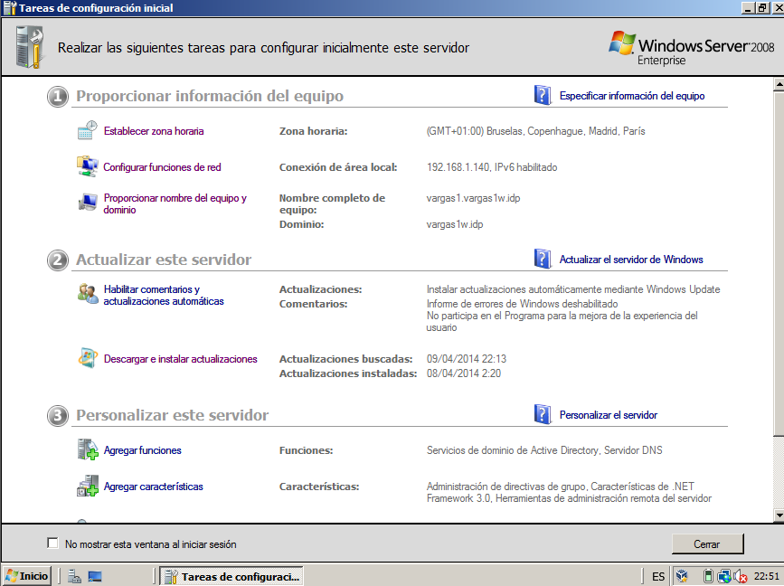

* Windows Server tiene una herramienta en `Inicio -> Administrar el Servidor`, 
que nos permite consultar la configuración del servidor, instalar/desinstalar 
paquetes/funciones/servicios, y acceder a los paneles de administración de los distintos servicios.

#2. Instalar el Controlador de dominio

> * **DA**:
>     * El DA(Directorio Activo) es una base de datos LDAP, que guarda la información de los objetos de nuestro dominio.
> * **NOMBRE DE DOMINIO**:
>     * Cada PDC se identifica con su nombre de dominio, el cuál debe ser único. Hay que evitar que el nombre de dominio se repita con la configuración de otro compañero.
>     * En realidad podríamos poner cualquier nombre, pero lo haremos según indique el profesor, para organizar mejor las distintas máquinas de la clase. 
>     * Además los nombres de dominio NO debe ser muy largos. Preferiblemente menos de 10 letras, para evitar problemas con los clientes Windows anteriores a Vista/7/8.

Instalación:
* Para activar la función de controlador de dominios podemos hacerlo de dos formas:
    * Abrir una consola (cmd) y ejecutar el comando `dcpromo`.
    * Ir a `Inicio -> Administrar el servidor -> Agregar funciones`. 
    (Servicio de Dominio de Directorio Activo y el Servicio DNS).

Veamos imagen del comando `dcpromo` en ejecución:

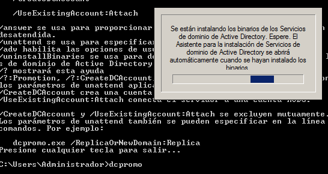

* Se inicia el asistente de configuración de los servicios del dominio de AD. Ponemos los
siguientes valores:
```
* Modo experto => NO
* Crear un dominio nuevo de un bosque nuevo => SI
* FQDN del dominio => `NOMBRE_DEL_SERVIDOR.NOMBRE_DE_DOMINIO`
* Nivel funcional del bosque => Windows Server 2008
* Servidor DNS => SI
* Carpetas de almacenamiento => Dejar valores por defecto.
* Al terminar reiniciar el sistema.
``` 

Vemos imagen, donde podemos comprobar que se han instalado varias "funciones" para controlar el dominio:

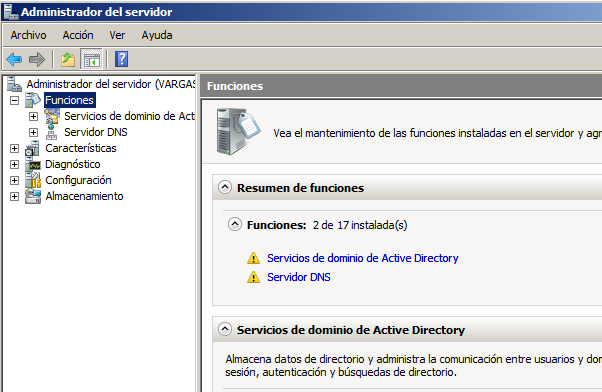

#3. Usuarios del dominio

* Leer/consultar los apuntes para entender los conceptos siguientes: 
usuario local, usuario del dominio, equipo del dominio, grupo local, grupo del dominio.
* Enlace de interés:
    * [Definiciones de ámbito local, global y universal](https://msdn.microsoft.com/es-es/library/cc755692%28v=ws.10%29.aspx) 
    * [Deshabilitar políticas de clave en Windows 2008 Server](http://www.radians.com.ar/blog/?p=403)  
    * [Usuarios y Grupos](http://www.ite.educacion.es/formacion/materiales/85/cd/windows/10Usuarios/index.html).

Vamos a crear usuarios y grupos del dominio:
* Ir a `Inicio -> Herramientas Administrativas -> Usuarios y Equipos de Active Directory`
* Crear el grupo (tipo global) JEDI con los siguientes usuarios de dominio: "yoda,", "obiwan" y "quigon". No confundir usuarios locales con usuarios del dominio.
* Crear el grupo (tipo global) SITH con los siguientes usuarios de dominio: "emperador", "vader" y "maul".

Vemos imagen con los usuarios del dominio creados:

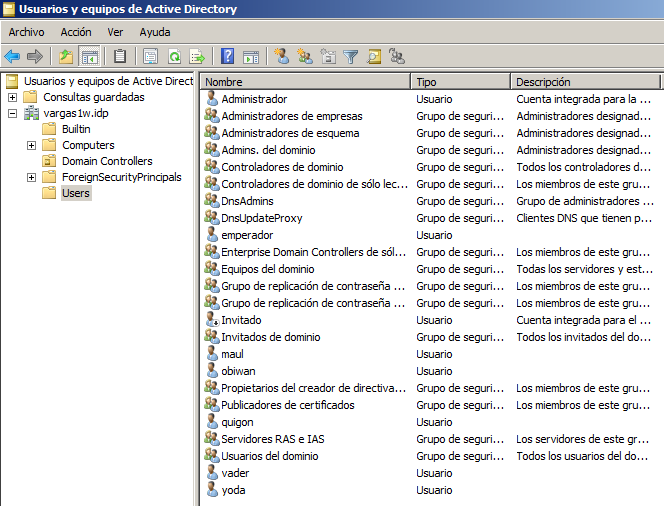

#4. Equipos del dominio

```
MV's CLIENTES: 
* Necesitaremos 2 MV's con Windows 7 profesional, que actuarán de clientes o equipos del dominio.
* Podemos crear una MV, y luego clonarla, modificando la MAC de la segunda MV, para 
  no tener problemas de conectividad por tarjetas de red duplicadas.

FECHA/HORA
* Es muy importante que todos los equipos estén bien sincronizados en cuanto al reloj. 
  No puede haber diferencias de más de 5 minutos.

RED: 
* Además cada cliente debe tener como DNS1 la IP del PDC, y como DNS2 al 8.8.4.4.
``` 

* [Configurar las MVs](../../global/configuracion-aula109.md))
* Unir el equipo cliente al dominio. 
    * Ir a `Equipos (Botón derecho) -> Propiedades -> Cambiar configuración -> Cambiar -> Dominio (Escribir el nombre del dominio) -> Aceptar`.

Veamos imagen de ejemplo:

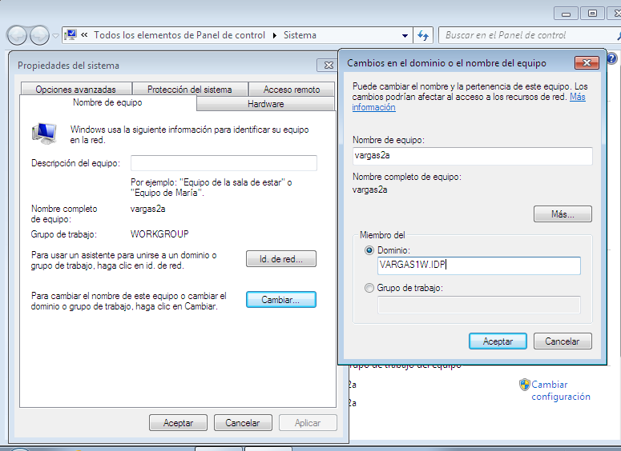     

##4.1 Problemas en la unión al dominio

Espero que no tengas problemas y puedas saltar este apartado, si no es así... sigue leyendo.

Si tuviéramos poblemas al realizar esta tarea de unión del equipo al dominio, tenemos varias opciones:

* Esperar 5 minutos y repetir el proceso. Las redes SMB/CIFS tardan un tiempo en propagar la información de los equipos por la red.
* Volver a comprobar que todas las configuraciones son correctas. Repite el paso uno (NOTA: Pon un compañero contigo mientras lo haces. 4 ojos ven más que 2).
* Consultar la información que contiene el servidor DNS del W2k8server. Si está vacía probar a resinstalar AD y DNS en W2k8server 
(NOTA: Una configuración incorrecta del servidor DNS hará que no se puedan unir los equipos al dominio).
* Probar a poner como puerta de enlace del cliente la IP del servidor PDC.
* Configurar las másquinas servidor y cliente en la misma red interna de VirtualBox (Consultar configuración de red de VirtualBox) y vuelve a intentarlo (NOTA: Pueden darse problemas si se repiten IP's no nombres de máquinas en la red. Al crear una red interna tenemos una zona aislada bajo nuestro control).
* ¿Repetimos?

##4.2 Comprobaciones


Comprobar que podemos entrar en los equipos cliente ("kenobi2a" y "kenobi2b") usando los usuarios del dominio.

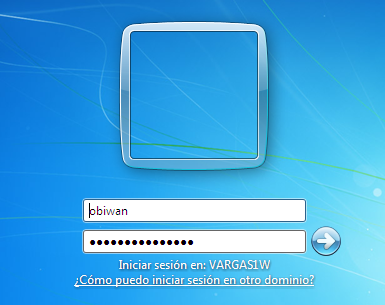

* Para entrar como usuario local poner "VARGAS2A\profesor". Esto es, "nombre-de-máquina\nombre-usario-local".

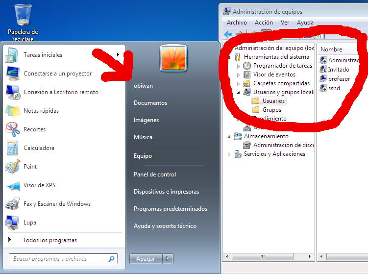

* Comprobar en el PDC que aparecen los equipos CLIENTE1 y CLIENTE2 como equipos del dominio.

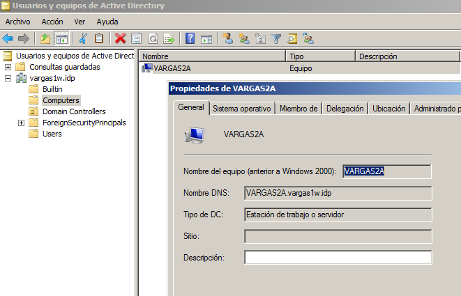


#5. Perfiles móviles

Material de lectura/estudio/consulta:
* Leer/consultar los apuntes para entender los conceptos de perfiles, perfil móvil y perfil obligatorio. 
* Consultar Vídeo [Windows Server 2008 - Perfiles moviles con Windows 7](https://youtu.be/kgGmLWO6dzs)

##5.1 Crear un segundo disco:

* Crear un segundo disco (1GB). Lo usaremos para guardar los perfiles (En la carpeta compartida `E:\perfiles$`).

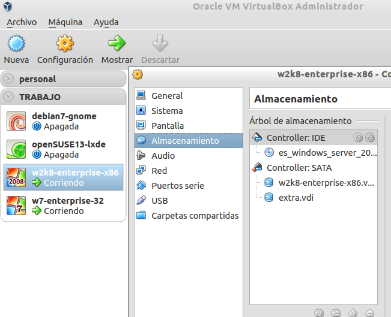

* Hay que formatear el disco NTFS y asignarle la letra E.

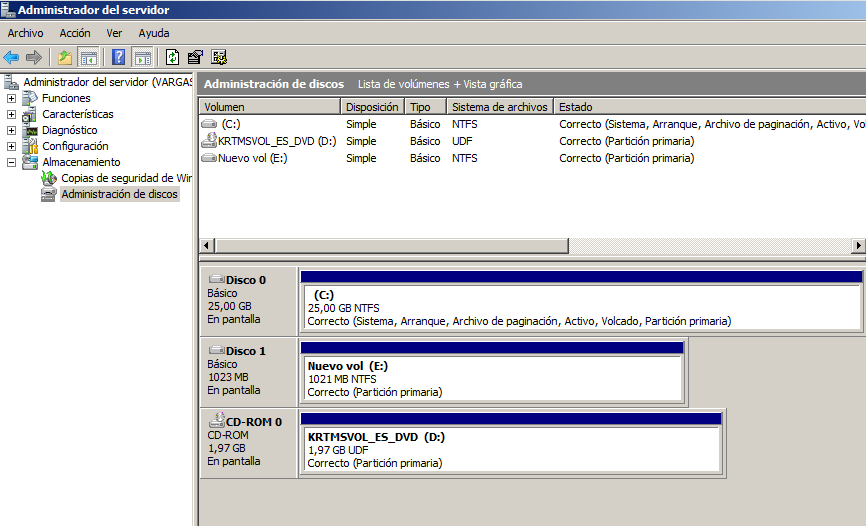

##5.2 Crear Perfiles de usuarios:

* En el PDC, crear la carpeta `E:\perfiles$`, como compartida por red. 
Permisos lectura/escritura para todos los usuarios del dominio.
* En el PDC, modificar el atributo `perfil` de los siguientes usuarios del dominio:
    * yoda: \\ip-del-PDC\perfiles$\%username%
    * obiwan: \\ip-del-PDC\perfiles$\%username%
    * quigon: \\ip-del-PDC\perfiles$\%username%
    * emperador: \\ip-del-PDC\perfiles$\%username%
    * vader: \\ip-del-PDC\perfiles$\%username%
    * maul: \\ip-del-PDC\perfiles$\%username%
* Iniciar sesión en CLIENTE1 con los usuarios obiwan y maul. 
* Para cada usuario modificar el entorno del escritorio, colores, iconos.
* Para el usuario del dominio obiwan
    * Crear la carpeta jedy en el escritorio
    * Crear fichero "Escritorio/jedi/personajes.txt". Escribir dentro los nombres de los 3 jedis.
* Para el usuario dominio maul
    * Crear la carpeta sith en el escritorio
    * Crear fichero "Escritorio/sith/personajes.txt". Escribir dentro los nombres de los 3 siths.

> De este modo el "perfil" de cada usuario será diferente en aspecto.

* Debemos comprobar que se han creado las carpetas con los perfiles en el servidor.


##5.3 Limpiar el equipo cliente

* Iniciar sesión en CLIENTE1 con el "administrador" del dominio.

Ver imagen de ejemplo:

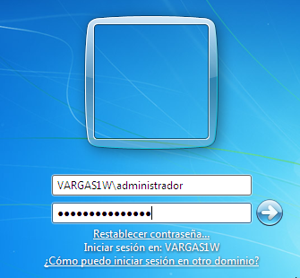

* Ir a `Inicio -> Panel de Control -> Sistema -> Opciones Avanzadas -> Configuración de Perfiles de usuario`. 
* Eliminar las copias de los perfiles locales en el equipo cliente.

perfiles-en-cliente

* Entrar en el equipo CLIENTE2, con los usuarios del dominio (obiwan y maul)
* Comprobar que tenemos perfiles móviles para ellos.

> El perfil móvil permite al usuario moverse por PC's diferentes y ver el mismo entorno con sus datos.

#6. Perfiles obligatorios

* Enlace de interés: [Crear perfil obligatorio dando los permisos adecuados](http://somebooks.es/?p=3400)
* Vídeo [Usuario con perfil obligatorio Windows Server 2008](https://youtu.be/TKCmAFcKSGA)

* Convertir el perfil móvil del  Sith Maul, a perfil obligatorio. 
* Comprobar que ahora el perfil no cambia.

#7. Control de tiempo

* Modificar los permisos de acceso de los usuarios del dominio, de la siguiente forma:
    * Los "jedi" sólo pueden acceder de 08:00 a 14:00 y
    * Los "sith" sólo pueden acceder de 14:00 a 20:00
