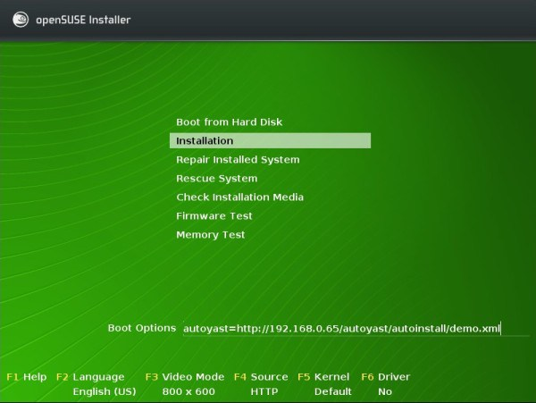

```
Instalación desatendida con OpenSUSE
* Creada en el curso 201314.
* Problemas en la lectura del fichero autoyast.xml
```

#Instalaciónes desatendidas

Una instalación desatendida del sistema operativo ejecuta el proceso completo 
de la instalación del sistema operativo de forma automática, sin hacer preguntas al usuario.

* Vamos a crear 2 instalaciones desatendidas para el sistema operativo OpenSuse.
* Entregas:
    * (a) Entregar URL apuntando a la distro creada en el apartado 1.
    * (b) Informe los pasos del apartado 2.

#1. SuseStudio

Vamos a crear una distro personalizada apropiada para 1ASIR. 

* Ir a la web SuseStudio y registrarse.
* Crear una distro con el nombre `idp1516-nombre-del-alumno`.
* Vamos a crear nuestro proyecto a partir de un modelo base. 
    * Para eso elegiremos la plantilla KDE o Gnome. 
    Esto nos crea un sistema de escritorio mínimo KDE o Gnome, 
    y a partir de aquí seguimos con nuestra personalización.
* Incluir:
    * Añadir programas/paquetes: 
        * tree, nmap, traceroute, gvim, ruby, geany, putty, minicom, gtk-recordmydesktop, recordmydesktop.
        * Incluir paquetes idioma español: `kde4-l10n-es`, `desktop-translations`
        * `yast2-users`
        * `virtualbox-guest-desktop`
        * `pattern-openSUSE-...-basis`
        * Incluir como Desktop secundario XFCE (El nombre del paquete es `patterns-openSUSE-xfce`).
    * Idioma español y teclado español. Zona horaria Europa/Canarias.
    * Activar `Configuración -> Appliance -> Add live installer CD/DVD`.
    * Para crear el usuario elegir una de las siguientes opciones:
        * (a) Crear usuario `linux` con clave `linux`.
        * (b) Activar autologin o en su defecto 
        * (c) Informar en el EULA de los usuarios/claves configurados en el sistema.
    * Descargar los ficheros:
        * `https://downloads.tuxfamily.org/godotengine/2.0.3/Godot_v2.0.3_stable_x11.64.zip`
        * `https://downloads.tuxfamily.org/godotengine/2.0.3/Godot_v2.0.3_stable_demos.zip`
    * Añadirlos a la distro sin descomprimir
        * `Move/rename`, definir ruta `/opt/godot-engine`.
        * Activar `Extract`, para que automáticamente descomprima los ficheros cuando construya la ISO.

* Ahora construimos la distro con `build`, eligiendo `Live CD/DVD iso`.
* Probamos la distro de forma remota con `Testdrive`
* Y si estamos contentos con el resultado, la publicamos con `Share`
     * Usar etiquetas `idp1516`
* Entregar URL de la distro publicada al profesor.
        
> De forma opcional se puede continuar con lo siguiente:
> * Clonar la distro y compartir la original (Share).
> * Tratar de hacer una segunda versión con escritorios ligeros (LXDE o XFCE).

#2. Instalación desatendida de OpenSUSE con `autoyast`

Enlace de interés:
* [Instalación desatendida con autoyast](https://dtrinf.wordpress.com/2012/11/06/instalacion-de-suse-desatendida-con-autoyast/)  
* [Documentación de AutoYast](https://doc.opensuse.org/projects/autoyast/)   
* [Resumen de los comandos versión 13.1](https://es.opensuse.org/openSUSE:Vadem%C3%A9cum_comandos_13.1)   

##2.1 Crear el fichero `autoyast.xml`

Necesitamos el fichero `autoyast.xml`, con las respuestas a las preguntas del instalador.

###2.1.1 Opción 1 - Instalando una MV desde cero

Hacemos una nueva instalación de OpenSUSE en MV.
* Incluir los programas/paquetes siguientes: tree, nmap, traceroute, vim, ruby, geany, putty, minicom, gtk-recordmydesktop.
* Crear el usuario `nombre-alumnoXX`.
* Configurar el nombre de máquina con `primer-apellido-alumnoXX`.
* Configurar dominio con `curso1516`.
* Asegurarse de que se guarda el fichero `autoyast.xml` durante el proceso.
Este fichero guarda las decisiones que tomamos sobre la configuración de nuestra instalación.

> `autoyast.xml`  es  nuestro "Control File". 
> Esto es, un fichero XML con las definiciones que elijamos para nuestra instalación desatendida.

###2.1.2 Opción 2 - Usando una MV con el sistema operativo ya instalado

Si no se hubiera creado el fichero `autoyast.xml` durante la instalación entonces
vamos a crearlo ahora en nuestra MV con el sistema ya instalado.
* A continuación, personalizaremos nuestra máquina como se indica más arriba.
* Instalamos la herramienta Autoyast (Paquete `autoyast2`).
* Iniciamos autoyast
    * Por GUI `Yast -> Autoyast` o
    * por comandos `/sbin/yast2 autoyast`.
* Seleccionar los paquetes instalados yendo a la sección Software -> Selección de paquetes -> Clonar
* Seleccionar las particiones yendo a la sección Hardware -> Partitioning -> Clonar
* Seleccionar el boot loader yendo a la sección System -> BootLoader -> Clonar
* Seleccionar fecha/hora yendo a la sección System -> Date and Time -> Clonar
* Seleccionar el idioma yendo a la sección System -> Languages -> Clonar.
* Seleccionar la configuración de red yendo a la sección Network Devices -> Network Setting -> Clonar
* Seleccionar los usuarios y grupos yendo a la sección Security and Users -> User and Group Managent -> Clonar
* Al terminar de "clonar" los datos que nos interesan vamos a grabarlos en un XML, 
vamos a File -> Save as. Y lo grabamos con "nombre-del-alumno.xml".
* Copiamos el fichero XML en un pendrive o en la máquina real.

##2.2 Crear acceso al fichero XML

Elegir una de las siguientes formas para la instalación desatendida.
* **ISO** - Fichero de control dentro de la propia ISO
    * Incluir el fichero XML dentro de la ISO de instalación. 
    * Para modificar la ISO podemos usar el programa isomaster. 
* **USB** - Fichero de control en USB
    * Copiamos el fichero en un pendrive y al instalar el sistema operativo.
* **CIFS** - Fichero de control en carpeta compartida de Windows
* **HTTP** - Fichero de control en un servidor Web (HTTP)
    * Copiaremos el fichero XML en el servidor web proporcionado por el profesor, 
    para que se accesible a través de la red. El fichero tendrá el nombre `nombre_del_alumno.xml`.
    * Establer la configuración de red de forma manual, pulsando F4 -> Configuración de red. 

##2.3 Comenzar la instalación desatendida

* Vamos a otra MV y comenzamos una nueva instalación de OpenSUSE. 

Ver imagen de ejemplo:



Elegiremos una de las siguientes formas para localizar el fichero XML.
* **ISO** - Fichero de control dentro de la propia ISO
        * En boot options ponemos `autoyast=file://nombre-de-alumno.xml`
* **USB** - Fichero de control en USB
    * En boot opcions ponemos `autoyast=usb://nombre-del-alumno.xml`
* **SMB/CIFS** - Fichero de control en carpeta compartida de Windows
    * `autoyast=cifs://servidor/carpeta/control-file.xml`
* **HTTP** - Fichero de control en un servidor Web (HTTP)
    * Luego en Boot options `autoyast=http://ip-del-servidor-web/autoyast/nombre-de-alumno.xml`.
    * Poner en Boot Options información de la configuración de red. Esto es: "hostip=172.16.109.31/16 gateway=172.16.1.1 autoyast=http://172.16.2.9/autoyast/nombre-de-alumno.xml"

A continuación debe comenzar la instalación de forma desatendida con las opciones 
especificadas en el fichero XML.

> Los últimos cursos hemos tenido problemas con la lectura de dicho fichero XML.

