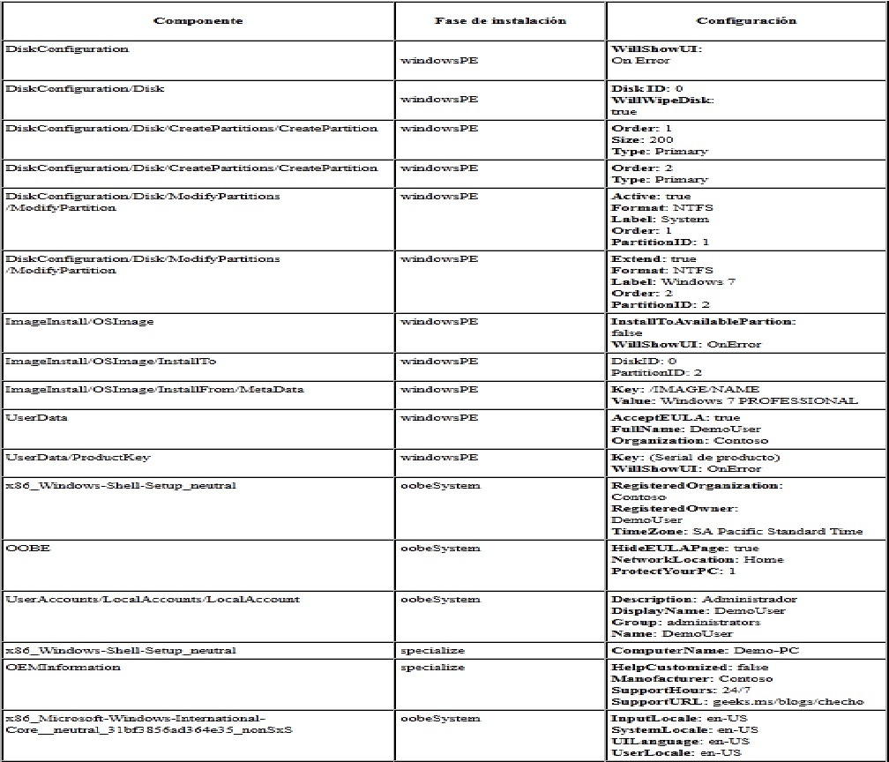
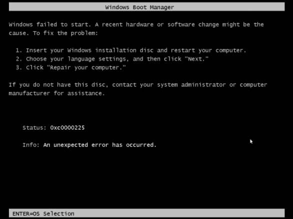
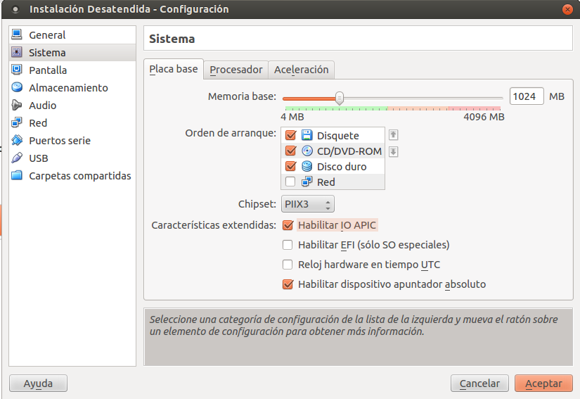

# Instalación destendida de Windows 7

Vamos a crear instalación desatendida para Windows 7.

Se ha utilizado la información de una página web elaborada por los alumnos de
los Ciclos Formativos IES Valle del Jerte - Plasencia: David Carballo Baz,
Mario Melchor Fernandez y Jose Antonio Franco Martin.

# 1. Introducción

Enlaces de interés:
* [instalación desatendida para Windows - IES Valle del Jerte 7](http://informatica.iesvalledeljerteplasencia.es/wordpress/creacion-de-imagen-de-windows-7-con-instalacion-desatendida/).
* [Instalación desatendida de Windows- David del Río Pascual](http://www.daviddelrio.es/instalacion-desatendida-de-windows/)

Vamos a crear una imagen ISO de windows 7 con instalación desatendida.
El sistema operativo se instalará en la máquina sin necesidad de que un usuario supervise la instalación ya que todos los parámetros configurables son configuradas anteriormente en un archivo que incluiremos en la ISO llamado `Autounattend.xml`.

Requisitos:
* ISO de Windows 7.
* La herramienta WAIK "Kit de instalación Automatizada de Windows 7".

---

# 2. Instalar WAIK

## 2.1 Copiar ficheros

* Crear la carpeta `C:\W7`.
* Montar la ISO Windows 7 de 64 bits en la unidad CD de la MV
* Copiar el contenido de la unidad de CD a la carpeta `C:\W7`.

## 2.2 Desacargar e Instalar WAIK

* Descargar el [Kit de instalación automatizada de Windows (AIK) para Windows 7](https://www.microsoft.com/es-es/download/details.aspx?id=5753)
* Instalamos la herramienta WAIK.
* Ir `Inicio > Todos los programas > Microsoft Windows AIK > Administrador de imágenes del sistema de Windows`. Ejecutar como administrador.

---

# 3. Crear fichero de respuestas

Ahora deberemos crear un catálogo que es el que nos dirá que tiene, que se puede y no se puede hacer dentro de la imagen seleccionada de Windows 7.

* Ir a `Archivo -> Seleccionar imagen de Windows` y buscamos el archivo `C:\W7\Sources\install_Windows 7 PROFESSIONAL.clg.` y lo abrimos (Si falla la carga probar con `C:\W7\Sources\install.wim`).
* Elegir la versión de Windows 7 para la que queremos crear el archivo de autorespuesta.
En nuestro caso es Windows 7 Professional.
* Nos saldrá en la esquina inferior izquierda una lista que podemos desplegar con diferentes componentes y paquetes.
* Crear el archivo de Autorespuesta que configuraremos posteriormente. Ir a `Archivo -> Nuevo archivo de respuesta`.
* Agregar al archivo las respuesta los componentes de cada secuencia de la instalación.

> Aclaración:
>
> * En la sección "WindowsSetup" encontraremos los apartados para configurar los discos, particiones e ImageInstall.
> * En la sección "ShellSetup" encontraremos los apartados para configurar OOBE, cuentas de usuario, y OEM Information.

Ver ejemplo:

* Validar el archivo de respuesta. Ir a `herramientas -> validar archivo de respuesta`.
* Guardar el archivo de respuesta en `Archivo -> Guardar archivo de respuesta como -> ruta donde está los archivos del windows a instalar`. El nombre debe ser Autounattend.xml es muy importante ya que el sistema sólo reconocerá el archivo si tiene este nombre.

---

# 4. Configurar aplicaciones

* Crear la carpeta `C:\W7\applications`. Dentro pondremos un programa de instalación MSI.
* Para que la instalación automática de las aplicaciones que queramos al iniciarse el sistema después de su instalación deberemos agregar el componente:
`Microsoft-Windows-Shell-Setup_neutral -> FirstLogonCommands -> Synchronous Command`
* Deberemos agregar el componentes tantas veces como aplicaciones queramos que se instalen al inicio y configurarlos de la siguiente manera:
    * CommandLine: Ubicación del ejecutable de la aplicación. Ejemplo: `C:\W7\applications\ejecutable.msi`.
    * Description: Una descripción del programa que se va a instalar.
    * Order: Orden en el que se instalará la aplicación.
    * RequiresUserInput: Si la aplicación necesita interacción del usuario.

---

# 5. Crear la ISO

Después de configurar esta última entrada en el archivo de respuesta, debemos compilar los archivos en una ISO para después grabarla en un DVD o memoria USB y poder usarla para su instalación en cualquier equipo.

* Crear la carpeta `C:\W7desatendido`.
* Para crear la ISO, `Abrimos desde  Inicio -> Todos los programas -> Microsoft Windows AIK -> Línea de comandos de las herramientas de implementación` y se nos abrirá una consola de comandos.
* Escribir `oscdimg –n –m –bC:\W7\boot\etfsboot.com  C:\W7 c:\W7desatendido\W7desatendido.iso`
* Si todo es correcto comenzará la creación de nuestra ISO desatendida lista para ser usada.

---

# 6. Comprobamos la ISO

Al terminar probamos la ISO en una máquina virtual
Si al iniciar la MV con la iso recién creada, aparece el error 225.
Ver imagen:

Una posible solución será activar APCI en la MV. Ver imagen:

> NOTA: Instalación personalizada
>
> En siguiente enlace tenemos una guía para [crear disco de instalación Windows7 personalizado](http://computerhoy.com/paso-a-paso/software/crea-tu-propio-disco-instalacion-windows-7-desatendido-7294).
>
> Esto no es lo mismo que una instalación desatendida.
> En la instalación desatendida automatizamos las respuestas del proceso
de instalación pero se hace una instalación estándar del sistema operativo.
> En una instalación personalizada estaríamos modificando los ficheros/archivos/programas
que se van a instalar, y por tanto no sería una instalación estandar del sistema operativo.
>Hay que tener en cuenta si lo permite o no la licencia.

---

# ANEXO A

## A.1 Instalación desatendida de Windows XP

> Esta parte NO hay que hacerla. Es meramente informativa.

* Enlaces de interés:[http://www.compuayuda.net/guia21-1.htm](http://www.compuayuda.net/guia21-1.htm)

NOTA:
* Si queremos evitar el usar disquetes podemos hacer esto otro.
* Al guardar los archivos txt que pone por defecto, sustituimos por el nombre de winnt.sif.
* Deberemos tener los archivos winnt.sif y winnt.bat. Estos dos archivos los meteremos en la iso, dentro de la carpeta i386.Nos ayudaremos de un programa especial para modificar las isos. Por ejemplo poweriso (Buscar en softonic)
* Con esto conseguiremos una iso de instalación desatendida personalizada.
