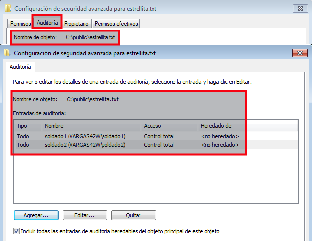

*(Actividad adaptada de eventos-locales-windows-debian para el curso 201617)*

# 1. Introducción

Toda la actividad importante del sistema debe quedar registrada en los
ficheros de registro. Esto nos permite tener un histórico del comportamiento
del sistema, que nos ayuda a modo de *"caja negra"*, a reconstruir situaciones
del pasado para diversos fines. Esta es la utilidad de la monitorización y la auditoría,
saber lo que ha pasado.

---

# 2. SO Windows

* [Configuramos la MV Windows](../../global/configuracion/windows.md)

## 2.1 Auditar inicios de sesión

Vamos realizar las siguientes tareas en SO Windows.
* Activar unas directivas de seguridad, para auditar los inicios de sesión
al sistema (Correctos e incorrectos). Incluir captura de pantalla con la directiva activada.
* Nosotros queremos auditar los *"Sucesos de inicio de sesión"*.

> NOTA:
> * Los "Sucesos de inicio de sesión de cuenta" no los vamos a necesitar ahora.
> * Éstos sirven para auditar a los usuarios del dominio. Esto todavía no lo hemos visto.

A continuación se muestra imagen de ejemplo de la directiva desactivada:

* Reiniciar la MV para que empiecen a funcionar las auditorías.
* Crear los usuarios `soldado1`, `soldado2` y `soldado3`.
* Hacer las siguientes acciones:
    * Entrar al sistema con `soldado1` de forma correcta.
    * Intentar entrar con `soldado2` poniendo la clave mal.
    * y no entrar con `soldado3`.
* Buscar en el sistema, la herramienta visor de sucesos.
* Comprobar cómo se registran los eventos anteriores en la sección "Seguridad".
Incluir captura de pantalla.
* Exportar los eventos a ficheros CSV. ¡OJO!: Filtrar los eventos para NO
incluirlos todos (Elegir los generados hoy, o en las últimas horas).
* Incluir fichero en la entrega con el nombre `nombre-alumno-registro-windows.csv`.
* Los ficheros con formato CSV se pueden abrir y manipular cómodamente usando hojas
de cálculo (Por ejemplo: Excel de Microsoft, Calc de LibreOffice, etc.). Comprobarlo.

> Realmente los CSV son ficheros de texto donde cada fila es como in registro de una tabla.
Y se usa la coma para delimitar los campos dentro de cada fila.

## 2.2 Auditar acceso a un fichero

Activar directiva de auditoría para los objetos.
* Ir a Directivas de seguridad local -> Directivas locales -> Directivas de auditoría.
* Activar `Auditar acceso a objetos`.

Activar auditoría sobre un fichero:
* Crear el archivo `c:\public\estrellita.txt`
* `Botón derecho -> Propiedades -> Seguridad -> Opciones avanzadas -> Auditoría`.

Hemos activado la auditoría de eventos sobre el ficheros anterior para los usuarios soldado1 y soldado2.
* Reiniciar la MV.
* Acceder con los usuarios `soldado1` y `soldado2` al archivo para generar eventos.
* Vamos al visor de eventos.
* Crear un filtro personalizado para los eventos del usuario `soldado1`.
* Mostrar los resultados de la auditoría.

---

# 3. GNU/Linux OpenSUSE

El servicio Audit es una herramienta que nos permite auditar eventos en los sistemas
GNU/Linux. En este tutorial instalar, configurar y usar la herramienta de auditoría
audit.

Usando herramientas potentes como audit, el sistema puede ser relizar un seguimiento
de muchos eventos y monitorizar y auditar el sistema. Ejemplos:
* Auditar el acceso y modificación de ficheros.
    * Ver quién cambió un fichero concreto.
    * Detectar cambios no autorizados.
* Monitorizar las llamadas al sistema y funciones
* Detectar anomalías como procesos dañados.
* Establecer marcas (tripwires) para detectar intrusiones.
* Grabar comandos de usuarios concretos.

## 3.1 Un poco de teoría

La configuración del demonio audit la llevan dos ficheros, uno para el demonio
(auditd.conf) y otro para las reglas usadas por la herramienta auditctl (audit.rules).

### auditd.conf

El fichero auditd.conf configura el demonio auditd centrándose en dónde y cómo
se deben registrar los eventos. Define como tratar con los discos llenos,
rotaciones de log y el número de log a mantener. Normalmente la configuración
por defecto será apropiada para la mayoría de los casos.

### audit.rules

Para configurar los eventos que deben ser auditados se usa el fichero audit.rules.

Enlaces de interés:
* [Systemd Journal](https://es.opensuse.org/SDB:Systemd_journal)
* [Systemd Optimización](https://es.opensuse.org/SDB:Systemd_optimizacion)
* [Linux audit](https://doc.opensuse.org/documentation/leap/security/html/book.security/cha.audit.comp.html)
* [Configuring and auditing Linux with audit](https://linux-audit.com/configuring-and-auditing-linux-systems-with-audit-daemon/)

## 3.2 Instalación y teoría

* Instalar los paquetes `audit` y `yast2-audit-laf`.
* Consultar el estado del demonio:
    * `auditctl -s`,
    * `systemctl status auditd`
* Consultar el fichero `/etc/audit/auditd.conf`
* Averiguar el significado de los siguientes parámetros: log_file, log_format,
log_group, freq, num_logs, max_log_file, max_log_file_action.

## 3.3 Crear una regla temporal para auditar un fichero

* Consultar el fichero `/etc/audit/audit.rules`. En este fichero se define qué
elementos se van a auditar.
* Con el comando `auditctl -l`, también podemos ver las reglas activas.
Al principio no debemos tener nada.

> Para eliminar reglas usaremos auditctl y el parámetro -D.

Hacemos lo siguiente:
* Abrirmos un terminal (Llamémosle t1).
* Crear el fichero `/home/estrellita.txt` con todos los permisos para el grupo `users`.
* Crear los usuarios `rebelde1`, `rebelde2` y `rebelde3`.
* `auditctl -f /home/estrellita.txt -p warx`, estamos creando una regla temporal
(porque no está guardada en el fichero audit.rules) para auditar un fichero concreto,
cuando ocurra algunos de los eventos de w=escritura, a=cambio de atributos,
r=lectura o x=ejecución.
* `auditctl -l`, vemos que tenemos la regla de auditoría definida.
* `cat /etc/audit/audit.rules`, comprobamos nuestra regla no está en el fichero de
configuración. Cuando reiniciemos el equipo nuestra regla desaparecerá.

## 3.4 Empezamos a generar eventos

Los eventos, cuando se produzcan, se guardarán en `/var/log/audit/audit.log`.
* Abrimos otro terminal (Llamémosle t2)
* `tail -f /var/log/audit/audit.log`, muestra en pantalla de forma permanente
las últimas líneas del fichero audit.log. Entonces cada vez que se registre un
nuevo evento y se guarde, veremos aparecer una nueva línea en esta terminal (t2).

* Volvemos al terminal t1
* `ausearch -f /home/estrellita.txt`, no debe haber ningún evento asociado al fichero todavía.
* Con el usuario `rebelde1` modificar el fichero.
* Con el usuario `rebelde2` leer el fichero.

 Consultar ahora los eventos de auditoria.
* Consultar las salidas del terminal t2.
* Ver las últimas líneas del fichero `/var/log/audit/audit.log`
* `ausearch -f /home/estrellita.txt`, consultar eventos sobre el fichero.
* Repetir para rebelde1, rebelde2 y rebelde3:
   * `id USERNAME`, consultar el uid del usuario.
   * `ausearch -f estrellita.txt -uid USERUID`, consultar eventos sobre
   el fichero para el usuario con USERUID.
   * `ausearch -f estrellita.txt -uid USERUID | wc -l`, contar los eventos.
* Repetir para vim, cat y more:
  * `ausearch -x COMMANDNAME`, consultar eventos asociados a dichos comandos.

## 3.5 Hacer un informe con los eventos

Como ver los eventos registrados con toda la información que generan es confuso,
podemos usar el comando aureport para crear una especie de informe con los datos
que queramos filtrar con ausearch.

* Repetir para rebelde1, rebelde2 y rebelde3
   * `ausearch -f estrellita.txt -uid USERUID | aureport -f`
   * `ausearch -f estrellita.txt -uid USERUID | aureport -u`
* Repetir para vim, cat y more:
   * `ausearch -x PROGRAMNAME | aureport -f`
   * `ausearch -x PROGRAMNAME | aureport -u`

> El comando `aureport -f` genera una lista numerada de los eventos
asociados a ficheros incluyendo información de fecha, hora, nombre
del fichero, número de llamadas al sistema, éxito/fallo del comando, el ejecutable
que lo accedió, un ID y número de evento.

## 3.6 Crear una regla de auditoría fija

* Reiniciamos el equipo.
* `auditct -l`, comprobamos que nuestra regla temporal ha desaparecido.
* Crear una regla pero esta vez dentro del fichero audit.rules, para
activar auditoría sobre el programa/comando `mkdir`.
* Reiniciar el equipo.
* `auditctl -l`, comprobar que la regla aparece.
* Crear el directorio `/home/rebelde1/rogue-one`.
* Consultar los registros de auditoría para mkdir.
* Crear un informe de los eventos del ejecutable mkdir(`aureport -x`).
Este comando genera una lista numerada de todos los eventos de ejecuta
* Eliminar la regla del fichero audit.rules.

---

# ANEXO

Componentes de audit:
* auditd: Demonio que captura los eventos y los almacena (log file)
* auditctl: Herramienta cliente para configurar auditd
    * auditctl -e, habilitar o deshabilitar audit
    * auditctl -r, controlar la ratio límite de mensajes
    * auditctl -s, consultar el estado actual del demonio
* audispd: daemon to multiplex events
* aureport: Herramienta de informes que leer de los ficheros de log (auditd.log)
* ausearch: Visor de eventos (auditd.log)
* autrace: Componente del kernel para hacer seguimiento de los binarios.
* aulast: Similar a last, pero usando audit
* aulastlog: Similar a lastlog, pero usando audit
* ausyscall: mapea los syscall ID y nombre
* auvirt: Muestra información relacionada con las máquinas virtuales.

Para auditar procesos en Linux, Audit tiene la herramienta autrace que es similar a strace.
Mostrar los eventos capturados usando ausearch.
`ausearch –start recent -p 21023 –raw | aureport –file –summary`

## Auditar acceso de usuarios

Si se quiere saber que ficheros han sido accedidos por un usuario (UID) concreto
`auditctl -a exit,always -F arch=x86_64 -S open -F auid=80`

Explicación de los parámetros:
* -F arch=x86_64, define la arquitectura (uname -m)
* -S open, elige las llamadas “open” al sistema
* -F auid=80, el UID del usuario

## Converting system calls

Syscalls are logged by an numeric value. Since there will be an overlap in these values between different architectures, the active architecture is also logged.

By using uname -m we can determine the architecture and use ausyscall to determine what numeric call 188 represents.

    [root@host audit]# ausyscall x86_64 188
    setxattr

We now know it was a change in attribute, which makes sense as we defined our watch to trigger an event on an attribute change (perm=a).

Used a temporary rule and want to use the old rules again? Refresh the audit rules from a file:

    auditctl -R /etc/audit/audit.rules

## Systemd y journal

Enlace de interés:
* [OpenSUSE systemd journal](https://es.opensuse.org/SDB:Systemd_journal)
* [Ver los logs del sistema en Linux con journalctl](http://lamiradadelreplicante.com/2015/03/29/ver-los-logs-del-sistema-en-linux-con-journalctl/)
