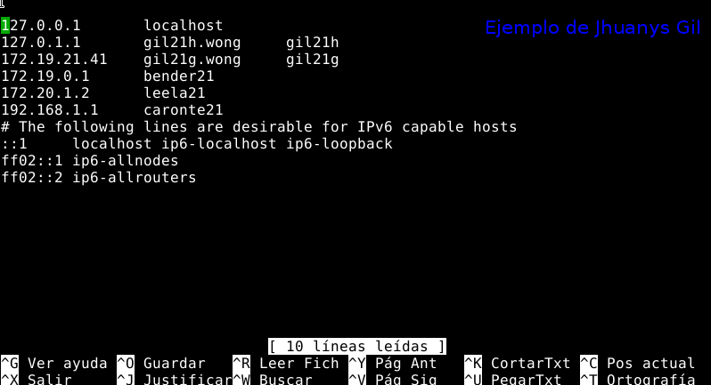
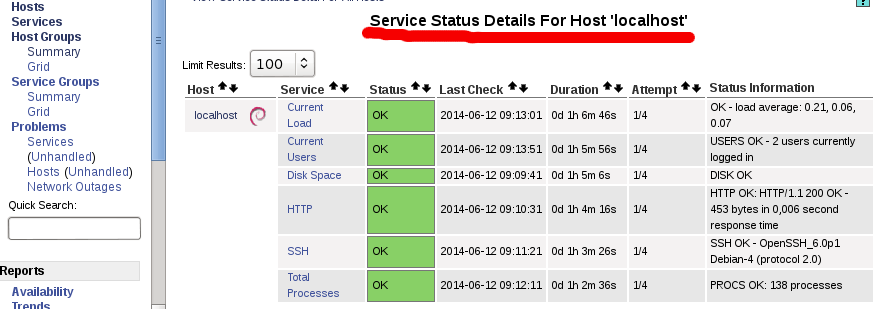

```
(Actividad realizada en los cursos: 201314, 201415, 201516)
Mejorada para el curso 201516.
```

#1. Preparativos

##1.1 Preparar las máquinas

Para esta actividad vamos a necesitar 3 MV's (Consultar la [configuración](../../global/configuracion-aula109.md) ).
* Monitorizador
    * SO Debian 8 - GNU/Linux
    * IP estática 172.19.XX.41
    * Incluir en el `/etc/hosts` todas las máquinas de la práctica.
* Cliente1:
    * SO Debian 8 - GNU/Linux para ser monitorizado.
    * IP estática 172.19.XX.42
    * Incluir en el `/etc/hosts` todas las máquinas de la práctica.
* Cliente2:
    * SO Windows 7 para ser monitorizado.
    * IP estática 172.19.XX.11
    * Incluir en el fichero `c:\Windows\System32\drivers\etc\hosts` todas las máquinas de la práctica.



##1.2 Consultar la documentación

* Enlaces de interés: 
    * Recomendado - [Instalación y configuración del servidor Nagios, y de los agentes para Linux y Windows](http://itfreekzone.blogspot.com.es/2013/03/nagios-monitoreo-remoto-de-dispositivos.html)
    * [Instalar y configurar nagios usando check_nt](www.tropiezosenlared.com/instalar-y-configurar-nagios-para-la-monitorizacion-de-equipos-en-la-red/) 
    * [Configuring nagios to monitor remote host using nrpe](https://kura.io/2010/03/21/configuring-nagios-to-monitor-remote-load-disk-using-nrpe/).  
* Leer los documentos proporcionados por el profesor.

#2. Instalar el servidor

* Instalar Nagios3, la documentación y el plugin NRPE de Nagios.
    * En Debian se usa `apt-get ...` o synaptic.
    * Comprobación: `dpkg -l nagios*`
* Durante la instalación se pedirá la clave del usuario `nagiosadmin` (Administrador Nagios). 
Además se instalará un servidor web.


* ¿Está todo instalado y en ejecución?
    * Comprobación `netstat -ntap`.
    * Comprobación `nmap localhost`.
* Abrimos un navegador y ponemos el URL `http://localhost/nagios3`.
    * Ponemos usuario/clave (nagiosadmin/clavesecreta), y ya podemos 
    interactuar con el programa de monitorización.
    * Si vamos a las opciones del menú izquierdo *"Hosts"* y *"Services"*, 
    vemos que ya estamos monitorizando nuestro propio equipo *"localhost"*.

#3. Configurar el servidor

Nos vamos a plantear como objetivo configurar Nagios para monitorizar lo siguente:
* Routers:
    * Hosts: router benderXX (172.19.0.1) y el router caronteXX (192.168.1.1).
    * Comprobar si están activos.
* Servidores:
    * Hosts: leelaXX (172.20.1.2)
    * Comprobar si tiene activos los servicios HTTP y SSH.
* Clientes:
    * Hosts: cliente1, y el cliente2.
    * Comprobar si están activos los equipos.

##3.1 Directorio personal

* Creamos el directorio `/etc/nagios3/nombre-del-alumno.d`, para 
guardar nuestras configuraciones.
* Modificamos fichero de configuración principal `/etc/nagios3/nagios.cfg`, 
y añadiremos la siguiente línea: `cfg_dir=/etc/nagios3/nombre-del-alumno.d`,
para que Nagios tenga en cuenta también estos ficheros al iniciarse.

##3.2 Grupos

> Cuando se tienen muchos *hosts* es más cómodo agruparlos. 
Para esto sirven son los `hostgroup`.

* Vamos crear `hostgroups`:
    * Sustituir XX por el identificador del alumno.
    * Creamos el fichero `/etc/nagios3/nombre-del-alumno.d/gruposXX.cfg`.
    * Dentro definimos 3 grupos de hosts: `routersXX`, `servidoresXX` y `clientesXX`.
    * Veamos un ejemplo (no sirve copiarlo):
    
```
define hostgroup {
  hostgroup_name clientes
  alias Equipos clientes
  members localhost
}

define hostgroup {
  hostgroup_name servidores
  alias Servidores del departamento
  members fryXX
}
```

##3.3 Hosts

###Routers

* Crear el fichero `/etc/nagios3/nombre-del-alumno.d/grupo-de-routersXX.cfg` para
incluir las definiciones de las máquinas de tipo router.
* Veamos un ejemplo (no sirve copiarlo):
```
#Define FRY router
define host{
  host_name fryXX
  alias Servidor fryXX
  address 172.20.1.1
  hostgroups servidores, http-servers, ssh-servers
  icon_image cook/router.png
  statusmap_image cook/router.png
  #parent

  check_command check-host-alive
  check_interval 5
  retry_interval 1
  max_check_attempts 1
  check_period 24x7
}
```

> Fijarse en todos los parámetros anteriores y preguntar las dudas.
> * [Enlace de interés sobre los parámetros](http://itfreekzone.blogspot.com.es/2013/03/nagios-monitoreo-remoto-de-dispositivos.html)
> * host_name: Nombre del host
> * alias: Nombre largo asociado al host
> * address: Dirección IP
> * hostgroups: Grupos a los que pertenece
> * icon_image: Las imágenes PNG están en `/usr/share/nagios/htdocs/images/logos/cook`.
>   Poner a cada host una imagen que lo represente.
> * parent: Nombre del equipo padre o anterior. El router caronteXX tiene como padre a benderXX.

* Reiniciamos Nagios para que coja los cambios en la configuración.
    * Pista `service nagios...`
    * Comprobación `netstat -ntap |grep nagios`.
* Consultar la lista de hosts monitorizados por Nagios.

### Servidores

* Crear el fichero `/etc/nagios3/nombre-del-alumno.d/grupo-de-servidoresXX.cfg` para
incluir las definiciones de las máquinas de tipo servidor.
* El equipo leelaXX tiene como parent a benderXX.
* Reiniciamos Nagios
    * Pista `service ...`
    * Comprobación `netstat -ntap |grep nagios`.
* Consultar la lista de hosts monitorizados por Nagios.

### Clientes

* Crear el fichero `/etc/nagios3/nombre-del-alumno.d/grupo-de-clientesXX.cfg` para
incluir las definiciones de las máquinas de tipo cliente.
* Veamos un ejemplo (no sirve copiar):

```
define host{
  use generic-host
  host_name client1-windows
  alias client1-windows
  address 172.16.108.250
  hostgroups clientsXX
}

define host{
  use generic-host
  host_name client2-debian
  alias client2-debian
  address 172.16.108.150
  hostgroups clientsXX
}
```
> Personalizar: host_name, alias, address y hostgroups.

* Reiniciamos Nagios para que coja los cambios
    * Pista `service ...`
    * Comprobación `netstat -ntap |grep nagios`.
* Consultar la lista de hosts monitorizados por Nagios.

#4 Ver algunos ejemplos

A continuación vemos una imagen donde se muestran los hosts que estamos monitorizando.
* El verde significa OK. 
* El rojo que el equipo presenta algún problema y requiere atención.


Además podemos tener una visión completa de la red en la opción "map".


* Consulta la lista de hosts, el mapa de Nagios y haz capturas de pantalla.

#5. Agente Nagios GNU/Linux

Por ahora el servidor Nagios sólo puede obtener la información
que los equipos dejan ver desde el exterior.

Cuando queremos obtener más información del interior los hosts, 
tenemos que instalar una utilidad llamada "Agente Nagios" en cada uno.
El agente es una especie de "chivato" que nos puede dar datos de:
Consumo CPU, consumo de memoria, consumo de disco, etc.

Aquí vemos un ejemplo del estado de los servicios monitorizados, 
en el host "localhost". Con la instalación de los "agentes", 
podremos tener esta información desde los clientes.



##5.1 Documentación

Enlaces de interés:
* [install-nagios-nrpe-client-and-plugins-in-ubuntudebian](https://viewsby.wordpress.com/2013/02/14/install-nagios-nrpe-client-and-plugins-in-ubuntudebian/)
* [instalacion-de-nagios-como-cliente-en-windows-y-linux](http://www.nettix.com.pe/documentacion/administracion/114-instalacion-de-nagios-como-cliente-en-windows-y-linux)
* [monitoring-linux](http://nagios.sourceforge.net/docs/3_0/monitoring-linux.html)


##5.2 Instalar y configurar el cliente1

En el cliente:
* Debemos instalar el agente nagios en la máquina cliente (paquete NRPE server y los plugin básicos)
    * Pista: `apt-get ... `
* Editar el fichero `/etc/nagios/nrpe.cfg` en el cliente y modificar la línea
`allowed_hosts=127.0.0.1,ip-del-servidor-nagios` con la ip del servidor Nagios.
* Reiniciar el servicio en el cliente: 
    * Pista `service nagios-nrpe-server ...`

##5.3 Configurar en el servidor

En el servidor Nagios:
* Vamos a comprobar desde el servidor la conexión NRPE al cliente de la siguiente forma: 
    * `/usr/lib/nagios/plugins/check_nrpe -H ip-del-cliente`
* A continuación, vamos a definir servicios a monitorizar
   * Crear el fichero `/etc/nagios3/nombre-del-alumno.d/servicios-gnulinuxXX.cfg`
   * Añadir las siguientes líneas:
 
```
define service{
  use generic-service
  host_name client2-debian
  service_description Disk Space
  check_command check_nrpe_1arg!check_disk
}

define service{
  use generic-service
  host_name client2-debian
  service_description Current Users
  check_command check_nrpe_1arg!check_users
}

define service{
  use generic-service
  host_name client2-debian
  service_description Total Processes
  check_command check_nrpe_1arg!check_procs
}

define service{
  use generic-service
  host_name client2-debian
  service_description Current Load
  check_command check_nrpe_1arg!check_load
}
```

* Consultar el estado de los servicios monitorizados por Nagios.


#6. Agente Nagios en Windows


##6.1 Instalar en el cliente2

* Descargar el programa Agente Windows (NSCLient++)
    * http://nsclient.org/nscp/downloads
    * http://www.nagios.org/download/addons.
* Instalar el programa nsclient
    * Activar las opciones `common check plugins`, `nsclient server` y `NRPE server`.

> * En este caso hemos elegido NRPE como protocolo de comunicación entre el agente
Windows y el servidor Nagios.
> * Si tenemos un fichero de instalación MSI, al ejecutarlo nos hará la 
instalación del programa con las opciones por defecto sin preguntarnos.

* Servicio `Agente Nagios` en el cliente
    * `net start nsclient` para iniciar el servicio del agente.
    * `net stop nsclient` para parar el servicio del agente. 

##6.2 Configurar en el Servidor

Configuración de los servicios del host Windows en Nagios Master.
* [Consultar documentación](http://nagios.sourceforge.net/docs/3_0/monitoring-windows.html).
* Veamos un ejemplo. 
    * En al monitorizador Nagios podemos crear el fichero `/etc/nagios3/mydevices.d/servicios-windowsXX.cfg`.
    * Y añadir las siguientes líneas:


```

* Consultar los servicios monitorizados por Nagios

#7. Monit en el Servidor

* Instalar Monit
* Hacer copia de seguridad al fichero `/etc/monit/monitrc`.
* Copiar el fichero de ejemplo proporcionado por el profesor a la ruta `/etc/monit/monitrc`.
* Veamos un ejemplo:

```
    # Fichero /etc/monit/monirc de ejemplo
    # config general
    set daemon 120
    set logfile /var/log/monit.log
    set mailserver localhost

# Plantilla de email que se envía en las alertas
set alert nombreusuarios@correousuario.com
set mail-format {
  from: monitusuario@correousuario.es
  subject: $SERVICE $EVENT at $DATE
  message: Monit $ACTION $SERVICE at $DATE on $HOST: $DESCRIPTION.
  Yours sincerely, monit
}

set httpd port 2812 and use address localhost
allow nombreusuario:claveusuario

# Monitorizar los recursos del sistema
check system localhost
if loadavg (1min) > 4 then alert
if loadavg (5min) > 2 then alert
if memory usage > 75% then alert
if cpu usage (user) > 70% then alert
if cpu usage (system) > 30% then alert
if cpu usage (wait) > 20% then alert

# Monitorizar el servicio SSHD
check process sshd with pidfile /var/run/sshd.pid
start program "/etc/init.d/ssh start"
stop program "/etc/init.d/ssh stop"
if failed port 22 protocol ssh then restart
if 5 restarts within 5 cycles then timeout
```

* Modificar el fichero /etc/monit/monitrc para adaptarlo a nuestra máquina.
* Reiniciar el servicio: /etc/init.d/monit restart
* Comprobar la lectura de datos de monit vía comandos: monit status
* Comprobar la lectura de datos de monit vía GUI. Abrir un navegador web en la propia máquina, y poner URL "http://localhost:2812". Escribir nombreusuario/claveusuario de monit (Según hayamos configurado en monitrc).
* Capturar pantalla.


#ANEXO

##A.1 Comandos check_nt para Agente Windows

```
define service{
  use generic-service
  host_name client1-windows
  service_description Disk Space
  check_command check_nt!USEDDISKSPACE!-l c -w 80 -c 90
}

define service{
  use generic-service
  host_name client1-windows
  service_description Mem Use
  check_command check_nt!MEMUSE!-w 80 -c 90
}

define service{
  use generic-service
  host_name client1-windows
  service_description Proc State Explorer
  check_command check_nt!PROCSTATE!-d SHOWALL -l Explorer.exe
}

define service{
  use generic-service
  host_name client1-windows
  service_description NSClient++ Version
  check_command check_nt!CLIENTVERSION
}

define service{
  use generic-service
  host_name client1-windows
  service_description Uptime
  check_command check_nt!UPTIME
}
```

##A.2 Para revisar

```
define host{
host_name winserver
alias Windows XP del profesor
address 172.16.108.250
check_command check-host-alive
check_interval 5
retry_interval 1
max_check_attempts 1
check_period 24x7
hostgroups aula108
icon_image cook/windows_pc.png
statusmap_image cook/windows_pc.png
}


define service{
use generic-service
host_name winserver
service_description CPU Load
check_command check_nt!CPULOAD!-l 5,80,90
}

define service{
use generic-service
host_name winserver
service_description Memory Usage
check_command check_nt!MEMUSE!-w 80 -c 90
}

define service{
use generic-service
host_name winserver
service_description C:\ Drive Space
check_command check_nt!USEDDISKSPACE!-l c -w 80 -c 90
}

define service{
use generic-service
host_name winserver
service_description W3SVC
check_command check_nt!SERVICESTATE!-d SHOWALL -l W3SVC
}

define service{
use generic-service
host_name winserver
service_description Explorer
check_command check_nt!PROCSTATE!-d SHOWALL -l Explorer.exe
}


##A.3 Configuraciones de ejemplo

```
#Define leela server
define host{
host_name leela
alias Servidor LEELA
address 192.168.1.3
check_command check-host-alive
check_interval 5
retry_interval 1
max_check_attempts 1
check_period 24x7
process_perf_data 0
retain_nonstatus_information 0
hostgroups servers, http-servers, ssh-servers
contact_groups admins
notification_interval 30
notification_period 24x7
notification_options d,u,r
icon_image cook/server.png
statusmap_image cook/server.png
parents fry
}

    #Define router
    define host{
    host_name router
    alias Router1
    address 192.168.1.1
    check_command check-host-alive
    check_interval 5
    retry_interval 1
    max_check_attempts 1
    check_period 24x7
    contact_groups admins
    icon_image cook/server.png
    statusmap_image cook/server.png
    parents fry
    }
```
