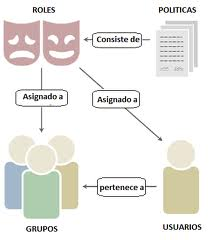
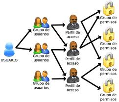
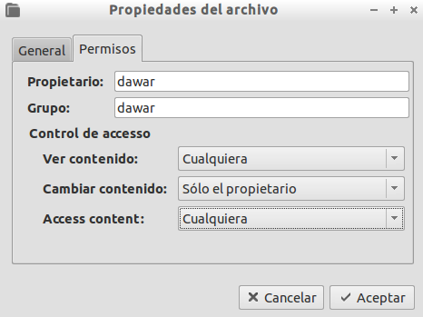

#Usuarios y permisos



* Entregar documento en formato ODT o PDF con el informe de la actividad realizadas y las capturas solicitadas.

#1. SO Windows 7
* Configurar la MV:
    * Modo de red VBox en modo puente.
    * Nombre de equipo: primer-apellido-del-alumno (Esto lo podemos consultar/modificar en `Inicio -> Equipo -> Btn derecho -> Propiedades`).
    * IP estática: 172.19.XX.11
    * Máscara: 255.255.0.0
    * Gateway: 172.19.0.1
    * DNS1: 8.8.4.4
* Ir a `miPC -> Botón derecho administrar -> Gestión de usuarios`.
* ¿Cuántos usuarios hay que no aparecen en la ventana de inicio al sistema? ¿Por qué?

##1.1 Usando el GUI Windows
Capturar imagen del resultado final.

* Crear el grupo `jedis` y dentro los usuarios `jedi1` y `jedi2`.
* Los miembros del grupo `jedis` ponerlos dentro del grupo administradores, para que puedan actuar como superusuarios.
* Capturar imagen. Para comprobar que los usuarios y grupos se han creado correctamente vamos a 
`Equipo -> Botón Derecho -> Administrar -> Usuarios y grupos`.
* Para cada miembro del grupo `jedis`:
    * Crear la carpeta `C:\Users\jedi1\private`.
    * Crear la carpeta `C:\Users\jedi1\group`.
    * Crear la carpeta `C:\Users\jedi1\public`.



> **INFORMACIÓN: Permisos NTFS**
>
> En Windows las carpetas HEREDAN los permisos de su carpeta padre. Para desactivar esta función 
en una carpeta determinada, haremos lo siguiente:
>
> * Botón derecho sobre la carpeta -> propiedades -> seguridad.
> * Opciones avanzadas -> cambiar permisos.
> * Desactivar herencia "Incluir permisos heredables" -> Quitar -> Aceptar.
> * Aplicar y Aceptar.
>
> Para modificar los permisos de una carpeta vamos a `Botón derecho -> Propiedades -> Seguridad -> Editar`.

* Vamos a modificar los permisos de la siguiente forma:
    * private: El usuario propietario tendrá control total y nadie más tendrá permisos.
    * group: grupo `jedis` permisos de lectura, y el usuario propietario control total.
    * public: todos tienen permiso de lectura, y el usuario propietario control total.
* Capturar imagen del resultado de la asignación de permisos.

Veamos un ejemplo de permisos para la carpeta public:


##1.2 Usando los comandos Windows
Capturar imagen de las acciones realizadas.

* Vamos a usar los comandos de la nueva shell de Windows, llamada PowerShell. 
Para ello buscamos en el menú PowerShell -> (botón derecho) -> Iniciar como Administrador.
Si no lo hacemos como administrador, no tendremos los privilegios necesarios, 
y no podremos crear los usuarios.

> **EJEMPLO Shell CMD**
>
> * `net user nombre-usuario clave-usuario /add`, crear usuario.
> * `net localgroup nombre-grupo nombre-usuario /add` para añadir un usuario a un grupo 
>
> **EJEMPLO shell PowerShell**
>
> Veamos un ejemplo para **crear grupo**:
> * Cambiar nombre-pc por el nombre del PC de cada uno.
> * Cambiar "alumnos" por el nombre del grupo que deseamos crear.
>
> ```
> PS C:\> [ADSI]$server="WinNT://nombre-pc"
> PS C:\> $grupo=$server.Create("Group","alumnos")
> PS C:\> $grupo
> PS C:\> $grupo.SetInfo()
> ```
> Veamos un ejemplo de **creación de usuarios** en PowerShell:
> * Cambiar nombre-pc por el nombre del PC de cada uno.
> * Cambiar "alumno1" por el nombre del usuario que deseamos crear.
> * Cambiar "123456" por el valor de password que querramos.
>
> ```
> PS C:\> [ADSI]$server="WinNT://nombre-pc"
> PS C:\> $usu1=$server.Create("User","alumno1")
> PS C:\> $usu1
> distinguishedName :
> Path : WinNT://GLOBOMANTICS/nombre-pc/alumno1
> PS C:\> $usu1.SetPassword("123456")
> PS C:\> $usu1.SetInfo()
> ```
>
> Veamos un ejemplo para **añadir usuario a un grupo ya existente**:
> * Cambiar nombre-pc por el nombre del PC de cada uno.
> * Cambiar "alumnos" por el nombre del grupo que deseamos crear.
> ```
> PS> $grupo = [adsi]"WinNT://nombre-pc/alumnos,group"
> PS> $grupo
> PS> $usu2 = [adsi]"WinNT://nombre-PC/alumno2,user"
> PS> $grupo.Add($usu2.path)
> ```

* Ahora vistos los ejemplos, vamos a crear el grupo `siths`.
* Pondremos a los usuarios `sith1` y `sith2`, dentro de los grupos `siths` y `usuarios`.

> Al ponerlos dentro del grupo Usuarios conseguimos que se muestren los iconos en la ventana de 
inicio de sesión del sistema.
>
> [Más información sobre la creación de usuarios con PowerShell](https://www.petri.com/create-local-accounts-with-powershell)

* Para cada usuario del grupo `siths` hay que:
    * Crear la carpeta `C:\Users\sith\private`
    * Crear la carpeta `C:\Users\sith1\group`
    * Crear la carpeta `C:\Users\sith1\public`

> Veamos un ejemplo de permisos por comandos:
>
> ```
> (Comprobar los permisos actuales de public)
> PS C:\> icacls public
>
> (Dar permisos de lecturas al grupo todos)
> PS C:\> icacls public /grant todos:R
>
> (Dar permisos control total al usuario alumno1)
> PS C:\> icacls public /grant alumno1:F
>
> (Quitar los permisos heredados a la carpeta public)
> PS C:\> icacls public /inheritance:r
>
> (Comprobar los permisos actuales de public)
> PS C:\> icacls public
>
> (Para quitar el acceso al directorio para todos los usuarios del dominio:)
> PS C:\> icacls directorio /remove \"Usuarios del dominio"
> ```
> 

* Modificar los permisos de la siguiente forma:
    * private: Sólo el usuario propietario tendrá permisos lectura/escritura.
    * group: grupo `siths` permisos de lectura, y usuario propietario permisos de lectura y escritura.
    * public: todos tienen permiso de lectura, y el usuario propietario tiene permisos de lectura y escritura.


#2. SO GNU/Linux OpenSUSE

##2.1 Preparar la MV
* Configurar la MV:
    * Modo de red VBox en modo puente.
    * Nombre de equipo: primer-apellido-del-alumno. En OpenSUSE usar Yast2.
    * Dominio: segundo-apellido-del-alumno.
    * Instalar OpenSSH
    * Clave de root DNI del alumno


> **INFORMACIÓN Debian/Ubuntu**
>
> Para configurar la red sin entorno gráfico en Debian/Ubuntu, modificaremos el 
contenido del fichero `/etc/network/interfaces` con lo siguiente:
>
> ```
> auto eth0
> iface eth0 inet static
> address 172.16.108.XX
> netmask 255.255.0.0
> gateway 172.16.1.1
> dns-nameservers 172.16.1.1
> ```
> 
> Para configurar la red mediante entorno gráfico podemos usar NetworkManager en Debian/Ubuntu.
>

* Ir al gestor de usuarios de OpenSUSE: Ir a Yast -> Gestión de Usuarios.
* ¿Cuántos usuarios hay que no aparecen en la ventana de inicio al sistema? ¿Por qué?
    
> En Debian/Ubuntu: Ir a `Aplicaciones -> Herramientas -> Configuración del sistema -> Preferencias -> Cuentas de usuarios`, 
o bien ir a `Sistemas -> Administración -> Usuarios y Grupos`.


##2.2 Usando el GUI GNU/Linux
Capturar imagen del resultado final.

* Crear el grupo `jedis` y dentro los usuarios `jedi1` y `jedi2`.
* Para cada usuario del grupo profesores:
    * Crear la carpeta `/home/jedi1/private`.
    * Crear la carpeta `/home/jedi1/group`.
    * Crear la carpeta `/home/jedi1/public`.
    
Veamos un ejemplo de permisos por el entorno GUI:



Capturar imagen del resultado final.
* Modificar los permisos de las carpetas de la siguiente forma:
    * private: Sólo el usuario propietario tendrá permisos lectura/escritura.
    * group: grupo `jedis` permisos de lectura, y usuario propietario permisos de lectura y escritura.
    * public: todos tienen permiso de lectura, y el usuario propietario tiene permisos de lectura y escritura.

##2.3 Sudoers (Grupo privilegiado)
Vamos a dar privilegios de superusuario a los miembros del grupo `jedis`.

> El comando `sudo` nos permite ejecutar comandos como si fuéramos el administrador del equipo.
Pero dicho comando sólo lo pueden ejecutar algunos elegidos.

* Vamos a configurar a los usuarios del grupo de `jedis` para poder tener privilegio totales de uso del comando sudo.
Añadiendo la línea siguiente `%jedis ALL = (root) NOPASSWD:ALL`.

Dos formas de hacerlo:

1. **GUI**: Usar Yast en OpenSUSE. Veamos imagen de ejemplo:
1. **CLI**: Abrir el editor de la configuración sudo (`/etc/sudoers`) (Debian/Ubuntu se usa `visudo`).


* Guardar y salir
* Ahora los usuarios del grupo profesores ya pueden ejecutar el comando sudo, 
para realizar todas las tareas administrativas.

Veamos un ejemplo de un usuario sin privilegios que intenta usar el comando sudo:


* Configurar al grupo `sith` en sudoers con 
`%siths ALL = (root) NOPASSWD:/sbin/shutdown, /sbin/fdisk -l, /sbin/dhclient`

##2.4 Usando los comandos

Vídeo [permisos en GNU/Linux](https://www.youtube.com/embed/Lq0UMXujGyc)

Capturar imagen de los pasos realizados.

* Crear el grupo `siths`.
* Crear los usuarios `sith1` y `sith2` dentro del grupo anterior.
* Ejecutar el comando `cat /etc/passwd`. Así vemos todos los usuarios 
definidos el el sistema. Algunos son usados por personas físicas, y otros 
son internos para uso de aplicaciones o del sistema operativo.
* Para cada usuario del grupo `siths` hacer:
    * rear la carpeta `/home/sith1/private`.
    * Crear la carpeta `/home/sith1/group`.
    * Crear la carpeta `/home/sith1/public`.


> Recordar los comandos: chown (Cambiar propietario), chgrp (Cambiar grupo propietario), 
chmod (Cambiar permisos de acceso).
  
* Modificar los permisos de las carpetas:
    * private: Sólo el usuario propietario tendrá permisos lectura/escritura.
    * group: grupo `stihs` permisos de lectura, y usuario propietario permisos de lectura y escritura.
    * public: todos tienen permiso de lectura, y el usuario propietario tiene permisos de lectura y escritura.

#ANEXO
El anexo contiene información complementaria. No son tareas que haya que realizar.

##A.1 Personalización de usuarios GNU/Linux
* En OpenSUSE vemos que cuando queremos invocar el comando `ifconfig` con 
un usuario normal debemos hacerlo con la ruta absoluta `/sbin/ifconfig`.


> Existe una variable llamada PATH, configurada para cada usuario de forma difierente. 
Dicha variable de entorno contiene las rutas de los ejecutables/comandos.
>
> No es necesario escribir la ruta completa para invocar a los comandos/programas que estén en alguna de estas rutas.
> 
> Para cambiarlo añadimos las siguientes líneas al final del fichero "/home/nombre-de-usuario/.profile":
> ```
> PATH=$PATH:/sbin
> export PATH
> ```
>
> Para que los cambios tengan efecto debemos cerrar la sesión.
>
> En otras distribuciones se usa el fichero de configuración "/home/nombre-de-usuario/.bashrc"

##A.2 Emulador de consola portable para Windows

Cmder (http://bliker.github.io/cmder/) is a software package created out of pure 
frustration over the absence of nice console emulators on Windows.

It is based on amazing software, and spiced up with the Monokai color scheme and 
a custom prompt layout. Looking sexy from the start.

