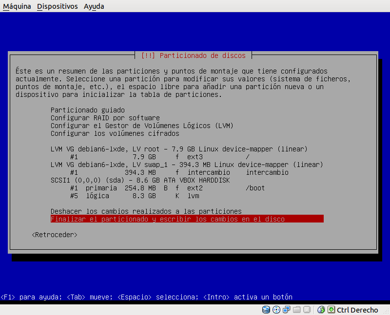

| Metadatos | Valores |
| --------- | ------- |
| Módulos recomendados | Sistemas Operativos (1asir, 2asir) |
| Curso     | 201819  |
| SSOO      | Debian9 y Windows7 |
| Duración estimada | 11 sesiones (1semana) |
| Entrega por defecto | Informe tipo tutorial |
| Futuro | Hacer rúbrica y migrar a OpenSUSE con Yast |

---

# Volúmenes Lógicos: Debian + Windows

Ejemplo de rúbrica:

| Sección               | Muy bien (2) | Regular (1) | Poco adecuado (0) |
| --------------------- | ------------ | ----------- | ----------------- |
| (1.3) Comprobación instalación LVM | | | |
| (2.2) Comprobamos | | | |
| (3.6) Comprobamos | | |. |

> Vídeos de interés:
> * [LVM. Learning Linux : "Lesson 20 Managing LVM"](https://youtu.be/m9SNN6IWyZo?list=PL3E447E094F7E3EBB)
> * [LVM. Learning Linux: "Lesson 21 LVM snapshots"](https://youtu.be/N8rUlYL2O_g?list=PL3E447E094F7E3EBB)

---

# 1. Instalar SO sobre LVM

Vamos a instalar un sistema operativo GNU/Linux Debian, sobre unos discos con LVM.

> NOTA:
>
> Otra forma de producir un efecto similar al de LVM, es mediante el uso de
sistemas de ficheros como BtrFS o ZFS (Consultar). Nosotros NO vamos a usar ZFS sino LVM en nuestra práctica, pero si algún grupo desea usar ZFS debe hablar con el profesor.

## 1.1 Preparar MV

Realizar las siguientes tareas:
* Crear MV para Debian, con un disco de 8GB.
* [Configuración](../../global/configuracion/debian.md) de la máquina.
* Comenzar a instalar GNU/Linux Debian, pero PARAR al llegar al particionado.

## 1.2 Particionar

### Partición BOOT

* Crearemos una partición primaria de 100MB para `/boot` formato ext2.

> Tener en cuenta que en la partición se monta `/boot` y va a parte (Fuera de LVM).

### Partición para LVM

* Crear una partición lógica con todo lo que nos queda de espacio en disco. Definir la partición de tipo LVM.
* Ir a la gestión de volúmenes.
* En la partición LVM, crearemos un grupo de volumen llamado `vgXXdebian`.
Donde XX es el número asociado a cada alumno.
* Dentro del `vgXXdebian`, crearemos los VL (volúmenes lógicos) siguientes:

| Logical Volume | Tamaño | Formato | Descripción |
| -------------- | ------ | ------- | ----------- |
| lvXXswap       | 500 MB | swap    | Area de intercambio |
| lvXXraiz`      | 5 GB   | ext4    | Raíz de la instalación del SO |
| lvXXdatos      | 100 MB | ext3    | Será el /home del sistema |

* Vemos que nos ha sobrado espacio. Lo dejamos así porque lo usaremos más adelante.

> **Imágenes de ejemplo que NO coinciden con la realidad**
>
> A continuación se muestran imágenes de referencia que NO tienen porqué coincidir con lo que se solicita.
>
> 
>
> A continuación se muestra imagen de muestra que NO tiene que coincidir con lo que se solicita.
>
> 

* Terminamos la instalación del sistema operativo.

## 1.3 Comprobación de la instalación LVM

* Reiniciamos el sistema y comprobamos lo que tenemos:

```
date
hostname -f
ip a
fdisk -l
vgdisplay
lvdisplay vgXXdebian
```

---

# 2 Aumentar el tamaño del VL en caliente

Ahora podremos ampliar *"en caliente"*, el espacio de lvXXdatos de 100MB a 400MB.

## 2.1 Ampliamos

* Consultar el tamaño actual del volumen lógico: `lvdisplay -v /dev/vgXXdebian/lvXXdatos`
* Para ampliar el tamaño del volumen lógico: `lvextend --resizefs -L 400 /dev/vgXXdebian/lvXXdatos`
* Comprobar con: `lvdisplay -v /dev/vgXXdebian/lvXXdatos`

## 2.2 Comprobamos

* Comprobamos lo que tenemos ahora:
```
vgdisplay             # Comprobar que ha aumentado el espacio ocupado
lvdisplay vgXXdebian
df -hT
```

> Fijarse si el comando `df -hT` no nos devuelve el tamaño que esperamos para el dispositivo. En tal caso, podemos usar `resize2fs /dev/vgXXdebian/lvXXdatos` sirve ajustar dicho valor.

---

# 3. Modificar el espacio físico LVM

* Hacer una instantánea o copia de seguridad de la MV antes de seguir.

Vamos a añadir al sistema anterior, más almacenamiento físico LVM, puesto que ya hemos agotado todo el espacio libre de los discos físicos.

Esquema de PV, VG y LV:


## 3.1 Preparar la MV

* Añadimos 2 discos virtuales nuevos:
    * Disco de 200MB (B): con una partición completa del disco
    * Disco de 750MB (C): con 3 particiones de 250MB sin formato, ni tipo.

> NOTA: Las particiones las pueden crear con fdisk, gparted, etc.
>
> * Para crear particiones del disco sdb con fdisk:
>     * `fdisk /dev/sdb`
>     * `m` ver el menú con las opciones
>     * `n` para crear partición -> `p` primaria -> Número de la partición
>     * `w` grabar y salir
>     * `q` salir sin grabar

## 3.2 Crear VG y VL

* Crear un Grupo de Volumen llamado `vgXXextra`, con el disco (B) y las 2
primeras particiones del (C). Veamos un ejemplo de cómo
crear un grupo de volúmenes con vgcreate:
`vgcreate /dev/NOMBRE-GRUPO-VOLUMEN /dev/discoA /dev/discoB1`
* Crear un nuevo Volumen Lógico llamado `lvXXextra` con tamaño 690MB.
Comando: `lvcreate -L690M -n lvXXextra vgXXextra`.

> NOTA: La partición 3 del disco (C) NO la estamos usando por ahora.

* Comprobamos lo que tenemos:
```
vgdisplay vgXXextra # Muestra información del grupo de volumen
lvdisplay vgXXextra # Muestra información de los volúmenes lógicos de un grupo de volumen concreto
```

## 3.3 Escribir información

* El nuevo dispositivo `/dev/vgXXextra/lvXXextra` no tiene formato. Vamos a darle formato ext4.
Ejemplo: `mkfs.ext4 nombre-del-dispositivo`.
* Crear directorio (`/mnt/volXXextra`),donde vamos a montar el nuevo dispositivo (Volumen lógico).
* Montar el nuevo dispositivo (Volumen Lógico) en la carpeta `/mnt volXXextra`.
* Comprobamos que se ha montado correctamente con `df -hT`.

A partir de ahora todo lo que escribamos en dicha carpeta se estará guardando en el dispositivo montado.
* Comprobar el espacio usado en `/mnt/volXXextra` (df -hT).
* Escribir información en `/mnt/volXXextra`. Crear algunas carpetas y ficheros con tamaño mayor a cero. Por ejemplo para crear un archivo de tamaño 1M podemos hacer `dd if=/dev/zero of=/mnt/volXXextra/file-size-1M bs=512 count=2048`.
**El comando dd hay que usarlo con precaución**.
* Comprobar el espacio usado en `/mnt/volXXextra` (df -hT).

## 3.4 Añadir más tamaño

* Añadir la tercera partición del disco (C) (no utilizada) al VG vg-extra.

```
pvcreate /dev/sdc3            # Crear un dispositivo físico de LVM
vgextend vgXXextra /dev/sdc3  # Ampliar el grupo de volumen.
vgdisplay vgXXextra           # Para comprobar el cambio
```

* Ampliar el tamaño de lvXXextra a 930MB (Comando lvextend). Comprobar el aumento del espacio (lvdisplay)
* Comprobar que los datos/información no se han borrado al ampliar el volumen lógico.

## 3.5 Quitar un disco físico del VG

> En LVM los discos físicos se llaman volúmenes físicos (Physical Volumes).

El grupo de volumen vgXXextra, tiene dos volúmenes físicos que son los discos (B) y (C). En los pasos siguientes vamos a dejar de usar disco (C) dentro del VG, sin perder la información almacenada en él. Y además en "caliente".

* Primero comprobamos el tamaño utilizado de nuestros datos: `du -sh /mnt/volXXextra`. Este valor debe ser menor a 50 MB.
* Reducir el tamaño del volumen lógico lvXXextra a 50 MB: `lvreduce --size 50MB /dev/vgXXextra/lvXXextra`.
* Redimensionar el sistema de ficheros para adaptarlo al nuevo espacio. `df -hT` debe mostrar el mismo tamaño que el que tiene el volumen ahora.
* Comprobamos: `lvdisplay /dev/vgXXextra/lvXXextra`.

Antes de quitar el disco hay que asegurarse de que no guarda datos.
* Movemos la información del disco sdc al disco sdb:

```
pvmove /dev/sdc1 /dev/sdb1
pvmove /dev/sdc2 /dev/sdb1
pvmove /dev/sdc3 /dev/sdb1
```

* Reducimos el tamaño del grupo de volumen:

```
vgreduce vgXXextra /dev/sdc1
vgreduce vgXXextra /dev/sdc2
vgreduce vgXXextra /dev/sdc3
```

* Comprobar que se mantiene la información almacenada.

## 3.6 Comprobamos

* Comprobamos lo que tenemos:

```
vgdisplay
lvdisplay vgXXextra
```
* Ahora podemos a quitar el disco `/dev/sdc` de la MV sin problemas.

---

# 4. Discos dinámicos en Windows

En windows las particiones se llaman volúmenes básicos. Para poder hacer el mismo efecto de LVM debemos convertir las particiones a volúmenes básicos.

## 4.1 Volumen Distribuido

* Vídeo sobre la [Creación de un volumen distribuido en Windows7](https://www.youtube.com/watch?v=prXBbHvqgx8)

* Añadimos 2 discos virtuales nuevos:
    * Disco de 200MB (B): con una partición completa del disco
    * Disco de 600MB (C): con 2 particiones de 300MB sin formato, ni tipo.
* Vamos a crear un volumen *Distribuido* con el disco (B) y las
primera partición del disco (C).

> * Nota: los volúmenes simples del primer disco deben permanecer intactos.
> * Un volumen Distribuido NO es RAID0. Se parece a RAID0 y usa discos de distinto tamaño
para crear otro mayor. Es el mismo efecto que el conseguido con LVM y los volúmenes lógicos.

* Con la misma letra de unidad se acceden a una zona
de almacenamiento (volumen dinámico) formada por partes (particiones o
volúmenes básicos) de varios discos. Comprobarlo.
