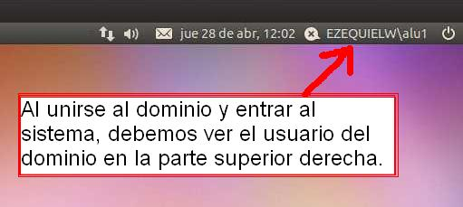

```
Curso       : 201415, 201314
Area        : Sistemas operativos, dominios
Descripción : Unir un equipo Ubuntu/Debian a un dominio Windows server
Requisitos  : PDC Windows Server, SO Ubuntu, Software PIBS/Likewise
Tiempo      :
```

# 1. Clientes de Dominio

## 1.1 Introducción

El OBJETIVO de esta práctica será el de configurar una MV GNU/Linux,
para que se comporte como cliente del dominio anterior. En este caso la unirá al PDC del Windows Server.

Vamos a aprovechar el PDC de la actividad anterior, para realizar esta práctica. Además usaremos la herramienta **PBIS (PowerBroker Identity Services)**, que es un programa de entorno gráfico que nos ayudará a realizar la unión al dominio de forma sencilla.

## 1.2 Lecturas

LECTURA: Para realizar esta tarea, consultar la documentación proporcionada por el profesor.
En el documentos se muestran dos formas de hacer este paso:
* (a) Usando comandos (Páginas 1-4 del documento "dirac-01.pdf"),
* (b) Usando LikeWise (Páginas 4 y 5 del documento "dirac-01.pdf"). Éste es el modo recomendado.

> Si se usa la distribución Ubuntu como cliente para unirse al dominio de un Windows Server el proceso es más sencillo.
> Otra distribución GNU/Linux podría funcionar, pero quizás la instalación del software LikeWise sería diferente o habría que usar los comandos.
> Cada versión de Ubuntu tiene un nombre diferente. Es importante tener esto en cuenta si modificamos los repositorios de instalación de paquetes. Veamos algunos ejemplos:
> * Versión 14.04, nombre Trusty Thar
> * Versión 13.10, nombre Saucy
> * Versión 13.04, nombre Raring Ringtail

# 2. Preparativos en el cliente

## 2.1 Revisar

Tener en cuenta los siguientes aspectos en la configuración del cliente Ubuntu.

* **FECHA/HORA**: La fecha/hora del sistema debe sincronizarse con el PDC.
Si hiciera falta cambiar la zona horaria podemos usar el comando `dpkg-reconfigure tzdata`.
* **VIRTUALBOX**: GNU/Linux y PDC, deben estar en la misma red, por lo que es aconsejable configurar la red de las máquinas virtuales en modo "puente" las dos (El modo "Red interna" también funcionará bien).
* **Interfaz de RED**: Recordar que las máquinas Servidor y cliente deben tener la configuración de red estática.
* **Servidores DNS**: Los clientes, para unirse al PDC, deben tener como DNS1=ip-del-pdc, y DNS2=8.8.4.4.

## 2.2 Configuracion de red

Veamos un ejemplo de configuración del interfaz de red Ubuntu (Fichero `/etc/network/interfaces`):

```
auto lo
iface lo inet loopback

auto ethY
iface ethY inet dhcp

auto ethX
iface ethX inet static
address 172.16.108.240
netmask 255.255.0.0
gateway 172.16.1.1

dns-nameservers ip-del-pdc 172.16.1.1
dns-search vargas42dom.curso1415
dns-domain vargas42dom.curso1415
```

* Después de modificar los ficheros de configuración de red, es necesario
reiniciar el servicio de red para que se lean los cambios. Hay varias formas:
    * service networking restart
    * /etc/init.d/networking restart
    * o bien, reiniciar la máquina.

## 2.3 Servidores DNS

* Para configurar los servidores DNS en Debian, tenemos otra forma.
Que es editar el archivo /etc/resolv.conf, añadiendo lo siguiente:
```
search vargas42dom.curso1415
domain vargas42dom.curso1415
nameserver ip-del-pdc
nameserver 172.16.1.1
```

* Comprobar configuración DNS: Para comprobar si la resolución de nombres está funcionando correctamente hacemos las siguientes pruebas:

```
$ nslookup www.iespuertodelacruz.es
Server: 172.16.1.1
Address: 172.16.1.1#53

Non-authoritative answer:
Name: www.iespuertodelacruz.es
Address: 88.198.18.148

$ nslookup vargas42dom.curso1415
Server: 172.16.108.40
Address: 172.16.108.40#53

Non-authoritative answer:
Name: vargas42dom.curso1415
Address: 172.16.108.40
```

* Configuración "manual" de la resolución de nombres: Si la resolución de nombres fallara, podemos para este caso, hacer una configuración de nombres "manual". Para ello editamos el archivo "/etc/hosts" y añadimos la línea siguiente:

```
172.16.108.40 vargas42s.vargas42dom.curso1415 vargas42dom.curso1415
```

* Volvemos a realizar la comprobación mediante la ejecución del comando nslookup.

# 3. Unirse al dominio

Vamos a unir el cliente Ubuntu al PDC Windows Server usando una aplicación de entorno gráfico, llamada **Likewise**.

> Enlaces de interés: LikewiseOpen Ubuntu Documentation, Download PowerBroker Identity Service Edition

## 3.1 Instalar Likewise

Para instalar Likewise en Ubuntu hay varias formas:

**(A) Instalar la herramienta PBIS (PowerBroker Identity Services PBIS)**
* Descargar el instalador de PowerBroker Identity Services, Open Edition y lo hacemos ejecutable (chmod a+x). Lo ejecutamos.
* Si tenemos el error "Unable to find ssh binary" podemos
    * (a) instalar el paquete del servidor SSH: `apt-get install openssh-server` , o
    * (b) Desactivar el uso de ssh `domainjoin-cli join --disable ssh DOMAIN administrador`.

**(B) Instalar los paquetes**: `likewise-open` y `likewise-open-gui`.

**(C) Descargar el paquete/instalador desde la web de Likewise, para nuestra distro.**

**(D) Descargar el código fuente, y realizar la instalación del programa**
* http://debian-base.blogspot.com.es/2014/01/installing-active-directory-client.html

## 3.2 Unir equipo al dominio

**Por entorno gráfico**

Una vez instalado el programa Likewise, puede ser que no tengamos creado un acceso directo en los menús del entorno gráfico. Si queremos saber dónde está el programa podemos ejecutando una búsqueda con "find / -name domainjoin-gui" o "whereis domainjoin-gui".

* Para ejecutar el programa en modo gráfico, abrimos un terminal y ponemos: `domainjoin-gui`
* Completamos la siguiente información de configuración:
    * `Computer name`: nombre de nuestra máquina (Aparece por defecto)
    * `Domain`: el dominio de nuestro PDC.
* Luego nos pedirá usuario y contraseña. Aquí ponemos el nombre de nuestro usuario administrador del PDC, y su contraseña.

> [OJO] Revisar bien al escribir el nombre de usuario. No es lo mismo "AdministraTor" que "AdministraDor". El administrador del domino en Windows suele llamarse "Administrador", y en GNU/Linux es "root". NO es lo mismo.

* Luego saldrá una pantalla indicando si el proceso ha sido correcto, y se pide reiniciar.

**Por comandos**

* Ir al equipo cliente.
* `domainjoin-cli join DOMINIO Administrador`, ejecutar el comando para unir el equipo cliente al dominio.
* Si tenemos un error DNS a la hora de encontrar el servidor de dominio desde la máquina GNU/Linux, podemos incorporar la IP y el NOMBRE-DEL-DOMINIO al fichero /etc/hosts de cada máquina cliente. Esto lo hacemos para facilitar la búsqueda en la resolución de nombre e IP.

## 3.3 Comprobar

* Ir al cliente y ejecutar `domainjoin-cli query`, para comprobar que nos hemos unido al dominio.
* Ir al servidor. En el PDC WindowServer debe parecer, dentro de la carpeta "Computers" del Directorio Activo", nuestra máquina GNU/Linux.

# 4. Autenticación

* Ir al cliente.
* Entramos al sistema con algún usuario del dominio (Ejemplos: username, username@DOMAIN, DOMAIN\username).

> En la imagen de ejemplo podemos ver una máquina con SO Ubuntu, donde se ha iniciado sesión con el usuario **alu1** del dominio **EZEQUIELW**.



* Abrir consola y poner el comando: `cat /etc/passwd | grep $(whoami)`. Este comando busca si nuestro usuario actual está configurado dentro del fichero de usuario locales del sistema.

> **PROBLEMAS**: Si hemos conseguido unirnos al dominio pero tuviéramos problemas para entrar en la máquina GNU/Linux con los usuarios del dominio, probaremos a quitar el cliente del dominio, volver a unirla al dominio e intentarlo de nuevo.

---
# ANEXO

## A1. Enlaces de Interés

* http://cerowarnings.blogspot.com.es/2011/11/how-to-linux-en-dominio-windows.html
* Una web que puede servir de ayuda para el ejercicio: http://alternativalibre.wordpress.com/2010/09/15/likewise-open-linux-y-active-directory/
* Para iniciar sesión en un likewise: http://www.likewise.com/resources/documentation_library/manuals/lwe/likewise-enterprise-53-guide.html#AboutLoggingOn

## A2. Debian

Enlaces de interés:
* [Samba: Unir Debian a un Dominio Windows (I)](https://blog.desdelinux.net/samba-unir-debian-a-un-dominio-windows-i/)
* [Unir Debian a un dominio de Active Directory](https://red-orbita.com/?p=2652)
