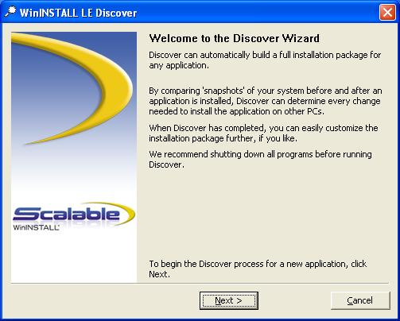
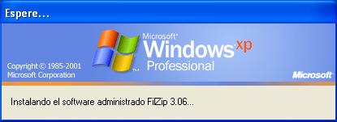

```
Curso       : 202021, 201920, 201819
Área        : Sistemas operativos, dominios, políticas, seguridad
Descripción : Aplicar políticas de seguridad a los equipos del dominio
              Crear paquetes de instalación desatendido
              Configurar políticas con el uso de ficheros MSI.
Requisitos  : Windows Server
Tiempo      : 8-10 horas
```

# Políticas o directivas de grupo

## Preparativos

* Vamos a usar las MVs de la práctica anterior (**Montar un controlador de dominio con Windows Server**).
* Leer la documentación que se proporciona. Concretamente el fichero `M34_directivas_grupos.pdf`.
* Consultar las dudas al profesor.

En esta práctica veremos:
* Crear GPO de usuarios.
* Crear ficheros MSI.
* Crear GPO de software.

# 1. Aplicar directivas de Usuario

## 1.1 Crear las OU

Realizar las siguientes tareas:

* Ir a la MV PDC.
* Por seguridad, antes de empezar la práctica vamos a crear un "snapshot" (instantánea) de la máquina virtual.
* Abrir la herramienta de gestión de "Usuarios y equipos del Active Directory".
* Click en `Dominio -> Nuevo -> Crear OU`
* Crear las OU (Unidades Organizativas) siguientes: `jediXX` y `sithXX`.
* Los usuarios (obiwan y yoda) que teníamos creados en `Usuarios`, los movemos a la OU de `jediXX`.
* Los usuarios (maul y vader) que teníamos creados en `Usuarios`, los movemos a la OU de `sithXX`.

## 1.2 Crear GPO's

La GPO es un conjunto de políticas o directivas que se aplica a una o varias unidades organizativas.

> Enlaces de interés:
> * [Crear GPO en Windows Server 2016](https://www.solvetic.com/tutoriales/article/4910-crear-editar-eliminar-politicas-de-grupo-gpo-windows-server-2016/)

**IMPORTANTE**: No aplicar la directivas a todo el dominio, sino a las unidades organizativas que se especifiquen. Este error puede afectar al correcto funcionamiento del servidor en su totalidad.

* Ir a `Herramientas -> Administración de directivas de grupo`
* Dentro de la OU de los `jediXX` -> Botón derecho -> crear la GPO `gpo_jediXX`.
* Dentro de la OU de los `sithXX` -> Botón derecho -> crear la GPO `gpo_sithXX`.

## 1.3 Personalizar cada GPO de forma diferente

> **INFO**: Para editar configuraciones de Directiva de grupo:
> * En Group Policy Management (Administración de directivas de grupo), en el árbol de consola, desplegar Group Policy Objects (Objetos de Directiva de grupo). Click con el botón derecho del ratón en el GPO y seleccionar Edit (Editar).
> * En el Editor de objetos de Directiva de grupo, buscar la Directiva de grupo que queremos modificar y hacemos doble clic. En el cuadro de diálogo Propiedades, cambiamos la configuración y Aceptar.

Vamos a aplicar las siguientes directivas a las OU anteriores(_Elegir unas para una OU y otras para la otra_).

En la sección de **Configuración de usuario / Directivas / Plantillas administrativas / Menú Inicio y barra de tareas** (User configuration / Administrative Templates / Start Menu and Taskbar)
* `No buscar archivos`
* `No buscar programas`
* `Quitar el menú Ejecutar del menú Inicio`
* `Quitar el icono de Red del menú inicio`
* `Quitar icono de Red`
* `Quitar Conexiones de red del menú Inicio`

En la sección **Configuración de usuario / Directivas / Plantillas administrativas / Panel de control** (User configuration / Administrative Templates / Control Panel)
* `Prohibir el acceso al Panel de control`

En la sección **Configuración de usuario / Directivas / Plantillas administrativas / Escritorio** ( User configuration / Administrative Templates / Active Desktop)
* `Ocultar el icono Ubicaciones de red del escritorio`.

En la sección **Configuración de usuario / Directivas / Plantillas administrativas / Componentes de Windows / Explorador de Windows** (User configuration / Administrative Templates / Windows Components / Windows Explorer)
* Ocultar estas unidades específicas en Mi PC (Hide these specified drives in My Computer) o Impedir el acceso a las unidades desde Mi PC (Prevent Access to drives from my computer). Elegir un combinación adecuada como bloquear las unidades A y B (Restrict A y B drives only).
* `Quitar <Conectar a unidad de red> y <Desconectar de unidad de red>`

## 1.5 Comprobar que se aplican las directivas

Al terminar de configurar las directivas, hacemos lo siguiente:
* Ir al PDC.
* Abrir consola como administrador.
* Ejecutar `gpupdate /force`, para forzar las actualizaciones de las directivas. En algunos casos, después de definir una política, ésta tarda un tiempo en activarse, pero usando el comando anterior, nos aseguramos de que este paso de activación se realice inmediatamente.
* Ir a `Administración de Directivas de Grupo`.
* Capturar imagen del resumen de la configuración de cada una de las directivas creadas (`Ir a directiva -> Configuración`). Esta pestaña debe mostrar las opciones que hemos usado para configurar nuestra directiva.
* Ir cada máquina cliente para comprobar los efectos de las directivas.


# 2. Paquete MSI

> **IMPORTANTE**: Vamos a crear otro "snapshot" de la máquina virtual, por seguridad.

## 2.1 Crear recurso compartido de red

Vamos a crear un recurso compartido de red para guardar los ficheros MSI y que se puedan compartir entre todos los equipos de nuestra red.

**En el servidor**
* Crear la carpeta `e:\softwareXX`.

Permisos                           | **`Usuarios del dominio`** | **`Administradores`**
---------------------------------- | :------------------------: | :-------------------:
Control total                      |                            | &#x2714;
Modificar                          |                            | &#x2714;
Lectura y ejecución                | &#x2714;                   | &#x2714;
Mostrar el contenido de la carpeta | &#x2714;                   | &#x2714;
Lectura                            | &#x2714;                   | &#x2714;
Escritura                          |                            | &#x2714;
Permisos especiales                |                            | &#x2714;

* Crear un recurso compartido de red `softwareXX` a la carpeta anterior.

Permisos                           |         **`Todos`**        | **`Usuarios del dominio`**
---------------------------------- | :------------------------: | :------------------------:
Control total                      |                            | &#x2714;
Modificar                          |                            | &#x2714;
Lectura y ejecución                |                            | &#x2714;
Mostrar el contenido de la carpeta |                            | &#x2714;
Lectura                            | &#x2714;                   | &#x2714;
Escritura                          |                            | &#x2714;
Permisos especiales                |                            | &#x2714;

* Por ejemplo, si vamos a usar/crear un MSI de Firefox, entonces crearemos la subcarpeta `e:\softwareXX\firefox`.

## 2.2 Instalar WinINSTALL

> **OTROS PROGRAMAS**: Si tenemos problemas con el programa WinINSTALL, podemos usar [Advanced Installer](https://www.advancedinstaller.com/)

Ahora vamos a crear nuestro propio paquete de instalación MSI, usando la herramienta WinINSTALL. Si ya tenemos el software que queremos instalar en los clientes en formato MSI, nos podemos saltar este apartado.

**En el servidor**
* Descargar el programa WinINSTALL y lo instalamos.
    * http://www.downloadsource.es/3414/WinINSTALL-LE/
    * http://www.freewarefiles.com/downloads_counter.php?programid=52066
* Una vez instalada la aplicación hemos de asignar permisos de acceso al recurso compartido de WinINSTALL al usuario `Administrador` en modo lectura.

## 2.3 Crear paquete MSI

> Enlaces de interés:
> * [Crear paquetes MSI con WinINSTALL](http://www.ite.educacion.es/formacion/materiales/85/cd/windows/11Directivas/crear_paquetes_msi.html).
> * [Vídeo - Crear MSI con WinINSTALL](https://www.youtube.com/watch?v=cBzmcROYAcA)

Si disponemos del paquete MSI nos saltamos este apartado.

> **NOTA**: Podemos [descargar el programa Firefox en formato msi](https://support.mozilla.org/en-US/kb/deploy-firefox-msi-installers) directamente.

**En el cliente**
* Entramos con el usuario administrador del dominio.
* Descargar el instalador de Firefox. **¡OJO! Sólo descargar** (NO instalar todavía). El instalador de Firefox debe tener un tamaño de varios MBs. Si tiene pocos KBs no es el instalador, sino un programa para descargar el instalador.
* `Inicio -> Ejecutar -> \\ip-del-servidor\WinINSTALL\Bin\Discover.exe`,
para iniciar la aplicación WinINSTALL LE de forma remota,



* Indicamos el nombre que vamos a asociar al paquete MSI (`firefoxXX.msi`).
* Ruta de red donde almacenaremos el MSI, en nuestro caso
`\\ip-del-servidor\softwareXX\firefox\firefoxXX.msi`.


* Unidad donde se almacenarán los ficheros temporales => C:.
* Unidades que serán analizadas para realizar la foto inicial;
en nuestro caso sobre la unidad C: de nuestro equipo cliente.
* Indicar los ficheros que serán excluidos del análisis;
en nuestro caso aceptaremos las opciones propuestas por el asistente por defecto.
* Pulsamos `Finish` para comenzar la generación de la foto inicial del equipo.

> **ADVERTENCIA**: Durante el tiempo comprendido entre la ejecución de este proceso y la ejecución del proceso de la foto final, es crítico ejecutar únicamente el software de instalación del paquete MSI a generar.
> Cualquier modificación que se haga durante este proceso, se grabará en el paquete MSI obtenido, aunque no forme parte de las modificaciones realizadas de la aplicación durante su instalación.

* Una vez que la foto inicial haya sido realizada, pulsamos Aceptar, y
a continuación se nos mostrará otra ventana en el que seleccionaremos el fichero de instalación de la aplicación de la que vamos a generar el paquete MSI.En nuestro caso el fichero `firefox.exe` que nos habíamos descargado.
* Comienza la instalación de la aplicación de `firefox.exe` de modo manual.
* Volvemos a Inicio -> ejecutar -> `\\ip-del-servidor\WinINSTALL\Bin\Discover.exe`, para iniciar el proceso de creación de la foto final del sistema (_Este que puede durar varios minutos_).
* Podremos confirmar que el paquete ha sido creado correctamente en el equipo "SERVIDOR", yendo a la carpeta `E:\softwareXX\firefox`.
* Limpiamos el equipo cliente:
    * Eliminar el fichero `firefox.exe` que nos habíamos descargado.
    * Desinstalar el programa Firefox del cliente.

# 3. Aplicar directiva de Equipo

> Enlaces de interés
>
> * [Vídeo - Instalación de software con extensión MSI a través de GPO en windows server 2016](https://www.youtube.com/watch?v=JUR-1JDWDZI)

## 3.1 Crear nueva GPO en el servidor

**Vamos al servidor:**
* Crear la OU `equiposXX` y mover los equipos del dominio (`computers/*`) dentro de esta OU.
* Dentro de la OU anterior, crear una nueva directiva (`gpo_softwareXX`).
* Ir a `Configuración del equipo -> Directivas -> Configuración de software`, para editar la directiva.
    * Paquete de instalación de software de la aplicación.
    * Elegir el paquete `\\ip-del-servidor\softwareXX\firefox\firefox.msi`
    * Configurar la instalación del paquete en modo `Asignado`.
    * Exigido: `Sí`.
* En la GPO. Ir a la Directiva -> Ámbito -> Filtrado de seguridad y añadir `Usuarios del dominio`.

> **ADVERTENCIAS**
>
> * Cuando indiquemos la ruta al paquete MSI, debemos indicar su
ruta de red y NO su ruta del sistema de ficheros.
>     1. Ejemplo correcto: `\\ip-del-servidor\softwareXX\firefox\firefox.msi`
>     1. Ejemplo INCORRECTO: `E:\softwareXX\firefox\firefox.msi`
> * La configuración de instalación de paquete `Publicado` no instala el programa, pero lo deja disponible por si el usuario lo quiere instalar a través de la herramienta de `Instalación de Software` del panel de control.

* Abrir consola como administrador y ejecutar `gpupdate /force` para forzar las actualizaciones de las directivas.
* Capturar imagen del resumen de la configuración de la directiva (`Ir a directiva -> Configuración`).

## 3.2 Comprobar desde los clientes

**Vamos al otro cliente:**
* Entramos con un usuario del dominio y se debe haber instalado automáticamente el programa que hemos configurado
en las directivas. OJO. Este paso puede tardar bastante tiempo.
* Mostrar salida de los comandos: `whoami` y `hostname`.

> **ERRORES**
>
> * En caso de tener problemas deshabilitar de las directivas la opción de `Ocultar el icono Ubicaciones de red del escritorio`.
> * Comprobar acceso al recurso remoto desde los clientes.
> * Comprobar MSI de forma manual.

---
# ANEXO A

## EMCO Software

* Esto es un tutorial: https://www.youtube.com/watch?v=Ak1z1iadfQw
* Este el programa: https://emcosoftware.com/msi-package-builder

## Advanced Installer

Advanced Installer
New -> IT Pro
Convert
MSI from EXE

## Duda

Parece que la directiva siguiente no es compatible con la instalación de software:
* En la sección `Configuración de usuario / Directivas / Plantillas administrativas / Escritorio` ( User configuration / Administrative Templates / Active Desktop)
    * `Ocultar el icono Ubicaciones de red del escritorio`.



## Iconos UNICODE

https://tutorialzine.com/2014/12/you-dont-need-icons-here-are-100-unicode-symbols-that-you-can-use
