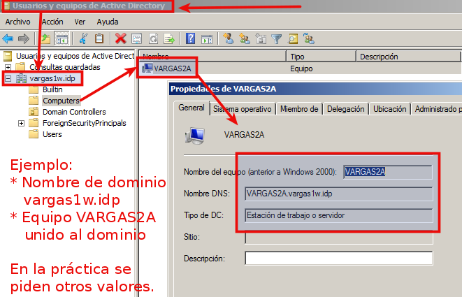
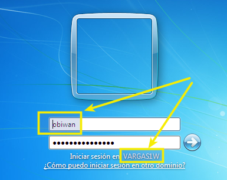
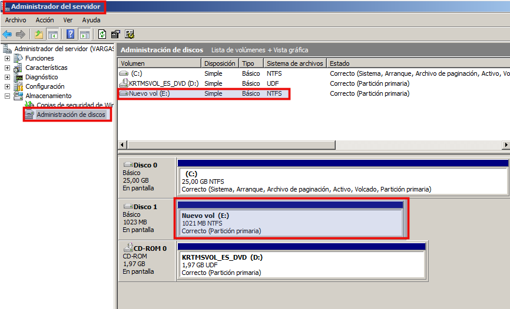

```
Curso       : 202021
Area        : Sistemas operativos, dominios
Descripción : Instalar un PDC y configurarlo para
              autenticación y perfiles móviles
Requisitos  : Windows 2016 Server, Windows 10
Tiempo      : 6 horas
```

# Introducción

En esta práctica vamos a:
* PDC: Instalar y configurar
* Unir equipos al dominio
* Perfiles móviles
* Perfil obligatorio

# 1. Preparativos

## 1.1 Máquinas virtuales

Necesitaremos las siguientes máquinas virtuales:

| MV  | Sistema operativo | Configuración | DNS1 | DNS2 |
| --- | ----------------- | ------------- | ---- | ---- |
| MV1 | Windows 2016 Server DataCenter | [Consultar](../../global/configuracion/windows-server.md) | 127.0.0.1 | 1.1.1.1 |
| MV2 | Windows 10 | [Consultar](../../global/configuracion/windows.md) | IP Windows Server | |
| MV3 | Windows 10 | [Consultar](../../global/configuracion/windows.md) | IP Windows Server | |

## 1.2 Observaciones

* Realizaremos las prácticas en MV's que pueden estar todas en el mismo PC o en varios diferentes.
* Las diferencias entre las distintas versiones de SO Windows: Standard, Data Center, etc. son las funcionalidades/características que vienen incluidas.
* Recién instalado, Window Server es estricto con la política de seguridad, en cuanto a cómo deben definirse las claves (Mayúsculas, minúsculas, números y caracteres especiales y longitud superior a 10).
* Se puede deshabilitar en las `Directivas de seguridad local -> Directivas de cuenta`, pero reduciríamos la seguridad de las contraseñas. Un ejemplo de contraseñas segura: `obiwanKENOBI2016!`.

# 2. Instalar el Controlador de dominio

## 2.1 Definiciones

**AD**:
* El AD (Directorio Activo o Active Directory) es una base de datos LDAP, que guarda la información de los objetos de nuestro dominio.

**NOMBRE DE DOMINIO**:
* Cada PDC se identifica con su nombre de dominio, el cuál debe ser único. Hay que evitar que el nombre de dominio se repita con la configuración de otro compañero.
* En realidad podríamos poner cualquier nombre, pero lo haremos según indique el profesor, para organizar mejor las distintas máquinas de la clase.
* Los nombres de dominio NO debe ser muy largos. Preferiblemente menos de 10 letras, para evitar problemas con los clientes Windows anteriores a Vista/7/8.

## 2.2 Instalar controlador de dominio

* Ir a la MV Windows Server.
* Comprobar la configuración del nombre del equipo, zona horaria, la IP estática.
* Hacer una instántanea de la MV antes de nada.

> Enlace de interés:
> * https://blog.ragasys.es/controlador-de-dominio-sobre-ms-windows-server-2016-dns-y-dhcp

* `Inicio -> Administrar el Servidor`.
* Agregar roles.
* Revisar que cumplimos los requisitos: clave segura de Administrador, IP fija. OJO: tener el sistema actualizado no es necesario para seguir con la práctica.
* Elegimos instalación basada en roles.
* Seleccionamos el servidor (sólo hay uno)
* Elegimos el rol "Servicio de Dominio Active Directory".
* Agregar características.
* Siguiente.
* Instalar.
* Al terminar hay que reiniciar el sistema.

A continuación vamos a promover a controlador:
* Promover el servidor a "Controlador de dominio". Esta acción aparece como un triángulo amarillo de advertencia en la parte superior.
* Agregar un nuevo bosque y ponemos el nombre de nuestro dominio "segundoapellidoXXdom.curso2021".
* Crear delegación DNS = NO
* Instalar

## 2.3 Comprobaciones

* Ir a `Herramientas -> DNS` y comprobar que dentro de `Zona de búsqueda directa` aparece nuestro `nombre-de-dominio`.
* Abrir una consola y ejecutar `nslookup nombre-de-dominio-largo`. Por ejemplo: "nslookup ruiz42dom.curso2021". Debe aparecer la IP de nuestro servidor PDC.
* Abrir una consola y ejecutar `nslookup nombre-PDC.nombre-de-dominio-largo`. Por ejemplo: "nslookup vargas42s.ruiz42dom.curso2021". Debe aparecer la IP de nuestro servidor PDC.

# 3. Usuarios del dominio

## 3.1 Teoría

* Leer/consultar los apuntes para entender los conceptos siguientes:
usuario local, usuario del dominio, equipo del dominio, grupo local, grupo del dominio.

> Enlace de interés:
> * [Definiciones de ámbito local, global y universal](https://msdn.microsoft.com/es-es/library/cc755692%28v=ws.10%29.aspx)
> * [Deshabilitar políticas de clave en Windows 2008 Server](http://www.radians.com.ar/blog/?p=403)  
> * [Usuarios y Grupos](http://www.ite.educacion.es/formacion/materiales/85/cd/windows/10Usuarios/index.html).
> * Información sobre [Tipos y ámbitos de grupo en Windows Server](https://es.slideshare.net/cesartg65/tipos-y-mbitos-de-grupo-windows-server)

## 3.2 Práctica

Vamos a crear usuarios y grupos del dominio:
* Ir a `Inicio -> Herramientas Administrativas -> Usuarios y Equipos de Active Directory`
* Crear los siguientes grupos:

| Grupo      | jedis      | siths     |
| ---------- | ---------- | --------- |
| **Ámbito** | global     | global    |
| **Tipo**   | Seguridad  | Seguridad |
| **Usuarios de dominio** | yoda y obiwan | vader y maul |

> ¡OJO! No confundir usuarios locales con usuarios del dominio.

Vemos imagen con los usuarios del dominio creados:


# 4. Equipos del dominio

## 4.1 Preparativos

Configurar las MV's clientes de la siguiente forma:

* Necesitaremos 2 MV's con Windows 10, que actuarán como equipos del dominio. **¡OJO!** Podemos crear una MV, y luego clonarla. Pero hay que modificar la MAC de la segunda MV, para no tener problemas de conectividad por tarjetas de red duplicadas.
* [Configurar las MVs](../../global/configuracion/windows.md)
* Poner la misma **fecha/hora y zona horaria** a las MV's. Todos los equipos deben estar sincronizados en cuanto al reloj. No puede haber diferencias de más de 5 minutos.
* **Cada equipo cliente debe tener como DNS1 la IP del PDC (Windows Server que hace de controlador de dominio)**.
* Abrir una consola y ejecutar `nslookup nombre-de-dominio` para **comprobar que el DNS está correcto**. Debe aparecer la respuesta desde la IP de nuestro servidor PDC (Windows Server que hace de controlador de dominio).
* Ejecutar `hostname` en una consola PowerShell. Debe aparecer el nombre correcto de la máquina.
* **Comprobar la conectividad** entre PDC-cliente y cliente-PDC usando el comando `ping` (Configurar el cortafuegos para permitir los ping entre las máquinas o deshabilitar el cortafuegos si fuera necesario).

## 4.2 Unir equipo al dominio

> Enlace de interés: https://www.youtube.com/watch?v=5vJ5zli0efE

Podemos unir el equipo al dominio por entorno gráfico o por comandos.

**Unir el equipo cliente al dominio por entorno gráfico**

* Ir al equipo cliente Windows.
* Ir a `Equipos (Botón derecho) -> Propiedades -> Cambiar configuración -> Cambiar -> Dominio`
* Escribir el nombre del dominio. Por ejemplo `ruiz42dom.curso2021`. En caso de error podemos probar con el nombre corto del dominio `ruiz42dom`.
* Se nos pide poner un usuario/clave del dominio. Usaremos el usuario `Administrador` del dominio, que tenemos definido en el PDC (Windows Server).

Veamos imagen de ejemplo:

     

**Unir un equipo al dominio usando comandos**

* Ir al equipo de Windows Server.
* Haremos uso del comando **Netdom**. Si no lo tenemos, lo primero sería descargarlo e instalarlo.
* `netdom.exe join %nombreequipo% /domain:NombreDominio /UserD:NombreDominio\nombreUsuario /PasswordD:Password`, para unir un equipo al dominio.

> NOTA: `netdom.exe remove %nombreequipo%`, Para quitar y eliminar equipo de dominio.

## 4.3 Problemas en la unión al dominio

_Espero que no tengas problemas, y puedas saltar este apartado, si no es así... sigue leyendo._

Si tuviéramos poblemas al realizar esta tarea de unión del equipo al dominio, tenemos varias opciones:
* Esperar 5 minutos y repetir el proceso. Las redes SMB/CIFS tardan un tiempo en propagar la información de los equipos por la red.
* Volver a comprobar que todas las configuraciones son correctas.
    * Repite desde el paso uno (NOTA: Pon un compañero contigo mientras lo haces. 4 ojos ven más que 2).
    * (NOTA: Una configuración incorrecta del servidor DNS hará que no se puedan unir los equipos al dominio).
* ¿Repetimos?

## 4.4 Comprobaciones

Entraremos en los equipos cliente usando los usuarios del dominio.
Podemos comprobarlo por entorno gráfico o usando comandos.

### Por entorno gráfico

* Ir al PDC (MV1) y comprobar que aparecen los equipos CLIENTE1(MV2) y CLIENTE2(MV3) como equipos del dominio.



* Ir a la máquina cliente (Windows 10) y entrar con un usuario del dominio.




> INFO: Para entrar como usuario local poner "VARGAS42W\profesor". Esto es, "nombre-de-máquina\nombre-usuario-local".

### Por comandos

* Ir a la máquina cliente (Windows 10) y entrar con un usuario del dominio.
* Abrimos consola PowerShell y ejecutamos los comandos siguientes.
    * `whoami`, muestra nuestro usuario actual. Que debe ser un usuario del dominio.
    * `net user`, muestra los usuarios locales del sistema y no debe mostrar el usuario anterior.
    * `hostname`, muestra el nombre del equipo local.

# 5. Perfiles móviles

Material de lectura/estudio/consulta:
* Leer/consultar los apuntes para entender los conceptos de perfiles, perfil móvil y perfil obligatorio.
* Consultar Vídeo [Windows Server 2008 - Perfiles moviles con Windows 7](https://youtu.be/kgGmLWO6dzs)

## 5.1 Crear un segundo disco

* Crear un segundo disco (1GB). Lo usaremos para guardar los perfiles de los usuarios del dominio.


* Hay que formatear el disco NTFS y asignarle la letra E.



## 5.2 Configurar la ruta de perfil de cada usuario

Ir a la MV Windows Server o PDC.
* Crear la carpeta `E:\perfiles`.
* Para dicha carpeta, asignar permisos "contro total" para el grupo llamado **Usuarios del dominio**. Esto se hace por `Propiedades -> Seguridad`.
* Para dicha carpeta ir a `Propiedades -> Compartir -> Uso compartido avanzado`. Poner nombre del recurso compartido de red como **perfiles$**. El poner el $ en el nombre del recurso compartido es para hacerlo oculto.
* Para dicha carpeta ir a `Propiedades -> Compartir -> Uso compartido avanzado -> permisos` y asignar al grupo `Todos` control total. En este punto estamos asignando permisos al recurso compartido de red.
* Ir a la herramienta de gestión de `Usuarios y equipos de Active Directory`.
* Seleccionar usuario, e ir a `Propiedades -> Perfil (pestaña)`. Modificar el atributo `ruta de acceso al perfil` de los siguientes usuarios del dominio:

| Usuario | Ruta de acceso al perfil        |
| ------- | ------------------------------- |
| yoda    | `\\IP-del-PDC\perfiles$\yoda`   |
| obiwan  | `\\IP-del-PDC\perfiles$\obiwan` |
| vader   | `\\IP-del-PDC\perfiles$\vader`  |
| maul    | `\\IP-del-PDC\perfiles$\maul`   |

> INFO: También podríamos haber puesto en la ruta del perfil el valor `\\IP-del-PDC\\perfiles$\%username%`. En este caso la variable %username% se cambia automáticamente al valor del nombre de cada usuario.

## 5.3 Personalizar los perfiles en CLIENTE1

* Ir a la MV CLIENTE 1.
* Iniciar sesión con los usuarios `obiwan` y `maul`.
* [OPCIONAL] Para cada usuario modificar el entorno del escritorio, colores, iconos.
* Para el usuario del dominio `obiwan`:
    * Crear la carpeta `jedi` en el escritorio.
    * Crear fichero `Escritorio/jedi/jedis.txt`. Escribir dentro los nombres de los 2 jedis.
* Para el usuario dominio `maul`:
    * Crear la carpeta `sith` en el escritorio.
    * Crear fichero `Escritorio/sith/siths.txt`. Escribir dentro los nombres de los 2 siths.

> De este modo el "perfil" de cada usuario será diferente en aspecto y contenido.

* Debemos comprobar que se han creado las carpetas con los perfiles en el servidor para los usuarios anteriores. A continuación se muestra una imagen de ejemplo:


## 5.4 Comprobar perfiles desde CLIENTE2

Vamos a comprobar el perfil móvil.

* Ir al equipo CLIENTE2.
* Entrar en el equipo con los usuarios del dominio (obiwan y maul).
* Abrir PowerShell y ejecutar los siguientes comandos.
* `hostname`, para mostrar nombre del equipo.
* `whoami`, para mostrar nuestro usuario actual.
* Comprobar que tenemos perfiles móviles para ellos. El perfil móvil permite al usuario moverse por PC's diferentes y ver el mismo entorno con sus datos.
* Ir a `Inicio -> Panel de Control -> Sistema -> Configuración Avanzadas -> Perfiles de usuario -> Configuración`, y comprobar que el perfil es móvil.

# 6. Perfiles obligatorios

> Enlaces de interés:
> * [Crear un perfil obligatorio en Active Directory sobre Windows Server 2016](http://somebooks.es/crear-perfil-obligatorio-active-directory-windows-server-2016/).
> * [Crear un perfil obligatorio en Windows Server 2016 utilizando Ubuntu](http://somebooks.es/crear-perfil-obligatorio-windows-server-2016-utilizando-ubuntu/).

Para convertir el perfil móvil de un usuario en perfil obligatorio sólo hay que renombrar el fichero "NTUSER.DAT", que encontraremos dentro del la carpeta que contiene al perfil del usuario, por el de "NTUSER.MAN". Para ello necesitamos dar permisos al usuario `Administrador` sobre el perfil de `maul`.

Ir a la MV Windows 10:
* Abrir sesión con usuario `maul`
* Iniciar el explorador de archivos.
* Donde pone "Acceso rápido", escribir la dirección del recurso compartido de red. Esto es: `\\ip-del-pdc\perfiles$`
* Dar permisos de Control Total al usuario `Administrador` en la carpeta `maul.V5`.
* Cerrar la sesión.

Ir al Windows Server:
* Abrir sesión como Administrador.
* Iniciar el explorador de archivos e ir a la ruta `E:\perfiles\maul.V5`
* Los ficheros que hay que cambiar están ocultos y son del sistema. Por ese motivo vamos al explorador de archivos, ir a `Vista -> Opciones -> cambiar opciones de carpeta y búsqueda -> Ver`:
    * Marcar => Mostrar archivos, carpetas y unidades ocultas.
    * Desmarcar => Ocultar extensiones de archivos.
    * Desmarcar => Ocultar archivos protegidos del sistema.
    * A continuación pulsamos en "Aplicar" y "Aceptar".
* Ahora renombramos el fichero "NTUSER.DAT" por "NTUSER.MAN". De esta forma convertimos el perfil móvil del usuario Maul en perfil obligatorio .

Ir a MV Windows10:
* Iniciar sesión con el usuario Maul. Hacer cambios en el perfil.
* Cerrar sesión y volver a entrar.
* Comprobar que el perfil no cambia al ser obligatorio.
* Ir a `Inicio -> Panel de Control -> Sistema -> Opciones Avanzadas -> Perfiles de usuario -> Configuración`, y comprobar que el perfil es obligatorio.

---

# ANEXO

# 7. Control de tiempo

Modificar los permisos de acceso de los usuarios del dominio, de la siguiente forma:
* Ir a la MV de Windows Server.
* Para cada uno de los usuarios "jedis", seleccionar `usuario -> propiedades -> cuenta -> Hora de inicio de sesión`. Configurar para que sólo puedan acceder de 08:00 a 14:00 (de lunes a viernes).
* Para cada uno de los usuarios "siths", seleccionar `usuario -> propiedades -> cuenta -> Hora de inicio de sesión`. Configurar para que sólo pueden acceder de 14:00 a 20:00 (de lunes a viernes).

## Duda con la complejidad de contraseñas

En Windows 2012 Server, queremos quitar la opcion de complejidad de contraseña pero aparece deshabilitada.
¿Cómo podemos habilitarla para poder desactivar la complejidad de contraseña?

* Open Run and type: `gpedit.msc`.
* From Local Group Policy Editor, choose from the tree (left): `Computer Configuration -> Windows Settings -> Security Settings -> Account Policies -> Password Policy`.
* Choose on the right: `Password must meet complexity requirements`
* Choose Disable.

Si no puedes realizar esto es porque tienes un GPO forzada por políticas desde un Domain Controller o estas usando la SecPol.msc.

## Comandos de Windows

* [Cambiar nombre equipo Windows con comando](https://www.solvetic.com/topic/5426-cambiar-nombre-equipo-windows-con-comando/)
    * `WMIC computersystem where caption='nombreDEahora' rename nuevoNombre`
    * Ahora tendrás que reiniciar tu PC Windows para que tenga efecto el nuevo nombre del equipo.
    * Este comando es válido para todos los sistemas Windows 10, 8, 7, Vista, XP, Server...
