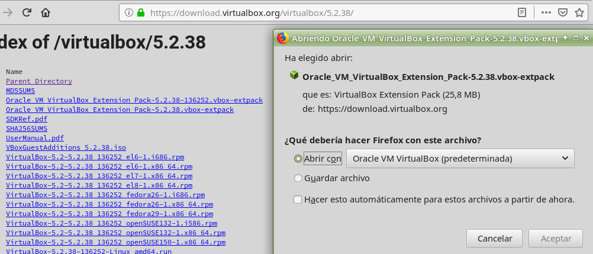
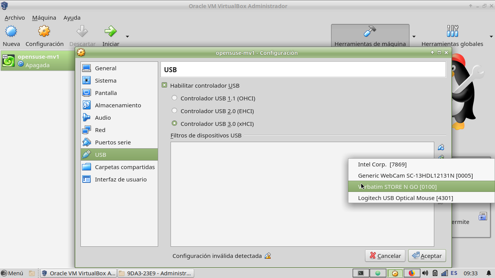
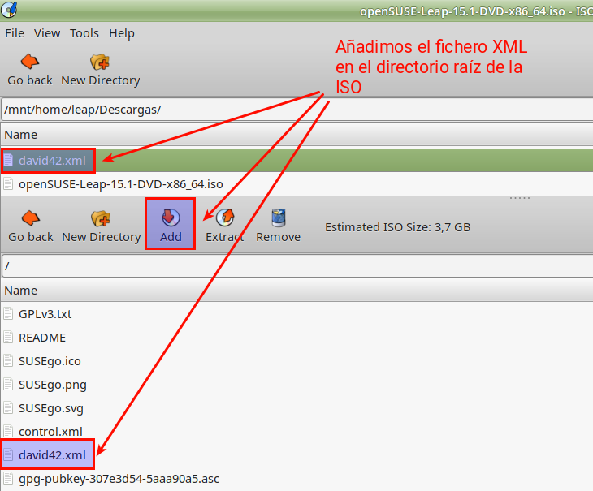
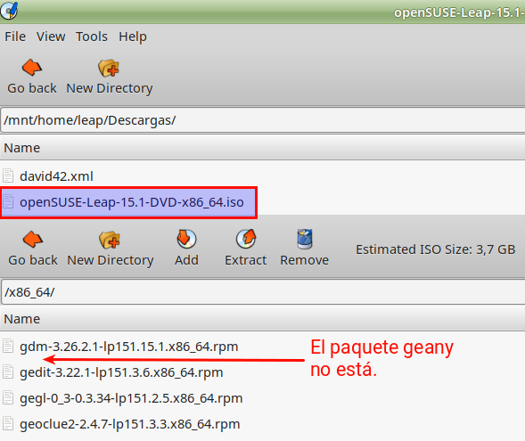

```
Curso           : 201920, 201819, 201718
Area            : Sistemas operativos, instalaciones
Descripción     : Instalación desatendida OpenSUSE
Requisitos      : OpenSUSE Leap 15,
                  Programa para editar ISO (isomaster)
                  Conveniente ver primero la creación de repositorios.
Tiempo estimado : 4 horas
```

# Instalación desatendida

Una instalación desatendida del sistema operativo ejecuta el proceso completo de la instalación del sistema operativo de forma automática, sin hacer preguntas al usuario.

Entregar:
* Informe, capturas de imágenes.
* Entregar XML utilizado.

---
# 1. Instalación desatendida con **autoyast**

> Enlace de interés:
> * ES - [Instalación desatendida con autoyast](https://dtrinf.wordpress.com/2012/11/06/instalacion-de-suse-desatendida-con-autoyast/)
> * EN - [Step by Step Guide to create autoyast xml file for SuSE Linux (SLES) with examples](https://www.golinuxhub.com/2018/02/step-guide-create-autoyast-xml-example-sles-or-suse.html?m=1)
> * EN - [AutoYaST Guide](https://doc.opensuse.org/projects/autoyast/)   
> * ES - [Resumen de los comandos versión 13.1](https://es.opensuse.org/openSUSE:Vadem%C3%A9cum_comandos_13.1)   

# 2. Preparativos

# 2.1 Personalizamos la MV

* Crear una MV1 nueva o usar una que ya tengamos con SO OpenSUSE.
    * OJO: La MV deben tener configurada la opción de BIOS. NO UEFI.
    * El proceso de instalación desatendida con UEFI debe revisarse porque es diferente.
* Personalizamos nuestra máquina con los siguientes cambios:
    * Nombre de máquina `1er-apellidoXXy`.
    * Instalamos paquetes que no vengan por defecto preinstalados. Por ejemplo: `evince`, `inkscape`, `vlc` (Prueba los programas para que los conozcas).
    * Creamos usuario `nombre-del-alumno`.

> **Elección de los paquetes**: Hemos elegido paquetes de software que sabemos están dentro de la ISO de instalación. Si queremos incluir más paquetes RPM dentro de la ISO, debemos modificar los ficheros de configuración del repositorio ISO (Consultar ANEXO).

# 3. Fichero de respuestas

## 3.1 Crear el fichero de respuestas

Como necesitamos las respuestas a las preguntas del instalador, vamos a crear un fichero `autoinst.xml` que "copia" la configuración de nuestro sistema actual.

* Instalamos la herramienta Autoyast (Paquetes `autoyast2`, `autoyast2-installation`).
* Ir a `Yast -> Autoinstallation Cloning System` (Por el terminal es igual usando el comando `/sbin/yast2 clone_system`).
* El perfil se guarda en `/root/autoinst.xml`.
* `cp /root/autoinst.xml /root/nombre-alumnoXX.xml`. Hacemos una copia de seguridad del perfil.

## 3.2 Configurar USB en la MV de VirtualBox

* Abrir VirtualBox. Ir a `Ayuda -> Acerca de` para consultar la versión que tenemos instalada. Por ejemplo: "5.2.38".
* Comprobar si tenemos instalado el "Oracle Extension Pack" en VirtualBox: `VirtualBox -> Archivo -> Preferencias -> Extensiones`. Este paquete sirve para ampliar funcionalidades a VirtualBox como por ejemplo el acceso a los dispositivos USB de la máquina real.
* Si no lo tenemos, hay que instalarlo. Descargar "Oracle Extension Pack" correspondiente a mi versión de VirtualBox (https://download.virtualbox.org/virtualbox/).

> Este paquete sirve para incluir los siguiente controladores: USB 2.0 and USB 3.0 Host Controller, Host Webcam, VirtualBox RDP, PXE ROM, Disk Encryption, NVMe.



* Aceptar e instalar.
* Seleccionamos nuestra MV1 y `configuración -> USB -> Añadir`. Elegimos nuestro USB y aceptamos.



* Iniciar la MV1. Ya podemos usar el USB desde dentro de la MV1. :+1:

## 3.3 Copiar fichero XML en pendrive

Vamos a copiar el fichero de control en un USB:
* Estamos en la MV1.
* Poner el pendrive y montarlo por el entorno gráfico.
* Abrir un terminal como root.
* `df -hT |grep media`, consultar la ruta donde está montado el USB.
* `cp /root/nombre-alumnoXX.xml /run/media/...`, copiar el archivo XML en la ruta del USB.
* Podemos apagar la MV1.

# 4. Instalación desatendida desde USB

Ya tenemos nuestro fichero XML de respuestas en un pendrive. Ahora vamos a realizar una instalación desatendida en una nueva máquina MV2.
* En VirtualBox crear una MV2 nueva, con un tamaño de disco duro similar a la MV1.
* Configurar MV2 para acceder al pendrive USB, igual que hicimos con la MV1.
* Ponemos el DVD (ISO) de instalación de OpenSUSE en la MV2.
* Seleccionamos nuestra MV2 y `configuración -> USB -> Añadir`. Elegimos nuestro USB y aceptamos.
Ahora debe estar montado el pendrive con el fichero de control XML en MV2.
* Iniciar la MV2.


* Cambiar el idioma a Español usando F2.
* Elegimos `Instalación`.
* Completar `Opciones de arranque` con: `autoyast=usb:///nombre-del-alumnoXX.xml`

> **OJO**: que son 3 barras seguidas después de los dos puntos. Esto es lo mismo que escribir "autoyast=usb://localhost/nombre-del-alumnoXX.xml". Entonces cuando la máquina es localhost se puede omitir.

* La instalación se debe realizar de forma automática y desatendida.
* Si durante el proceso de instalación hay una parada donde el instalador nos advierte que no ha podido encontrar algunos paquetes de software. Aceptamos y seguimos. Este problema lo vamos a resolver más adelante.

# 5. Instalación desatendida desde ISO

En la instalación desatendida anterior desde USB, tuvimos un problema porque algunos paquetes que se iban a instalar no estaban disponibles en la ISO de instalación. Vamos a realizar de nuevo la instalación desatendida pero en esta ocasión vamos a modificar la ISO original.

## 5.1 Software para editar ficheros ISO

* Ir la máquina real.
* Debemos tener instalado el programa `isomaster` en la máquina real. Isomaster es un programa para modificar el contenido de ficheros ISO.

En caso contrario lo podemos instalar de la siguientes formas:
* **Windows**: Si la máquina real es Windows podemos usar Isomaster u otro programa similar como ImgBurn, etc.
* **Ubuntu/Debian**: Si la máquina real es Ubuntu/Debian podemos instalar el programa con `apt-get install isomaster`.
* **OpenSUSE**: Si la máquina real es OpenSUSE, debemos añadir el repositorio `packman` para poder localizar e instalar el programa isomaster. Veamos:
    * `sudo zypper addrepo -cfp 90 'https://ftp.gwdg.de/pub/linux/misc/packman/suse/openSUSE_Leap_$releasever/' packman`. Esto añade el repositorio packman a nuestra máquina OpenSUSE Leap.
    * `zypper refresh; zypper install isomaster`

## 5.2 Preparar la ISO

* Copiar el fichero `nombre-alumnoXX.xml` en la máquina real.
* Iniciamos `isomaster` y abrimos el fichero ISO de OpenSUSE.



* Añadir el fichero XML dentro del directorio raíz de la ISO.
* Grabar ISO modificada con el nombre `opensuse-nombredelalumnoXX.iso`

## 5.3 Instalación desatendida desde la ISO

Ya tenemos nuestro fichero XML de respuestas dentro de la ISO. Ahora vamos a realizar una instalación desatendida en una nueva máquina MV3.
* En VirtualBox crear una MV3 nueva, con un tamaño de disco duro similar a la MV1.
* Ponemos el DVD (ISO) de instalación de OpenSUSE en la MV3.
* Iniciar la MV3.


* Cambiar el idioma a Español usando F2.
* Elegimos `Instalación`.
* Completar `Opciones de arranque` con: `autoyast=file:///nombre-del-alumnoXX.xml`

> **OJO**: que son 3 barras seguidas después de los dos puntos. Esto es lo mismo que escribir "autoyast=file://localhost/nombre-del-alumnoXX.xml". Entonces cuando la máquina es localhost se puede omitir.

* La instalación se debe realizar de forma automática y desatendida. En este caso hemos resuelto el problema de los paquetes RPM que no se encontraban, porque los hemos añadido en nuestra ISO personalizada.

# 6. INFO: Otras formas de localizar el fichero XML

A parte de usar un XML desde un USB, o desde el interior de la propia ISO, además tenemos estas otras formas de localizar nuestro fichero XML de respuestas.

**Carpetas compartidas SMB/CIFS**: El fichero de control se pone en una carpeta compartida de Windows de un equipo de nuestra red LAN.

* Boot options: `autoyast=cifs://servidor/carpeta/nombre-del-alumnoXX.xml`

**Servidor web HTTP**: El fichero de control se pone accesible desde un servidor Web (HTTP) en la red LAN o WAN.
* En clase podemos copiar el fichero XML en el servidor web proporcionado por el profesor, para que se accesible a través de la red. El fichero tendrá el nombre `nombredelalumnoXX.xml`.
* Establecer la configuración de red de forma manual, pulsando F4 -> Configuración de red.

Ejemplos de boot options:
* `autoyast=http://ip-del-servidor-web/autoyast/nombre-de-alumnoXX.xml`.
* Con información de configuración de red. Esto es: `hostip=172.19.XX.31/16 gateway=172.19.0.1 autoyast=http://172.20.1.2/autoyast/nombre-de-alumnoXX.xml`

---
# ANEXO

## A.1 Añadir software al repositorio ISO

**Paso 1: Descargar los paquetes RPM**:
* Ejecutar los siguientes comandos para descargar algunos paquetes, y sus dependencias. (Descargar por ejemplo: geany, tree, nmap y/o ipcalc):
    * _Cuando el software no lo tenemos instalado_, ejecutamos `zypper in --download-only PACKAGENAME`, para descargar paquete sin instalarlo.
    * _Cuando el software ya está instalado en nuestro sistema_, ejecutamos `zypper -v in -f --download-only PACKAGENAME`, para descargar paquete sin
    instalarlo.
* `tree /var/cache/zypp/packages | grep rpm`, vemos una estructura de directorios con los archivos de los paquetes descargados.

**IMPORTANTE**: Incluir los paquetes RPM y sus dependencias.

**Paso 2: Añadir paquetes al fichero ISO**

* Añadir los paquetes RPM dentro del directorio correspondiente dentro de la ISO (`noarcho`, `x86_64`, etc.)



**Paso 3: Modificar el catálogo del repositorio**

Para este paso, consultar documento sobre [crear un repositorio](../servidor/opensuse.md) o servidor de actualizaciones.
