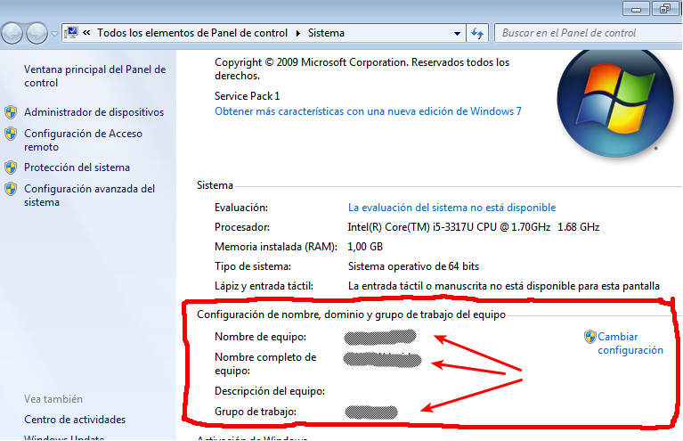
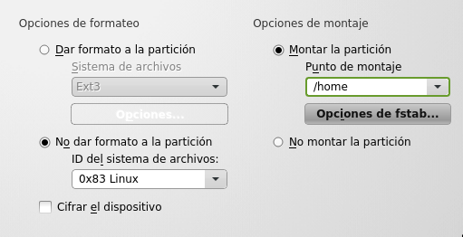
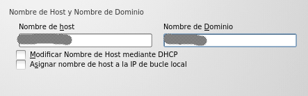

```
Curso: 201819
```

# Instalación Dual

> Enlaces de interés:
>
> * [Arranque dual Windows GNU/Linux] (http://www.ite.educacion.es/formacion/materiales/130/cd/redesubuntu/ubuntu-SaberMas/arranque_dual_windowslinux.html)

Vamos a realizar una instalación dual Windows y GNU/Linux.
Esto es, instalar dos SSOO en la misma máquina.

* Usaremos en esta práctica las versiones Windows7 Enterprise, y OpenSUSE.
* Entregar un documento en formato ODT o PDF con las capturas solicitadas.
Incluir breves comentarios de cada captura de pantalla.

> **Recuerda**
>
> * Pasado una semana si no vamos a usar más dicha MV, procederemos a eliminarla completamente para liberar espacio en disco.
> * Las capturas de pantallas del enunciado se han puesto como ejemplo. Al cambiar las versiones de los sistemas
operativos, muy probablemente las imágenes actuales sean diferentes.

---

# 1. Preparar la máquina virtual

* Crear una máquina virtual (VirtualBox).
* Configurar con:
    * tipo Windows 7 (64 bits)
    * RAM 1024MB
    * disco duro de 20GB
    * tarjeta de red en modo puente (bridge).

## 1.1 Particionado

* Usaremos un CD-LIVE (Knoppix) para crear las particiones.

> **RECORDAR**
>
> * Cuando se inicia Knoppix y aparece el prompt "boot:", pondremos `knoppix lang=es` para iniciarlo en español.
> * La tecla "=" puede estar en "¡".

* Para hacer las particiones en Knoppix:
    * Abrimos un terminal.
    * Nos ponemos como superusuario (comando `su` o `sudo bash`).
    * Iniciamos la herramienta de particionado con el usuario root ejecutando el comando `gparted`.
* `Gparted -> Dispositivo -> Crear tabla de particiones -> MSDOS`.
* Crear las siguientes particiones:
    * Una partición primaria, tipo NTFS para Windows (12GB),
    * Una primaria FAT32 para datos (100MB).
    * Crearemos una partición extendida que coja todo el disco restante.
* Dentro de la extendida haremos las siguientes particiones lógicas:
    * Área de intercambio o SWAP (500MB),
    * Partición de tamaño 100MB y con formato ext3.
    * Partición de tamaño 7GB y con formato ext4.
    * Quedará un espacio libre que lo dejamos sin usar.
* Capturar pantalla del `gparted` con las particiones solicitadas
* Apagar MV.

---

# 2. Instalación del primer SO

Vamos a instalar primero el SO Windows.
* Montamos ISO de instalación de Windows en la MV y la iniciamos.
* Idioma español. Leer licencia antes de aceptarla.
* Instalación personalizada. Elegir la partición 1 para instalar el SO.
Producto/Licencia:
* Clave de producto: La dejamos vacía por esta vez.
* Si aparece la opción *Activar Windows automáticamente*, elegiremos que NO.
* [Configuración de la MV](../../../global/configuracion/windows.md)
    * Nombre equipo: `1er-apellidoXXw1`
    * IP estática 172.AA.XX.12
* Comprobar la conexión de red haciendo `ping www.google.es`.
* Capturar imagen como la siguiente. Mostrando las particiones del disco duro
(`Ir a miEquipo -> Btn Derecho -> Administrar -> Almacenamiento`).


* Modificar la configuración de Windows Update y ponerla como Deshabilitada
(Sin descargas ni notificaciones).
* Ir a `miEquipo -> Btn Derecho -> Propiedades -> Cambiar conf. equipo`.
Poner nombre grupo de trabajo indicado. Reiniciar
* Ir a `miEquipo -> Btn derecho -> Propiedades`. Capturar imagen nombre de equipo y grupo de trabajo.
* Capturar imagen como la siguiente:



* Cuando terminen la instalación de Windows debemos acordarnos de desmontar
la ISO (CD de instalación) de la MV.

> Enlace de interés:
>
> * [Cómo aceder a una partición GNU/Linux desde Windows](https://es.opensuse.org/SDB:Acceder_a_la_particion_de_GNU/Linux_desde_Windows)

---

# 3. Instalación del segundo SO

A continuación vamos a instalar un SO GNU/Linux (OpenSUSE)
* [Configurar MV OpenSUSE](../../../global/configuracion/opensuse.md)
* [Acceso remoto MV OpenSUSE](../../../global/acceso-remoto/opensuse.md)


## 3.1 Empezamos con la ISO

* Hacer una instantánea de la MV antes de continuar.
* Ponemos ISO en la MV y la iniciamos.
* Pulsar F2 para cambiar el idioma a Español.
* Leer licencia y aceptar si corresponde.

## 3.2 Particionado

* Elegir instalación nueva, y DESACTIVAR la configuración automática. No vamos a usar la configuración automática porque la vamos a personalizar según las especificaciones de esta práctica.
* Entrar en el modo experto.
* Si no se ven las particiones que habíamos creado pulsar en `Volver a explorar dispositivos`.
* Esquema de uso de las particiones:
    * Área de intercambio o SWAP (500MB),
    * Partición home (montar /home) de tamaño 100MB y con formato ext3.
    * Partición del sistema (montar /) de tamaño 7GB y con formato ext4.
    * Quedará espacio libre. Lo dejamos sin usar.
* Capturar imagen como la siguiente:


* Botón derecho sobre la partición `ext3` -> para montar `/home`



* Botón derecho sobre partición `ext4` -> para montar `/`


```
IMPORTANTE

Montar la partición donde tenemos instalado el SO Windows en la ruta `/mnt/windows`.
Esto lo hacemos para poder acceder de forma sencilla a la partición Windows desde el SO
GNU/Linux.

Esto lo hacemos para versiones de OpenSUSE 12.3 detecten sin problemas el Windows y
se configure automáticamente el gestor de arranque.
```

* Aceptar.
* Capturar imagen como la siguiente:


* Verificar y siguiente.


## 3.3 Entorno, usuario y SSH

* Elegir zona horaria (Canarias)
* Selección de entorno gráfico: XFCE

> En teoría podríamos elegir el entorno gráfico que quisiéramos.
> * Gnome y KDE son bonitos pero recargados y pesados. Es probable que no quepan en el espacio disponible.
> * XFCE y LXDE son escritorios ligeros y ocupan poco espacio en disco.

* Crear usuario con `nombre-del-alumno`.
* Desmarcar inicio de sesión automático.
* Habilitar y abrir el Servicio SSH. NOTA: Esto lo activamos para permitir el acceso remoto a esta máquina virtual ([Configurar acceso remoto](../../../global/acceso-remoto/opensuse.md))

## 3.4 Instalar

* Comprobar que todo es correcto y procedemos a "Instalar".


* ¿Desea actualización en línea? -> OMITIR actualización.
No vamos a actualizar el SO en este momento. Esto lo hacemos para minimizar el consumo
de ancho de banda que se produce en las actualizaciones.
* Entrar al sistema.
* Comprobar que la conexión de red está bien haciendo `ping www.google.es`
* Reiniciar el sistema.
* Capturar imagen como la siguiente donde se muestra el arranque inicial
donde se ve un menú para eligir el sistema operativo a iniciar.


## 3.5 Con el SO instalado

* Entrar al sistema con nuestro usuario.
* Vamos al la herramienta `YAST -> Ajustes de red` para poner los siguientes valores:
    * [Configuración de la MV](../../../global/configuracion/opensuse.md)
    * IP estática 172.AA.XX.32
    * Poner como nombre del host o equipo `1er-apellidoXXg1`.
    * Poner NO a "Modificar nombre de HOST mediante DHCP". En caso contrario
    el nombre del equipo puede cambiar en cada reinicio.



* Abrir un terminal.
* Ejecutar `ping www.google.com` para comprobar la conexión de red.
* Ejecutar comando su para convertirnos en superusuario (clave de root).
* Como superusuario (root) ejecutar los comandos siguientes y capturar su salida:
```
    date      # Muestra la fecha/hora del sistema
    hostname  # Muestra nombre del sistema
    uname -a  # Muestra datos del kernel
    ip a      # Muestra información de red
    df -hT    # Muestra información de ocupación del disco
    fdisk -l  # Muestra información de particiones
    lsblk     # Muestra UUID de las particiones
```
* Al iniciarse la MV deben aparecer los dos SSOO en el menú de inicio (Boot Loader).

---

# ANEXO

Esto NO hay que hacerlo.

## Cambiar el menu de arranque Windows


* Iniciar GNU/Linux.
* `su` (Convertirnos en superusuario)
* `cd /etc/grub.d` (Cambiamos de directorio)
* `zypper install nano` (Para instalar el programa nano)
* `nano 11_windows` (Creamos archivo nuevo con el siguiente contenido)

```
#!/bin/sh -e
echo "Adding Windows 7" >&2
cat<<EOF
menuentry "Windows 7 (nombre-del-alumno - curso1819)" {
set root=(hd0,1)
chainloader +1
}
EOF
```

* Grabar el archivo y salir de nano
* `chmod +x 11_windows`
* `grub2-mkconfig -o /boot/grub2/grub.cfg` (Actualizamos el GRUB2 con el nuevo cambio)
* `reboot` (Reiniciamos la MV)
* Capturar imagen del menú de arranque.
