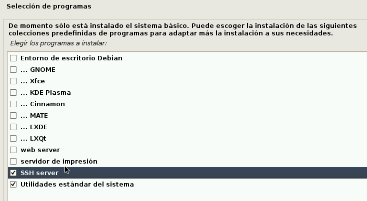

```
Curso           : 202021
Requisitios     : Debian
Tiempo estimado : 4 sesiones
```
---

# Instalación personalizada

Ejemplo de rúbrica:

| Sección                      | Muy bien (2) | Regular (1) | Poco adecuado (0) |
| ---------------------------- | ------------ | ----------- | ----------------- |
| (2.1) Checksum de las 2 ISOs | | | |
| Esquema de particionado  | | | |
| (4) Comandos de comprobación | | | |
| (5.2) SSH                    | | |.|

## Entrega

* Entregar un documento en formato ODT o PDF con los pasos realizados.

> NOTA: No borrar esta máquina virtual Debian al terminar, porque la vamos a necesitar en las próximas actividades.

---

# 1. Preparar la Máquina virtual

Crear una nueva MV VirtualBox con:

| Parámetro       | Valor                    |
| --------------- | ------------------------ |
| Nombre          | idp-debian-personalizado |
| Tipo            | Debian 64 bits
| Tamaño de disco | 10 GB |
| Tarjeta de red  | modo bridge (Puente) |

# 2. Instalar SO Debian

## 2.1 Descargar los ficheros

* Descargar del servidor la ISO de Debian y su fichero de comprobación.
* Comprobar que la descarga fue correcta, ejecutando el comando siguiente:
    * `sha512sum -c nombre-fichero-comprobación`
    * Debe aparecer mensaje `la suma coincide`.

## 2.2 Instalar SO

* Montar la ISO en la MV para comenzar la instalación.
* Elegir idioma: Español.
* Ubicación: España
* Teclado: Español.

> [¿Cómo configurar la MV?](../../../global/configuracion/debian.md) durante la instalación.

* Nombre del equipo: `1er-apellidoXXd`
* Nombre de dominio: `curso2021` (Estamos en el curso 2020-2021)
* La clave de root
* Nombre completo del usuario: `nombre-del-alumno`.
* Nombre de usuario para la cuenta: `nombre-del-alumno`
* Contraseña.
* Zona horaria: `Islas Canarias`.
* Método de particionado: `manual`. Aquí es donde vamos a empezar a personalizar nuestra instalación
definiendo las particiones a nuestro criterio.
* Seleccionar el disco `sda`. Continuar. Crear nueva tabla de particiones.
* Seleccionar el espacio libre y comenzar a crear las siguientes particiones:

| ID | Partición | Tamaño | Tipo        | Montar    | Uso               |
| -- | --------- | ------ | ------------| --------- | ----------------- |
| #1 | Primaria  | 1 GB   | Intercambio | No        | Swap              |
| #2 | Primaria  | 7 GB   | ext4        | /         | Sistema Operativo |
| #3 | Primaria  | 500 M  | ext3        | /home     | Datos de usuarios |
| #4 | Primaria  | 100 MB | ext2        | No montar |                   |
| -  | Sin usar  | Resto  | -           | No montar |                   |

> En este punto el profesor debe explicar el esquema de particionado elegido
y qué utilidad tiene cada partición.

* Elegir una réplica de red de España.
* El valor de Proxy lo dejamos vacío.



* En la selección de programas:
    * NO seleccionar entorno gráfico. Por el momento queremos un sistema sólo en modo texto.
    * Marcar *Utilidades estándar del sistema* y
    * Marcar *SSH Server*
* ¿Instalar el cargador de arranque GRUB en el registro principal de arranque? SI. Esto es el disco `/dev/sda`.
* Instalación completa -> Continuar.

---

# 4. Con el SO instalado

* Entrar al sistema como root (superusuario)
* Vamos a configurar la tarjeta de red con la siguiente [Configuración de la MV](../../../global/configuracion/debian.md).

> Enlace de interés:
> * Información sobre [configurar la tarjeta de red](http://www.driverlandia.com/configurar-tarjeta-de-red-con-ip-estatica-en-debian-sin-interfaz-grafica/) en Debian.

* Entrar al sistema como root (`su -l`).

Capturar imagen con la salida de los siguientes comandos:

```
date         # Muestra la fecha/hora del sistema
hostname -a  # Muestra nombre del sistema
hostname -d  # Muestra nombre de dominio
uname -a     # Muestra datos del kernel
ip a         # Muestra información de red
df -hT       # Muestra información de ocupación del disco
fdisk --list # Muestra información de particiones (Ejecutar como superusuario)
lsblk        # Muestra información de las particiones
blkid        # Muestra los códigos UUID de las particiones
```

* Salir con el comando `exit`.

---

# 5. Acceso externo

## 5.1 Instalar servidor SSH

* `systemctl status sshd`, comprobamos que el servidor SSH está activo.
* En caso contrario, seguir los siguientes pasos para [instalar y configurar Servidor SSH en la MV Debian](../../../global/acceso-remoto/debian.md).

## 5.2 Comprobar que funciona el acceso SSH

* Desde la máquina real hacer `ssh root@ip-de-la-máquina-virtual`, para
comprobar que funciona bien el acceso desde fuera.
* Apagar el sistema con el comando: `poweroff`

---

# ANEXO

* [Linux: Should You Use Twice the Amount of Ram as Swap Space? - 201708](https://www.cyberciti.biz/tips/linux-swap-space.html)
