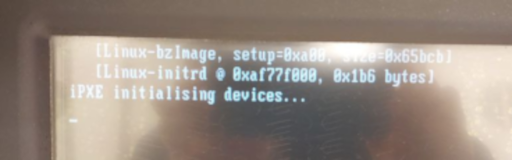
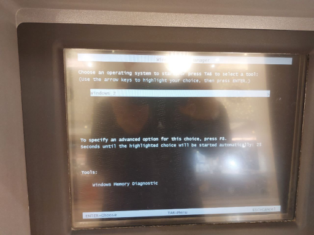
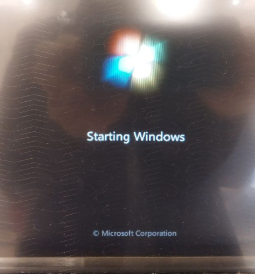
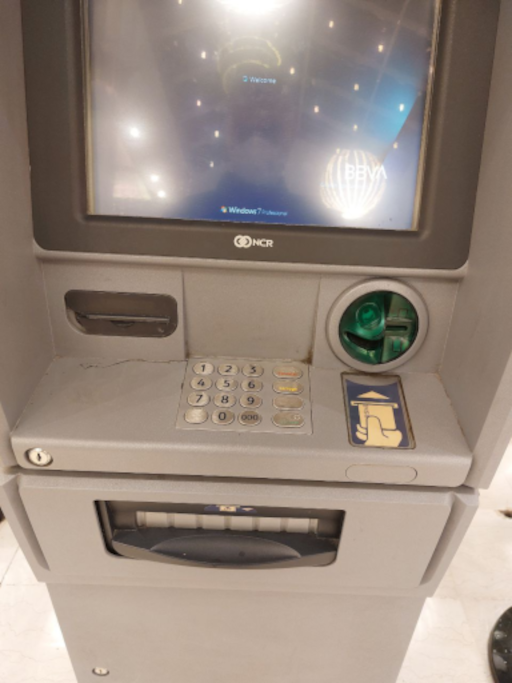
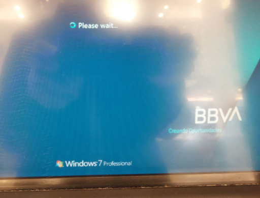

# Ejemplo real arranque PXE

El PC está intentando iniciar (boot) por la red (PXE):

Vemos que ha detectado un servidor PXE, y éste le ofrece una única opción de arranque.

¿Además le ofrece Windows7 en pleno 2022? Si. El Windows7 está descatalogado por MS... pero si eres un banco y pagas... MS te lo sigue actualizando. Hay que pensar que los bancos son los primeros que tienen muy encuenta la seguridad.

Se inicia el sistema operativo:

La máquina real es un cajero de un centro comercial. Los cajeros son PC's conectados en red y con pantalla táctil.

Eñ sistema operativo es Windows 7 Professional personalizado para un banco concreto.

Como tardaba mucho me fuí, pero hubiera sido interesante seguir captando el proceso hasta el final.
