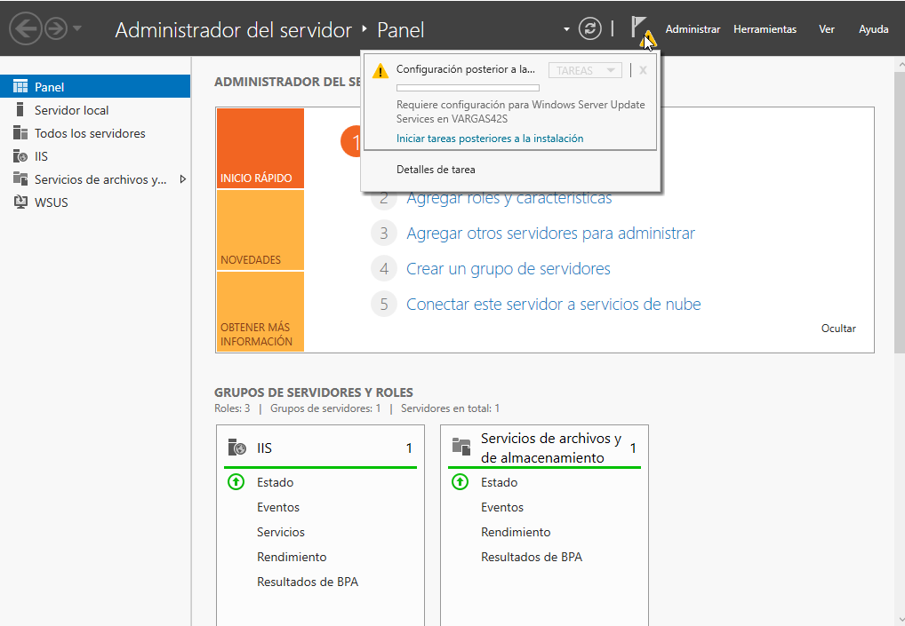

```
Curso       : 202021, 201819, 201718
Área        : Sistemas operativos, servidor, instalar, software
Software    : Windows Server 2016/2012/2008 y Windows 10/7
Descripción : Servidor de actualizaciones WSUS
Requisitos  :
Tiempo      :
```

# 1. Servidor de actualizaciones WSUS

## 1.1 Teoría

Inconvenientes de no tener nuestros sistemas actualizados:
* Un atacante puede aprovechar las vulnerabilidades.
* Aumenta el tiempo de inactividad de los PC's comprometidos.
* La información de la empresa puede verse comprometida.

Ventajas de tener un servidor WSUS que almacena y distribuye las actualizaciones de software MS:
* Reducción del consumo del ancho de banda WAN.
* Mejora de los tiempos de actualización global.
* Mayor control de las actualizaciones que se desean.
* Servidor pone las actualizaciones disponibles a los clientes.
* El administrador del servidor aprueba y prioriza las actualizaciones.
* El cliente se conecta a WSUS e instala los paquetes usando Windows Update.

> **Resumen:**
>
> * WSUS proporciona control a la hora de aprobar y distribuir actualizaciones de Microsoft entre sus ordenadores clientes.
> * Un servidor WSUS puede copiar actualizaciones desde Microsoft y almacenarlas localmente. Entonces, los ordenadores clientes descargarán las actualizaciones desde su servidor WSUS en vez de descargarlas desde Microsoft a través de Internet.
> * Para soportar organizaciones con muchas oficinas, los servidores WSUS de descarga pueden sincronizar actualizaciones, aprobaciones y opciones de configuración de los servidores WSUS de subida.
> * WSUS también requiere IIS.

## 1.2 Preparativos

Vamos a necesitar 2 MVs.
* MV1: Window Server 2016 (No es necesario que sea PDC). [Configurar](../../../global/configuracion/windows-server.md) como se indica.
    * Añadir una disco extra de 10 GB y montarlo en la unidad E:.
* MV2: Windows 10. [Configurar](../../../global/configuracion/windows.md) como se indica.

# 2. Servidor WSUS

Vamos a la MV1 con Windows Server.

## 2.1 Teoría

Consideraciones a tener en cuenta:
* NO es necesario tener un Active Directory para montar el servicio WSUS.
* Servidor WSUS se conecta vía HTTP/HTTPS con el exterior. Se usa IIS en WSUS para que se conecten los clientes.
* Se requiere al menos 6GB de disco duro para almacenar las actualizaciones.
* Tendremos que hacer copias de seguridad de la BBDD de WSUS periódicamente.
* Necesitamos 1 servidor WSUS por cada 10 PC's. En caso de fallo disponemos de 1 semana para reemplazar el servidor.
* Podremos usar como fuente origen de las actualizaciones a los servidor
 de Microsoft u otros servidores WSUS.
* La base de datos que guarda la información, la podemos tener en
C:\WSUS\UpdateServicesDbFiles\SUSDB.mdf (WS2008) o montar un SQL-Server.
* En nuestro caso lo vamos a hacer SIN SQL-Server.

## 2.2 Instalación del servidor

> Enlaces de interés:
> * [Instalar WSUS en Windows Server 2016](https://docs.microsoft.com/es-es/windows-server/administration/windows-server-update-services/deploy/1-install-the-wsus-server-role#:~:text=foro%20de%20WSUS.-,Para%20instalar%20el%20rol%20de%20servidor%20de%20WSUS,en%20Agregar%20roles%20y%20caracter%C3%ADsticas)
> * [Instalación y puesta en marcha Servidor de actualizaciones (WSUS I)](http://cerowarnings.blogspot.com.es/2011/11/servidor-de-actualizaciones-wsus.html)
> * [Instalación y configuración de WSUS - Parte 1](https://hackpuntes.com/wsus-windows-server-update-services-instalacion-y-configuracion-parte-i/)
> * [Vídeo WSUS en Windows 2012 Server R2](https://www.youtube.com/watch?v=2YPtfrwVObg)

Ir a la MV1 Windows Server.
* Asegurarse de que tenemos la instalación estado `No ilegal`.
* La forma más sencilla para instalar el software WSUS es usar la propia
herramienta de administrar del servidor Windows Server.
    * `Administrar el servidor -> Roles -> Agregar Roles -> Windows Server Update Services (WSUS)`.
    * Capturar imagen de las opciones que vayamos eligiendo.
    * No usar base de datos.
    * Almacenar las actualizaciones en `E:\actualizacionesXX` (donde XX es el número del alumno).

## 2.3 Configuración del servidor

> Enlace de interés: [Configurar WSUS - Windows Server 2016](https://docs.microsoft.com/es-es/windows-server/administration/windows-server-update-services/deploy/2-configure-wsus)



* Ir a la configuración de WSUS: `Panel -> Herramientas -> Windows Server Update Services (WSUS)`.

A continuación configuramos el servidor WSUS con los siguientes parámetros:
* Selección de Productos: Para minimizar descargas es conveniente hacer una
selección de idiomas y de productos concretos para actualizar. Elegir:
    * Idioma: `Español` e `Inglés`
    * Producto: `Windows 10`
    * Tipo de actualización: `Actualizaciones críticas y de seguridad`.
* Fuente de sincronización: `Microsoft` (Windows update).
* Elegir sincronización manual en lugar de automática. Elegimos manual para hacer nuestras pruebas de clase.
Cuando estemos en la empresa elegiremos sincronización automática.
* Iniciar sincronización inicial.

Aprobar algunas actualizaciones del Windows 10, en el servidor WSUS:
* Ir a `Administrador del servidor -> Windows Server -> Update Services -> Actualizaciones`, seleccionar 3 actualizaciones críticas y aprobarlas.
* `Windows Server -> Update Services -> Sincronizar`, para conectar con los
servidor de Microsoft y comenzar la descarga de los paquetes aprobados.

## 2.4 Servicio con inicio automático

* Asegurarnos en `Administración -> Servicios` que el servicio WSUS tiene
configurado inicio automático al arrancar la máquina.

> NOTA: Podemos consultar configuración del WSUS en el servidor, abriendo un navegador con el URL `http://WSUSServerName/iuident.cab`. Esto nos descarga el archivo `iuident.txt` que nos muestra la configuración del WSUS en el servidor.

---

# 3. Cliente WSUS

## 3.1 Teoría

> Tener en cuenta que:
> * Sistemas operativos clientes pueden ser W2K, WXP, WVista, WS2K3 y WS2K8.
> * Los clientes se conectan vía HTTP con el servidor WSUS.
> * Cliente Windows Update usa la firma digital y HASH (SHA1) para comprobar la autenticidad. En WXP y W2K se usa "cliente de actualizaciones automáticas".
> * Se pueden usar directivas de grupo para distribuir la configuración de la organización ( `Conf Eq. > Direct > Plant. Admin. > Componen > Win Update`)

Parámetros de configuración en el cliente:
* Máquina Servidor WSUS
* Frecuencia, notificaciones, grupo asignado.
* Reinicio: automático / confirmación / retrasar
* Administración de energía: Iniciar PC si está apagado para ejecutar actualización.

## 3.2 Configurar el cliente

* Vamos a la MV2 con Windows 10, para configurarla como cliente WSUS.

### Configurar sin PDC (Recomendado)

Vamos a configurar Windows Update de cada cliente de forma local.

**Configuración usando Políticas de Grupo (Local)**
* En `especificar la ubicación del servidor`:
    * En WS2012 se usan los puertos 8530/8531. Entonces hay que poner
    algo como `http://ip-del-servidor:8530`.
    * En WS2008 se usan los puertos 80/443. Entonces hay que poner
    algo como `http://ip-del-servidor`.
* Enlaces de interés:
    * [Configuración cliente para WSUS con o sin Active Directory](http://cosiis.com/blog/archives/69)
    * [Configurar Windows7 para WSUS](http://soporte.fen.uchile.cl/mw/index.php/WSUS_para_Windows_7)
* Configurar cliente para descargar las actualizaciones sin instalaras.
* Ejecutar `gpupdate /force` en una consola como administrador. Esto fuerza a que se apliquen los cambios realizados en las directivas.

> **Otras formar de configurar el cliente WSUS:**
>
> **Registro de Windows**
> * Esta información está probada en Windows XP, pero no es Windows7.
> * Antes de ejecutar este proceso hacer una copia de seguridad del registro o bien hacer una instantánea de la MV.
> * Enlace de interés [Script para modificar el registro de Windows](http://servidorespararedes.blogspot.com.es/2008/10/configuracion-de-cliente-wsus-por.html)
>
> **Configurar con PDC**
>
> * Vamos a asignar el servidor WSUS a los equipos del dominio mediante directivas de grupo.
> * Política de Grupo (AD DS). Enlace de interés [Configuración de clientes y aprobación de actualizaciones WSUS](http://cerowarnings.blogspot.com.es/2011/11/servidor-de-actualizaciones-wsus-ii.html)  

## 3.3 Comprobacíón

Comprobación 1:
* Ejecutar la siguiente consulta de registro en línea de comandos: `reg query HKLM\SOFTWARE\Policies\Microsoft\Windows\WindowsUpdate`
* Se muestran parámetros configuración del servidor WSUS en pantalla.
* Capturar imagen.

> **Otras comprobaciones**
>
> Comprobación 2:
> * Ir a `Inicio -> Ejecutar` el programa `rsop.msc` o `gpedit.msc`.
> * Ir a `Configuración de Equipo > Plantillas Administrativas > Componentes de Windows > Windows Update.`
> * Comprobar que el valor de `Especificar ubicación del servicio de Windows Update`
apunta a nuestro servidor WSUS.
>
> Comprobación 3:
> * Inicio -> Ejecutar `regedit`.
> * Ir a `LOCAL MACHINE > Software > Policies > Microsoft > Windows > Windows Update`.
> * Consultar valores de `WUServer` y `WUStatusServer`
>
> Comprobación 4:
> * Examinar el archivo `C:\Windows\WindowsUpdate.log`.
> * Buscar líneas `WSUS server...` y `WSUS status server...`.
>

## 3.4 Servicio en el cliente

Cuando se cambia la configuración, hay reiniciar el servicio Windows Update en el cliente:
* `net stop wuauserv`, Para el servicio de Windows Update.
* `net start wuauserv`, Inicia el servicio de Windows Update.

Podemos esperar 10 minutos a que Windows Update conecte con el servidor, o también
invocar los siguientes comandos:
* `wuauclt.exe /detectnow`: trata de conectar con el servidor y registra el equipo cliente en WSUS.
* `wuauclt /a`, el cliente consulta al servidor.
* Buscar actualizaciones de Windows Update desde Windows7.
    * Capturar imagen de las actualizaciones pendientes de instalar.
    * Deberían ser las mismas que tenemos aprobadas en el WSUS.

## 3.5 En el caso de tener PROBLEMAS

Sólo en caso de tener problemas de conexión del cliente WSUS con el servidor.

* Descargar y ejecutar [Herramienta de diagnóstico WSUS](http://download.microsoft.com/download/9/7/6/976d1084-d2fd-45a1-8c27-a467c768d8ef/WSUS%20Client%20Diagnostic%20Tool.EXE) desde línea de comandos.
* Algunos problemas de cliente WSUS se solucionan con la siguiente herramienta:
    * Descargar herramienta [Solucionador WSUS](http://aka.ms/diag_wu)
    * https://support.microsoft.com/es-es/help/10164/fix-windows-update-errors
* `sfc /scannow`, repara archivos dañados.

---

# 4. Auditar procesos

## 4.1 Auditar desde el servidor

* Estamos en la MV del servidor WSUS
* Ir a `Herramientas -> WSUS -> Equipos`. Capturar imagen del equipo Windows registrado como cliente WSUS.
* Para auditar las actualizaciones de los clientes desde el servidor, vamos a
`Consola Windows Update -> Informes`.
    * Mostrar informe de las actualizaciones de nuestro equipo cliente.

---

# ANEXO A

## A.1 Otra forma de instalar WSUS

 Resumen de los pasos para la instalación del servidor WSUS.

* Descarga desde www.microsoft.com/WSUS.
* Inicio > Herr. Admin. > MS Win Server Update Services-
* Consola Up. Serv.
* Detalles > sincronizar hora (Esto puede tardar minutos u horas).

## A.2 Eliminar actualizaciones

Cuando una actualización ocasiona problemas de compatibilidad, éstas se
pueden desinstalar. Para ellos hacemos:
* Usar Windows Update para ver el historial de actualizaciones.
Consultar los detalles de cada una para identificar dónde puede estar el problema. Anotar el número KB.
* Inicio -> Panel de control -> Programas -> desinstalar programas.
* Tareas -> ver actualizaciones instaladas.
* Selecionar por el número KB y desinstalarla.
* Siga las instrucciones que aparecen y reinicie si fuese necesario.

> NOTA:
>
> Si eliminar la actualización NO resuelve el problema, debe volver a aplicar esa actualización.
> A continuación, CONTACTE con el desarrollador de la aplicación
(en caso de incompatibilidad con el programa) o con su representante de soporte
de Microsoft para informarle de la incompatibilidad.

## A.3 Consultar ficheros de Log

* Para realizar un diagnóstico de WSUS desde el servidor, consultamos el contenido
de los siguientes archivos:
    * `C:\Program Files\Update Services\Log Files\Change.txt`
    * `C:\Program Files\Update Services\Log Files\SoftwareDistribution.txt`
