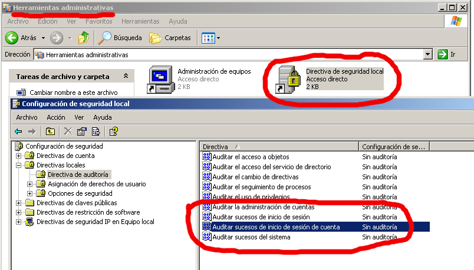
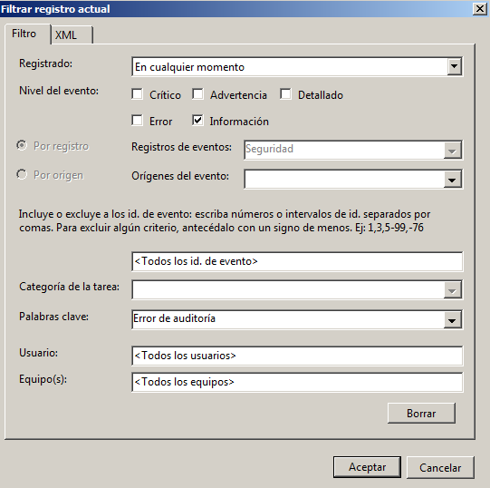

```
Curso       : 202021, 201920, 201819, 201718, 201617
Área        : Sistemas operativos, monitorización, auditoría
Descripción : Monitorizar y auditar eventos del sistema operativo en local
Requisitos  : Windows y Audit con OpenSUSE
              Se recomienda trabajar esta práctica antes de AppArmor.
Tiempo      : 11 sesiones
```

---
# 1. Eventos locales: Windows y OpenSUSE

Toda la actividad importante del sistema debe quedar registrada en los ficheros de registro. Esto nos permite tener un histórico del comportamiento del sistema, que nos ayuda a modo de *"caja negra"*, a reconstruir situaciones del pasado para diversos fines. Esta es la utilidad de la monitorización y la auditoría, saber lo que ha pasado.

---
# 2. SO Windows

* [Configuramos la MV Windows](../../global/configuracion/windows.md)

## 2.1 Auditar inicios de sesión

Vamos realizar las siguientes tareas en SO Windows.

* Ir a `Herramientas administrativas -> Directivas de auditoría -> Directivas de seguridad local`.

> A continuación se muestra (a modo de ejemplo) una imagen de la directiva desactivada:
>
> 

* Activar la opción para directivas de seguridad, auditar los *"Sucesos de inicio de sesión"*. Habilitar la configurar tanto correctos y erróneos.
* Incluir captura de pantalla con la directiva activada y configurada.

> NOTA:
>
> Los "Sucesos de inicio de sesión de cuenta" no los vamos a necesitar ahora. Sirven para auditar a los usuarios del dominio. Esto todavía no lo hemos visto.

* Reiniciar la MV para que empiecen a funcionar las auditorías.
* Crear los usuarios `soldado1`, `soldado2` y `soldado3`.
* Realizar las siguientes acciones:
    * Entrar al sistema con `soldado1` de forma correcta.
    * Intentar entrar con `soldado2` poniendo la clave mal.
    * No entrar al sistema con `soldado3`.
* Buscar en el sistema, la herramienta visor de eventos.
* Seleccionar la sección "Seguridad".
* Usar la opción de `Menú derecho -> Acciones -> Buscar` para localizar los eventos de `soldado1` y `soldado2`.

> Imagen de ejemplo para crear un filtro de eventos "Error de auditoría":
>
> 

**Entregar**: Captura de pantalla de los eventos de seguridad para los usuarios `soldado1`y `soldado2`.

## 2.2 Exportar los datos

A continuación vamos a exportar los eventos a un fichero CSV.
* Abrir el visor de sucesos y filtrar los eventos (Por ejemplo, los generados en la última hora).
* Seleccionar o marcar los registros que aparecen en la pantalla, y a continuación exportar o guardar los eventos a ficheros CSV.
* Incluir fichero CSV en la entrega con el nombre `nombre-alumno-registro-windows.csv`.

> Realmente los CSV son ficheros de texto donde cada fila es como un registro de una tabla. Normalmente se usa la coma para delimitar los campos dentro de cada fila.

* Los ficheros con formato CSV se pueden abrir y manipular cómodamente usando hojas de cálculo (Por ejemplo: Calc de LibreOffice, Excel de Microsoft,  etc.). Comprobarlo.
* Para aplicar un filtrado dentro de la hoja de cálculo LibreOffice, seleccionamos la hoja completa y vamos a `Datos -> Filtro Automático`.
* En la primera fila (con los nombres de los campos/columnas) nos aparece un desplegable (triángulo) que nos permite aplicar filtrados y así facilitarnos el localizar los eventos.

**Entregar:** Fichero CSV con los registros solicitados.

## 2.3 Auditar acceso a un fichero

> Enlace de interés:
> * [Auditar acceso a fichero](http://blog.elhacker.net/2013/03/auditar-el-acceso-ficheros-carpetas-en-windows-7-windows-xp.html)
> * [Vídeo sobre auditar el acceso a objetos](https://www.youtube.com/watch?v=xfMOfApRyVA)

Vamos a activar directiva de auditoría para los objetos.
* Ir a `Directivas de seguridad local -> Directivas locales -> Directivas de auditoría`.
* Activar `Auditar acceso a objetos`.

Activar auditoría sobre un fichero:
* Crear el archivo `c:\public\estrellitaXX.txt`
* `Botón derecho -> Propiedades -> Seguridad -> Opciones avanzadas -> Auditoría`.
Habilitar configuración de correctos y erróneos.


Hemos activado la auditoría de eventos sobre el ficheros anterior para los usuarios soldado1 y soldado2.
* Reiniciar la MV.
* Acceder con los usuarios `soldado1` y `soldado2` al archivo para generar eventos.
    * Apuntar la hora/minuto que se hacen los accesos para que sea más sencillo encontrar los eventos.
* Vamos al visor de eventos. Usar la opción de `Buscar` para localizar los eventos relacionados con el fichero `estrellitaXX.txt`.

**Entregar:** Captura de pantalla de los eventos registrados con los accesos al fichero `estrellita.txt`.

---
# 3. GNU/Linux OpenSUSE

El servicio Audit es una herramienta que nos permite auditar eventos en los sistemas GNU/Linux. En este tutorial instalar, configurar y usar la herramienta de auditoría `audit`.

Usando estas herramientas se puede ser realizar un seguimiento de muchos tipos de eventos, y monitorizar y auditar el sistema. Ejemplos:
* Auditar el acceso y modificación de ficheros.
    * Ver quién cambió un fichero concreto.
    * Detectar cambios no autorizados.
* Monitorizar las llamadas al sistema y funciones
* Detectar anomalías como procesos dañados.
* Establecer marcas ("tripwires") para detectar intrusiones.
* Grabar comandos de usuarios concretos.

## 3.1 INFO: Un poco de teoría

La configuración del demonio audit la llevan dos ficheros, uno para el demonio (auditd.conf) y otro para las reglas usadas por la herramienta auditctl (audit.rules).

**auditd.conf**

El fichero `auditd.conf` configura el demonio "auditd", centrándose en dónde y cómo se deben registrar los eventos. Define como tratar con los discos llenos, rotaciones de log y el número de log a mantener. Normalmente la configuración por defecto será apropiada para la mayoría de los casos.

**audit.rules**

Para configurar los eventos que deben ser auditados se usa el fichero "audit.rules".

> Enlaces de interés:
> * [Tutorial - Configuring and auditing Linux with audit](https://linux-audit.com/configuring-and-auditing-linux-systems-with-audit-daemon/)
> * [OpenSUSE documentation - Linux audit](https://doc.opensuse.org/documentation/leap/security/html/book.security/cha.audit.comp.html)
> * [Wiki - Systemd Journal](https://es.opensuse.org/SDB:Systemd_journal)
> * [Wiki - Systemd Optimización](https://es.opensuse.org/SDB:Systemd_optimizacion)

## 3.2 Instalación

* Instalar los paquetes `audit` y `yast2-audit-laf`.
* `systemctl status auditd`, consultar el estado del servicio. También tenemos otro comando específico de Audit que da información del servicio `auditctl -s`.
* Consultar el fichero `/etc/audit/auditd.conf`, y averiguar el significado de los siguientes parámetros: log_file, log_format, log_group.

> Estos son las definiciones de algunos parámetros:
> * **freq**, un valor de 20 le indica al demonio audit que debe escribir los datos de los eventos al disco cada 20 segundos.
> * **max_log_file**, tamaño máximo en MB del fichero de log.
> * **max_log_file_action**, acción que se ejecuta cuando el fichero de log llega a su valor máximo.
> * **num_logs**, número de ficheros de log que se mantendrán guardados cuando max_log_file_action tiene el valor rotate.

## 3.3 Crear una regla temporal para auditar un fichero

* `auditctl -D`, para eliminar (temporalmente) todas las reglas de audit.
* `auditctl -l`, podemos ver que no hay ninguna regla.

Hacemos lo siguiente:
* Abrirmos un terminal (Llamémosle "t1").
* Crear el fichero `/home/nombre-alumno/estrellita.txt` con todos los permisos para el grupo `users`.
* Crear los usuarios `rebelde1`, `rebelde2` y `rebelde3`. Estos usuarios deben pertenecer al grupo `users` para tener acceso al fichero anterior.
* `auditctl -w /home/nombre-alumno/estrellita.txt -p warx`, estamos creando una regla temporal (porque no está guardada en el fichero audit.rules) para auditar un fichero concreto, cuando ocurra algunos de los eventos de w=escritura, a=cambio de atributos, r=lectura o x=ejecución.

**Entregar:** Las siguientes capturas de pantalla.
* `auditctl -l`, vemos que tenemos la regla de auditoría definida.
* `cat /etc/audit/audit.rules`, comprobamos nuestra regla no está en el fichero de configuración. No reiniciar el equipo todavía porque esta regla desaparecerá.

## 3.4 Empezamos a generar eventos

Los eventos, cuando se produzcan, se guardarán en `/var/log/audit/audit.log`.
* Abrimos otro terminal (Llamémosle "t2") sin cerrar el terminal "t1".
* `tail -f /var/log/audit/audit.log`, muestra en pantalla de forma permanente las últimas líneas del fichero audit.log. Entonces cada vez que se registre un nuevo evento y se guarde, veremos aparecer una nueva línea en esta terminal ("t2").

Vamos a provocar que se generen eventos:
* Volvemos al terminal "t1".
* `ausearch -f estrellita.txt`, no debe haber ningún evento asociado al fichero todavía. Este comando hace un filtro de los eventos para mostrar sólo los del fichero.
* Con el usuario `rebelde1` modificar el fichero. Para cambiar de usuario en la consola sin cerrar sesión podemos usar el comando `su -l rebelde1` en el terminal.
* Con el usuario `rebelde2` leer el fichero.

**Entregar:** Capturas de las siguientes acciones. Ahora vamos a consultar los eventos de auditoría.
* Consultar las salidas del terminal "t2".
* Ver las últimas líneas del fichero `/var/log/audit/audit.log`
* `ausearch -f estrellita.txt`, consultar eventos sobre el fichero.
Este comando hace un filtro de los eventos para mostrar sólo los del fichero.
* Repetir para rebelde1, rebelde2 y rebelde3:
   * `id USERNAME`, consultar el uid del usuario.
   * `ausearch -f estrellita.txt -ua USERID`, consultar eventos sobre el fichero para el usuario con USERID.
   * `ausearch -f estrellita.txt -ua USERID | wc -l`, contar los eventos.

> ¿Diferencias entre los siguientes comandos/parámetros de filtrado?
> * ausearch -ui USERNAME: Filtrado por el usuario real
> * ausearch -ue USERNAME: Filtrado por el usuario efectivo (no es real pero lo parece)
> * ausearch -ua USERNAME: Filtrado por usuario real o efectivo.

* Repetir para nano, cat y more:
  * `ausearch -x COMMANDNAME`, consultar eventos asociados a dichos comandos.

## 3.5 Hacer un informe con los eventos

Como mostrar los eventos registrados con toda la información que generan es confuso, podemos usar el comando `aureport` para crear una especie de informe con los datos que queramos filtrar con `ausearch`.

**Entregar:** Capturas de las siguientes acciones.
* Repetir para rebelde1, rebelde2 y rebelde3
   * `ausearch -f estrellita.txt -ua USERUID | aureport -f`
   * `ausearch -f estrellita.txt -ua USERUID | aureport -u`
* Repetir para nano, cat y more:
   * `ausearch -x PROGRAMNAME | aureport -f`
   * `ausearch -x PROGRAMNAME | aureport -u`

> Más información:
> * `ausearch` filtra los eventos que cumplan unos determinados criterios.
> * `aureport -f` genera una lista numerada de los eventos asociados a ficheros incluyendo información de fecha, hora, nombre del fichero, número de llamadas al sistema, éxito/fallo del comando, el ejecutable que lo accedió, un ID y número de evento.

## 3.6 Crear una regla de auditoría fija

* Reiniciamos el equipo.
* `auditctl -l`, comprobamos que nuestra regla temporal ha desaparecido.

Vamos a crear una regla de auditoría permanente sobre el programa o comando `mkdir` en "audit.rules" (Reglas de audit):
* `whereis mkdir`, averiguar la ruta al fichero o comando "mkdir".
* Editar el fichero `/etc/audit/rules.d/starwars.rules`.
* Añadir una línea de la forma `-w RUTA-ABSOLUTA-A-MKDIR -p warx`
* Reiniciar el servicio de audit:
    * `systemctl stop auditd`, parar el servicio.
    * `systemctl start auditd`, iniciar el servicio.
* `auditctl -l`, comprobar que tenemos la nueva regla. Si reiniciamos el equipo podremos comprobar que la regla de auditoría sigue estando activa.

## 3.7 Comprobamos que funciona la regla

* Crear el directorio `/home/rebelde1/rogue-one`.
* Consultar los registros de auditoría para `mkdir`.
* Crear un informe de los eventos del ejecutable `mkdir`(`aureport -x`).

Al terminar limpiamos las reglas para que no se sigan generando más eventos:
* Eliminar la regla del fichero `/etc/audit/rules.d/starwars.rules`.

---
# ANEXO

## Audit: Más Información

Esta parte no hay que hacerla. Sólo es información para consultar.

> Enlace de interés:
> * [OpenSUSE systemd journal](https://es.opensuse.org/SDB:Systemd_journal)
> * [Ver los logs del sistema en Linux con journalctl](http://lamiradadelreplicante.com/2015/03/29/ver-los-logs-del-sistema-en-linux-con-journalctl/)
> * [What is the purpose of auditctl -a never,task?](https://unix.stackexchange.com/questions/491406/what-is-the-purpose-of-auditctl-a-never-task)
> * [Locking users after X failed login attempts with pam_tally2](https://linux-audit.com/locking-users-after-failed-login-attempts-with-pam_tally2/)

### Resumen de comandos

| Comando     | Descripción |
| ----------- | ----------- |
| auditd      | Demonio que captura los eventos y los almacena (log file) |
| auditctl    | Herramienta cliente para configurar auditd |
| auditctl -e | habilitar o deshabilitar audit |
| auditctl -r | controlar la ratio límite de mensajes |
| auditctl -s | consultar el estado actual del demonio |
| audispd     | daemon to multiplex events |
| aureport    | Herramienta de informes que leer de los ficheros de log (auditd.log) |
| ausearch    | Visor de eventos (auditd.log) |
| autrace     | Para auditar procesos. Es similar a strace. Ejemplo: `ausearch –start recent -p 21023 –raw | aureport –file –summary`|
| aulast      | Similar al comando last, pero usando audit |
| aulastlog   | Similar al comando lastlog, pero usando audit |
| ausyscall   | mapea los syscall ID y nombre |
| auvirt      | Muestra información relacionada con las máquinas virtuales |

### Auditar acceso de usuarios

Si se quiere saber que ficheros han sido accedidos por un usuario (UID) concreto
`auditctl -a exit,always -F arch=x86_64 -S open -F auid=80`

Explicación de los parámetros:
* -F arch=x86_64, define la arquitectura (uname -m)
* -S open, elige las llamadas “open” al sistema
* -F auid=80, el UID del usuario
